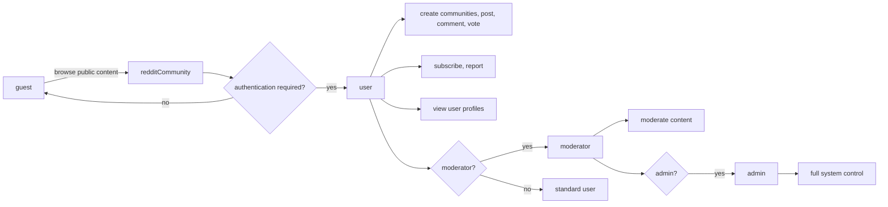

# User Actors and Authentication Requirements for redditCommunity

This document provides comprehensive business requirements for user actors and authentication for the redditCommunity platform. It defines all user roles, their permissions, and specifies the authentication and token management framework backend developers must implement. This serves as a foundation for secure, role-aware system access.

---

## 1. Introduction

redditCommunity is a Reddit-like community platform that enables users to create, interact with, and moderate content within communities (subreddits). Robust authentication and precise role-based permissions are critical for securing user actions and maintaining platform integrity.

This document focuses exclusively on the business requirements of user authentication and authorization, describing what behaviors and controls must be enforced by the backend, without prescribing technical implementations.

---

## 2. Authentication Requirements

### 2.1 User Registration
WHEN a user submits a registration request with a valid email address and password, THE system SHALL validate the inputs, create a user account, and require email verification before enabling community participation.

### 2.2 User Login
WHEN a user submits valid login credentials, THE system SHALL authenticate the user, initiate a secure session, and issue an access token.
IF credentials are invalid, THEN THE system SHALL deny login and provide an informative error message.

### 2.3 User Logout
WHEN a user requests to log out, THE system SHALL securely terminate the user's session and invalidate tokens.

### 2.4 Session Management
THE system SHALL use JWT (JSON Web Tokens) to manage authentication tokens, with access tokens expiring after 15 minutes, and refresh tokens expiring after 30 days.
WHEN an access token expires, THE system SHALL allow renewal using a valid refresh token.

### 2.5 Password Reset
WHEN a user requests a password reset, THE system SHALL send a reset link to the verified email address.
WHEN the password is reset, THE system SHALL validate the reset token and update the password securely.

---

## 3. User Actor Structure

The platform defines four distinct user actors with clearly separated roles and permissions:

- guest: Unauthenticated users who can browse public communities and view posts but cannot create content, vote, comment, or subscribe.
- user: Authenticated users who can register, log in, create communities, post text/links/images, comment including nested replies, vote on content, subscribe to communities, and report content.
- moderator: Community-specific moderators who have all user permissions plus content moderation within assigned communities, including removing posts/comments.
- admin: System administrators with platform-wide elevated permissions, including managing all users, communities, and handling reports globally.

---

## 4. Permission Matrix

| Feature/Action                               | guest | user | moderator | admin |
|---------------------------------------------|-------|------|-----------|-------|
| Browse public communities                    | ✅    | ✅   | ✅        | ✅    |
| Register account                            | ❌    | ✅   | ✅        | ✅    |
| Login/logout                               | ❌    | ✅   | ✅        | ✅    |
| Create a community                           | ❌    | ✅   | ✅        | ✅    |
| Post content (text/link/image)             | ❌    | ✅   | ✅        | ✅    |
| Comment & nested replies                    | ❌    | ✅   | ✅        | ✅    |
| Upvote/downvote posts & comments           | ❌    | ✅   | ✅        | ✅    |
| Subscribe to communities                    | ❌    | ✅   | ✅        | ✅    |
| View user profiles                           | ✅    | ✅   | ✅        | ✅    |
| Report inappropriate content                 | ❌    | ✅   | ✅        | ✅    |
| Moderate content (remove posts/comments)   | ❌    | ❌   | ✅        | ✅    |
| Ban users from communities                   | ❌    | ❌   | ✅        | ✅    |
| Manage users, communities, reports system-wide | ❌ | ❌   | ❌        | ✅    |

---

## 5. Conclusion

The redditCommunity platform requires robust authentication and authorization mechanisms to enforce role-based access control. The backend SHALL implement secure user registration, login, session management, password recovery, and token management.

User roles are distinctly defined with precise permissions to support community interaction while maintaining platform security and integrity.

Developers shall ensure strict adherence to these business requirements to guarantee secure, scalable, and maintainable system access control.

---

## 6. User Authentication and Authorization Overview

