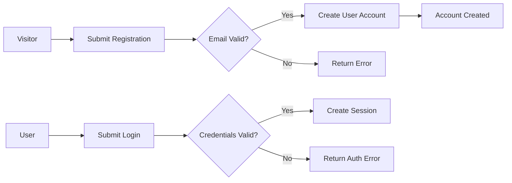
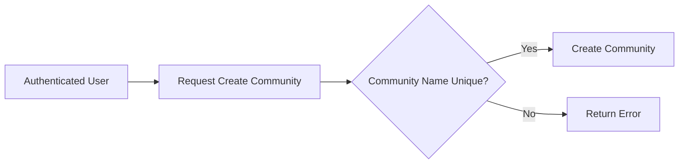
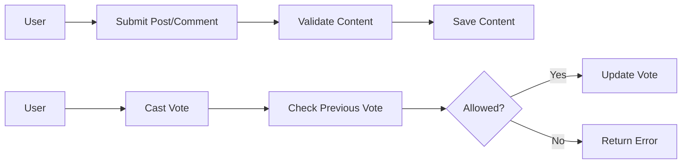

# Functional Requirements Analysis for Reddit-like Community Platform

## 1. Introduction
This document defines all functional requirements for the development of a Reddit-like community platform named `redditCommunity`. It details user interactions, system responses, and business rules to be implemented by backend developers, focusing exclusively on business requirements and avoiding technical implementation details.

The platform enables users to create communities, post content, vote, comment, manage subscriptions, view profiles, and report inappropriate content, closely modeled on Reddit’s key features.

---

## 2. User Actors and Authentication

The system recognizes four primary user actors, each with specific capabilities and permissions:

- **Guest**: Unauthenticated users who can browse public communities and view posts but cannot create or interact.
- **User**: Authenticated users capable of registering, logging in, creating communities, posting content, commenting, voting, subscribing, and reporting content.
- **Moderator**: Community moderators with additional permission to manage and moderate content within their communities.
- **Admin**: System administrators with elevated privileges to manage users, communities, and moderate reports across the platform.

Authentication is required for all actions except browsing public content, with JWT-based token management for session control.

---

## 3. Functional Requirements

### 3.1 User Registration and Login

- WHEN a visitor submits a registration request with valid email and password, THE system SHALL create a new user account.
- WHEN a registered user submits login credentials, THE system SHALL validate and authenticate the user session.
- IF authentication fails due to invalid credentials, THEN THE system SHALL deny access and provide an error response.
- THE system SHALL maintain active user sessions securely via tokens, with expiration and renewal mechanisms.

### 3.2 Community Management

- WHEN an authenticated user submits a request to create a community, THE system SHALL validate the uniqueness and permissibility of the community name and create it.
- WHERE the user is a created community moderator, THE system SHALL grant moderation permissions within that community.
- WHEN a user requests to view community details, THE system SHALL provide community metadata including description and subscription count.

### 3.3 Content Posting

- WHEN an authenticated user submits a post with text, link, or image content, THE system SHALL validate content parameters and save the post under the selected community.
- THE system SHALL verify that images meet size and format constraints.
- IF content violates community guidelines or restricted formats, THEN THE system SHALL reject the post with an informative error.

### 3.4 Voting System

- WHEN an authenticated user casts an upvote or downvote on a post or comment, THE system SHALL record the vote and update the score accordingly.
- THE system SHALL restrict each user to a single vote per post or comment, allowing them to change their vote only once.
- THE system SHALL calculate the visibility order of posts by sorting using hot, new, top, and controversial algorithms based on voting scores and recency.

### 3.5 Commenting System

- WHEN an authenticated user submits a comment on a post, THE system SHALL link the comment to the post and allow nested replies.
- THE system SHALL limit the nesting depth to a maximum level (e.g., 5 levels) to ensure performance and readability.
- THE system SHALL validate comment length and content compliance with community rules.

### 3.6 User Karma System

- THE system SHALL assign karma points to users based on upvotes and downvotes received on their posts and comments.
- WHEN a vote affects content, THE system SHALL recalculate and update the user’s karma accordingly.

### 3.7 Subscription System

- WHEN an authenticated user subscribes or unsubscribes to a community, THE system SHALL update the user's subscription list and reflect changes in the subscribed communities count.
- THE system SHALL prevent subscription duplication.

### 3.8 User Profiles

- WHEN a user views a profile, THE system SHALL display the user’s public posts and comments with pagination.
- THE system SHALL provide summary statistics such as total karma, number of posts, and comments.

### 3.9 Content Reporting

- WHEN an authenticated user reports inappropriate content (posts or comments), THE system SHALL record the report specifying content details and reporter.
- THE system SHALL notify moderators and admins of new reports for review.
- WHERE reports meet predefined thresholds, THE system SHALL flag content for automatic hiding or administrative review.

---

## 4. Business Rules

- Community names must be unique and respect naming conventions.
- Posts and comments must comply with content guidelines and format restrictions.
- Votes must be unique per user per content item; vote changes are limited.
- Karma updates reflect only valid votes, excluding votes from banned or flagged accounts.
- Moderators have authority limited to their communities.
- Admins oversee system-wide moderation and report handling.

---

## 5. Error Handling Expectations

- Authentication failures return standardized unauthorized error responses.
- Content submission errors return descriptive validation messages, e.g., invalid format, content too long.
- Voting irregularities return errors if attempted votes do not meet rules.
- Reporting failures return errors if reports lack necessary details.

---

## 6. Performance Requirements

- THE system SHALL respond to user actions such as posting or voting within 2 seconds under normal load.
- THE system SHALL paginate content listings in pages of 20 items.
- Sorting algorithms for post listing SHALL perform real-time updates based on vote and time data.

---

## 7. Diagrams

### User Registration and Login Flow

### Community Creation Flow

### Posting and Voting Process

---

This document provides business requirements only. All technical implementation decisions belong to developers. Developers have full autonomy over architecture, APIs, and database design. This document describes WHAT the system should do, not HOW to build it.