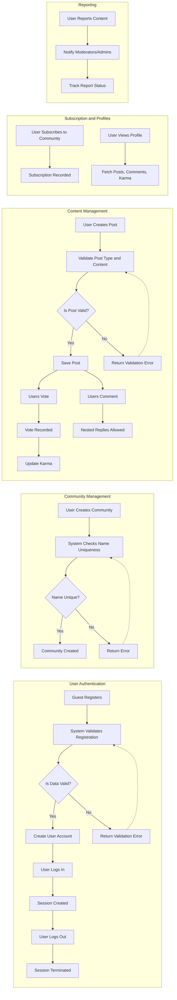

# Functional Requirements Analysis for Reddit-like Community Platform

## 1. Introduction
This document specifies the detailed functional requirements for the Reddit-like community platform backend. It defines the business operations and user interactions that developers must implement in natural, clear, and testable terms. This includes user authentication, community and content management, interactive features, and reporting capabilities.

## 2. User Registration and Login
### Requirements
- WHEN a guest user registers with a valid email and password, THE system SHALL create a new registered user account.
- WHEN a registered user submits login credentials, THE system SHALL authenticate the user and establish a session.
- IF login credentials are invalid, THEN THE system SHALL return an unauthorized error with clear messaging.
- WHEN a logged-in user logs out, THE system SHALL terminate their session.
- THE system SHALL validate email formats and password strength upon registration.
- THE system SHALL enforce secure password storage and authentication processes.

## 3. Community Management
### Requirements
- WHEN a registered user requests to create a community, THE system SHALL verify uniqueness of community name and create the community.
- THE system SHALL allow communities to have descriptive metadata such as title, description, and creation timestamp.
- WHERE a user is the creator of a community, THE system SHALL grant them owner permissions to manage community settings.
- THE system SHALL allow moderators to be assigned to communities and grant them content moderation permissions.
- THE system SHALL prevent community name duplication.

## 4. Content Posting
### Requirements
- WHEN a registered user posts content in a community, THE system SHALL accept posts of type text, link, or image.
- THE system SHALL verify that the target community exists and that the user has posting permissions.
- THE system SHALL validate post content as follows:
  - Text posts SHALL have non-empty content up to a predefined maximum length.
  - Link posts SHALL have valid URLs.
  - Image posts SHALL include image file references with valid formats and sizes.
- WHEN a post is created, THE system SHALL store timestamps, author references, and community association.

## 5. Voting System
### Requirements
- WHEN a registered user votes on a post or comment, THE system SHALL record an upvote or downvote action.
- THE system SHALL prevent users from voting multiple times on the same post or comment.
- THE system SHALL allow users to change their vote or remove it.
- THE system SHALL aggregate votes to compute scores for posts and comments.

## 6. Commenting and Replies
### Requirements
- WHEN a registered user comments on a post, THE system SHALL create a comment entity linked to the post and author.
- WHEN a user replies to a comment, THE system SHALL allow nested replies with unlimited depth.
- THE system SHALL maintain parent-child relationships between comments for proper nesting.
- THE system SHALL enforce a maximum comment length.
- THE system SHALL allow comment editing by their authors within specified time constraints.

## 7. User Karma System
### Requirements
- THE system SHALL track karma points for registered users based on community interactions such as post votes, comment votes, and other positive contributions.
- WHEN users receive an upvote on their post or comment, THE system SHALL increment their karma accordingly.
- WHEN users receive a downvote, THE system SHALL decrement karma appropriately.
- THE system SHALL provide endpoints to retrieve user karma summaries.

## 8. Post Sorting
### Requirements
- THE system SHALL support sorting posts within communities by 'hot', 'new', 'top', or 'controversial'.
- WHEN a user requests a sorted post list, THE system SHALL return ordered posts based on the selected criterion.
- THE system SHALL apply pagination with a default page size to limit the number of posts returned.

## 9. Community Subscription
### Requirements
- WHEN a registered user subscribes to a community, THE system SHALL record the subscription association.
- WHEN a user unsubscribes, THE system SHALL remove the subscription.
- THE system SHALL allow users to retrieve a list of their subscribed communities.

## 10. User Profiles
### Requirements
- THE system SHALL provide profiles for registered users displaying their posts, comments, and karma scores.
- WHEN a user requests a profile, THE system SHALL aggregate and return relevant user content and statistics.
- THE system SHALL protect user privacy according to configured settings.

## 11. Reporting System
### Requirements
- WHEN a user reports inappropriate content (posts or comments), THE system SHALL accept the report with user details, content identification, and reason.
- THE system SHALL notify moderators or admins for further action.
- THE system SHALL prevent duplicate reports from the same user on the same content.
- THE system SHALL track report statuses and actions taken.

## 12. Error Handling and Validation
### Requirements
- IF any required input is missing or invalid, THEN THE system SHALL return descriptive error responses.
- IF a user attempts unauthorized actions, THEN THE system SHALL deny requests with appropriate error messages.
- THE system SHALL validate all inputs for format, length, and business constraints.
- THE system SHALL limit response times for common operations within 2 seconds to ensure a responsive experience.

---

## System Behavior Mermaid Diagram

---

This document provides business requirements only. All technical implementation decisions belong to developers. Developers have full autonomy over architecture, APIs, and database design. This document describes WHAT the system should do, not HOW to build it.
