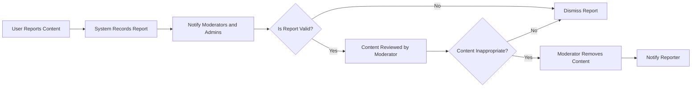
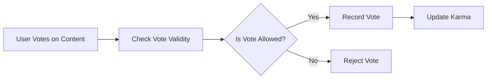

# Business Rules and Validation for redditCommunity

## 1. Introduction and Scope
This document defines the business rules and validation requirements for the redditCommunity backend platform. These rules govern content moderation, karma calculation, community creation, voting behavior, comment nesting, reporting processes, and user permissions.

All aspects are described in clear business language suitable for implementation by backend development teams. The document excludes technical implementation details and focuses on what the system must enforce.

## 2. Content Moderation Rules

### 2.1 Allowed Content Types
- The system SHALL allow posts containing text, links, and images.
- The system SHALL reject posts containing unsupported file types or corrupted images, returning descriptive error messages to users.

### 2.2 Moderator Authority
- WHEN a moderator identifies inappropriate content within their community, THE system SHALL allow the moderator to remove or hide the content.
- THE system SHALL log all moderation actions including moderator ID, content ID, and timestamps.

### 2.3 Admin Authority
- THE system SHALL provide admins with rights to moderate content platform-wide, including removal, hiding, and restoration of posts and comments.

### 2.4 Automated Content Checks
- WHERE automated spam or abuse detection mechanisms are enabled, THE system SHALL flag suspicious content and notify moderators for review.

### 2.5 Community Posting Restrictions
- IF a user is banned from a community, THEN THE system SHALL prevent posting in that community and provide an authorization error.

## 3. Karma Calculation Rules

### 3.1 Karma Attribution
- WHEN a user receives an upvote on their post or comment, THE system SHALL increment the user’s karma by 1 point.
- WHEN a user receives a downvote on their post or comment, THE system SHALL decrement the user’s karma by 1 point.

### 3.2 Karma Visibility
- THE system SHALL maintain and display each user’s karma score.

### 3.3 Voting Impact on Karma
- WHEN irregular voting behavior indicative of manipulation is detected, THEN THE system SHALL suspend karma updates from the affected votes until manual review.

## 4. Community Creation Rules

### 4.1 Eligibility
- WHEN a registered user requests to create a community, THE system SHALL verify that the user is in good standing and has no active bans.
- IF the user is ineligible, THEN THE system SHALL reject the creation request with a clear explanation.

### 4.2 Community Name Requirements
- THE system SHALL enforce uniqueness of community names in a case-insensitive manner.
- Community names SHALL only contain alphanumeric characters, underscores (_), and hyphens (-).
- Community names SHALL be between 3 and 21 characters in length.
- Community names SHALL not contain profanity, trademarks, or other restricted terms.

## 5. Voting Rules

### 5.1 Voting Constraints
- EACH user SHALL have one vote per post or comment, which can be either an upvote or a downvote.
- The system SHALL prevent duplicate votes of the same type on a single piece of content.

### 5.2 Vote Changes
- WHEN a user changes their vote from upvote to downvote or vice versa, THE system SHALL update vote counts and karma accordingly.

### 5.3 Self-Voting
- IF a user attempts to vote on their own post or comment, THEN THE system SHALL reject the vote and notify the user.

### 5.4 Voting on Removed Content
- The system SHALL prevent voting on posts or comments that have been removed or hidden.

## 6. Comment Nesting and Limits

### 6.1 Nested Replies
- The system SHALL support nested replies to comments.
- To maintain usability and performance, the nesting depth SHOULD be limited to a maximum of 10 levels.

### 6.2 Comment Length
- Comments SHALL have a maximum length of 10,000 characters.
- Comments exceeding the maximum length SHALL be rejected with an informative error.

### 6.3 Comment Moderation
- WHEN a moderator removes a comment, THE system SHALL prevent further replies to that comment.

## 7. Reporting and Resolution Processes

### 7.1 Reporting Capabilities
- WHEN a user reports content as inappropriate, THE system SHALL record the report with reporter ID, content ID, reason, and timestamp.

### 7.2 Report Validation
- IF a user submits multiple identical reports on the same content, THEN THE system SHALL ignore duplicates after the first.

### 7.3 Moderator and Admin Actions
- THE system SHALL notify moderators and admins of new reports immediately upon submission.
- Moderators and admins SHALL be able to mark reports as resolved, dismissed, or escalated.

### 7.4 Outcome Notifications
- WHEN a report results in content removal, THE system SHALL notify the reporter of the outcome.
- WHEN a report is dismissed, THEN the system SHALL not notify the reporter.

## 8. Glossary and Definitions

| Term       | Definition                                                   |
|------------|--------------------------------------------------------------|
| User       | Registered individual with an account                        |
| Guest      | Unauthenticated visitor                                      |
| Moderator  | User with permissions to moderate content in specific communities |
| Admin      | System administrator with elevated platform-wide privileges  |
| Post       | Content item submitted by users                              |
| Comment    | User response to a post or another comment                  |
| Karma      | Numeric score representing user reputation based on votes   |

## 9. Notes to Developers
This document specifies business rules and validation logic only. All technical design decisions, including API design, database schema, and infrastructure, are left to the development team. Developers have full autonomy to determine the best technical implementations that satisfy these business requirements.

---

## Mermaid Diagram: Content Moderation Workflow

## Mermaid Diagram: Voting and Karma Update Process

