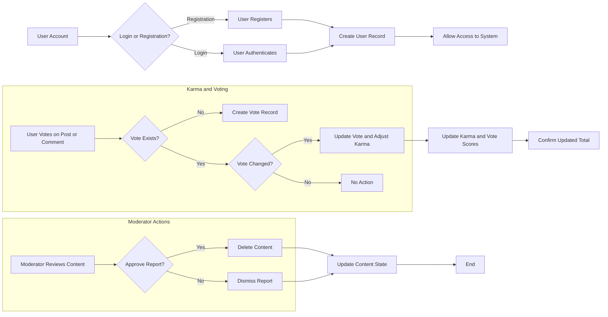

# Reddit-like Community Platform Requirements Specification

## User Account

### Registration
- WHEN a user signs up with email and password, THE system SHALL create a unique user account with a unique username.
- THE system SHALL validate uniqueness of the username during registration.
- WHEN a user registers, THE system SHALL store their email and hashed password securely.

### Authentication
- WHEN a user logs in with email and password, THE system SHALL authenticate them and create a session token.
- THE system SHALL invalidate session tokens upon logout.

### Password Management
- WHEN a user requests to change their password, THE system SHALL verify the current password.
- THE system SHALL allow a user to update to a new password.

### Account Deletion
- WHEN a user deletes their account, THE system SHALL delete all their posts and comments.
- THE system SHALL remove all user data securely.

## User Profile

### Profile Data
- Each user SHALL have a profile containing display name, bio text, and avatar image.

### Profile Editing
- WHEN a user edits their profile, THE system SHALL update their display name, bio, or avatar.

### Viewing Profiles
- Users SHALL be able to view any other user's profile, displaying the user's display name, bio, avatar, total karma, posts, and comments.

## Karma

### Karma Definition and Calculation
- Each user SHALL have a single karma score as an integer that can be positive, zero, or negative.
- WHEN a post or comment receives an upvote, THE system SHALL increase the author's karma by 1.
- WHEN a post or comment receives a downvote, THE system SHALL decrease the author's karma by 1.
- WHEN a vote is removed, THE system SHALL adjust the karma accordingly.
- Karma updates SHALL be atomic and consistent.

### Karma Display
- THE system SHALL display each user's karma on their profile and other relevant areas.

## Communities

### Community Creation
- WHEN a user creates a community, THE system SHALL create a new community record with a unique name, description, and icon image.
- THE creator SHALL be assigned as the community owner.

### Browsing and Searching
- Users SHALL be able to browse all communities in a list.
- Users SHALL be able to search communities by name.
- Each community SHALL display its subscriber count.

## Subscribing

### Subscription Actions
- Users SHALL be able to subscribe and unsubscribe from any community.
- WHEN a user subscribes to a community, THE system SHALL add them to the community's subscriber list.
- Subscribing SHALL be required to create posts in a community.

### Subscription Listing
- Users SHALL be able to view a list of all communities they are subscribed to.

## Posts

### Post Creation
- WHEN a user creates a post in a subscribed community, THE system SHALL allow creation if the user is subscribed.
- A post SHALL have a required title.
- Post types SHALL be text, link, or image.
- Text posts SHALL contain text content.
- Link posts SHALL contain a valid URL.
- Image posts SHALL contain an uploaded image.

### Post Management
- Users SHALL be able to edit and delete their own posts.

### Post Viewing
- WHEN viewing a post, users SHALL see title, full content, author, community, vote score, comment count, and posting time.

## Post Voting

### Voting Rules
- Users SHALL be able to upvote or downvote posts.
- A user SHALL have only one vote per post.
- Votes SHALL be changeable and removable.
- Vote score SHALL be the total upvotes minus downvotes.
- Only authenticated users SHALL vote.
- Banned users SHALL not be able to vote.

## Post Feeds

### Feed Types
- Home Feed SHALL display posts only from subscribed communities, accessible to logged-in users.
- Popular Feed SHALL display posts from all communities, accessible to all users.
- Community Feed SHALL display posts from a specific community, accessible to all users.

### Sorting Options
- Hot, New, Top (with time filters), and Controversial sorting SHALL be supported.
- All feeds SHALL be paginated.

## Post List Display

### Post Summary
- Each post in lists SHALL show title, author username, community name, vote score, comment count, and time since posted.
- Text posts SHALL show first 200 characters.
- Image posts SHALL show a thumbnail.
- Link posts SHALL show the domain name.

## Comments

### Commenting
- Users SHALL be able to create comments and replies with no depth limit.
- Users SHALL be able to edit and delete their own comments.

### Comment Display
- Comments SHALL show author, content, vote score, time since posted, and nested replies.

## Comment Voting

### Voting Rules
- Same rules as posts: upvote/downvote, one vote per user, change/removal allowed.
- Only authenticated users SHALL vote.
- Banned users SHALL not be able to vote.

## Comment Sorting

- Comments SHALL be sortable by Best, New, and Controversial.

## Community Moderation

### Roles and Permissions
- Owner (community creator) HAS highest authority.
- Owner CAN add and remove moderators.
- Moderators CAN add other moderators but CANNOT remove owner or other moderators.

### Moderator Actions
- Moderators CAN delete any post or comment in their community.
- Moderators CAN ban or unban users.
- Banned users CANNOT create posts or comments but CAN view content.

## Reporting

### Reporting Mechanism
- Users CAN report posts or comments with a required reason.
- Moderators CAN view, approve (delete content), or dismiss reports.
- Dismissed reports SHALL be removed from the list.

---

# Mermaid Diagrams

---

# Summary

This requirements specification comprehensively defines all features, actor permissions, workflows, and business rules necessary to implement the Reddit-like community platform backend. It is immediately actionable for developers in the next phases.