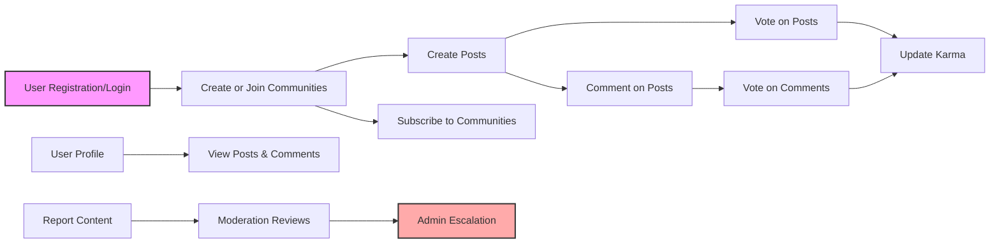

# Reddit-like Community Platform: Functional Requirements

## 1. Introduction
This document details the full functional requirements for the redditCommunity platform. It specifies business rules, user workflows, permission requirements, and system behaviors necessary for backend development. All requirements are written using the EARS (Easy Approach to Requirements Syntax) format to ensure clarity, testability, and measurability.

## 2. User Registration and Login

### 2.1 Registration
- WHEN a guest submits a registration request with a valid email and password, THE system SHALL validate the email format, ensure password strength of at least 8 characters including letters and numbers, and check email uniqueness.
- WHEN the registration data passes validation, THE system SHALL create a new inactive user account and send an email verification link.
- WHEN the user clicks the verification link, THE system SHALL activate the user account.
- IF the user attempts to log in without verifying their email, THEN THE system SHALL deny access with an error message prompting email verification.

### 2.2 Login
- WHEN a registered user submits login credentials, THE system SHALL validate credentials.
- IF credentials are invalid, THEN THE system SHALL deny access with an "invalid username or password" error within 2 seconds.
- WHEN login succeeds, THE system SHALL generate a JWT access token valid for 30 minutes and a refresh token valid for 14 days.
- WHEN a user logs out, THE system SHALL invalidate the refresh token.
- WHEN a JWT token expires, THE system SHALL require the user to reauthenticate.

### 2.3 Password Reset
- WHEN a user requests a password reset, THE system SHALL send a secure, time-limited reset link to their verified email.
- WHEN the user submits a new password through the reset link, THE system SHALL validate password strength and update the password.

## 3. Community Management

### 3.1 Creating Communities
- WHEN a member submits a request to create a community, THE system SHALL validate that the community name is unique, between 3 and 30 alphanumeric characters or underscores.
- THE system SHALL create the community with associated metadata including name, description, creator ID, and creation timestamp.
- THE creator SHALL be assigned as the initial community moderator.

### 3.2 Editing Communities
- WHEN a community moderator requests to update the community description, THE system SHALL allow changes up to 500 characters.
- Community names SHALL NOT be changed after creation.

### 3.3 Browsing and Searching
- WHEN any user views communities, THE system SHALL provide paginated listings with search functionality by name or description.

### 3.4 Subscriptions
- WHEN a member subscribes to a community, THE system SHALL add it to their subscription list.
- WHEN a member unsubscribes, THE system SHALL remove it from their subscription list.
- THE personalized feed SHALL include posts only from subscribed communities.

## 4. Post Management

### 4.1 Creating Posts
- WHEN a member creates a post, THE system SHALL accept exactly one of the following content types: text, link, or single image.
- Text posts SHALL have a maximum body length of 10,000 characters.
- Link posts SHALL verify URLs are valid HTTP or HTTPS links.
- Image posts SHALL accept a single image file (JPEG, PNG, GIF) not exceeding 10MB.
- THE post SHALL be attributed to the author and assigned to one community.

### 4.2 Editing and Deleting Posts
- WHEN the author edits their post within 24 hours of creation, THE system SHALL update the post content and last edited timestamp.
- Authors SHALL be able to delete their posts, removing them from public display.
- Community moderators and admins SHALL be able to delete any post within their jurisdiction.

### 4.3 Post Metadata
- THE system SHALL track and display publicly the numbers of upvotes, downvotes, and comments.

## 5. Voting System

### 5.1 Voting on Posts and Comments
- WHEN a member casts an upvote or downvote on a post or comment, THE system SHALL register one active vote per user per content.
- Users SHALL be able to change or remove their vote at any time.
- Vote counts SHALL be publicly visible to all users including guests.

### 5.2 Karma Update
- WHEN a vote is cast or changed, THE system SHALL update the author’s karma according to the following:
  - Post upvote: +10 karma points
  - Post downvote: -2 karma points
  - Comment upvote: +5 karma points
  - Comment downvote: -1 karma point
- WHEN a vote is removed, THE system SHALL subtract the corresponding karma points.
- WHEN a vote is changed from upvote to downvote or vice versa, THE system SHALL adjust karma accordingly by removing the previous vote’s effect and applying the new vote.

## 6. Comment System

### 6.1 Commenting
- WHEN a member comments on a post or another comment, THE system SHALL support nested replies to unlimited depth.
- Comments SHALL have a maximum length of 2000 characters.

### 6.2 Editing and Deleting Comments
- WHEN a comment author edits their comment within 24 hours, THE system SHALL update the content and last edited timestamp.
- Authors SHALL be able to delete their comments.
- Community moderators and admins SHALL be able to delete any comment within their jurisdiction.

## 7. Post Sorting

### 7.1 Sorting Options
- THE system SHALL provide sorting methods for posts in any community or personalized feed:
  - hot: based on a calculated hotness score combining votes and recency
  - new: posts sorted by creation timestamp descending
  - top: posts sorted by total upvotes descending
  - controversial: posts sorted by high variance between upvotes and downvotes

### 7.2 Default Sorting
- THE default sorting method SHALL be "hot" when loading posts in communities or personalized feeds.

## 8. User Profiles

### 8.1 Profile Content
- THE public user profile SHALL display the user’s posts, comments, total karma, join date, and an optional bio.

### 8.2 Profile Editing
- WHEN a member updates their bio, THE system SHALL save the changes.

### 8.3 Profile Visibility
- User profiles SHALL be publicly visible.

## 9. Content Reporting

### 9.1 Reporting Mechanism
- WHEN a member or guest reports a post, comment, or user, THE system SHALL accept the report with reason and optional description.
- Reports SHALL be timestamped and linked to the reporter if logged in.

### 9.2 Report Review
- Community moderators SHALL review reports related to content within their communities.
- Admins SHALL review escalated reports and unresolved cases.

### 9.3 Report Actions
- WHEN a report is approved, THE system SHALL mark the content as removed and notify the author.
- WHEN a report is rejected, THE system SHALL notify the reporter.

## 10. Permission Matrix

| Action                        | Guest | Member | Community Moderator | Admin |
|------------------------------|-------|--------|---------------------|-------|
| View public communities/posts | ✅    | ✅     | ✅                  | ✅    |
| Register / Login             | ❌    | ✅     | ✅                  | ✅    |
| Create communities           | ❌    | ✅     | ✅                  | ✅    |
| Create/edit/delete own posts | ❌    | ✅     | ✅ (within community)| ✅    |
| Vote on posts/comments       | ❌    | ✅     | ✅                  | ✅    |
| Comment and reply            | ❌    | ✅     | ✅                  | ✅    |
| Subscribe to communities      | ❌    | ✅     | ✅                  | ✅    |
| Moderate community content   | ❌    | ❌     | ✅                  | ✅    |
| Manage site users/admin      | ❌    | ❌     | ❌                  | ✅    |
| Handle escalated reports     | ❌    | ❌     | ✅                  | ✅    |

## 11. Business Rules and Validation

### 11.1 Input Validation
- Community names SHALL be unique and between 3 and 30 characters using alphanumeric and underscores only.
- Post content types SHALL be strictly one of text, link, or single image.
- Text content length limits SHALL be enforced (10,000 characters for posts, 2000 for comments).
- URLs in link posts SHALL be valid HTTP or HTTPS.
- Image files SHALL comply with accepted formats and size limits.
- Votes SHALL be limited to one per user per content item.

### 11.2 Karma Calculations
- Karma points SHALL be computed as specified in the Voting System section.
- Karma SHALL be updated immediately after votes are cast or changed.

### 11.3 Moderation Rules
- Moderators and admins SHALL have authority to delete any inappropriate content.
- Reports SHALL be handled promptly, with moderators reviewing within 24 hours.

## 12. Error Handling and Recovery

### 12.1 Authentication Errors
- Invalid login attempts SHALL return clear error messages within 2 seconds.
- Accounts SHALL lock for 15 minutes after 5 consecutive failed login attempts.

### 12.2 Content Submission Errors
- Validation errors on posts, comments, or communities SHALL return descriptive error messages.
- Unauthorized actions SHALL return 403 errors.

### 12.3 Voting and Commenting Errors
- Votes on deleted or non-existent content SHALL be rejected.
- Comment nesting errors (e.g., excessive depth) SHALL be handled gracefully.

### 12.4 Reporting and Moderation Errors
- Invalid or duplicate reports SHALL be rejected with appropriate feedback.
- Moderation action failures SHALL notify moderators with error details.

## 13. Performance and Scalability

- Login and registration SHALL complete within 2 seconds under normal load.
- Content listing SHALL paginate with 20 items per page, loading within 3 seconds.
- Voting and commenting operations SHALL reflect within 1 second.
- The system SHALL support up to 1 million registered users and 100,000 concurrent users without degradation.

## 14. Security Requirements

- Passwords SHALL be securely hashed.
- JWT tokens SHALL be signed with secure keys and verified on each request.
- Access control SHALL follow the permission matrix.
- User data SHALL be handled in compliance with privacy laws like GDPR.

## 15. Glossary

- Community: A user-created group where posts are shared.
- Post: Content created by users, can be text, link, or image.
- Comment: Nested replies on posts or other comments.
- Karma: Numeric score representing user reputation.
- Vote: User action to upvote or downvote content.
- Moderator: User with privileges to manage a community.
- Admin: User with site-wide administrative privileges.
- Subscription: User's following of a community.
- Report: Flagging content or users for review.

## 16. Mermaid Diagram: Main Platform Workflow

---

All requirements are stated as natural language business rules suitable for backend development. Technical implementation details such as database schema design, API endpoint details, and UI/UX design are under developer discretion and are not covered here.