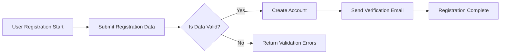
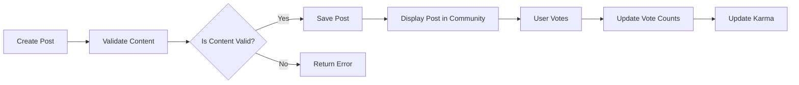
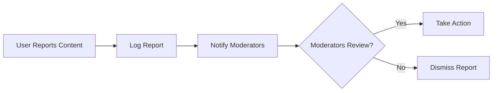

# Requirement Analysis Report for Reddit-Like Community Platform

## 1. Introduction

The platform allows users to create and participate in topic-based communities resembling subreddits. It supports user registration, secure login, community creation, posting diverse content types, voting, nested commenting, karma calculation, subscription management, user profiles, and content reporting for moderation.

## 2. Business Model

The platform meets the need for decentralized, user-driven community discussions with democratic content curation through voting and moderation. Revenue potential arises from advertising, premium subscriptions, and community partnerships. Growth is driven by organic user adoption and active community moderation. Success is measured by usage metrics such as active users, community count, post and comment volume, votes cast, and moderation effectiveness.

## 3. User Actors

- **Guest:** Unauthenticated users who can browse public communities and read posts and comments only.
- **Registered User:** Authenticated members who can create communities, post content (text, links, images), vote, comment with nested replies up to 5 levels, subscribe/unsubscribe communities, view/edit own profiles, and report inappropriate content.
- **Community Moderator:** Registered users with moderation rights limited to their communities; can remove posts/comments, ban users within communities, and edit community settings.
- **Admin:** System administrators with full platform privileges over users, content, communities, and moderation.

## 4. Functional Requirements

### 4.1 User Registration and Login
- WHEN a new user provides valid registration data,
  THE system SHALL create the user account and send a verification email.
- WHEN a user submits login credentials,
  THE system SHALL authenticate credentials and initiate a secure session.
- IF credentials are invalid,
  THEN THE system SHALL return authentication errors with clear messages.
- Users SHALL be able to reset passwords through secured tokenized links.

### 4.2 Community Management
- WHEN a registered user requests to create a community with a unique name following naming rules (3-21 alphanumeric or underscores),
  THE system SHALL validate uniqueness and create the community.
- IF the community name exists or violates rules,
  THEN THE system SHALL reject the request with descriptive errors.
- Community moderators SHALL be able to update settings such as description and rules.
- WHEN a user subscribes or unsubscribes to/from a community,
  THE system SHALL update user subscriptions and reflect changes immediately.

### 4.3 Content Management

#### Posting
- WHEN a registered user submits a post (text, link, or image) in a community,
  THE system SHALL validate content types, size limits (images max 5MB), and associate posts with author and community.
- Posts SHALL be editable within 24 hours by the author.

#### Voting
- WHEN a user votes (upvote or downvote) on a post or comment,
  THE system SHALL record one vote per user per content item and update scores.
- The system SHALL prevent duplicate votes and allow vote changes/removals.

#### Commenting
- WHEN a user comments on a post or replies to another comment,
  THE system SHALL allow nested replies up to 5 levels deep.
- Comments SHALL have a maximum length of 1000 characters.

### 4.4 User Karma System
- Karma SHALL be calculated as net votes (upvotes minus downvotes) on all user posts and comments.
- WHEN votes change,
  THE system SHALL update karma in near real-time.
- The system SHALL implement mechanisms to detect and prevent voting fraud and karma manipulation.

### 4.5 Post Sorting
- POSTS SHALL be sortable by the following criteria:
  - "hot": algorithmic ranking combining recency and votes
  - "new": by creation time descending
  - "top": by highest votes
  - "controversial": by high vote divergence
- Users SHALL select sorting criteria when browsing posts.

### 4.6 Subscription Management
- Users SHALL be able to subscribe/unsubscribe communities.
- THE system SHALL provide retrieval of subscribed communities per user for personalized feeds.

### 4.7 User Profiles
- Profiles SHALL display user’s posts, comments, total karma, and subscriptions.
- Users SHALL be able to edit profile information excluding username.

### 4.8 Reporting and Moderation
- WHEN a user reports inappropriate content,
  THE system SHALL log reports, notify community moderators and admins,
  and track report statuses (pending, reviewed, resolved).
- Moderators and admins SHALL be able to take actions such as content removal, user warnings, or bans based on reports.

## 5. Business Rules
- Community names MUST be unique, 3 to 21 characters, allow only alphanumeric and underscores.
- Post content MUST adhere to allowed types and size limits.
- Votes MUST be limited to one per user per content item with option to change.
- Karma points SHALL be incremented or decremented per vote as defined.
- Moderators act only within their assigned communities.
- Posting and commenting rate limits SHALL prevent spam.

## 6. Error Handling and Validation
- WHEN input validation fails (e.g., invalid email, password, community name),
  THE system SHALL return descriptive error messages within 2 seconds.
- IF unauthorized actions are attempted,
  THEN THE system SHALL deny with proper authorization error messages.
- WHEN duplicate votes are submitted,
  THE system SHALL reject duplicates with clear feedback.
- IF post or comment exceeds length or size limits,
  THE system SHALL reject with corresponding error.

## 7. Performance Requirements
- User login and registration SHALL respond within 2 seconds.
- Post and comment creation SHALL complete within 1 second.
- Vote and karma updates SHALL be reflected within 5 seconds.
- Post listings with sorting SHALL paginate in batches of 20 posts, loading within 2 seconds.

---

## Appendix: Mermaid Diagrams

### User Registration and Login Flow

```mermaid
graph LR
  A["User Registration Start"] --> B["Submit Registration Data"]
  B --> C{"Is Data Valid?"}
  C -->|"Yes"| D["Create Account"]
  C -->|"No"| E["Return Validation Errors"]
  D --> F["Send Verification Email"]
  F --> G["Registration Complete"]
```

### Posting and Voting Flow

```mermaid
graph LR
  A["Create Post"] --> B["Validate Content"]
  B --> C{"Is Content Valid?"}
  C -->|"Yes"| D["Save Post"]
  C -->|"No"| E["Return Error"]
  D --> F["Display Post in Community"]
  F --> G["User Votes"]
  G --> H["Update Vote Counts"]
  H --> I["Update Karma"]
```

### Reporting Workflow

```mermaid
graph LR
  A["User Reports Content"] --> B["Log Report"]
  B --> C["Notify Moderators"]
  C --> D{"Moderators Review?"}
  D -->|"Yes"| E["Take Action"]
  D -->|"No"| F["Dismiss Report"]
```

All flows use double quotes correctly with no spaces inside brackets per Mermaid syntax requirements.