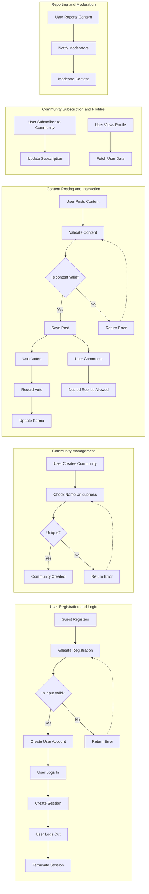

# Requirements Analysis Report for Reddit-like Community Platform

## 1. Introduction

The redditCommunity platform is a user-driven online community system that facilitates the creation and participation in topic-based communities similar to "subreddits." It provides users the ability to register, create communities, post diverse content, interact through voting and commenting, manage subscriptions, and report inappropriate behavior, all within a moderated and scalable environment.

## 2. Business Model

### 2.1 Purpose and Motivation
The platform exists to empower users to create and engage in specialized communities fostering shared interests and discussions. It addresses the demand for decentralized and moderated content sharing, offering fine-grained control over community creation and content curation.

### 2.2 Revenue Channels
Monetization strategies include advertising integration, premium membership options, and sponsored community features, designed to ensure sustainable platform growth.

### 2.3 Growth and Success Metrics
Success will be measured through active user counts, community engagement levels, volume of content generated, and efficiency in moderation and content reporting processes.

## 3. User Actors and Permissions

The system recognizes the following user roles:

- **Guest**: Unauthenticated visitors with read-only access to public communities and posts.
- **RegisteredUser**: Authenticated members who can create communities, post content, comment, vote, subscribe, and report inappropriate content.
- **Moderator**: Users with moderation privileges restricted to specific communities, empowered to manage content and reports within those communities.
- **Admin**: System administrators with full control over the platform, users, and content.

### 3.1 Permission Matrix

| Action                         | Guest | RegisteredUser | Moderator | Admin |
| ------------------------------|-------|----------------|-----------|-------|
| Browse Public Content          | ✅    | ✅             | ✅        | ✅    |
| Register / Login              | ❌    | ✅             | ✅        | ✅    |
| Create Communities           | ❌    | ✅             | ❌        | ✅    |
| Create Posts                 | ❌    | ✅             | ✅        | ✅    |
| Comment on Posts             | ❌    | ✅             | ✅        | ✅    |
| Vote on Posts/Comments       | ❌    | ✅             | ✅        | ✅    |
| Subscribe to Communities     | ❌    | ✅             | ✅        | ✅    |
| Moderate Community Content    | ❌    | ❌             | ✅        | ✅    |
| View User Profiles           | ✅    | ✅             | ✅        | ✅    |
| Report Inappropriate Content | ❌    | ✅             | ✅        | ✅    |

## 4. Functional Requirements

### 4.1 User Registration and Login
- WHEN a guest submits valid registration data, THE system SHALL create a new registered user account.
- WHEN a registered user submits login credentials, THE system SHALL authenticate and establish a user session.
- IF login credentials are invalid, THEN THE system SHALL return an authentication error.
- WHEN a logged-in user logs out, THE system SHALL terminate the session securely.
- THE system SHALL validate input data formats and enforce password complexity.

### 4.2 Community Creation and Management
- WHEN a registered user requests to create a community with a unique name and description, THE system SHALL verify uniqueness and create the community.
- THE system SHALL assign the creator as community owner and allow them to manage community settings.
- THE system SHALL enable assigning moderators to communities with granular permissions.

### 4.3 Content Posting
- WHEN a registered user posts content (text, link, image) to a community, THE system SHALL validate content and save it with author and community references.

### 4.4 Voting System
- WHEN a registered user votes on a post or comment, THE system SHALL record the vote, restrict multiple votes by the same user, and update content scores.

### 4.5 Commenting and Nested Replies
- WHEN a registered user comments or replies to a comment, THE system SHALL associate the comment appropriately allowing unlimited nesting.
- THE system SHALL enforce maximum content lengths and prevent abuse.

### 4.6 User Karma System
- THE system SHALL calculate and update user karma based on votes received on posts and comments.

### 4.7 Post Sorting
- THE system SHALL support sorting posts by "hot", "new", "top", and "controversial" criteria.

### 4.8 Community Subscription
- WHEN a registered user subscribes or unsubscribes from a community, THE system SHALL manage the subscription list accurately.

### 4.9 User Profiles
- THE system SHALL provide detailed profiles displaying user posts, comments, karma, and community subscriptions.

### 4.10 Reporting Inappropriate Content
- WHEN content is reported by users, THE system SHALL log reports and notify community moderators and admins for review.
- THE system SHALL provide interfaces for moderation workflows to resolve reported content.

## 5. Business Rules and Validation

- Community names MUST be unique and conform to naming conventions.
- Posts and comments SHALL comply with content length and type validations.
- Each user MAY vote only once per content item.
- Karma calculations SHALL apply defined weights for posts and comment votes.
- Reporting triggers moderation workflows and potential content hiding or removal.

## 6. Error Handling and Performance

- IF inputs fail validation or authorization checks, THEN THE system SHALL return clear, descriptive error responses.
- THE system SHALL ensure typical operations respond within 2 seconds for optimal user experience.
- THE system SHALL paginate content lists to limit payload sizes.

## 7. User Interaction Flow Diagrams

```mermaid
graph LR
  subgraph "User Registration and Login"
    A["Guest Registers"] --> B["Validate Registration"]
    B --> C{"Is input valid?"}
    C -->|"Yes"| D["Create User Account"]
    C -->|"No"| E["Return Error"]
    D --> F["User Logs In"]
    F --> G["Create Session"]
    G --> H["User Logs Out"]
    H --> I["Terminate Session"]
  end

  subgraph "Community Management"
    J["User Creates Community"] --> K["Check Name Uniqueness"]
    K --> L{"Unique?"}
    L -->|"Yes"| M["Community Created"]
    L -->|"No"| N["Return Error"]
  end

  subgraph "Content Posting and Interaction"
    O["User Posts Content"] --> P["Validate Content"]
    P --> Q{"Is content valid?"}
    Q -->|"Yes"| R["Save Post"]
    Q -->|"No"| S["Return Error"]
    R --> T["User Votes"]
    T --> U["Record Vote"]
    U --> V["Update Karma"]
    R --> W["User Comments"]
    W --> X["Nested Replies Allowed"]
  end

  subgraph "Community Subscription and Profiles"
    Y["User Subscribes to Community"] --> Z["Update Subscription"]
    AA["User Views Profile"] --> AB["Fetch User Data"]
  end

  subgraph "Reporting and Moderation"
    AC["User Reports Content"] --> AD["Notify Moderators"]
    AD --> AE["Moderate Content"]
  end

  E -.-> B
  N -.-> K
  S -.-> P
```

## 8. Conclusion

These requirements form a complete, detailed, and actionable blueprint for implementing a Reddit-like community platform backend focused on user-generated content, voting, commenting, and moderation. They follow best practices for clarity, specificity, and executable EARS format standards to enable high-quality development and maintenance.

All technical details such as API design, database schemas, infrastructure, and frontend implementation are delegated to the development team. The document defines WHAT must be done, not HOW.
