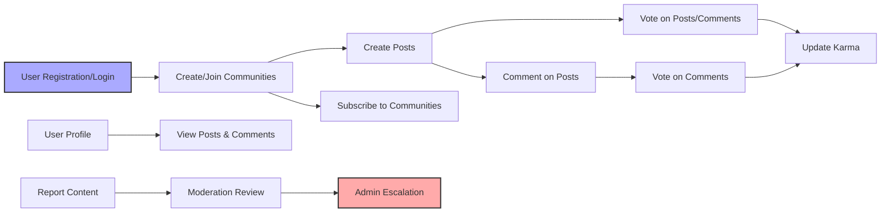

# Functional Requirements for redditCommunity Platform

## 1. Introduction

The redditCommunity platform is a social content aggregation service where users can create, join, and engage in topic-focused communities. The platform supports user registration, authentication, community creation, posting of various content types, voting, commenting with nested replies, user karma, post sorting, subscriptions, user profiles, and content reporting with moderation.

This document outlines all functional business requirements necessary for backend development, specifying system behaviors in natural language and using EARS format for clarity, completeness, and testability.

## 2. User Roles and Authentication

### 2.1 User Roles

- **Guest:** Unauthenticated users who can browse public communities and posts.
- **Member:** Registered users who can create communities, posts, comments, vote, subscribe, and manage their profiles.
- **Community Moderator:** Members assigned to moderate content and reports within specific communities.
- **Admin:** Platform administrators with full system-wide permissions.

### 2.2 Authentication Workflow

- WHEN a user registers with email and password, THE system SHALL validate the email format and password strength, create a pending account, and send an email verification link.
- WHEN the user clicks the verification link within 72 hours, THE system SHALL activate the account.
- IF the user fails to verify email within 72 hours, THEN THE system SHALL restrict posting, commenting, and voting privileges until verification.
- WHEN a user submits login credentials, THE system SHALL authenticate the credentials.
- IF credentials are valid, THEN THE system SHALL establish a secure session with expiring JWT tokens.
- WHEN a user logs out, THE system SHALL invalidate the session tokens.
- Sessions SHALL expire after 30 days of inactivity.

### 2.3 Permission Matrix

| Action                          | Guest | Member | Community Moderator | Admin |
|--------------------------------|-------|--------|---------------------|-------|
| View public content             | ✅    | ✅     | ✅                  | ✅    |
| Register / Login                | ✅    | N/A    | N/A                 | N/A   |
| Create communities             | ❌    | ✅     | N/A                 | ✅    |
| Moderate communities            | ❌    | ❌     | ✅ (assigned only)   | ✅    |
| Create posts                   | ❌    | ✅     | ✅                  | ✅    |
| Edit/Delete own posts          | ❌    | ✅     | N/A                 | ✅    |
| Vote posts/comments            | ❌    | ✅     | ✅                  | ✅    |
| Comment on posts/comments      | ❌    | ✅     | ✅                  | ✅    |
| Subscribe to communities       | ❌    | ✅     | N/A                 | ✅    |
| Manage reports                 | ❌    | ❌     | ✅ (within community) | ✅    |
| Manage system-wide settings    | ❌    | ❌     | ❌                  | ✅    |

## 3. Community Management

- WHEN a member requests to create a community, THE system SHALL verify the community name uniqueness (3-30 alphanumeric and underscores), and create the community with associated metadata.
- THE system SHALL assign the creating member as the initial community moderator.
- WHEN a community is updated, THE system SHALL allow community moderators to edit description (max 500 characters).
- Guests and members SHALL be able to browse and search all public communities.
- Members SHALL be able to subscribe to communities.
- WHEN a member subscribes, THE system SHALL add the community to the user's subscription list.
- WHEN a member unsubscribes, THE system SHALL remove the community from their subscriptions.

## 4. Post Management

- WHEN a member creates a post, THE system SHALL accept one of three types: text only, link only (valid HTTP/HTTPS URL), or single image (JPEG, PNG, GIF, max 10MB).
- THE system SHALL validate post titles (non-empty, max 300 characters) and bodies (text max 10,000 characters).
- WHEN a post is created, THE system SHALL associate it with the author and community.
- Members SHALL be able to edit posts within 24 hours of creation; edits SHALL update last modified timestamp.
- Members SHALL be able to delete their posts.
- Community moderators and admins SHALL be able to delete any post within their jurisdiction.
- THE system SHALL maintain version history.
- Publicly visible metadata SHALL include creation, last edited timestamps; vote counts; and comment counts.

## 5. Voting System

- WHEN a member votes on a post or comment, THE system SHALL allow upvote (+1), downvote (-1), or vote removal.
- THE system SHALL restrict one active vote per user per content item.
- Members SHALL be able to change their vote at any time.
- THE system SHALL immediately update and display public vote counts.

## 6. Comment System

- Members SHALL be able to comment on posts with unlimited nesting depth.
- Comments SHALL be non-empty and max 1,000 characters.
- Members SHALL be able to edit or delete their comments within 24 hours.
- Moderators and admins SHALL be able to delete any comment within their jurisdiction.
- Comments SHALL display creation and last edited timestamps and vote counts.

## 7. User Karma System

- THE system SHALL calculate user karma as the sum of points from votes on posts and comments authored by the user.
- WHEN a post receives an upvote, THE system SHALL add 10 karma points to the author.
- WHEN a post receives a downvote, THE system SHALL subtract 2 karma points.
- WHEN a comment receives an upvote, THE system SHALL add 5 karma points.
- WHEN a comment receives a downvote, THE system SHALL subtract 1 karma point.
- WHEN a vote is changed or removed, THE system SHALL adjust karma points accordingly.

## 8. Sorting Posts

- THE system SHALL support sorting posts by:
  - hot: score reflects votes and recency
  - new: ordered by creation time descending
  - top: ordered by highest vote count
  - controversial: ordered by high vote variance
- THE default sort method SHALL be hot.
- Sorting SHALL apply within communities and personalized user feeds.

## 9. User Profiles

- User profiles SHALL be publicly visible showing posts, comments, total karma, join date, and optional bio.
- Members SHALL be able to edit their bios.

## 10. Content Reporting

- Members and guests SHALL be able to report posts, comments, or users.
- Reports SHALL include reporter ID if authenticated, reported content ID, report type (spam, abuse, other), and timestamp.
- Community moderators SHALL review reports within their communities.
- Admins SHALL handle escalated reports.
- WHEN reports are validated, THE system SHALL update content visibility and apply penalties.

## 11. Error Handling

- WHEN validation fails (e.g., invalid inputs, duplicate votes), THE system SHALL return descriptive error messages within 2 seconds.
- WHEN unauthorized actions are attempted, THE system SHALL deny with appropriate errors.
- WHEN system errors occur, THE system SHALL provide user-friendly messages and log details for administrators.

## 12. Mermaid Diagrams

---

This comprehensive requirements document enables backend developers to proceed with implementation without ambiguity. All requirements are stated in clear, testable, natural language and ensure the platform behavior aligns correctly with business expectations.