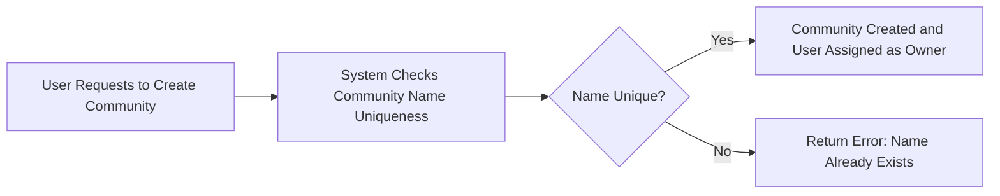
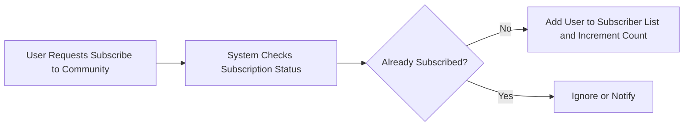
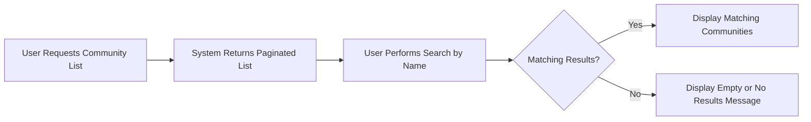
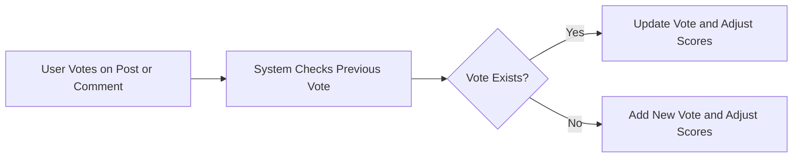
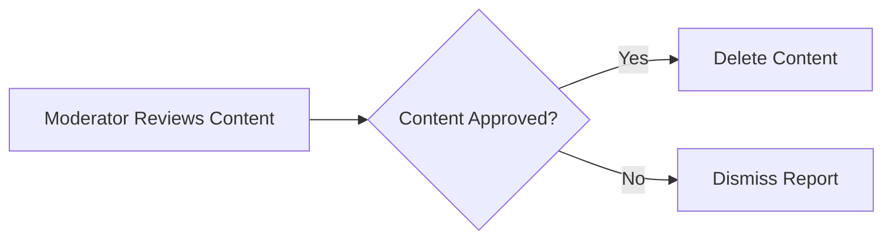

# Reddit-like Community Platform

## 1. User Account

### 1.1 User Registration
WHEN a user submits a valid email address, a unique username, and a password to the registration endpoint, THE system SHALL create a new user account.

### 1.2 User Login
WHEN a user submits a valid email and password, THE system SHALL authenticate the user and establish a secure session.

### 1.3 Password Change
WHEN an authenticated user submits their current password and a new password, THE system SHALL verify the current password and update the password.

### 1.4 Account Deletion
WHEN an authenticated user requests account deletion, THE system SHALL delete the user's account along with all posts and comments created by the user.

## 2. User Profile

### 2.1 Profile Data
Each user SHALL have a profile containing display name, bio text, and avatar image.

### 2.2 Profile Editing
WHEN a user updates their display name, bio, or avatar image, THE system SHALL update the user's profile.

### 2.3 Profile Viewing
ANY user SHALL be able to view any other user's profile showing display name, bio, avatar, total karma, list of posts, and list of comments.

## 3. Karma

### 3.1 Karma Score
EVERY user SHALL have a karma score that can be positive or negative.

### 3.2 Karma Updates
WHEN a post or comment receives an upvote, THE system SHALL increment the author's karma by 1.
WHEN it receives a downvote, THE system SHALL decrement the author's karma by 1.
WHEN a vote is removed, THE system SHALL adjust karma accordingly.

## 4. Communities

### 4.1 Community Creation
WHEN a user creates a community with a unique name, description, and icon, THE system SHALL create the community and assign the user as owner.

### 4.2 Community Information
THE system SHALL store and display the community's unique name, description, icon, and subscriber count.

### 4.3 Community Browsing
ANY user SHALL be able to browse a paginated list of all communities.

### 4.4 Community Search
ANY user SHALL be able to search communities by name with case-insensitive matching.

## 5. Subscribing

### 5.1 Subscribe to Community
WHEN a user subscribes to a community, THE system SHALL add the user to the subscriber list and increment the subscriber count.

### 5.2 Unsubscribe from Community
WHEN a user unsubscribes, THE system SHALL remove them from the subscriber list and decrement the subscriber count.

### 5.3 Subscription Requirement
THE system SHALL require subscription to a community in order to create posts therein.

### 5.4 User's Subscriptions
WHEN a user requests, THE system SHALL provide a paginated list of all communities the user is subscribed to.

## 6. Posts

### 6.1 Post Creation
WHEN a subscribed user submits a post with title and matching content type, THE system SHALL create the post.

### 6.2 Post Types
Posts SHALL be one of:
- Text Post: includes text content
- Link Post: includes a valid URL
- Image Post: includes an uploaded image

### 6.3 Post Editing
WHEN a user edits their own post, THE system SHALL update the post content.

### 6.4 Post Deletion
WHEN a user deletes their own post, THE system SHALL remove the post and all its comments.

### 6.5 Post View
WHEN viewing a post, THE system SHALL display title, full content, author, community, vote score, comment count, and posting time.

## 7. Post Voting

### 7.1 One Vote Per User
EVERY user SHALL be allowed one vote per post: upvote, downvote, or none.

### 7.2 Voting Changes
WHEN a vote is created, changed, or removed, THE system SHALL update the post vote score and author's karma accordingly.

## 8. Post Feeds

### 8.1 Feed Types
The system SHALL offer Home Feed (subscribed communities), Popular Feed (all communities), and Community Feed (single community).

### 8.2 Sorting Options
Feeds SHALL support sorting by Hot, New, Top (with time filters), and Controversial.

### 8.3 Pagination
Feeds SHALL be paginated.

## 9. Post List Display

### 9.1 Display Fields
Each post in any feed SHALL display title, author username, community name, vote score, comment count, posting time.

### 9.2 Post Type Display
Text posts SHALL show first 200 characters of content.
Image posts SHALL show thumbnail image.
Link posts SHALL show domain name from URL.

## 10. Comments

### 10.1 Comment Creation
WHEN a logged-in user adds a comment or replies, THE system SHALL store the comment.

### 10.2 Nested Replies
Replies MAY be nested unlimited.

### 10.3 Comment Editing
WHEN a user edits their comment, THE system SHALL update it.

### 10.4 Comment Deletion
WHEN a user deletes their comment, THE system SHALL delete it and its replies.

### 10.5 Comment Viewing
Comments SHALL include author, content, vote score, time since posted, and nested replies.

## 11. Comment Voting

### 11.1 Voting Rules
The voting rules SHALL mirror post voting: one vote per user per comment; upvote, downvote, or none.

## 12. Comment Sorting

### 12.1 Sorting Options
Comments SHALL be sortable by Best, New, Controversial.

## 13. Community Moderation

### 13.1 Roles
Owner is the community creator, top authority; moderators are added with constraints.

### 13.2 Moderator Management
Owners can add/remove moderators; moderators can add but not remove other moderators or owner.

### 13.3 Moderator Actions
Moderators can delete posts/comments, ban/unban users in community.

### 13.4 Banned Users
Banned users cannot create posts/comments but can view content.

### 13.5 Permissions
| Action          | Guest | User | Moderator | Owner |
|-----------------|-------|------|-----------|-------|
| Delete content  | ❌    | ❌   | ✅        | ✅    |
| Ban/unban users | ❌    | ❌   | ✅        | ✅    |
| Add moderators  | ❌    | ❌   | ✅(add only) | ✅    |
| Remove moderators| ❌    | ❌   | ❌        | ✅    |

## 14. Reporting

### 14.1 Reporting
Users can report posts/comments, providing reason.

### 14.2 Report Viewing
Moderators view reports related to their community.

### 14.3 Report Actions
Moderators approve (delete content) or dismiss reports.

### 14.4 Report Management
Dismissed reports are removed from report list.

---

## Authentication and Authorization

### Authentication
Signup with unique email and username; login with email/password; password change; account deletion.

### Authorization
Role-based permissions: guest, user, moderator, owner.

---

## Error Handling and Performance

Errors handled with appropriate messages.
Performance: community and subscription lists load within 1 second; search within 2 seconds.
Pagination applied to lists and feeds.

---

## Mermaid Diagrams

### Community Creation

### Subscription Flow

### Community Browsing and Searching

### Voting Flow

### Moderator Actions Flow

