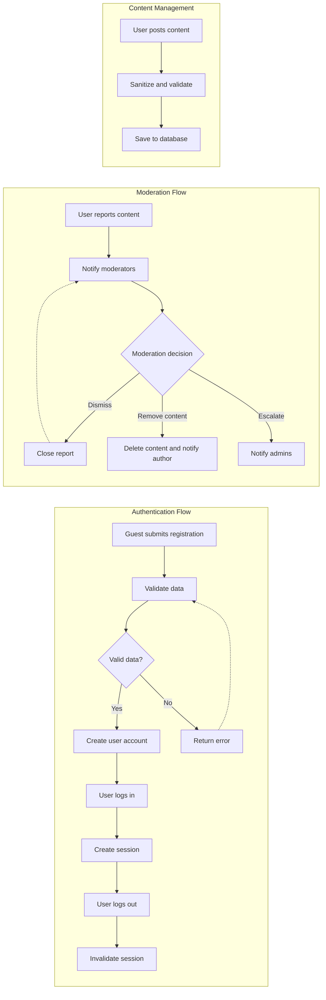

# Requirement Analysis Report for Reddit-like Community Platform Backend

## 1. Introduction

This document specifies the comprehensive business and functional requirements outlining the security, privacy, authentication, authorization, and compliance standards for the backend system of the Reddit-like community platform. Its purpose is to guide backend developers in creating a secure, compliant, and resilient platform that protects user data and enforces role-based access and moderation.

## 2. Business Model

### 2.1 Purpose
The redditCommunity platform enables users to create interest-based communities where they can share content, vote, comment, and interact socially. It fulfills the need for moderated, democratic content sharing with reputation and karma mechanisms, driving user engagement and retention.

### 2.2 Revenue Strategy
Revenue streams include advertising, premium subscription features, and sponsored content. The system must support secure and scalable integration points for payment processing and advertising delivery.

### 2.3 Growth Plan
Growth depends on viral user acquisition, community engagement through voting and commenting, and active moderation for quality control.

### 2.4 Success Metrics
- Monthly Active Users
- Communities Created
- Posts and Comments Volume
- Voting Activity
- Moderator Responsiveness

## 3. User Actors and Authentication

### 3.1 Actors
- **Guest**: Unauthenticated users with read-only access to public content.
- **Registered User**: Authenticated users able to create communities, post, comment, vote, report, and subscribe.
- **Moderator**: Community-specific moderators with privileges to manage content and review reports.
- **Admin**: System-wide administrators with full permissions.

### 3.2 Authentication Flow
- WHEN a guest submits registration details with a unique email and strong password, THE system SHALL create a new registered user account.
- WHEN a registered user submits login credentials, THE system SHALL validate and establish a secure session.
- WHEN a user logs out, THE system SHALL invalidate the session.
- THE system SHALL manage session expiration with configurable timeouts.
- THE system SHALL enforce robust password policies and throttle login attempts.

### 3.3 Permissions Matrix

| Action                         | Guest | Registered User | Moderator | Admin |
|-------------------------------|-------|-----------------|-----------|-------|
| Browse Public Content          | ✅    | ✅              | ✅        | ✅    |
| Register / Login               | ❌    | ✅              | ✅        | ✅    |
| Create Communities            | ❌    | ✅              | ❌        | ✅    |
| Post Content                  | ❌    | ✅              | ✅        | ✅    |
| Comment                      | ❌    | ✅              | ✅        | ✅    |
| Vote                         | ❌    | ✅              | ✅        | ✅    |
| Subscribe to Communities      | ❌    | ✅              | ✅        | ✅    |
| Report Content                | ❌    | ✅              | ✅        | ✅    |
| Moderate Content              | ❌    | ❌              | ✅        | ✅    |
| Manage Users                 | ❌    | ❌              | ❌        | ✅    |

## 4. Functional Requirements

### 4.1 User Registration and Login
- WHEN a guest registers using valid credentials, THE system SHALL create an active user account.
- WHEN users attempt to register with duplicate emails, THE system SHALL reject with an informative error.
- WHEN registered users login, THE system SHALL authenticate and create session tokens using best practices.
- THE system SHALL use secure password storage with salted hashes.

### 4.2 Community Creation and Management
- Registered users SHALL create communities with unique names.
- Moderators SHALL be assigned per community with scoped permissions.

### 4.3 Posting and Content Management
- Registered users SHALL post text, links, or images subject to validation.
- The system SHALL sanitize posts to prevent injection attacks.

### 4.4 Voting System
- Registered users SHALL be allowed one vote per post/comment.
- The system SHALL update karma and invalidate cached scores accordingly.

### 4.5 Commenting and Nested Replies
- The system SHALL support unlimited nesting for comments.
- Comment content SHALL be validated and sanitized.

### 4.6 User Karma
- Karma points SHALL be updated real-time based on votes.

### 4.7 Post Sorting
- The system SHALL offer post sorting by hot, new, top, controversial.

### 4.8 Community Subscription
- Users SHALL subscribe and unsubscribe from communities impacting feed content.

### 4.9 User Profiles
- Profiles SHALL display accessible data based on privacy and user roles.

### 4.10 Reporting and Moderation
- Reports SHALL be logged and escalated to proper moderators and admins.
- Moderation actions SHALL include dismissals, deletions, and user warnings.

## 5. Security and Compliance

### 5.1 Data Privacy
- User data SHALL be encrypted in transit and at rest using industry standards.
- Personal Identifiable Information (PII) SHALL be handled per privacy laws (e.g., GDPR).

### 5.2 Access Control
- Role-Based Access Control (RBAC) SHALL be enforced respecting actor permissions.
- Sessions and authentication tokens SHALL be managed securely.

### 5.3 Content Moderation Policies
- System SHALL allow flagging, review, and removal workflows.
- Repeat violations SHALL trigger account sanctions.

### 5.4 Data Protection and Auditing
- The system SHALL log security-relevant events.
- Regular backups and audit trails SHALL be maintained.

### 5.5 Regulatory Compliance
- Platform SHALL comply with relevant regional laws including data protection and user rights.

## 6. Error Handling and Performance

- Unauthorized actions SHALL return precise HTTP status codes and messages.
- Validation errors SHALL provide clear feedback.
- The system SHALL aim to respond to user actions within 2 seconds.

## 7. Mermaid Diagrams

## 8. Appendix

All requirements focus solely on business rules and user interactions. Detailed technical or infrastructure design is the responsibility of developers who must ensure compliance with these requirements.