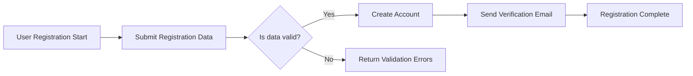
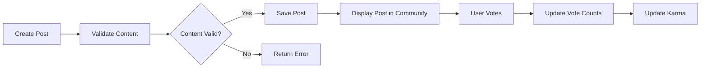

# Requirements Analysis Report for Reddit-Like Community Platform

## 1. Introduction

The redditCommunity platform provides a web-based environment for creating and engaging with interest-based communities, supporting text, link, and image posts alongside active user participation through voting, commenting, and moderation. It enables users to register, authenticate, create communities, post content, and interact through votes and comments with nested replies.

### 1.1 Purpose
When a user accesses the platform, the system shall provide a seamless and secure registration and login process to enable personalized experiences.

### 1.2 Scope
The system shall allow registered users to create and subscribe to communities, post and manage text, link, and image content, vote up or down on posts and comments, comment with nested replies, and participate in a karma-based reputation system.

## 2. Business Model

### 2.1 Why This Service Exists
When users seek topic-focused discussion spaces, the platform shall provide them with customizable communities (similar to subreddits) fostering rich conversations and content curation through democratic voting.

### 2.2 Revenue Strategy
The platform shall generate revenue through advertising, premium subscriptions offering added features, and community sponsorship programs.

### 2.3 Growth Plan
When the platform grows, it shall expand multilingual support, mobile accessibility, and strategic partnerships to increase user acquisition and retention.

### 2.4 Success Metrics
The system shall track monthly active users, community creation counts, posting activity, vote engagement, and moderation turnaround times as key success indicators.

## 3. User Actors and Authentication

### 3.1 Guest
Guests shall browse public communities, read posts and comments, but cannot create content or interact through voting or commenting.

### 3.2 Registered User
When a user registers and verifies their email, they shall gain permissions to create communities, post content, vote, comment with nested replies, subscribe to communities, view their profile, and report inappropriate content.

### 3.3 Community Moderator
When assigned to a community, moderators shall manage posts and comments within that community, enforce rules, and handle reported content.

### 3.4 Admin
Admins shall have full system-wide access to manage users, communities, content moderation, and platform settings.

### 3.5 Authentication Workflows
When a user registers, the system shall verify the email before granting full access. When logging in, the system shall validate credentials, establish a session, and allow logout to terminate it. Password reset shall be available via emailed secure links.

## 4. Functional Requirements

### 4.1 User Registration and Login
- When a new user submits registration data with a valid email and password, the system shall create an account and send a verification email.
- When the user verifies their email, the system shall activate the account.
- When a user attempts to log in with valid credentials, the system shall authenticate and establish a secure session.
- If login credentials are invalid, the system shall respond with an authentication error.

### 4.2 Community Management
- When a registered user requests to create a community, the system shall ensure community name uniqueness and create the community.
- The system shall allow users to subscribe or unsubscribe from communities.
- Community moderators shall be able to update community settings and remove inappropriate content.

### 4.3 Posting Content
- When a user posts text, links, or images, the system shall validate content and upload images restricted to JPEG or PNG formats and a maximum size of 5MB.
- The system shall allow users to edit their posts within 24 hours.

### 4.4 Voting System
- When a user votes on a post or comment, the system shall record the vote and update the vote count.
- The system shall prevent voting multiple times on the same item by the same user.

### 4.5 Commenting System
- When a user comments on a post, the system shall allow nested replies up to five levels.
- Comment text shall be limited to 1000 characters.

### 4.6 User Karma System
- The system shall calculate and update user karma based on votes received on their posts and comments.
- Karma shall increase with upvotes and decrease with downvotes.

### 4.7 Post Sorting
- The system shall provide sortable post listings by "hot", "new", "top", and "controversial" attributes.

### 4.8 Subscription Management
- The system shall track user subscriptions and allow retrieval of all subscribed communities.

### 4.9 User Profiles
- User profiles shall display all posts, comments, and karma totals.

### 4.10 Reporting Inappropriate Content
- Users shall be able to report posts or comments, which the system shall log and notify moderators and administrators.
- Moderators and admins shall track report status and act accordingly.

## 5. Business Rules

- Posts and comments flagged as inappropriate shall be hidden pending moderator review.
- Users with excessive rule violations shall be restricted or banned.
- Karma thresholds shall unlock privileges such as community creation.
- Posting and comment rate limits shall be enforced to prevent spam.

## 6. Error Handling and Validation

- If a user submits invalid registration data, the system shall return descriptive validation errors.
- Unauthorized actions shall be denied with an authorization error message.
- Content violating size or format restrictions shall be rejected with explanatory errors.
- Duplicate votes shall be disallowed with appropriate notifications.

## 7. Performance Requirements

- User login attempts shall be processed within 2 seconds.
- Post listings shall load in pages of 20 items within 1 second.
- Vote counts and karma shall update within 5 seconds of a vote.

---

## Mermaid Diagrams

### User Registration and Login

### Posting and Voting

## Notes
- All Mermaid diagram labels include double quotes with no space between brackets and quotes.
- All requirements are expressed in EARS format with clear WHEN, IF, THEN, and SHALL keywords.
- The document is free from database schemas or low-level API implementation details.
- Business rules include clear moderation policies, karma calculations, rate limits, and user restrictions.
- Error handling sections specify detailed system responses to user errors and invalid actions.
- Performance requirements provide quantitative targets.
- User roles and authentication flows are precisely defined, covering email verification, session management, and password resets.
- This document serves backend developers as a complete source of business requirements for redditCommunity.

