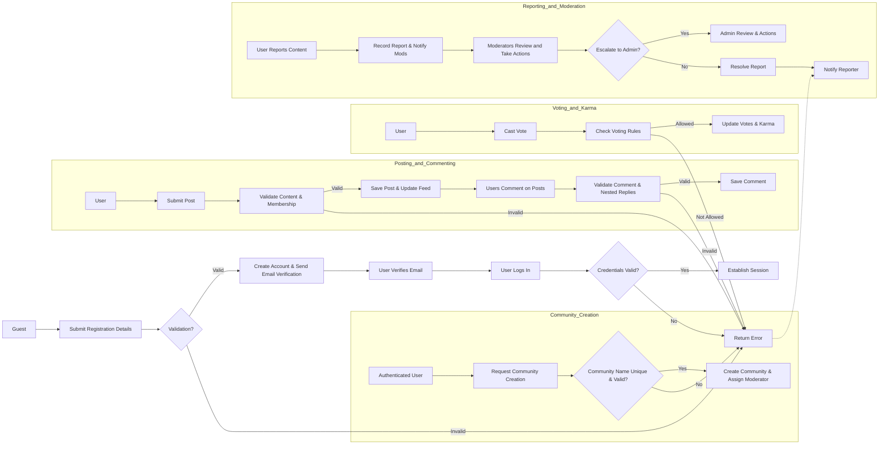

# Reddit-Like Community Platform User Scenarios

## 1. Introduction
These user scenarios describe typical interactions of different actors within the redditCommunity platform. Each scenario outlines user actions, system responses, business rules, and error handling to guide backend implementation.

## 2. Business and System Context
The system involves four primary actors:

- **Guest**: Can browse public communities and view posts.
- **User**: Registered member capable of posting, commenting, voting, creating communities, subscribing, and reporting.
- **Moderator**: A community-appointed user with permissions to moderate content and manage reports within specific communities.
- **Admin**: System administrator with full access and control over the entire platform.

## 3. User Scenarios

### 3.1 User Registration and Authentication Flow

1. A Guest accesses the registration page.
2. The Guest submits registration details including email and password.
3. The system validates input for format correctness and uniqueness.
4. WHEN registration details are valid, THE system creates a new user account and sends an email verification.
5. IF registration fails (e.g., duplicate email, weak password), THEN the system returns specific error messages within 2 seconds.
6. The user verifies their email through a link.
7. The user attempts login with email and password.
8. The system authenticates credentials; if valid, it establishes a session and returns an access token.
9. IF credentials are invalid, the system returns an authentication error promptly.

### 3.2 Community Creation and Management Flow

1. An authenticated user requests to create a new community by specifying a unique community name and description.
2. The system verifies community name uniqueness and naming policy compliance.
3. WHEN the name is valid and unused, THE system creates the community and assigns the user as moderator.
4. Moderators can update community settings or remove content within their communities.
5. Admins can manage all communities, including deletion or suspension.
6. Error scenarios include duplicate community names or unauthorized update attempts.

### 3.3 Posting and Commenting Flow

1. A User submits a new post with text, link, or image content to a community the user is subscribed to.
2. The system validates content type, size limits, and community membership.
3. WHEN valid, THE system saves the post and updates the community feed.
4. Users may comment on posts; comments support nested replies up to 5 levels.
5. The system validates comment length and nesting depth.
6. IF content violates community guidelines, THE system blocks posting and returns error messages.
7. Moderators can remove inappropriate posts or comments.

### 3.4 Voting and Karma Flow

1. A User casts an upvote or downvote on a post or comment.
2. The system checks if the user has already voted on the same item.
3. IF the vote is new or a change of opinion, THE system updates vote counts and recalculates user karma.
4. THE system prevents multiple votes of the same type by the same user on the same item.
5. Votes on removed content are disallowed.
6. Error responses are returned promptly if voting rules are violated.

### 3.5 Reporting and Moderation Flow

1. A User reports inappropriate content by selecting a reason from predefined categories.
2. The system records the report, associates it with the content and reporter, and timestamps it.
3. Moderators receive notifications of new reports related to their communities.
4. Moderators review reported content and may take actions: approve, remove, or escalate to admins.
5. Admins can override moderator decisions and perform system-wide moderation.
6. Reporters receive notifications on the status of their reports.

## 4. Mermaid Diagrams

