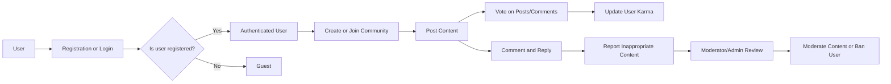

# Reddit-like Community Platform Requirements Analysis Report

## 1. Introduction
This document presents a comprehensive requirements analysis for a Reddit-like community platform designed to facilitate user-generated content, community formation, social interaction via voting and commenting, moderation, and user engagement mechanisms like karma.

The platform aims to provide a scalable, secure, and user-centric environment for sharing and discussing various topics organized within distinct communities.

## 2. Business Model

### Why This Service Exists
The platform addresses the need for open, community-driven discussion forums where users can create interest-based communities (subreddits) and engage with content from diverse perspectives. It fills the market gap for an intuitive, socially interactive platform fostering meaningful conversations around shared interests.

### Revenue Strategy
Potential revenue streams include targeted advertising within communities, premium features for users (e.g., enhanced profile customization), and community sponsorship options.

### Growth Plan
User acquisition via word-of-mouth, social media presence, and incentivizing engagement through the karma system. Growth strategy includes community creation tools and social sharing capabilities.

### Success Metrics
Key metrics include Monthly Active Users (MAU), number of communities created, average posts per user, engagement rates (votes, comments), and report resolution times.

## 3. User Actors

### Guest
Unauthenticated users with permission limited to browsing public communities, reading posts and comments.

### Registered User
Authenticated users who can register and log in, create and join communities, submit posts (text, links, images), vote, comment, subscribe to communities, and report inappropriate content.

### Community Moderator
Elevated privileges within assigned communities, including post and comment moderation, community settings management, and enforcement of community rules.

### Admin
System-wide administrators with full control over platform settings, user and content management, report handling, and user bans.

## 4. Functional Requirements

### 4.1 User Registration and Login
- WHEN a user registers with valid email and password, THE system SHALL create a new registered user account.
- WHEN a user attempts to log in, THE system SHALL authenticate credentials and establish a user session.
- IF authentication fails, THEN THE system SHALL return a clear error indicating invalid credentials.

### 4.2 Community Management
- WHEN a registered user creates a community, THE system SHALL validate uniqueness of community name and create it.
- THE system SHALL allow community moderators to update community information and manage membership.

### 4.3 Post Creation
- WHEN a registered user creates a post within a community, THE system SHALL support text, link, or image content types.
- THE system SHALL validate that posts belong only to existing communities to which the user is subscribed or has access.

### 4.4 Voting System
- WHEN a registered user votes on a post or comment, THE system SHALL record an upvote or downvote.
- THE system SHALL restrict users to one vote per content item, allowing vote changes.

### 4.5 Commenting System
- WHEN a registered user comments on a post, THE system SHALL support nested replies up to a reasonable depth.
- THE system SHALL enforce maximum comment length of 5000 characters.

### 4.6 Karma System
- THE system SHALL calculate user karma based on received upvotes and downvotes on posts and comments.
- WHEN a vote occurs, THE system SHALL update the karma accordingly in near real-time.
- THE system SHALL ensure karma cannot be negative.

### 4.7 Post Sorting
- THE system SHALL allow sorting posts by hot, new, top, and controversial.

### 4.8 Subscription Management
- WHEN a registered user subscribes or unsubscribes to a community, THE system SHALL update the subscription list accordingly.

### 4.9 User Profiles
- THE system SHALL provide user profiles showing their posts and comments history.

### 4.10 Reporting Inappropriate Content
- WHEN a user reports content as inappropriate, THE system SHALL log the report and notify moderators/admins.

## 5. Business Rules and Constraints

### 5.1 Content Policies
- THE system SHALL prohibit posting illegal, harmful, or offensive content, enforcing community-specific rules.
- THE system SHALL require reported content to be reviewed and actioned by moderators or admins.

### 5.2 Karma Calculation Rules
- THE system SHALL award +1 karma for each upvote and deduct -1 karma for each downvote received on posts and comments.
- THE system SHALL aggregate karma per user as the sum of votes on all their content.
- Karma SHALL not fall below zero.

### 5.3 Moderation and Reporting Rules
- THE system SHALL allow moderators to remove posts/comments violating rules.
- THE system SHALL notify users when their content is removed.
- THE system SHALL maintain a log of reports with status indicators such as pending, reviewed, and resolved.

### 5.4 Community Creation Guidelines
- THE system SHALL require community names to be unique and between 3 and 30 characters, only allowing alphanumeric characters, hyphens, and underscores.

### 5.5 User Behavior Policies
- THE system SHALL restrict banned users from posting, voting, or commenting.
- THE system SHALL enforce rate limits on posting and commenting to prevent spam.

## 6. Error Handling and Recovery
- IF user registration fails due to duplicate email, THEN THE system SHALL return an appropriate error.
- IF unauthorized actions are attempted, THEN THE system SHALL respond with HTTP 403 Forbidden.
- IF a community name is already taken, THEN THE system SHALL notify the user with a conflict error.
- IF content upload fails due to invalid format or size, THEN THE system SHALL reject the submission with an error message.

## 7. Performance Expectations
- THE system SHALL respond to login and registration requests within 2 seconds.
- THE system SHALL paginate posts and comments, loading 20 items per page.
- THE system SHALL reflect voting and karma updates in real-time or near real-time.
- THE system SHALL handle up to 100 concurrent users without degradation.

## 8. Summary
This analysis report comprehensively captures all core business requirements, use cases, constraints, and policy rules necessary for backend developers to commence implementation. It focuses on WHAT functionality must exist, expected business rules, user roles, and required user interactions to realize a Reddit-like community platform.

---

> *This document provides business requirements only. All technical implementations, including architecture, APIs, and database schema design, are at the discretion of the development team.*

## Mermaid Diagram

