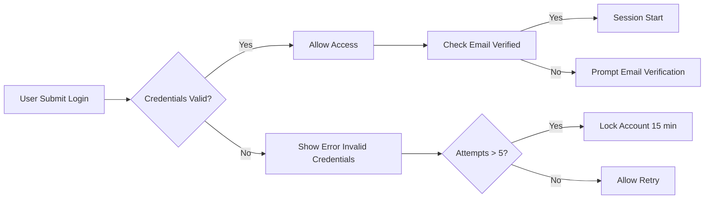
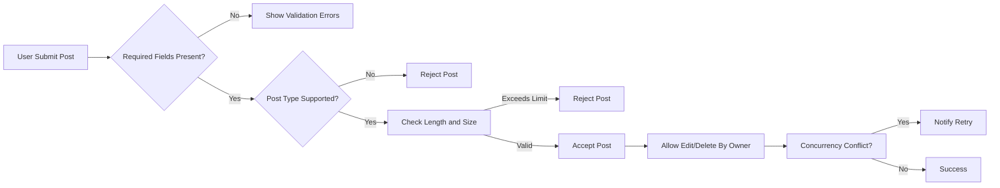
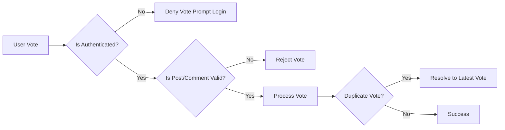
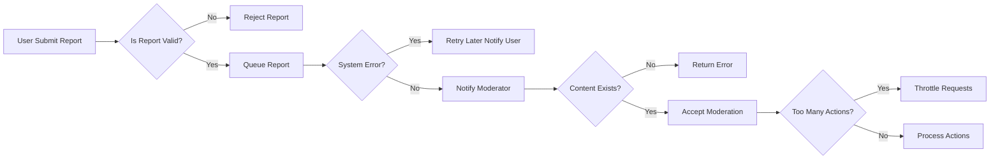

# Error Handling and Recovery Processes for redditCommunity

This document describes all error handling scenarios, failure cases, and recovery mechanisms for the Reddit-like community platform redditCommunity. It defines how the system behaves when errors occur during authentication, content submission, voting, commenting, reporting, moderation, and system faults, along with how users are informed and allowed to recover.

This document provides business requirements only. All technical implementation decisions belong to developers who have full autonomy over architecture, APIs, and database design. This report describes WHAT the system should do, not HOW to build it.

## 1. Authentication Errors

### 1.1 Login Failures
- WHEN a user submits invalid login credentials, THE system SHALL reject the login attempt and return an error indicating "invalid username or password." The response SHALL be returned within 2 seconds.
- IF a user exceeds 5 failed login attempts within 10 minutes, THEN THE system SHALL temporarily lock the account for 15 minutes and notify the user of the lockout.
- WHEN a user attempts to log in with an unverified email address, THE system SHALL deny login and prompt the user to verify their email.

### 1.2 Registration Issues
- IF a new registration attempts to use an email already registered, THEN THE system SHALL reject the registration with an error "email already in use."
- WHEN a user registers, THE system SHALL send an email verification link.
- IF email verification fails (invalid or expired link), THEN THE system SHALL prompt the user to request a new verification email.

### 1.3 Session and Token Errors
- WHEN a user attempts any action requiring authentication with an expired session or invalid token, THE system SHALL deny the request with an error requiring reauthentication.
- IF refresh token is invalid or expired, THEN THE system SHALL force the user to log in again.

## 2. Content Submission Errors

### 2.1 Community Creation
- IF a user without permission attempts to create a community, THEN THE system SHALL deny the action with an authorization error.
- WHEN community creation fails due to missing required fields (e.g., community name), THE system SHALL return a clear validation error.

### 2.2 Post Creation, Editing, and Deleting
- WHEN a user attempts to post content exceeding allowed lengths (text, image size), THE system SHALL reject with a validation error.
- IF the post type is unsupported (e.g., unsupported media formats), THEN THE system SHALL reject the post creation.
- WHEN a user attempts to edit or delete a post they do not own, THE system SHALL deny access and return an authorization error.
- IF a post editing or deletion request fails due to concurrency conflicts, THEN THE system SHALL notify the user and allow retry.

### 2.3 Comment Submission Errors
- WHEN a comment exceeds the maximum length (e.g., 1000 characters), THE system SHALL reject the submission.
- IF a user attempts to comment in a non-existent post or deleted content, THEN THE system SHALL respond with an error.
- WHEN a user tries to edit or delete comments they do not own, THE system SHALL deny the action.

## 3. Voting and Commenting Errors

### 3.1 Voting Errors
- WHEN a user tries to vote without being authenticated, THE system SHALL deny the vote and prompt login.
- IF a user attempts to upvote/downvote on invalid or deleted posts/comments, THEN THE system SHALL reject the vote.
- WHEN vote data is inconsistent (e.g., duplicate votes), THE system SHALL resolve conflicts by considering the latest vote and notify the user if applicable.

### 3.2 Commenting Errors
- When comment submission encounters server errors, THE system SHALL return a retry suggestion to the user.
- If nested comment depth exceeds limits imposed by moderators, THE system SHALL reject the comment and notify the user.

## 4. Reporting and Moderation Errors

### 4.1 Reporting Content
- WHEN users report inappropriate content (posts, comments, users), THE system SHALL validate the report reason and reject incomplete or invalid reports.
- IF report processing fails due to system errors, THEN THE system SHALL queue the report for retry and notify reporting user of delay.

### 4.2 Moderation Actions
- WHEN community moderators or admins attempt moderation actions on non-existent content or users, THE system SHALL return proper errors.
- IF moderation action results in too many concurrent changes (e.g., mass deletion), THE system SHALL throttle requests and notify moderators.

## 5. System Recovery Procedures

### 5.1 Fault Tolerance and Retry
- WHEN transient failures occur during critical operations (posting, voting, reporting), THE system SHALL automatically retry up to 3 times before returning an error to the user.

### 5.2 Data Consistency
- IF concurrent updates lead to conflicts (e.g., voting counts), THEN THE system SHALL use last-write-wins strategy or other defined business rule to ensure consistency.

### 5.3 User Notification and Recovery
- WHEN errors occur, THE system SHALL provide clear, user-friendly error messages explaining the problem and suggested next steps (e.g., retry, contact support).

### 5.4 Logging and Monitoring
- THE system SHALL log all errors with sufficient detail for diagnostics.
- Critical errors SHALL trigger alerts for system administrators for timely resolution.

---

## Mermaid Diagram: Authentication Error Handling Flow

## Mermaid Diagram: Content Submission Error Handling Flow

## Mermaid Diagram: Voting Error Handling Flow

## Mermaid Diagram: Reporting and Moderation Error Handling Flow

## Summary
This document defines comprehensive business requirements for handling errors across all user touchpoints and system processes in redditCommunity. It enables developers to implement predictable, user-friendly error responses and robust recovery mechanisms that uphold system integrity and user satisfaction.