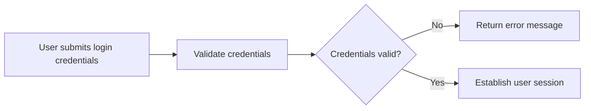
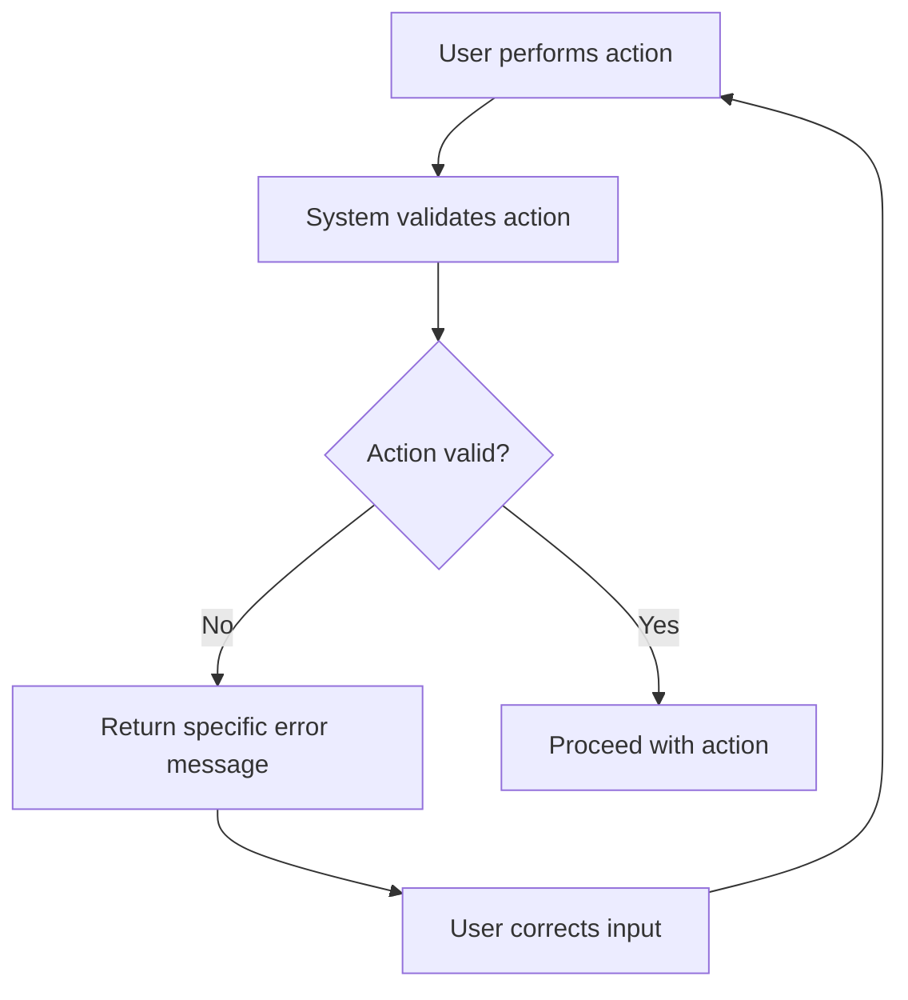

# Error Handling and Recovery Requirements for redditCommunity

## 1. Introduction
Effective error handling is critical to maintain a seamless user experience on redditCommunity. The system SHALL provide clear, specific, and actionable error messages to guide users in recovering from errors promptly. This document defines all error handling requirements across authentication, authorization, content submission, voting, commenting, and reporting processes.

## 2. Authentication Errors
- WHEN a user registration attempt fails due to invalid data, THE system SHALL return an informative error message explaining which fields need correction within 2 seconds.
- WHEN a user attempts to log in with invalid credentials, THE system SHALL deny access and return an error message within 2 seconds.
- WHEN email verification is pending for a user, THE system SHALL prevent posting or other restricted actions and prompt the user to verify their email.
- WHEN a password reset request fails (e.g., invalid email), THE system SHALL inform the user with clear instructions within 2 seconds.

## 3. Authorization Errors
- WHEN a user attempts to access a resource without sufficient permissions, THE system SHALL deny access and return an authorization error message within 1 second.
- WHEN a user attempts an action restricted to specific roles (e.g., moderator-only), THE system SHALL return a permission denied message immediately.

## 4. Content Submission Errors
- WHEN a post submission fails validation due to content format or length, THE system SHALL reject the submission and provide detailed feedback within 2 seconds.
- WHEN a comment submission exceeds maximum nesting depth or length, THE system SHALL reject the comment and notify the user.
- WHEN an image upload fails due to unsupported format or size limits, THE system SHALL return a specific error explaining accepted formats and maximum sizes.

## 5. Voting Errors
- WHEN a user attempts to vote multiple times on the same post or comment, THE system SHALL reject the additional votes and notify the user immediately.
- WHEN a user attempts to vote on their own content, THE system SHALL prevent the vote and inform the user.

## 6. Commenting Errors
- WHEN the maximum allowed nesting depth is exceeded in replies, THE system SHALL reject the new comment and inform the user.
- WHEN a comment exceeds the character limit, THE system SHALL reject the comment with an appropriate error message.

## 7. Reporting Errors
- WHEN a user attempts to report content that is non-existent or already removed, THE system SHALL notify the user of invalid report within 1 second.
- WHEN a user submits multiple identical reports for the same content, THE system SHALL ignore duplicates silently but log the attempt.

## 8. User Recovery and Retry Logic
- The system SHALL provide users with clear instructions to correct errors and retry their actions.
- Error responses SHALL be actionable, indicating the exact problem and suggested fixes.
- THE system SHALL allow retrying failed operations after fixes.

## 9. Error Message Specifications
- Error messages SHALL be concise, clear, and free of technical jargon.
- The system SHALL deliver error messages within 2 seconds of an error occurrence.
- User-facing errors SHALL include context-sensitive help or links to relevant FAQs when appropriate.

## 10. Conclusion
Robust error handling is essential for user satisfaction and system reliability. By clearly communicating problems and guiding recovery, redditCommunity ensures positive user experiences and maintains platform integrity.

## Mermaid Diagrams

### Error Scenario - Login Failure

```mermaid
graph LR
  A["User submits login credentials"] --> B["Validate credentials"]
  B --> C{"Credentials valid?"}
  C -->|"No"| D["Return error message"]
  C -->|"Yes"| E["Establish user session"]
```

### Error Handling Flow

```mermaid
graph TD
  A["User performs action"] --> B["System validates action"]
  B --> C{"Action valid?"}
  C -->|"No"| D["Return specific error message"]
  D --> E["User corrects input"]
  E --> A
  C -->|"Yes"| F["Proceed with action"]
```

---

This document specifies business-focused error handling and recovery requirements only. All technical implementation decisions such as specific API error codes, logging mechanisms, or retry delays are the responsibility of the development team. The primary goal is to ensure clear, measurable, and user-centric error communication to support a positive user experience.