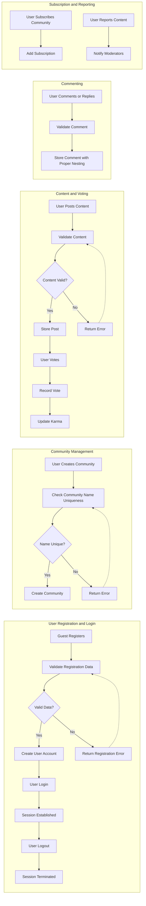

# Functional Requirements Analysis for Reddit-like Community Platform

## Introduction
The redditCommunity platform enables users to register, create and engage in communities, post various content types, vote, comment with nested replies, accumulate karma, subscribe to communities, view profiles, and report inappropriate content. This document specifies the detailed business requirements to guide backend development.

## User Actors and Permissions

### Actors
- **Guest**: Unauthenticated users can browse public communities and view content but cannot post, vote, comment, or subscribe.
- **Registered User**: Authenticated users who can create communities, post content, vote, comment, subscribe, and report inappropriate content.
- **Moderator**: Registered users assigned moderation rights within specific communities.
- **Admin**: System administrators with full permissions over all content and users.

### Permissions
| Action                        | Guest | Registered User | Moderator | Admin |
|-----------------------------|-------|----------------|-----------|-------|
| Browse Public Content        | ✅    | ✅             | ✅        | ✅    |
| Register and Login           | ❌    | ✅             | ✅        | ✅    |
| Create Communities           | ❌    | ✅             | ✅*       | ✅    |
| Post Content                | ❌    | ✅             | ✅        | ✅    |
| Comment on Posts             | ❌    | ✅             | ✅        | ✅    |
| Upvote/Downvote Posts/Comments | ❌    | ✅             | ✅        | ✅    |
| Subscribe to Communities     | ❌    | ✅             | ✅        | ✅    |
| Moderate Content             | ❌    | ❌             | ✅        | ✅    |
| View User Profiles          | ✅    | ✅             | ✅        | ✅    |
| Report Inappropriate Content | ❌    | ✅             | ✅        | ✅    |

*Moderators may create communities if permitted.

## User Registration and Login
- WHEN a guest submits registration data with a unique email and valid password, THE system SHALL create a registered user account.
- Invalid or duplicate registration data SHALL cause an error response stating the problem.
- WHEN a registered user submits login credentials, THE system SHALL authenticate the user and initiate a session.
- Failed authentication SHALL return a clear error within 2 seconds.
- WHEN a user logs out, THE system SHALL invalidate the session promptly.

## Community Creation and Management
- WHEN a registered user requests to create a community with a name and description, THE system SHALL verify that the name is unique.
- Upon successful validation, THE system SHALL create the community and assign the creator as the owner/moderator.
- Moderators and admins SHALL be able to modify community settings and manage posts and comments within their jurisdictions.

## Content Posting
- WHEN a registered user submits a post (text, link, or image) in a community, THE system SHALL validate post content (length, format, media type) and save it associated with the user and community.

## Voting and Karma System
- WHEN a registered user upvotes or downvotes posts or comments, THE system SHALL record the vote ensuring one vote per user per content item.
- Users SHALL be allowed to change or remove their votes.
- Vote counts SHALL be aggregated in real-time.
- The user whose content receives votes SHALL have karma adjusted per predefined values (e.g., +10/-2 for posts, +5/-1 for comments).

## Commenting with Nested Replies
- WHEN a user comments on a post or replies to another comment, THE system SHALL create a nested comment preserving parent-child relationships.
- Unlimited depth of replies SHALL be supported.
- Comment content SHALL be validated for length and sanitized.

## Post Sorting
- The system SHALL provide sorting options: hot, new, top, and controversial.
- Sorted results SHALL be paginated at 20 items per page.

## Community Subscription
- Registered users SHALL be able to subscribe or unsubscribe from communities.
- Subscriptions SHALL influence content feeds and notification eligibility.

## User Profiles
- THE system SHALL provide user profiles displaying posts, comments, karma, and subscribed communities.

## Reporting System
- WHEN a user reports inappropriate content, THE system SHALL log the report with details and notify community moderators.
- Moderators and admins SHALL be able to review, act on, and resolve reports.

## Business Rules
- Community names SHALL be unique and follow format restrictions.
- Votes SHALL be limited to one per user per content item to prevent vote manipulation.
- Karma SHALL be updated based on vote actions.
- Reports SHALL initiate moderation workflows.

## Error Handling
- THE system SHALL return descriptive error messages for failed user actions, such as invalid input, unauthorized actions, or duplicate votes.
- All errors MUST be handled promptly and informatively.

## Performance Expectations
- User-facing actions (login, post creation, voting) SHALL respond within 2 seconds under normal load.
- Data retrieval actions SHALL paginate data to ensure responsiveness.

## Mermaid Diagram: Key Process Workflows

## Conclusion
These requirements specify WHAT business processes and user interactions the redditCommunity backend must support. All specified workflows, permissions, business rules, and performance goals guide the development of a robust, scalable, and user-centric community platform backend.