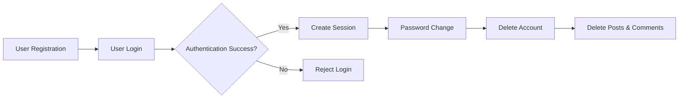
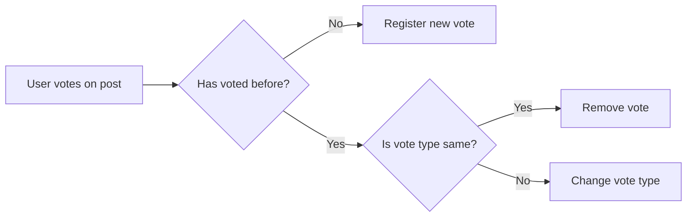
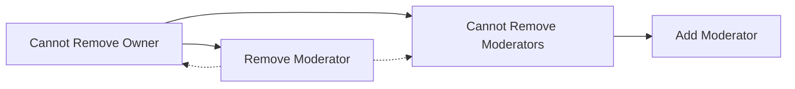

# Reddit-like Community Platform Detailed Requirements Specification

## User Account

- WHEN a user signs up, THE system SHALL require a unique email, password, and unique username.
- THE system SHALL securely store user passwords using strong hashing algorithms.
- WHEN a user attempts to sign up with an existing email or username, THE system SHALL reject the registration with a clear error message.
- WHEN a user logs in with email and password, THE system SHALL authenticate the credentials.
- WHEN authentication succeeds, THE system SHALL initiate a user session with proper token management.
- WHEN a user wants to change their password, THE system SHALL verify the old password before allowing the change.
- WHEN a user deletes their account, THE system SHALL delete the user's data along with all posts and comments authored by the user.
- IF a user tries to delete the account while not logged in, THE system SHALL deny the request.

## User Profile

- EACH user SHALL have a profile consisting of a display name, bio text, and avatar image.
- WHEN a user edits their profile, THE system SHALL allow updating display name, bio, and avatar.
- WHEN a user views another user's profile, THE system SHALL show display name, bio, avatar, total karma score, and lists of all posts and comments authored by that user.
- THE total karma score SHALL reflect the sum of karma changes from all posts and comments by the user.

## Karma

- EACH user SHALL have a single integer karma score which can be negative.
- WHEN any user upvotes a post or comment, THE system SHALL increase the author's karma by 1.
- WHEN any user downvotes a post or comment, THE system SHALL decrease the author's karma by 1.
- WHEN a vote is removed, THE system SHALL adjust karma by removing the previous vote's effect.
- The system SHALL maintain data integrity and consistency of karma scores in concurrent operations.

## Communities

- ANY user SHALL be able to create a community with a unique name, description, and icon image.
- THE user who creates a community SHALL become the owner.
- THE system SHALL allow users to browse all communities with pagination support.
- Users SHALL be able to search communities by name using case-insensitive substring matching.
- EACH community SHALL display its subscriber count.

## Subscribing

- Users SHALL be able to subscribe to or unsubscribe from any community.
- WHEN a user subscribes to a community, THE system SHALL add the user-community subscription.
- WHEN a user unsubscribes, THE system SHALL remove their subscription.
- Subscribing SHALL be a prerequisite to creating posts in a community.
- USERS SHALL be able to view a list of communities they are subscribed to.

## Posts

- USERS SHALL be able to create posts only in communities they are subscribed to.
- POSTS SHALL have a required title.
- POSTS SHALL be one of three types:
  - Text post: contains text content.
  - Link post: contains a valid URL.
  - Image post: contains one uploaded image file.
- USERS SHALL be able to edit and delete their own posts.
- WHEN viewing a post, USERS SHALL see the title, full content, author, community, vote score, comment count, and timestamp.

## Post Voting

- USERS SHALL be able to upvote or downvote posts.
- EACH user SHALL have only one vote per post.
- USERS SHALL be able to change their vote or remove it.
- THE vote score SHALL be calculated as total upvotes minus total downvotes.
- Karma adjustments SHALL occur according to post votes.

## Post Feeds

- THE system SHALL provide three different post feeds with pagination:
  - Home Feed: POSTS from subscribed communities; accessible only to logged-in users.
  - Popular Feed: POSTS from all communities; available to all users.
  - Community Feed: POSTS from a selected community; available to all users.
- ALL feeds SHALL support sorting by:
  - Hot: recent posts with many upvotes sorted first.
  - New: most recently created posts first.
  - Top: posts ranked by highest vote scores with time filters (today, this week, this month, this year, all time).
  - Controversial: posts with many votes but close to zero score first.

## Post List Display

- EACH post in a feed SHALL display the title, author username, community name, vote score, comment count, time since posted.
- ADDITIONALLY:
  - Text posts SHALL show first 200 characters of content.
  - Image posts SHALL show a thumbnail image.
  - Link posts SHALL show the domain of the URL.

## Comments

- USERS SHALL be able to write comments on posts and reply to comments with unlimited nesting depth.
- USERS SHALL be able to edit and delete their own comments.
- WHEN a comment is deleted, all child replies SHALL also be deleted.
- EACH comment SHALL display author, content, vote score, time since posted, and nested replies in hierarchical order.

## Comment Voting

- THE voting rules SHALL mirror post voting with one vote per user per comment.
- USERS SHALL be able to upvote, downvote, change, or remove their votes on comments.
- Karma SHALL be adjusted according to comment votes.

## Comment Sorting

- COMMENTS SHALL be sortable by Best (highest vote scores), New (most recent), and Controversial (many votes but near zero score).

## Community Moderation

- THE community owner SHALL have the highest authority as owner.
- OWNERS AND moderators SHALL manage moderators with the following rules:
  - Owner can add and remove moderators.
  - Moderators can add moderators.
  - Moderators cannot remove other moderators or the owner.
- Moderators SHALL have permissions to delete any post or comment in their community.
- Moderators SHALL be able to ban and unban users from their community.
- Banned users SHALL be restricted from posting or commenting but CAN view content.
- THE system SHALL provide functionality for moderators to view the list of banned users.

## Reporting

- USERS SHALL be able to report posts or comments with a required reason.
- MODERATORS SHALL be able to view all reports for their community.
- EACH report SHALL contain the reported content, reporting user, and reason.
- MODERATORS SHALL be able to approve reports (deleting content) or dismiss reports (keeping content).
- DISMISSED reports SHALL be removed from report lists.

---

## Mermaid Diagrams

### User Account Management

### Post Voting Flow

### Community Moderation Roles

---

Comprehensive requirements specification ensures the Reddit-like community platform is fully functional, secure, and user-friendly. Each aspect is described with business rules and workflows suitable for backend implementation without ambiguity.