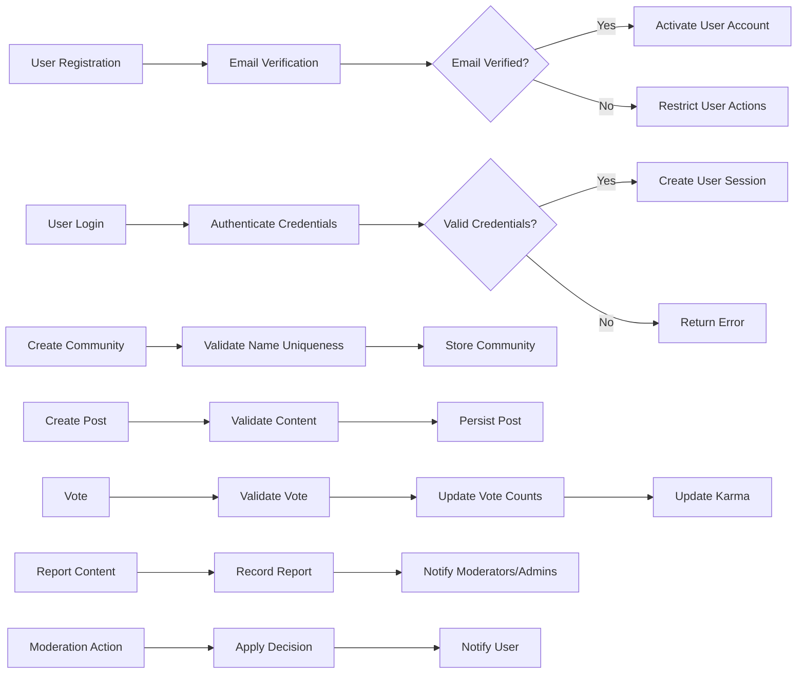

# Non-Functional Requirements for redditCommunity Platform

## 1. Introduction
redditCommunity is a Reddit-like community platform designed to facilitate user registration, content sharing within communities, voting, commenting, moderation, and user engagement through a karma system. This document specifies the business-focused non-functional requirements, performance, security, scalability, and compliance characteristics necessary for backend development.

## 2. User Actors

| Actor               | Description                                                                                   |
|---------------------|-----------------------------------------------------------------------------------------------|
| Guest               | Unauthenticated user; may browse public communities and read content only.                    |
| Registered User      | Authenticated user; can create communities, post content, vote, comment, subscribe, and report content.
| Community Moderator  | Elevated user with moderation privileges within specific communities to manage posts and comments, enforce rules, and handle reports.
| Admin               | System administrator with full access to all platform data and management capabilities.

## 3. Functional Context for Non-Functional Requirements

While this document focuses on non-functional business requirements, key functional contexts are summarized here to clarify performance and security requirements.

- User registration and authentication
- Community creation and subscription
- Posting of text, link, or image content
- Upvoting and downvoting posts and comments
- Nested commenting and replies
- Karma calculation and updates
- Sorting posts by hot, new, top, and controversial
- Reporting inappropriate content and moderation

## 4. Performance Requirements

- THE system SHALL respond to login requests within 2 seconds under normal load.
- THE system SHALL respond to post creation, voting, and commenting actions within 1 second.
- THE system SHALL paginate posts and comments in pages of 20, with load times under 1 second.
- THE system SHALL process karma updates and vote count changes in near real-time, within 2 seconds.
- THE system SHALL scale to support at least 10,000 concurrent users without degradation of response times.

## 5. Security and Compliance

- THE system SHALL enforce secure authentication mechanisms, including password hashing and token management.
- THE system SHALL require email verification before enabling posting and voting capabilities.
- THE system SHALL implement authorization rules respecting actor permissions for all actions.
- THE system SHALL maintain audit logs for sensitive actions such as moderation decisions and user bans.
- THE system SHALL comply with data privacy regulations applicable to user data.

## 6. Scalability

- THE system SHALL be designed to scale horizontally, supporting increasing numbers of users, communities, and content posts.
- THE system SHALL be able to distribute workloads for voting, commenting, and karma updates efficiently.

## 7. Availability and Reliability

- THE platform SHALL provide 99.9% uptime excluding planned maintenance windows.
- THE system SHALL support backup and recovery mechanisms for user data and content.

## 8. Monitoring and Logging

- THE system SHALL log user activities, errors, and performance metrics for operational insight.
- THE system SHALL provide alerts for unusual activity and system errors.

## 9. Glossary

- **Community**: A user-created group focused on a shared topic of interest.
- **Post**: Content shared by users within a community, can be text, link, or image.
- **Comment**: Replies to posts or other comments, supporting nested threading.
- **Karma**: Numeric score representing user reputation based on voting.
- **Vote**: User action to upvote or downvote content, influencing visibility and karma.
- **Moderation**: Processes and roles responsible for content and user behavior management.

---

## Mermaid Diagram: User Actions and Performance Flow

*End of Non-Functional Requirements for redditCommunity Platform*