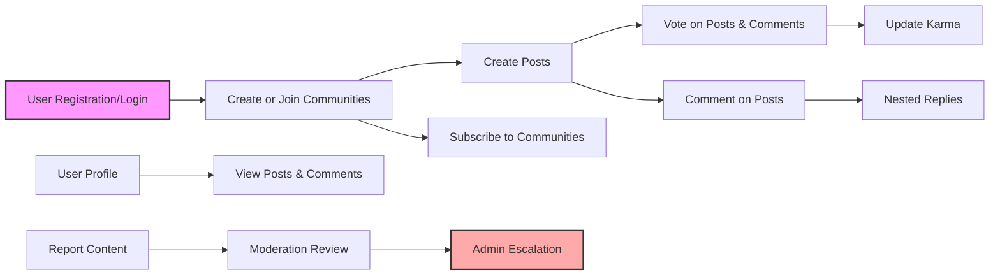

# redditCommunity Platform Requirements Analysis Report

## 1. Introduction

redditCommunity is a dynamic, user-driven community platform that allows users to create and participate in topic-based communities. Users can share textual, link, and image content; interact via votes and comments; manage subscriptions; build reputation through karma; and maintain profiles. This report specifies detailed backend business requirements to guide development.

## 2. User Roles and Authentication

### 2.1 User Roles
- **Guest**: Unauthenticated users who can view public content but cannot interact further.
- **Member**: Registered and authenticated users with privileges to create content, vote, comment, and subscribe.
- **Community Moderator**: Members appointed to manage and moderate content in specific communities.
- **Admin**: Users with full system control, including user and community management.

### 2.2 Authentication Requirements
- WHEN a new user registers with email and password, THE system SHALL validate email format, uniqueness, and password strength.
- WHEN registration is submitted, THE system SHALL send a verification email with an activation link.
- IF the user fails to verify their email within 72 hours, THEN posting, commenting, voting privileges SHALL be suspended.
- WHEN a user attempts login, THE system SHALL verify credentials and email verification status.
- IF credentials are invalid or email unverified, THEN login SHALL be denied with a meaningful error.
- THE system SHALL issue JWT tokens for authenticated sessions with access tokens (30 minutes expiry) and refresh tokens (14 days expiry).
- WHEN a user logs out, THEN refresh tokens SHALL be revoked.
- THE system SHALL support password reset through email with time-limited links.

### 2.3 Permission Matrix
| Action                       | Guest | Member | Community Moderator | Admin |
|------------------------------|-------|--------|--------------------|-------|
| View public content           | ✅    | ✅     | ✅                 | ✅    |
| Register/Login                | N/A   | ✅     | ✅                 | ✅    |
| Create communities            | ❌    | ✅     | ❌                 | ✅    |
| Create/edit/delete own posts | ❌    | ✅     | ✅ (community only) | ✅    |
| Comment and nested replies   | ❌    | ✅     | ✅                 | ✅    |
| Vote on posts/comments       | ❌    | ✅     | ✅                 | ✅    |
| Moderate content             | ❌    | ❌     | ✅                 | ✅    |
| Manage reports               | ❌    | ❌     | ✅ (community)      | ✅    |
| Administer platform          | ❌    | ❌     | ❌                 | ✅    |

## 3. Community Management

- WHEN a member creates a community, THE system SHALL ensure the community name is unique and matches the pattern: 3-50 characters, alphanumeric and underscores only.
- THE system SHALL record creator as initial community moderator.
- Community moderators SHALL be able to edit community description but not the name.
- ONLY admins SHALL be able to delete communities.
- THE system SHALL allow all users, including guests, to browse and search communities.
- THE system SHALL enable subscription and unsubscription to communities by members.

## 4. Post Management

- WHEN a member creates a post, THE system SHALL accept one of three post types: text (max 10,000 chars), link (valid URL), or single image (JPEG, PNG, GIF; max 10MB).
- Posts SHALL belong to one community.
- Authors SHALL be able to edit or delete their posts within 24 hours of creation.
- Moderators and admins SHALL be able to delete any posts in their communities.
- Posts SHALL display metadata: creation time, last edit time, author, vote counts, comment count.

## 5. Voting and Commenting

- Members SHALL be able to upvote or downvote posts or comments.
- Each user SHALL have at most one vote per post/comment but may change or remove it.
- Vote counts SHALL be publicly visible including to guests.
- Comments SHALL support unlimited nesting and have a max length of 2000 characters.
- Comment authors SHALL be able to edit or delete their comments within 24 hours.
- Moderators and admins SHALL have moderation rights over comments.

## 6. Karma System

- WHEN a post receives an upvote, THE system SHALL increase the post author's karma by 10 points.
- WHEN a post receives a downvote, THE system SHALL decrease the post author's karma by 2 points.
- WHEN a comment receives an upvote, THE system SHALL increase the comment author's karma by 5 points.
- WHEN a comment receives a downvote, THE system SHALL decrease the comment author's karma by 1 point.
- Vote changes SHALL adjust karma accordingly.
- Removing votes SHALL remove karma effects.
- Total karma SHALL be sum of post and comment karma.

## 7. Post Sorting

- THE system SHALL support sorting posts by these methods:
  - hot: combining vote score and recency via an established formula
  - new: most recent posts first
  - top: highest voted posts
  - controversial: posts with large upvote/downvote variance
- Default post sorting SHALL be hot.

## 8. Subscription Features

- Members SHALL be able to subscribe and unsubscribe from communities.
- THE system SHALL provide a personalized feed showing posts from subscribed communities.
- Subscription status SHALL be visible to users.

## 9. User Profiles

- User profiles SHALL be publicly viewable.
- Profiles SHALL show posts, comments, karma, join date, and editable bio.

## 10. Reporting and Moderation

- Members SHALL be able to report posts, comments, or users for categories such as spam, abuse, or other violations.
- THE system SHALL collect reporter identity, content reported, reason, and timestamp.
- Community moderators SHALL review reports for their communities and act (remove content, warn users).
- Admins SHALL handle escalated reports.
- Report states include pending, reviewed, action taken.

## 11. Error Handling

- THE system SHALL return clear error messages on failures such as invalid input, unauthorized actions, or concurrency conflicts.
- WHEN vote or comment operations fail, THE system SHALL notify users with retry suggestions.
- Authentication failures SHALL provide specific reasons (e.g., invalid credentials, unverified email).

## 12. Performance and Security

- Login, registration, voting, posting, and comment operations SHALL complete within 2 seconds under normal load.
- Posts and comments listings SHALL paginate with a default of 20 items per page.
- Passwords SHALL be stored securely with hashing.
- JWT tokens SHALL be securely signed and validated.
- Role-based access control SHALL be enforced consistently.
- Personal data SHALL be protected per relevant privacy regulations.

## 13. Glossary

- Community: A user-created group for discussions.
- Post: Content submitted to a community.
- Comment: Response to posts or comments allowing nested discussions.
- Karma: A numeric reputation score based on votes.
- Community Moderator: A user who handles moderation in specified communities.
- Admin: Platform-wide administrator role.

## 14. Diagrams

---

_backend developers should implement as specified with developer autonomy on architecture and technical details._