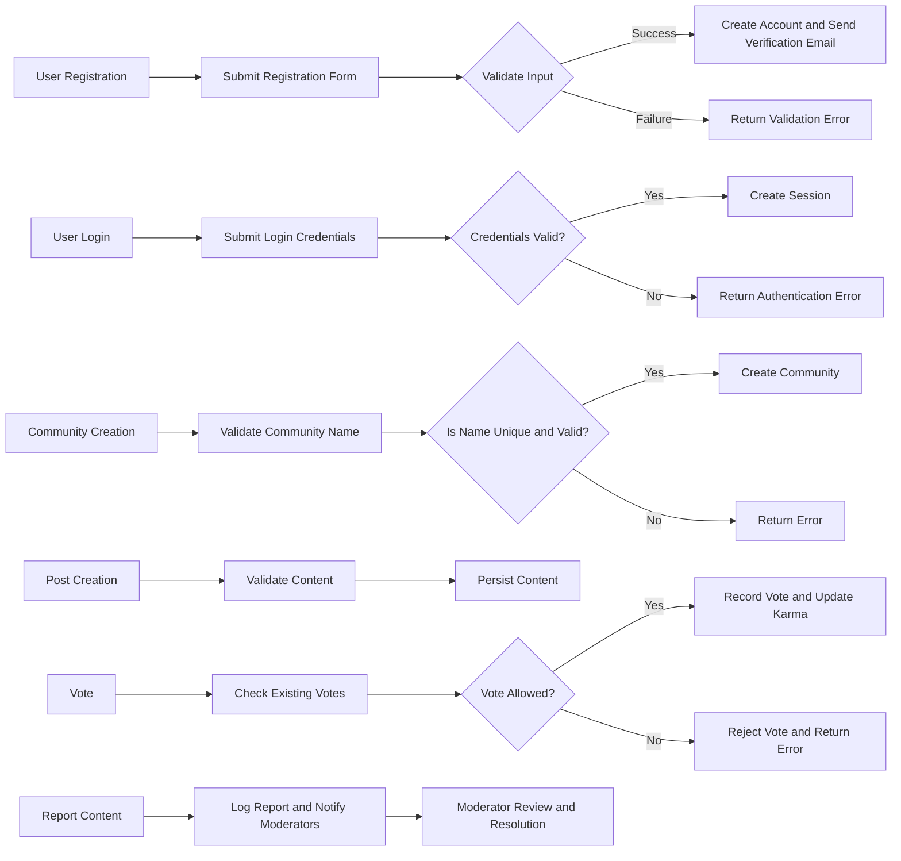

# redditCommunity Backend Requirements Analysis Report

## 1. Introduction
The redditCommunity platform is a Reddit-like system to foster community-driven content sharing and discussion through user-created subreddits. It empowers users to post various content types, vote, comment with nesting, and earn reputation via a karma system.

This document delivers a detailed set of business and functional requirements to guide backend developers in creating a scalable, secure, and maintainable system.

## 2. Business Model

### 2.1 Purpose and Market
redditCommunity fills the market need for moderated yet user-driven thematic communities with diverse content and social interaction capabilities.

### 2.2 Revenue Streams and Growth
Monetization will be achieved primarily via advertising, premium subscriptions for advanced moderation tools, and sponsored content placements. Growth strategies hinge on simple community creation, viral sharing, and user gamification through karma.

### 2.3 Success Metrics
Success will be measured by monthly active users, total communities, volume of posts and comments, average user karma, and moderation efficiency metrics.

## 3. User Actors and Authentication

### 3.1 Actors and Permissions
- Guest: Read-only access to browse public communities and posts.
- User: Authenticated, able to register, post content, vote, comment (including nested replies), subscribe to communities, and report content.
- Moderator: Users with community-specific moderation rights.
- Admin: Full platform administrative privileges.

### 3.2 Authentication
- WHEN users register, THE system SHALL require validating email and password, enforce email verification, and create accounts securely.
- WHEN users log in, THE system SHALL authenticate credentials, issue JWT tokens with 15-minute lifetimes, and refresh tokens valid for 30 days.
- Logouts SHALL revoke tokens and terminate sessions.
- Password reset and change processes SHALL be supported with appropriate validation.

## 4. Functional Requirements

### 4.1 User Registration and Login
- WHEN a user registers, THE system SHALL validate user data, create an account, and send a confirmation email.
- WHEN a user logs in with valid credentials, THE system SHALL create a secure session.
- IF authentication fails, THEN THE system SHALL return an explicit error message.

### 4.2 Community Management
- WHEN an authenticated user creates a community, THE system SHALL ensure the community name is unique and conforms to naming constraints.
- Moderators SHALL have permissions to manage content in their communities.
- Users SHALL subscribe or unsubscribe to communities.

### 4.3 Content Posting
- Users SHALL post text, links, and images.
- THE system SHALL validate content format and size limits.
- Content violating guidelines SHALL be rejected with error notifications.

### 4.4 Voting System
- Users SHALL upvote or downvote posts and comments.
- Votes SHALL be unique per user-content pair, with vote change allowed.
- Voting updates SHALL reflect in karma calculations.

### 4.5 Commenting System
- Nested comments supported up to at least 5 levels.
- Comments SHALL be validated for length and guidelines.

### 4.6 User Karma System
- Karma points SHALL update in near real-time according to votes.
- Negative karma values SHALL be possible.

### 4.7 Post Sorting
- Posts SHALL be sortable by hot, new, top, and controversial, with pagination.
- Sorting algorithms SHALL consider votes, timestamps, and activity.

### 4.8 Subscription System
- Users SHALL manage community subscriptions.
- Subscriptions SHALL affect content feed customization.

### 4.9 User Profiles
- Profiles SHALL display posts, comments, and overall karma.

### 4.10 Content Reporting
- Users SHALL report inappropriate content with reasons.
- Reports SHALL be logged and visible to moderators/admins.
- Reports exceeding thresholds SHALL trigger automatic content hiding.

## 5. Business Rules
- Community names MUST be unique, 3-21 characters long, and consist of alphanumeric characters plus hyphens and underscores.
- Votes MUST be restricted to one per user per content item, with vote changes allowed but duplicates disallowed.
- Comments MUST not exceed 10,000 characters and nested replies limited to 10 levels.
- Karma updates MUST consider anti-fraud mechanisms.
- Moderators limited to community moderation.
- Reports MUST include reporter ID, content ID, reason, and timestamp.

## 6. Error Handling
- Authentication errors SHALL return clear unauthorized messages.
- Content validation SHALL provide explicit error details.
- Duplicate voting attempts SHALL be rejected with conflict errors.
- Duplicate reports SHALL be ignored.

## 7. Performance Requirements
- User actions SHALL complete within 2 seconds.
- Pagination SHALL limit responses to 20 items per page.
- Karma updates SHALL occur within 5 seconds.
- System scalability to 1 million users and 100,000 simultaneous online users.
- Load surges SHALL degrade gracefully, prioritizing reads.

## 8. Security and Authorization
- Passwords SHALL be stored hashed using state-of-the-art algorithms.
- JWT token authentication SHALL be employed with secure session management.
- Permissions SHALL be role-based and strictly enforced.
- Sensitive user data SHALL follow privacy compliance.

## 9. User Interaction Workflows

```mermaid
graph LR
  A["User Registration"] --> B["Submit Registration Form"]
  B --> C{"Validate Input"}
  C -->|"Success"| D["Create Account and Send Verification Email"]
  C -->|"Failure"| E["Return Validation Error"]

  F["User Login"] --> G["Submit Login Credentials"]
  G --> H{"Credentials Valid?"}
  H -->|"Yes"| I["Create Session"]
  H -->|"No"| J["Return Authentication Error"]

  K["Community Creation"] --> L["Validate Community Name"]
  L --> M{"Is Name Unique and Valid?"}
  M -->|"Yes"| N["Create Community"]
  M -->|"No"| O["Return Error"]

  P["Post Creation"] --> Q["Validate Content"]
  Q --> R["Persist Content"]

  S["Vote"] --> T["Check Existing Votes"]
  T --> U{"Vote Allowed?"}
  U -->|"Yes"| V["Record Vote and Update Karma"]
  U -->|"No"| W["Reject Vote and Return Error"]

  X["Report Content"] --> Y["Log Report and Notify Moderators"]
  Y --> Z["Moderator Review and Resolution"]
```

## 10. Glossary
- Karma: User reputation score computed from votes.
- Community: Thematic user group for content.
- Moderator: User granted moderation rights within communities.
- Admin: Global system administrator.

## 11. References
- 00-toc.md
- 01-service-overview.md
- 02-user-actors.md
- 03-functional-requirements.md
- 04-business-rules.md
- 05-user-scenarios.md
- 06-error-handling.md
- 07-performance.md
- 08-security.md
- 09-integrations.md
- 10-data-lifecycle.md

## 12. Conclusion
The requirements detailed here provide a complete business-focused specification to guide backend development of redditCommunity. No technical implementation details or database/API schemas are specified, leaving full autonomy to technical teams. The document is actionable, clear, and comprehensive for developers to implement a production-grade backend system.