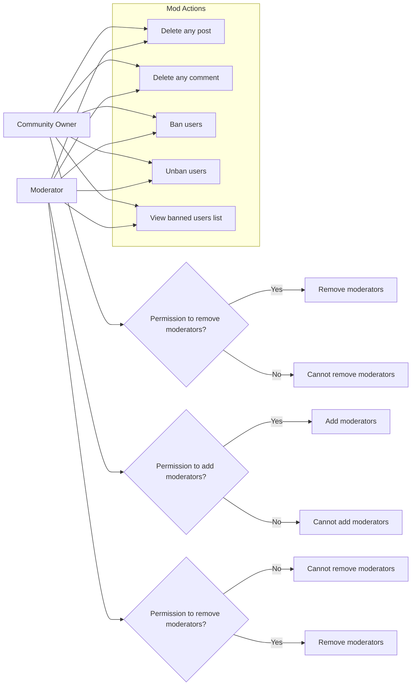

# Reddit-like Community Platform - Requirements Specification

## 1. User Account

### 1.1 User Registration
WHEN a user provides an email and password, THE system SHALL allow the user to register a new account by choosing a unique username. The system SHALL verify that the email address is unique and valid.

### 1.2 User Login
WHEN a user provides a valid email and password, THE system SHALL authenticate the user and establish a session.

### 1.3 Password Management
WHEN a logged-in user requests to change their password, THE system SHALL verify the current password before allowing the update.

### 1.4 Account Deletion
WHEN a user requests to delete their account, THE system SHALL delete the user account AND all posts and comments authored by the user.

## 2. User Profile

### 2.1 Profile Information
Each user SHALL have a profile containing display name, bio text, and avatar image.

### 2.2 Profile Editing
WHEN a logged-in user updates their display name, bio, or avatar image, THE system SHALL save the changes reflecting the user's profile.

### 2.3 Viewing Profiles
WHEN a user views another user's profile, THE system SHALL display that user's display name, bio, avatar image, total karma score, list of all posts the user has created, and list of all comments the user has written.

## 3. Karma

### 3.1 Karma Score Calculation
Each user SHALL have a single karma score represented as one integer number.

WHEN a post or comment is upvoted, THE system SHALL increase the respective author's karma score by 1.

WHEN a post or comment is downvoted, THE system SHALL decrease the respective author's karma score by 1.

WHEN a vote is removed, THE system SHALL adjust the respective author's karma score accordingly.

The karma score SHALL support negative values.

## 4. Communities

### 4.1 Community Creation
WHEN a logged-in user creates a community, THE system SHALL assign ownership of the community to that user.

Each community SHALL have a unique name, description text, and icon image.

### 4.2 Browsing and Searching Communities
Users SHALL be able to browse all communities in a list.

Users SHALL be able to search for communities by their unique name.

### 4.3 Community Metrics
Each community SHALL display the subscriber count.

## 5. Subscribing

### 5.1 Subscription Management
Users SHALL be able to subscribe to or unsubscribe from any community.

### 5.2 Subscription Requirements
WHEN a user creates a post in a community, THE system SHALL verify that the user is subscribed to that community.

### 5.3 Listing Subscriptions
Users SHALL be able to view a list of all communities to which they are subscribed.

## 6. Posts

### 6.1 Post Creation
WHEN a user creates a post in a subscribed community, THE system SHALL require a title and post type.

Post types SHALL be one of: Text post (with text content), Link post (with URL), or Image post (with uploaded image).

### 6.2 Post Editing and Deletion
WHEN a user edits their own post, THE system SHALL save the updated title and content.

WHEN a user deletes their own post, THE system SHALL remove the post and all associated comments.

### 6.3 Post Viewing
WHEN a user views a post, THE system SHALL display the title, full content, author, community, vote score, comment count, and timestamp of posting.

## 7. Post Voting

### 7.1 Voting Rules
Users SHALL be able to upvote (+1) or downvote (-1) posts.

Each user SHALL only have one active vote per post.

Users SHALL be able to change their vote between upvote and downvote or remove their vote entirely.

### 7.2 Vote Score Calculation
Vote score SHALL be calculated as total upvotes minus total downvotes.

## 8. Post Feeds

### 8.1 Feed Types
**Home Feed:** Shows posts from communities the logged-in user is subscribed to.

**Popular Feed:** Shows posts from all communities, available to all users including logged-out users.

**Community Feed:** Shows posts from one specific community, available to all users.

### 8.2 Feed Sorting
All feeds SHALL support sorting by hot (recent posts with many upvotes), new (most recent), top (highest vote score with time filtering options), and controversial (posts with many votes but vote score near zero).

### 8.3 Pagination
Feeds SHALL be paginated.

## 9. Post List Display

Each post in a feed SHALL display: title, author username, community name, vote score, comment count, time since posted, and content preview depending on post type (first 200 characters for text posts, thumbnail for image posts, domain name for link posts).

## 10. Comments

### 10.1 Comment Creation and Nesting
Users SHALL be able to write comments on posts and reply to any comment with unlimited nesting depth.

### 10.2 Comment Editing and Deletion
Users SHALL be able to edit or delete their own comments.

WHEN a comment is deleted, THE system SHALL remove that comment and all its nested replies.

### 10.3 Comment Display
Each comment SHALL show author, content, vote score, time since posted, and nested replies.

## 11. Comment Voting

Comment voting SHALL follow the same rules as post voting. Users SHALL be able to upvote or downvote comments, with one vote per user per comment. Users can change or remove votes.

## 12. Comment Sorting

Comments on a post SHALL be sorted by best (highest vote score), new (most recent), or controversial (many votes with score near zero).

## 13. Community Moderation

### 13.1 Roles
- The community creator is assigned the "owner" role with the highest authority.
- Owners can add or remove moderators.
- Moderators can be added by owners or other moderators.
- Moderators cannot remove the owner.
- Moderators cannot remove other moderators.

### 13.2 Permissions
- Owners and moderators can delete any post or comment in their community.
- Owners and moderators can ban or unban users from their community.
- Owners and moderators can view the list of banned users.
- Banned users cannot create posts or comments but can view content.

### 13.3 Moderator Management
- WHEN the owner or a moderator adds a moderator, THE system SHALL update the moderator list.
- WHEN the owner removes a moderator, THE system SHALL update the moderator list.
- Moderators cannot remove each other or the owner.

### 13.4 Content Deletion
- WHEN a moderator or owner deletes a post or comment, THE system SHALL remove it and associated nested content.

### 13.5 User Ban and Unban
- WHEN a moderator or owner bans a user, THE system SHALL prevent that user from creating posts or comments in that community.
- WHEN a moderator or owner unbans a user, THE system SHALL restore the user's ability to create posts and comments.

## 14. Reporting

### 14.1 Reporting Mechanism
Users SHALL be able to report posts or comments by providing a reason.

### 14.2 Moderator Review
Moderators SHALL be able to view reports for their communities, including reported content, reporter, and reason.

### 14.3 Report Resolution
Moderators SHALL be able to approve (delete the content) or dismiss (keep content) reports.

WHEN a report is dismissed, THE system SHALL remove it from the report list.

---

## Mermaid Diagram: Community Moderation Role and Permission Flow

