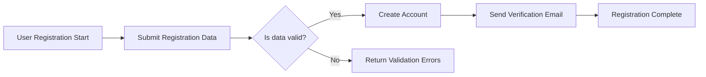
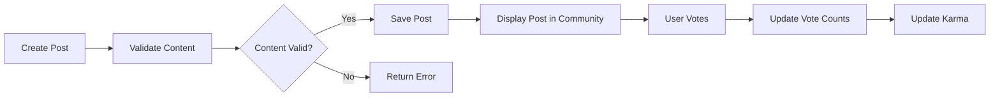

# Requirements Analysis Report for a Reddit-like Community Platform

## 1. Introduction

This document defines comprehensive business requirements for the development of a Reddit-like community platform enabling users to create communities, share content, interact through voting and commenting, and participate in community moderation. The requirements outlined here serve as precise, unambiguous guidance for backend developers.

## 2. Business Model

The platform facilitates interest-based communities, empowering users to create and engage in topic-specific groups sharing text, links, and images. Revenue may derive from advertising, premium memberships, or sponsored content. Growth strategies include community creation incentives, social sharing, and active moderation to retain users and foster engagement. Success is measured by user activity, community growth, content volume, voting frequency, and moderation effectiveness.

## 3. User Actors

- **Guest:** Unauthenticated users with read-only access to public communities and content.
- **Registered User:** Authenticated users able to register, log in, create communities, post content, vote, comment with nested replies, subscribe, view profiles, and report content.
- **Community Moderator:** Users granted moderation privileges within specific communities, managing content and community settings.
- **Admin:** System administrators with platform-wide control over users, content, and settings.

## 4. Functional Requirements

### 4.1 User Registration and Login
- WHEN a user submits valid registration details, THE system SHALL create an account and send a verification email.
- WHEN a user logs in with valid credentials, THE system SHALL authenticate and establish a session.
- IF login credentials are invalid, THEN THE system SHALL return an appropriate error message.
- THE system SHALL support logout and session termination.

### 4.2 Community Creation and Management
- WHEN a registered user requests to create a community, THE system SHALL validate uniqueness of community name and process creation.
- Community moderators SHALL have permissions to update community settings and manage content.
- Users SHALL be able to subscribe and unsubscribe to communities.

### 4.3 Posting Content
- WHEN a registered user creates a post with text, link, or image content, THE system SHALL validate and associate the post with the target community.
- Image uploads SHALL be restricted to accepted formats (JPEG, PNG) and a maximum size of 5MB.
- Post authors SHALL be able to edit posts within 24 hours.

### 4.4 Voting System
- Users SHALL be able to upvote or downvote posts and comments once per item.
- THE system SHALL update vote totals and prevent duplicate votes.

### 4.5 Commenting System
- Users SHALL be able to comment on posts and reply with nested replies up to 5 levels deep.
- Comments SHALL be limited to 1000 characters.

### 4.6 User Karma System
- THE system SHALL calculate karma based on votes received on posts and comments.
- Karma SHALL update appropriately with vote changes.

### 4.7 Post Sorting
- THE system SHALL support sorting posts by "hot", "new", "top", and "controversial".
- Sorting SHALL update dynamically based on post activity.

### 4.8 Subscription Management
- Users SHALL be able to subscribe or unsubscribe from communities.
- THE system SHALL maintain a list of user subscriptions for personalized feeds.

### 4.9 User Profiles
- User profiles SHALL display posts, comments, karma, and subscription summaries.

### 4.10 Reporting Inappropriate Content
- Users SHALL be able to report content with a reason.
- Reports SHALL notify moderators and admins.
- THE system SHALL provide a process to track report status and resolution.

## 5. Business Rules

- Content flagged as inappropriate SHALL be reviewed before visibility.
- Users violating rules MAY be restricted or banned.
- Karma thresholds SHALL unlock certain privileges.
- Posting and commenting rates SHALL be limited to mitigate spam.

## 6. Error Handling

- Invalid inputs SHALL generate descriptive validation errors.
- Unauthorized actions SHALL be denied with appropriate errors.
- Content exceeding size or format constraints SHALL be rejected.

## 7. Performance Requirements

- Authentication responses SHALL be within 2 seconds.
- Post listings SHALL paginate at 20 items per page and load within 1 second.
- Vote and karma updates SHALL reflect within 5 seconds.

## 8. Mermaid Diagrams

### User Registration and Login Flow

### Posting and Voting Flow

## 9. Summary

This document provides detailed business requirements for the redditCommunity platform backend development. All functional needs are specified in natural language with measurable criteria to ensure clarity and implementation readiness. Backend developers shall refer to this for precise guidance without assumptions about technical implementation details.