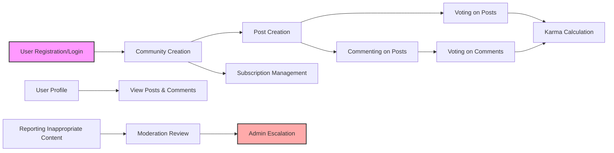

# Reddit-like Community Platform Requirements Analysis

## 1. Introduction
This platform, named redditCommunity, enables users to create and participate in various interest-based communities where they can share content, vote, comment, and engage in discussions. It supports secure user authentication, a karma reputation system, content sorting, subscriptions, and mechanisms for reporting inappropriate content.

## 2. User Roles and Authentication

### 2.1 User Roles
- **Guest**: An unauthenticated user who can browse public content but cannot post, comment, or vote.
- **Member**: A registered and authenticated user who can create communities, posts, comments, vote, subscribe, and manage their profile.
- **Community Moderator**: A member with delegated moderation rights over specific communities to manage posts, comments, and reports.
- **Admin**: A system administrator with full control over all platform features, user management, and site-wide settings.

### 2.2 Authentication Workflow Requirements
- WHEN a user registers with an email and password, THE system SHALL validate the email format and password strength according to security policies.
- WHEN a registration request is submitted, THE system SHALL enforce email verification by sending a unique verification link.
- IF the email is already registered, THEN THE system SHALL reject registration with an appropriate error message.
- WHEN a user logs in, THE system SHALL verify credentials and issue secure JWT access and refresh tokens.
- THE system SHALL ensure session expiration after 30 days of inactivity.
- Password reset requests SHALL trigger secure password reset links.
- THE system SHALL revoke all existing tokens on password change or logout.

### 2.3 Role-Based Access Control
| Action                          | Guest | Member | Community Moderator | Admin |
|--------------------------------|-------|--------|--------------------|-------|
| Browse public content           | ✅    | ✅     | ✅                 | ✅    |
| Register and login              | N/A   | ✅     | ✅                 | ✅    |
| Create communities             | ❌    | ✅     | ❌                 | ✅    |
| Create, edit, delete own posts | ❌    | ✅     | ✅ (within moderated communities) | ✅    |
| Vote on posts and comments     | ❌    | ✅     | ✅                 | ✅    |
| Comment on posts               | ❌    | ✅     | ✅                 | ✅    |
| Moderate community content     | ❌    | ❌     | ✅                 | ✅    |
| Manage users and site settings | ❌    | ❌     | ❌                 | ✅    |
| Handle user reports            | ❌    | ❌     | ✅ (local), ✅ (escalated) | ✅    |

## 3. Functional Requirements

### 3.1 Community Management
- WHEN a member creates a new community, THE system SHALL validate that the community name is unique, between 3 and 30 alphanumeric characters or underscores.
- THE system SHALL create the community with metadata including name, description (max 500 characters), creation timestamp, and creator ID.
- THE system SHALL assign the creator as the community’s initial moderator.
- Community moderators SHALL be able to edit community descriptions and manage posts and comments within their communities.
- Admins SHALL be able to delete any community.

### 3.2 Post Management
- Members SHALL be able to create posts with exactly one of the following types:
  - A text post with non-empty body up to 10,000 characters.
  - A link post with a valid URL.
  - An image post with a single image file (JPEG, PNG, GIF) under 10MB.
- Posts SHALL be assigned to exactly one community.
- Authors SHALL be able to edit posts within 24 hours of creation; the system SHALL maintain edit timestamps.
- Authors SHALL be able to delete their posts.
- Community moderators and admins SHALL have rights to delete any posts within their jurisdiction.
- Posts SHALL display creation and last edited timestamps, author ID, and vote counts.

### 3.3 Voting System
- Members SHALL be able to upvote (+1) or downvote (-1) posts and comments.
- THE system SHALL allow only one active vote per user per item, supporting vote changes or removal.
- Vote counts SHALL be publicly visible and updated in real-time.

### 3.4 Commenting System
- Members SHALL be able to comment on posts and reply to other comments without limit to nesting depth.
- Comments SHALL have a maximum length of 1,000 characters.
- Authors SHALL be able to edit or delete their comments within 24 hours.
- Moderators and admins SHALL have rights to delete any comments.
- Comments SHALL display creation and edit timestamps and vote counts.

### 3.5 User Karma System
- User karma SHALL be calculated as:
  - +10 points for each upvote on a user's post.
  - -2 points for each downvote on a user's post.
  - +5 points for each upvote on a user's comment.
  - -1 point for each downvote on a user's comment.
- WHEN a user changes or removes a vote, THE system SHALL adjust karma accordingly.

### 3.6 Post Sorting
- THE system SHALL support sorting posts within communities and user feeds by:
  - Hot: a calculated score combining vote counts and recency.
  - New: most recent posts first.
  - Top: highest vote counts first.
  - Controversial: highest variance between upvotes and downvotes.
- Default sorting SHALL be by hot score.

### 3.7 Subscriptions
- Members SHALL be able to subscribe or unsubscribe to communities.
- THE system SHALL maintain a personalized feed for each user, aggregating posts from subscribed communities sorted by selected criteria.

### 3.8 User Profiles
- Profiles SHALL be publicly visible, displaying user’s posts, comments, total karma, join date, and optional bio.
- Members SHALL be able to update their bio.

### 3.9 Content Reporting
- Members SHALL be able to report posts, comments, or users for violations.
- Reports SHALL include reporter ID, reported content ID, report category (spam, abuse, other), and timestamp.
- Community moderators SHALL review reports within their communities and take action.
- Reports may be escalated to admins for further review.
- Resolved reports SHALL be tracked with resolution status and communication to the reporter.

## 4. User Scenarios

### 4.1 User Registration and Login
- WHEN a guest submits registration data, THE system SHALL validate, create an inactive account, send verification email.
- WHEN user clicks verification, THE account is activated.
- WHEN logging in, THE system SHALL authenticate and generate JWT tokens.
- The system SHALL enforce session expiration and secure logout.

### 4.2 Community Creation and Subscription
- WHEN a member creates a community with a unique name, THE system shall assign the member as moderator.
- Members shall be able to subscribe or unsubscribe from communities.
- Subscriptions influence personalized feeds.

### 4.3 Posting, Voting, and Commenting
- Authenticated members shall create posts (text, link, or image).
- Members shall vote on posts and comments and change votes.
- Members shall comment and reply with nested comments.
- Karma updates shall reflect vote changes immediately.

### 4.4 Content Reporting and Moderation
- Members shall report inappropriate content.
- Moderators and admins shall review and act on reports.
- Resolutions and notifications shall be communicated.

## 5. Business Rules and Validation

- Email addresses must be unique and valid.
- Passwords must meet minimum strength requirements.
- Community and post names have character and format restrictions.
- Posts limited to single image or link or text.
- Comments maximum length is 1,000 characters.
- Voting rules enforce single active vote per user per item.
- Karma adjustments according to votes.
- Reports require valid categories.
- Subscriptions must reference existing communities.

## 6. Error Handling and Recovery

- Authentication errors return clear messages (invalid credentials, locked out).
- Content submission errors return validation feedback.
- Voting and commenting errors handle unauthorized attempts and invalid IDs.
- Reporting errors handle invalid or duplicate reports gracefully.
- System retry mechanisms for transient failures.

## 7. Performance Requirements

- Registration and login responses shall occur within 2-3 seconds.
- Content loading (posts, comments) to respond within 3 seconds.
- Voting and reporting actions shall complete within 1-2 seconds.
- System shall handle up to 1 million registered users with 100,000 concurrent.

## 8. Security Requirements

- Passwords shall be stored securely with strong hashing.
- JWT tokens shall be securely signed with expiration.
- Access control shall strictly enforce role permissions.
- Personal data shall be encrypted and access logged.
- Compliance with GDPR or applicable regulations.
- Audit logs for all significant actions, retained for at least 1 year.

## 9. Glossary

- **Community**: A topic-based group created by users to organize content.
- **Post**: Content submitted by users within communities, can be text, a link, or an image.
- **Comment**: A nested response to posts or other comments.
- **Karma**: Reputation score for users based on votes.
- **Community Moderator**: User with moderation rights for specific communities.
- **Admin**: User with full administrative rights.
- **Subscription**: Member following a community to receive its posts in their feed.
- **Report**: An action by users to flag inappropriate content.

## 10. Developer Autonomy Note

This document specifies business requirements only. All design decisions including architecture, database schema, APIs, and technical implementation belong to developers. It defines WHAT the system must do without prescribing HOW to build it.

## Mermaid Diagrams

---