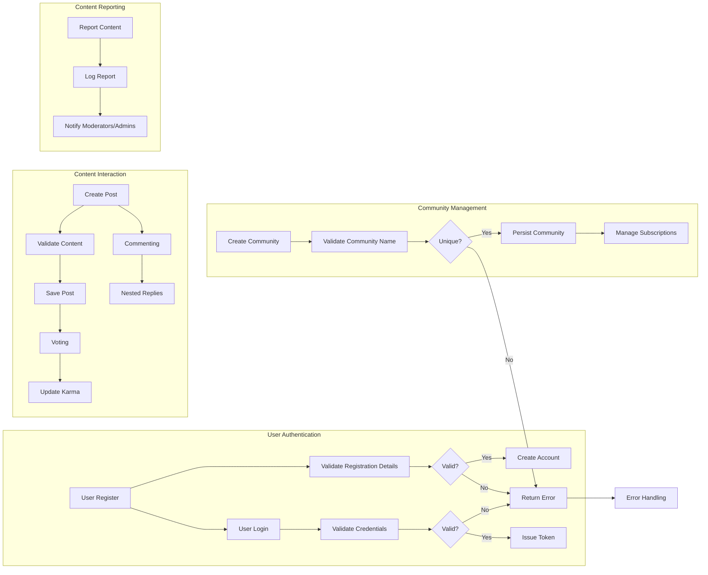

# Requirement Analysis Report for redditCommunity Backend

## 1. Introduction
This report outlines the comprehensive business requirements for the redditCommunity backend system, focusing on security, authentication, authorization, data privacy, and operational policies to safeguard users and platform integrity.

## 2. Authentication Security

### 2.1 User Registration and Login
- WHEN a user submits registration details, THE redditCommunity SHALL create a new user account after validating all required fields.
- WHEN a user attempts to log in with credentials, THE redditCommunity SHALL authenticate the user within 2 seconds and provide an access token.
- IF authentication fails, THEN THE redditCommunity SHALL return an appropriate error and not authorize access.
- THE redditCommunity SHALL allow users to log out, terminating their session.

### 2.2 Session Management
- THE redditCommunity SHALL use JWT tokens for session authentication.
- THE access token SHALL contain user's identity, role, and permissions.
- THE access token SHALL expire after 15 minutes.
- THE refresh token SHALL expire after 30 days.
- WHEN an access token expires, THE redditCommunity SHALL allow renewal using a valid refresh token.
- THE redditCommunity SHALL store tokens securely, using recommended storage methods.

## 3. Authorization Controls

- User roles include guest, user, moderator, and admin, each with specific permissions.
- Guests MAY only browse public communities and view content.
- Users SHALL be authenticated to post, comment, vote, and subscribe.
- Moderators SHALL have permissions to moderate content within their assigned communities.
- Admins SHALL have full system-wide permissions, including managing users and communities.

## 4. Data Privacy and Protection

- User passwords SHALL be securely stored using strong hashing algorithms.
- The system SHALL limit access to personal information to authorized users only.
- Sensitive data SHALL be encrypted at rest and in transit.
- User activity logs SHALL be maintained securely for audit and investigation.

## 5. Regulatory Compliance

- The platform SHALL comply with relevant data protection laws such as GDPR.
- Users SHALL have rights to access, correct, and delete their personal data.
- The system SHALL provide mechanisms for consent management and data breach notifications.

## 6. Functional Requirements

### 6.1 Posts and Comments
- Posts SHALL accept text, links, and images with validations on size and format.
- Comments SHALL support unlimited nested replies.
- THE system SHALL prevent posting if content violates guidelines.

### 6.2 Voting System
- Users SHALL be able to upvote or downvote posts and comments.
- The system SHALL prevent users from voting multiple times on the same content.
- Self-voting SHALL be disallowed.

### 6.3 User Karma
- THE system SHALL calculate karma based on votes received.
- Karma SHALL update in real-time following vote changes.

### 6.4 Content Reporting
- Users SHALL be able to report inappropriate content.
- Reports SHALL be logged and routed to moderators and admins for review.

## 7. Error Handling

- Authentication failures SHALL result in clear error messages.
- Authorization denials SHALL be logged and notified appropriately.
- Validation errors for posts and comments SHALL provide specific feedback.
- Duplicate votes or invalid actions SHALL return conflict errors.

## 8. Performance

- Login, registration, and token renewal SHALL complete within 3 seconds.
- Voting actions SHALL update and reflect in the UI within 1 second.
- Content retrieval SHALL be paginated and return within 2 seconds under normal loads.

## 9. Mermaid Diagrams

```mermaid
graph LR
  subgraph "User Authentication"
    A["User Register"] --> B["Validate Registration Details"]
    B --> C{"Valid?"}
    C -->|"Yes"| D["Create Account"]
    C -->|"No"| E["Return Error"]
    A --> F["User Login"]
    F --> G["Validate Credentials"]
    G --> H{"Valid?"}
    H -->|"Yes"| I["Issue Token"]
    H -->|"No"| E
  end

  subgraph "Community Management"
    J["Create Community"] --> K["Validate Community Name"]
    K --> L{"Unique?"}
    L -->|"Yes"| M["Persist Community"]
    L -->|"No"| E
    M --> N["Manage Subscriptions"]
  end

  subgraph "Content Interaction"
    O["Create Post"] --> P["Validate Content"]
    P --> Q["Save Post"]
    Q --> R["Voting"]
    R --> S["Update Karma"]
    O --> T["Commenting"]
    T --> U["Nested Replies"]
  end

  subgraph "Content Reporting"
    V["Report Content"] --> W["Log Report"]
    W --> X["Notify Moderators/Admins"]
  end

  E --> Z["Error Handling"]
```

## 10. Conclusion
The redditCommunity backend must adhere strictly to these security and functional requirements to ensure a secure, reliable, and user-friendly platform. All technical implementation details such as database and API design remain the responsibility of developers. This document specifies the WHAT and WHY of the requirements, empowering the team to build a compliant and maintainable backend system.