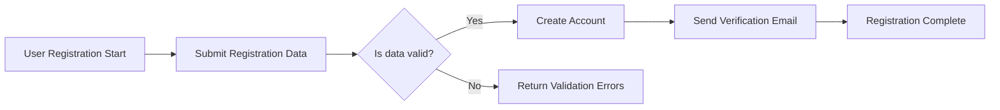
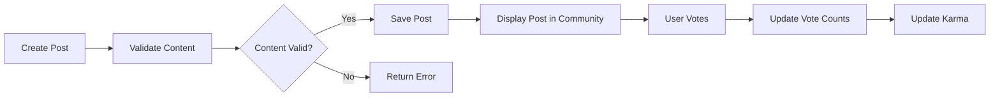

# Requirement Analysis Report for Reddit-Like Community Platform

## 1. Introduction

The redditCommunity platform is intended to provide a secure, scalable, and feature-rich backend system enabling users to join, create, and participate in topic-based communities that support content sharing through posts, voting, and commenting. The platform is designed to empower users to organize discussions around shared interests, fostering engagement through a dynamic karma and reputation system, community subscriptions, and moderation tools.

## 2. User Actors and Authentication

### 2.1 Guest
Guests are unauthenticated users who may browse public communities and read posts and comments. They are prohibited from content creation, voting, commenting, subscription, or reporting functions to maintain platform integrity.

### 2.2 Registered User
Registered users gain full access to the core platform features after completing a secure registration and email verification process. They can create communities, submit posts (text, links, images), vote (upvote/downvote) on posts and comments, comment with nested replies, subscribe or unsubscribe from communities, view and edit their profiles showing their posts, comments, and karma, and report inappropriate content.

### 2.3 Community Moderator
Community moderators are trusted registered users elevated with privileges limited to one or more specific communities they moderate. They can manage posts and comments within their communities, enforce rules by approving or removing content, assign community settings, and ban or warn users within their community.

### 2.4 Administrator
Administrators have full system-wide privileges to manage all users, communities, platform settings, handle escalated reports, enforce bans or restrictions platform-wide, and access analytics and logs.

### 2.5 Authentication Flow
- WHEN a new user submits valid registration input including a unique email and password, THE system SHALL create a user account and send a verification email.
- WHEN a user submits login credentials, THE system SHALL authenticate and create a session.
- THE system SHALL allow password resets via secure tokenized email.
- Sessions SHALL be maintained securely with JWT access and refresh tokens; access tokens expire after 30 minutes, refresh tokens expire after 30 days.
- Tokens SHALL be revoked upon logout or admin suspension.

## 3. Functional Requirements

### 3.1 User Registration and Login
- WHEN a user submits registration data, THE system SHALL validate email uniqueness and password strength.
- IF registration data is invalid, THEN THE system SHALL reject the registration with descriptive error messages.
- WHEN login credentials are provided, THE system SHALL authenticate or reject accordingly.
- The system SHALL support session management including logout functionality.

### 3.2 Community Creation and Management
- WHEN a registered user submits a request to create a community with a unique name, THE system SHALL validate and create the community.
- Moderators SHALL be able to update community info and moderate posts/comments.
- Community names SHALL be unique and immutable.

### 3.3 Posting Content
- Users SHALL be able to create posts containing text (up to 10,000 characters), links, or images.
- Image uploads SHALL be restricted to JPEG and PNG formats with a size limit of 5MB.
- Post editing SHALL be permitted for 24 hours by the author.

### 3.4 Voting System
- Users SHALL be able to upvote or downvote posts and comments, limited to one vote per item.
- Votes SHALL be recorded and reflected in real-time score calculations.
- Vote changes SHALL be allowed but multiple votes on the same item SHALL be prevented.

### 3.5 Commenting System
- Comments SHALL support nested replies up to 5 levels.
- Comment length SHALL be limited to 1,000 characters.

### 3.6 User Karma System
- THE system SHALL calculate karma based on net upvotes and downvotes on user-generated content.
- Karma SHALL update in real-time after votes are cast.

### 3.7 Post Sorting
- Users SHALL be presented with default and selectable sorting options by "hot", "new", "top", and "controversial".
- Sorting algorithms SHALL be applied consistently to post listings.

### 3.8 Subscription Management
- Users SHALL be able to subscribe or unsubscribe from communities.
- The system SHALL track subscriptions for personalized content delivery.

### 3.9 User Profiles
- Profiles SHALL include posts, comments, and total karma.
- Users SHALL be able to update profile information excluding username.

### 3.10 Reporting Inappropriate Content
- Users SHALL report inappropriate posts or comments specifying reasons.
- Reports SHALL notify community moderators and administrators.
- Moderators and admins SHALL review reports and may warn users, remove content, or impose bans.

## 4. Business Rules

- Community names SHALL be unique and immutable post-creation.
- Users must complete email verification before posting.
- Votes SHALL be limited to one per user per content item.
- Karma SHALL influence privileges such as community creation eligibility.
- Moderators have jurisdiction only within their communities.
- Posting and commenting rates SHALL be regulated to prevent spam.

## 5. Error Handling and Validation

- Registrations with duplicate email SHALL be rejected.
- Invalid login attempts SHALL return standardized error messages.
- Unauthorized actions SHALL be denied with access error responses.
- Content exceeding size or type limits SHALL be rejected with explanations.
- Duplicate votes SHALL be prevented.
- Comment nesting beyond allowed depth SHALL be blocked.

## 6. Performance Requirements

- Login processes SHALL respond within 2 seconds.
- Post and comment pagination SHALL load 20 items per page within 1 second.
- Vote and karma updates SHALL propagate within 5 seconds.

## 7. Summary

The redditCommunity platform will provide a robust backend forming the backbone of a Reddit-like user-driven community discussion service. This requirements analysis captures essential business processes, user interaction rules, and performance standards to guide backend developers in creating a maintainable and scalable system.

---

## Appendix: Mermaid Diagrams

### User Registration and Login Flow

### Posting and Voting Flow

## End of Requirement Analysis Report for redditCommunity