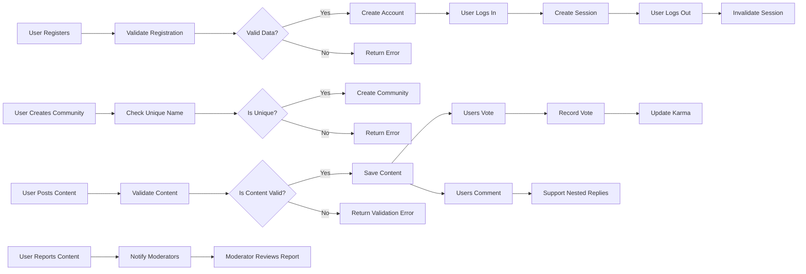

# Functional Requirements for Reddit-like Community Platform Backend

## User Actors and Permissions

- **Guest**: Can browse public communities and posts with read-only access but cannot create content, comment, vote, subscribe, or report.
- **Registered User**: Can create communities, post content (text, links, images), comment, vote, subscribe to communities, and report inappropriate content.
- **Moderator**: Has moderation rights in assigned communities to manage posts, comments, and reports.
- **Admin**: Full system-wide privileges including user management and content moderation.

### Permission Matrix

| Action                         | Guest | Registered User | Moderator | Admin |
|-------------------------------|-------|-----------------|-----------|-------|
| Browse public content          | ✅    | ✅              | ✅        | ✅    |
| Register / Login               | ❌    | ✅              | ✅        | ✅    |
| Create communities             | ❌    | ✅              | ❌        | ✅    |
| Create posts                  | ❌    | ✅              | ✅        | ✅    |
| Comment on posts              | ❌    | ✅              | ✅        | ✅    |
| Vote on posts/comments        | ❌    | ✅              | ✅        | ✅    |
| Subscribe to communities      | ❌    | ✅              | ✅        | ✅    |
| Moderate community content    | ❌    | ❌              | ✅        | ✅    |
| View user profiles            | ✅    | ✅              | ✅        | ✅    |
| Report inappropriate content  | ❌    | ✅              | ✅        | ✅    |

---

## Authentication and Session Management

- WHEN a guest submits valid registration information, THE system SHALL create a new user account.
- WHEN a registered user submits login credentials, THE system SHALL authenticate and establish a secure session.
- IF login credentials are invalid, THE system SHALL return a descriptive error message.
- WHEN a user logs out, THE system SHALL invalidate the user session.
- THE system SHALL enforce password complexity rules requiring minimum 8 characters, including uppercase letters, lowercase letters, and numbers.
- THE system SHALL implement session expiry after configurable inactivity timeout (default 30 days).
- THE system SHALL support password reset flows including email verification and secure password update.

---

## Community Creation and Management

- WHEN a registered user requests to create a new community with a unique name and description, THE system SHALL create the community and assign the creator as the moderator.
- Community names SHALL be unique and validated against allowed character sets.
- Moderators SHALL have rights to manage posts, comments, and reports within their communities.
- THE system SHALL allow updating community information and deleting communities by owners or admins.

---

## Posting Content

- WHEN a user creates a post (text, link, or image), THE system SHALL validate content type, size limits, and sanitize inputs.
- THE system SHALL link posts to the creator and respective community.
- Image uploads SHALL be validated for type (JPEG, PNG) and size (max 5MB).
- Text posts SHALL have a maximum character limit (e.g., 10,000 characters).

---

## Voting System

- WHEN a registered user upvotes or downvotes a post or comment, THE system SHALL record a single vote per user per item.
- THE system SHALL allow users to change or remove their vote.
- Votes SHALL update total scores in real-time and update user karma accordingly.
- IF a non-registered user attempts to vote, THE system SHALL reject the action with a 401 Unauthorized response.

---

## Commenting and Nested Replies

- THE system SHALL support nested replies to comments with unlimited depth.
- WHEN a user comments or replies, THE system SHALL validate content length and sanitize inputs.
- Users SHALL be able to edit their comments within a configurable time window (e.g., 15 minutes).

---

## User Karma System

- Karma points SHALL be calculated based on votes received on posts and comments:
  - Post upvote: +10 karma points
  - Post downvote: -2 karma points
  - Comment upvote: +5 karma points
  - Comment downvote: -1 karma point
- THE system SHALL update karma scores in real-time.

---

## Sorting Posts

- THE system SHALL provide sorting options for posts including hot, new, top, and controversial.
- Default sorting SHALL be 'hot'.
- Sorting SHALL be applied server-side with pagination of 20 items per page.

---

## Community Subscription

- WHEN a registered user subscribes to a community, THE system SHALL add the subscription to the user's profile.
- Users SHALL be able to unsubscribe and retrieve their subscribed communities list.
- Subscribed communities SHALL influence the user's newsfeed content.

---

## User Profiles

- THE system SHALL display user profiles showing posts, comments, karma scores, and subscribed communities.
- Users SHALL be able to view other users’ profiles.

---

## Reporting Inappropriate Content

- WHEN a registered user reports a post or comment, THE system SHALL log the report with user details, content reference, reason, and timestamp.
- THE system SHALL notify moderators or admins of new reports within 1 minute.
- Moderators SHALL review reports and take action such as dismissing, deleting content, or escalating to admins within 48 hours.
- THE system SHALL notify content authors when their content is removed due to reports.
- THE system SHALL detect and restrict abusive reporting behavior.

---

## Business Rules and Validation

- Community names SHALL be unique and follow allowed character patterns.
- Posts and comments SHALL be validated for length and content appropriateness.
- Voting SHALL enforce single vote per user per post/comment.
- Karma updates SHALL reflect vote changes immediately.
- Reports SHALL not be duplicated by the same user on the same content.

---

## Error Handling

- IF input validation fails, THEN THE system SHALL return specific error messages describing the issues.
- IF unauthorized access is attempted, THEN THE system SHALL deny with descriptive permissions error.
- IF duplicate votes or reports are detected, THE system SHALL reject with appropriate error codes.
- THE system SHALL log critical errors and provide clear feedback to users.

---

## Performance Expectations

- User registration, login, and posting SHALL respond within 2 seconds.
- Vote, comment, and karma update operations SHALL complete within 1 second.
- Content listings SHALL paginate with 20 items per page and respond within 2 seconds.
- Moderation reports SHALL notify moderators within 1 minute and require action within 48 hours.

---

## Mermaid Diagram

