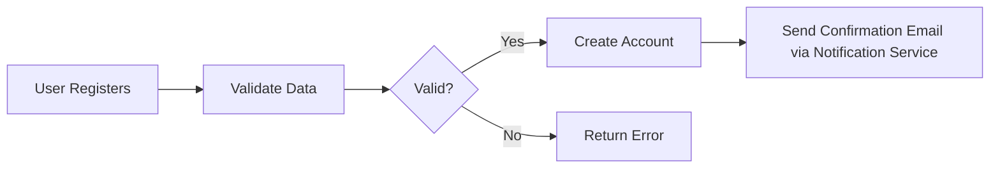
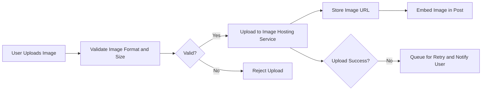
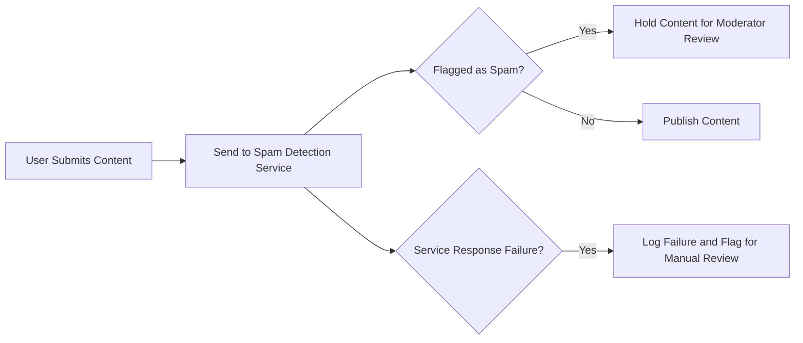
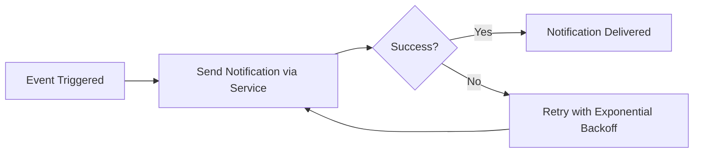

# Requirements Analysis Report for redditCommunity: Reddit-like Community Platform

## 1. Introduction

This document specifies the comprehensive business and functional requirements for the redditCommunity platform, focusing specifically on the integrations with external services that support core platform functionalities. The objective is to outline the expected behaviors, rules, and performance criteria necessary when interacting with third-party services such as image hosting, spam detection, and notification systems.

The redditCommunity platform is a community-driven discussion space similar to Reddit, where users create communities, post content, vote, comment, and moderate discussions. These external integrations are crucial to ensuring content quality, platform reliability, and effective user engagement.

## 2. User Actors and Permissions

The platform includes the following actors with defined permissions:

| Actor     | Description                                                              | Permissions Summary                                          |
|-----------|--------------------------------------------------------------------------|-------------------------------------------------------------|
| guest     | Unauthenticated users who can browse public content                      | Read-only access to communities and posts                   |
| user      | Registered and authenticated users                                       | Manage posts, comments, voting, subscriptions, reports     |
| moderator | Users granted moderation rights within specific communities              | Moderate content, manage community settings                 |
| admin     | System-wide administrators                                               | Manage users, communities, handle reports globally          |

All actor authentication and session management are prerequisites for accessing and utilizing external services integrated into the platform.

## 3. Integration Areas

### 3.1 Third-Party Services Overview

- WHEN the platform initiates actions requiring external capabilities, THE system SHALL interact with approved third-party services reliably and securely.
- THE system SHALL ensure user authentication tokens or API keys are refreshed and managed securely for external communications.
- THE system SHALL record audit logs for all external service interactions.

### 3.2 Image Hosting Requirements

- WHEN a user uploads an image as part of a post, THE system SHALL upload the image to a designated third-party image hosting service.
- THE system SHALL validate image format (JPEG, PNG) and size constraints before upload.
- IF the external image hosting service is temporarily unavailable, THEN THE system SHALL queue the upload for retry and notify the user of the delay.
- THE system SHALL store the returned image URL for embedding in posts.
- THE system SHALL ensure image URLs are accessible only through secured (HTTPS) endpoints.

### 3.3 Spam and Abuse Detection Requirements

- WHEN a user submits content (posts or comments), THE system SHALL send the content data to an external spam detection service asynchronously.
- IF the spam detection service flags content as spam or inappropriate, THEN THE system SHALL hold the content for moderator review before publication.
- THE system SHALL maintain retry logic on failed calls to the spam service, logging all failures.
- THE system SHALL provide an interface for moderators to override spam flags with proper auditing.

### 3.4 Notification Services Requirements

- WHEN significant events occur (e.g., content reported, new community created), THE system SHALL trigger notifications via third-party notification services.
- THE system SHALL support multiple notification channels including email, push notifications, and in-app messages.
- IF a notification fails to send, THEN THE system SHALL retry sending based on exponential backoff.
- THE system SHALL allow configuration of notification preferences per user and community.

## 4. Business Rules and Validation

- ALL third-party service interactions SHALL require authenticated sessions.
- ONLY authorized system components SHALL initiate external service calls.
- Content uploads SHALL comply with size and format restrictions.
- Spam detection failures SHALL NOT block content delivery but SHALL flag for manual review.
- Notifications SHALL respect user preferences and opt-out settings.

## 5. Error Handling and User Recovery

- IF an external service call fails permanently, THEN THE system SHALL log the error and escalate to system admins.
- THE system SHALL provide meaningful status feedback to users when delays occur due to integration issues.
- Retry logic SHALL mitigate transient failures.
- THE system SHALL provide fallback workflows for critical user actions relying on external services.

## 6. Performance and Latency Requirements

- THE system SHALL process image uploads to external hosting services within 3 seconds under normal load.
- THE spam detection service SHALL return flags within 2 seconds to enable near real-time content moderation.
- Notification delivery SHALL have a target latency of under 5 seconds.
- THE system SHALL monitor and log integration latency for performance tuning.

## 7. Security and Compliance Considerations

- THE system SHALL securely transmit data to external services using encrypted channels (HTTPS/TLS).
- User privacy SHALL be maintained, avoiding transmission of sensitive personal information unless strictly necessary.
- THE system SHALL comply with regulatory requirements concerning data sharing with third parties (e.g., GDPR).

## 8. Glossary

- **Image Hosting Service**: Third-party storage and delivery service for user-uploaded images.
- **Spam Detection Service**: External system that analyzes content for spam or abuse patterns.
- **Notification Service**: System sending alerts to users via various communication channels.

## 9. Integration Flow Diagrams

### 9.1 User Registration and Email Confirmation

### 9.2 Image Upload Process

### 9.3 Spam Detection Workflow

### 9.4 Notification Delivery Flow

## 10. Related Documents

- Authentication and User Actors: See [02-user-actors.md]
- Functional Requirements: See [03-functional-requirements.md]
- Business Rules and Validation: See [04-business-rules.md]

---

This document provides business requirements only. All technical implementation details, including API design and database schema, are the responsibility of the development team. The document describes WHAT the system should do, not HOW to build it.