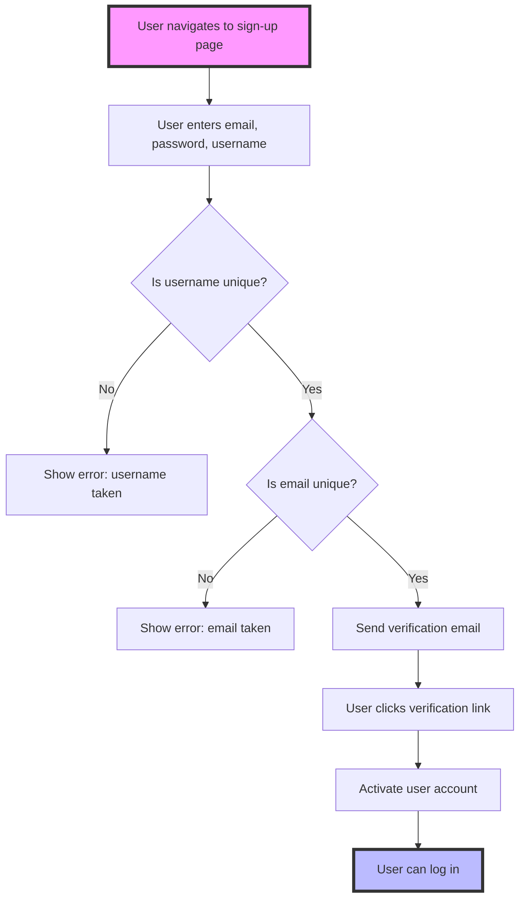
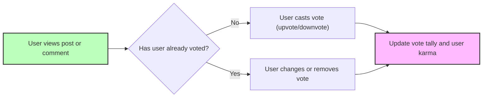
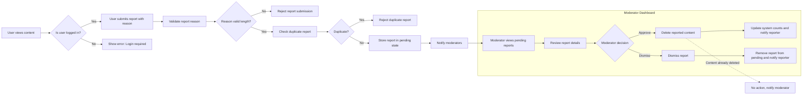

# Reddit-like Community Platform

## User Account

Users SHALL be able to create an account by signing up with email and password, and choosing a unique username. WHEN a user initiates sign-up, THE system SHALL verify that the email and username are unique across all users.

WHEN a user completes the sign-up, THE system SHALL send a verification email with a confirmation link. The user account SHALL remain inactive until the email is verified.

Users SHALL be able to log in with their email and password. WHEN a user submits login credentials, THE system SHALL authenticate the credentials and establish a user session.

Users SHALL be able to change their password by providing the current password and a new password. WHEN a password change request is submitted, THE system SHALL validate the current password before updating it.

Users SHALL be able to delete their account. WHEN a user deletes their account, THE system SHALL delete all data associated with that user including all their posts and comments.

IF account deletion is successful, THEN THE system SHALL destroy the user's session and log them out.

---

## User Profile

Each user SHALL have a profile consisting of display name, bio text, and an avatar image.

Users SHALL be able to edit their own display name, bio text, and avatar image. WHEN a user updates their profile, THE system SHALL validate and save the changes.

Users SHALL be able to view the profile of any other user.

WHEN viewing a user's profile page, THE system SHALL display the user's display name, bio, and avatar, along with the user's total karma score.

The profile page SHALL also list all posts created by the user and all comments written by the user, showing title and time for posts and snippet and time for comments.

---

## Karma

Every user SHALL have a single karma score represented by one integer that can be negative.

WHEN a post or comment created by a user receives an upvote, THEN THE system SHALL increase the user's karma by 1.

WHEN a post or comment receives a downvote, THEN THE system SHALL decrease the user's karma by 1.

WHEN a vote is removed, THEN THE system SHALL adjust the user's karma by subtracting/addition accordingly.

Karma SHALL be calculated as the sum of all votes received from all posts and comments.

---

## Communities

Any user SHALL be able to create a community. WHEN a user creates a community, THE system SHALL assign that user as the owner of the community.

A community SHALL have a unique name, description text, and an icon image.

Users SHALL be able to browse a list of all communities.

Users SHALL be able to search for communities by name. The search SHALL be case insensitive and support partial matches.

Each community page SHALL show the community's subscriber count.

---

## Subscribing

Users SHALL be able to subscribe to any community.

Users SHALL be able to unsubscribe from any community.

Users SHALL be able to view the list of all communities to which they have subscribed.

Users MUST be subscribed to a community before creating posts in that community.

---

## Posts

Users SHALL be able to create posts in communities to which they are subscribed.

Every post SHALL have a title (required field).

Posts SHALL be one of the following types:
- Text post: includes text content.
- Link post: includes a valid URL.
- Image post: includes an uploaded image file.

Users SHALL be able to edit their own posts. WHEN editing a post, THE system SHALL validate that the user is the author.

Users SHALL be able to delete their own posts. WHEN deleting a post, THE system SHALL also delete all related votes and comments.

When a post is viewed individually, THE system SHALL display title, full content, author username, community name, vote score, comment count, and post creation time.

---

## Post Voting

Users SHALL be able to upvote posts, which increases the vote score by 1.

Users SHALL be able to downvote posts, which decreases the vote score by 1.

Each user SHALL only be able to vote once per post.

Users SHALL be able to change their vote from upvote to downvote or vice versa.

Users SHALL be able to remove their vote on any post.

The vote score SHALL equal total upvotes minus total downvotes.

---

## Post Feeds

The system SHALL provide three feeds for viewing posts:

1. **Home Feed**: Shows posts from communities to which the user is subscribed. Accessible only to logged-in users.
2. **Popular Feed**: Shows posts from all communities, accessible to everyone including guests.
3. **Community Feed**: Shows posts from a specific community, accessible to everyone.

All feeds SHALL support the following sorting options:
- Hot: prioritizes recent posts with many upvotes.
- New: displays most recent posts first.
- Top: displays posts with highest vote scores, with filter by time periods: today, week, month, year, all time.
- Controversial: shows posts with many votes but scores close to zero.

Feeds SHALL be paginated.

When viewing a post list in any feed, each post entry SHALL display title, author username, community name, vote score, comment count, time since posted, and content preview:
- Text posts show first 200 characters.
- Image posts show a thumbnail.
- Link posts show the domain name.

---

## Comments

Users SHALL be able to write comments on any post.

Comments SHALL support nested replies with no depth limit.

Users SHALL be able to edit their own comments. Users SHALL be able to delete their own comments.

Each comment SHALL display author username, content, vote score, time since posting, and nested replies.

---

## Comment Voting

Comment voting SHALL follow the same rules as post voting:
- Users can upvote or downvote any comment.
- One vote per user per comment.
- Users can change or remove their vote.

---

## Comment Sorting

Comments on a post SHALL be sortable by:
- Best: highest vote score first.
- New: most recent first.
- Controversial: posts with many votes but scores close to zero first.

---

## Community Moderation

### Moderator Roles

The community creator SHALL be the owner with highest authority.

The owner SHALL be able to add or remove moderators.

Moderators SHALL be able to add other moderators but cannot remove the owner or each other.

### Moderator Actions

Moderators SHALL be able to delete any post or comment within their community.

Moderators SHALL be able to ban and unban users from their community.

Moderators SHALL be able to view a list of banned users.

Banned users SHALL be prevented from creating new posts or comments in that community but SHALL be allowed to view all content.

---

## Reporting

Users SHALL be able to report any post or comment.

Users SHALL provide a valid reason text for each report.

Moderators SHALL be able to view all reports in their communities.

Each report SHALL show the reported content, the reporter user, and the report reason.

Moderators SHALL be able to approve a report, which SHALL delete the reported content permanently.

Moderators SHALL be able to dismiss a report, which SHALL keep the content and remove the report from the list.

Dismissed reports SHALL be removed from the report list permanently.

---

## Authentication and Authorization

Users are required to authenticate using their email and password through a secure login system.

Sessions SHALL be managed using secure tokens with expiration.

Access to create, edit, or delete posts, comments, communities, and moderation actions SHALL be restricted based on user roles and permissions.

Owners and moderators SHALL have elevated permissions in their communities as specified.

The system SHALL enforce authorization checks on every protected action.

---

## Error Handling

The system SHALL provide clear error messages for invalid operations such as duplicate usernames, invalid login, unauthorized actions, or missing required fields.

WHEN an operation fails due to system or network error, THE system SHALL provide a user-friendly error message.

Input validations SHALL be performed on all user input forms.

---

## Performance and Scalability

The system SHALL support pagination and efficient querying to handle large numbers of posts, comments, and communities.

The system SHALL respond to user requests within 2 seconds under normal load.

Caching SHALL be used where appropriate to enhance performance.

---

## Mermaid Diagram: User Account Lifecycle

---

## Mermaid Diagram: Voting Process

---

## Mermaid Diagram: Reporting and Review Workflow

