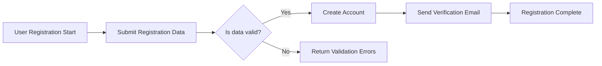
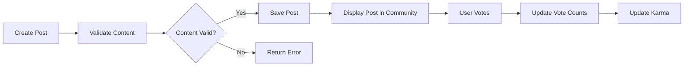

# Requirements Analysis Report for redditCommunity Platform

## 1. Introduction

The redditCommunity platform aims to provide a comprehensive backend system for an online community platform similar to Reddit. This enables users to register, create and manage communities (subreddits), post various content types, vote and comment with nested replies, manage subscriptions, and enforce moderation through reporting inappropriate content. This document provides clear, measurable, and unambiguous business requirements written in natural language targeted for backend developers.

## 2. Business Model

### 2.1 Service Purpose
The platform facilitates decentralized, interest-based online communities where users can share content, engage with posts and comments, and form social bonds. It fills the market need for user-driven forums with democratic content ranking through voting.

### 2.2 Revenue Strategy
Planned revenue sources include advertising within communities, premium user features via subscriptions, and partnership opportunities. The platform prioritizes organic user growth and engagement.

### 2.3 Growth Plan
User acquisition is driven through social sharing, invitations, and high engagement in communities. Retention benefits from personalized content feeds, karma incentives, and reliable moderation.

### 2.4 Success Metrics
Success is measured by monthly active users, number of active communities, posts and comments per day, voting activity, retention, and report resolution rates.

## 3. User Actors

| Actor             | Description                                                                                                  |
|-------------------|--------------------------------------------------------------------------------------------------------------|
| Guest             | Unauthenticated users who can browse public content and read posts and comments.                            |
| Registered User   | Authenticated users who can register, create communities, post content, vote, comment, subscribe, and report content. |
| Community Moderator | Users with moderation privileges within specific communities to manage posts, comments, and community settings. |
| Admin             | Platform-wide administrators with full access to manage users, communities, content moderation, and bans.    |

## 4. Functional Requirements

### 4.1 User Registration and Login
- WHEN a new user registers with a unique email and password, THE system SHALL create a user account and send a verification email.
- WHEN a registered user attempts to login, THE system SHALL authenticate credentials and establish a user session.
- IF login fails, THEN THE system SHALL provide an authentication error message.
- THE system SHALL allow users to logout and invalidate sessions.

### 4.2 Community Management
- WHEN a registered user requests community creation with a unique name, THE system SHALL create the community and store metadata.
- THE system SHALL allow community moderators to update community settings.
- WHEN a user subscribes or unsubscribes, THE system SHALL update the user's subscriptions accordingly.

### 4.3 Posting Content
- WHEN a registered user submits a post with text, link, or image in a community, THE system SHALL validate and save the post.
- THE system SHALL restrict image uploads to JPEG and PNG formats, max size 5MB.
- THE system SHALL allow authors to edit posts within 24 hours.

### 4.4 Voting System
- WHEN a user votes (upvote or downvote) on a post or comment, THE system SHALL record the vote and update vote counts.
- THE system SHALL prevent users from multiple votes on the same content.

### 4.5 Commenting System
- WHEN a user comments or replies, THE system SHALL associate the comment with the post or parent comment.
- Nested replies SHALL be supported up to 5 levels.
- Comments SHALL be limited to 1000 characters.

### 4.6 User Karma
- THE system SHALL calculate karma based on votes received on user's posts and comments.
- Karma SHALL increase or decrease in real-time with votes.

### 4.7 Post Sorting
- THE system SHALL provide sorting by hot, new, top, and controversial.
- Sorting SHALL update in near real-time based on votes and timestamps.

### 4.8 Subscription Management
- THE system SHALL allow users to subscribe and unsubscribe from communities.
- THE system SHALL retrieve subscription lists for users.

### 4.9 User Profiles
- THE system SHALL display user posts, comments, karma, and subscriptions.

### 4.10 Reporting Content
- WHEN a user reports inappropriate content, THE system SHALL log the report and notify moderators and admins.
- THE system SHALL allow tracking and resolution of reports.

## 5. Business Rules

- Posting and commenting require email verification.
- Votes limited to one per user per item.
- Karma thresholds may enable privileges such as community creation.
- Rate limits SHALL be enforced for posting and commenting.
- Moderators can remove or approve content in their communities.

## 6. Error Handling

- IF registration data is invalid, THEN THE system SHALL return specific validation errors.
- IF unauthorized actions are attempted, THEN THE system SHALL respond with an authorization error.
- IF uploads exceed size limits or invalid format, THEN THE system SHALL reject the content.
- IF duplicate votes occur, THEN THE system SHALL reject duplicates and allow vote changes.

## 7. Performance Requirements

- User login SHALL respond within 2 seconds.
- Posts and comments loading shall paginate in pages of 20 responding within 1 second.
- Vote counts and karma SHALL update within 5 seconds.

---

## Appendix: Mermaid Diagram Examples

### User Registration and Login Flow

### Posting and Voting Flow

