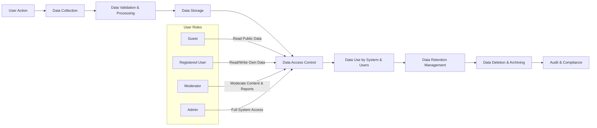

# Reddit-like Community Platform - User Data Flow and Lifecycle Requirements

This document provides detailed business requirements for managing the flow and lifecycle of user data within the redditCommunity platform. It covers the collection, processing, storage, access, sharing, retention, and deletion of user data, aligned with the roles and permissions of different actors and overall system behavior.

---

## 1. Introduction

The redditCommunity platform is a community-driven social system modeled on Reddit where users interact by creating communities, posting content, voting, commenting, and managing profiles. Proper management of user data is critical to ensuring privacy, compliance, and functional integrity of the platform.

This document defines the concrete requirements describing how user data is handled throughout its lifecycle, ensuring backend developers can implement correct data management aligned with business rules.

## 2. User Data Collection

### Overview
User data is collected primarily through user interactions on the platform, including registration, posting content, voting, commenting, subscription, profile updates, and reporting.

### Data Types Collected
- Personal identification data (username, email during registration)
- Authentication credentials
- Community creation and membership data
- Content data (posts, comments, votes)
- User activity metadata (timestamps, karma points)
- Reporting information

### Requirements
- WHEN a new user registers, THE system SHALL collect username, email, and validated password.
- WHEN a user updates their profile, THE system SHALL collect and update user-provided profile details.
- WHEN a user creates a community, THE system SHALL record community metadata with reference to the creating user.
- WHEN a user posts content (text, link, image), THE system SHALL collect post details including content type, community reference, and timestamp.
- WHEN a registered user votes on posts or comments, THE system SHALL record the vote alongside user and content references.
- WHEN a user comments or replies, THE system SHALL collect comment text, nesting references, and timestamps.
- WHEN a user subscribes to a community, THE system SHALL record the subscription relationship.
- WHEN a user reports content, THE system SHALL collect the report reason, reporter identity, and timestamp.
- IF data validation fails during collection (e.g., invalid email format, disallowed content types), THEN THE system SHALL reject the input and provide a clear error message to the user.
- THE system SHALL process all data collection requests within 2 seconds under normal load.

## 3. Data Processing

### Overview
Data processing involves validation, enrichment, aggregation (e.g., karma calculation), and moderation workflows.

### Requirements
- WHEN user registration data is received, THE system SHALL validate email uniqueness and password strength.
- WHEN content is posted, THE system SHALL validate content type and size constraints.
- WHEN voting occurs, THE system SHALL update affected users' karma points asynchronously but reflected within 5 minutes.
- WHEN content is reported, THE system SHALL flag it for moderator review and notify appropriate moderators.
- THE system SHALL sanitize all user-generated content before storage to prevent injection attacks.
- IF processing fails due to system error, THEN THE system SHALL log the error, notify support staff, and present a generic error message to the user.

## 4. Data Storage

### Overview
User data must be stored securely, logically partitioned by type, and indexed for access efficiency.

### Requirements
- THE system SHALL store personal user data separately from public content data.
- THE system SHALL encrypt sensitive data such as passwords and tokens.
- THE system SHALL maintain referential integrity between users, communities, posts, comments, votes, and reports.
- THE system SHALL archive deleted content in a soft-deleted state before permanent removal.
- THE system SHALL provide read and write latency under 1 second for user profile and post interactions.

## 5. Data Access and Sharing

### Overview
Access to user data is controlled based on actor roles and permissions.

### Actors and Access
| Actor           | Data Access Rights                                                                                  |
|-----------------|--------------------------------------------------------------------------------------------------|
| guest           | Read-only access to public communities, posts, and comments                                       |
| registeredUser  | Read and write access within permitted communities; access to own profile and content             |
| moderator       | Read/write access to content and reports within assigned communities; limited user data viewing   |
| admin           | Full access to all user data and system settings                                                  |

### Requirements
- THE system SHALL enforce access control policies for all data queries.
- WHEN a user requests their own data (profile, posts, comments), THE system SHALL provide comprehensive access.
- THE system SHALL NOT share personal user data with third parties without explicit consent.
- THE system SHALL audit all access to sensitive user data.
- WHERE required by law or regulation, THE system SHALL disclose user data to authorized authorities.

## 6. Data Retention and Deletion

### Overview
User data retention and deletion policies ensure compliance with privacy laws and user expectations.

### Requirements
- THE system SHALL retain active user data so long as the user account is active.
- WHEN a user deletes their account, THE system SHALL soft-delete user data immediately and permanently delete it after a retention period of 30 days.
- THE system SHALL retain reports and moderation logs for at least 90 days for audit and review purposes.
- THE system SHALL provide mechanisms for administrators to purge data upon valid legal requests.
- IF deletion fails due to system error, THEN THE system SHALL retry and notify administrators if unresolved after three attempts.

---

## Mermaid Diagram: User Data Lifecycle Flow

---

This document provides business requirements only. All technical implementation decisions belong to developers.
Developers have full autonomy over architecture, APIs, and database design.
This document describes WHAT the system should do, not HOW to build it.
