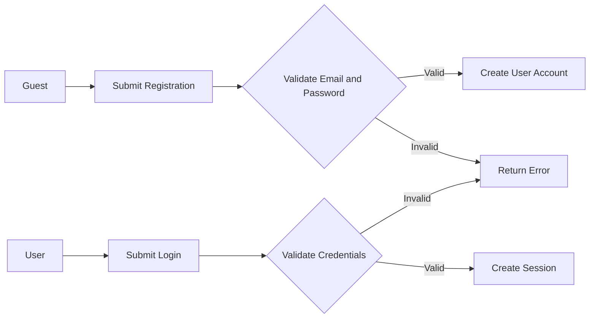
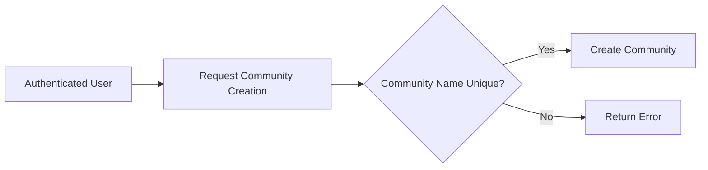
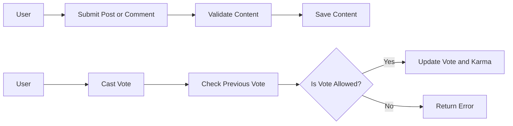
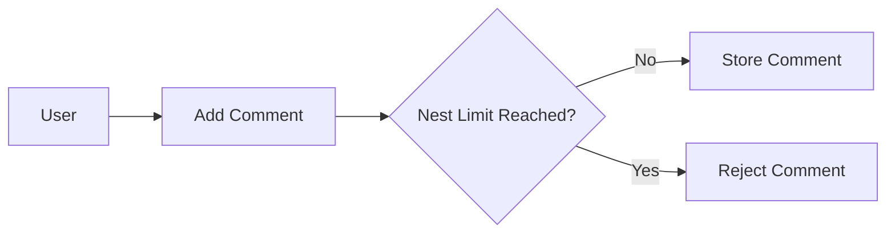
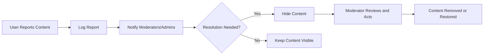

# Reddit-like Community Platform Data Lifecycle and Event Processing Requirements

## 1. Introduction

The redditCommunity platform is designed to provide a scalable and user-driven environment for community content sharing, discussion, and moderation. This document specifies detailed business requirements for data lifecycle management and event processing as part of backend development efforts. It describes the expected behaviors, validations, and workflows required to implement a robust, production-ready backend system.

## 2. Business Model

### 2.1 Service Purpose

The platform fulfills the market demand for flexible, interest-based community hubs where users create and share various content types including text, links, and images. It enables decentralized management by empowering users to create communities, vote on content, and moderate with role-based access.

### 2.2 Revenue Strategy

To sustain long-term operation, revenue will be generated through advertising placements, premium subscriptions for enhanced moderator tools, and strategic partnerships. Monetization phases will align with user base growth and feature maturity.

### 2.3 Growth and Success Metrics

The project’s success will be measured by:
- Monthly Active Users (MAU)
- Number of communities created
- Daily post and comment volumes
- User engagement levels (votes, subscriptions)
- Average user karma
- Timeliness of report resolutions

## 3. User Actors and Permissions

The system contains the following actors, each with distinct roles and capabilities:

| Actor     | Description                                                            |
|-----------|------------------------------------------------------------------------|
| Guest     | Unauthenticated visitors who may browse communities and read posts.   |
| User      | Registered members able to create communities, post content, comment, vote, subscribe, and report content.
| Moderator | Users assigned to moderate specific communities, with permission to manage content and review reports within their scope.
| Admin     | System-wide administrators responsible for user and community management, along with global moderation oversight.

### 3.1 Authentication Requirements

- WHEN a user registers with valid info, THE system SHALL create a user account.
- WHEN a user logs in, THE system SHALL authenticate and establish a secure session.
- IF login fails, THE system SHALL deny access with error messages.
- Users SHALL be able to reset passwords and verify emails.
- The system SHALL use token-based authentication to maintain sessions.

### 3.2 Permission Matrix

| Action                          | Guest | User | Moderator | Admin |
|--------------------------------|-------|------|-----------|-------|
| Browse public communities       | ✅    | ✅   | ✅        | ✅    |
| Register and login              | ❌    | ✅   | ✅        | ✅    |
| Create communities              | ❌    | ✅   | ✅ (own communities) | ✅ |
| Post content                   | ❌    | ✅   | ✅        | ✅    |
| Comment on posts               | ❌    | ✅   | ✅        | ✅    |
| Upvote/downvote                | ❌    | ✅   | ✅        | ✅    |
| Moderate content               | ❌    | ❌   | ✅        | ✅    |
| Manage users                  | ❌    | ❌   | ❌        | ✅    |
| Subscribe to communities        | ❌    | ✅   | ✅        | ✅    |
| Report inappropriate content    | ❌    | ✅   | ✅        | ✅    |

## 4. Functional Requirements

### 4.1 User Registration and Login
- WHEN a guest submits registration data, THE system SHALL validate and create a new user account.
- WHEN a user logs in, THE system SHALL authenticate credentials and provide session tokens.
- IF authentication fails, THE system SHALL return appropriate errors.

### 4.2 Community Management
- WHEN an authorized user requests community creation, THE system SHALL validate community name uniqueness and create it.
- MODERATORS SHALL manage content and settings within their communities.
- USERS SHALL subscribe and unsubscribe to communities.

### 4.3 Posting Content
- WHEN a user posts text, links, or images to a community, THE system SHALL validate and store the content.
- Invalid content SHALL be rejected with clear errors.

### 4.4 Voting System
- WHEN a user votes on a post or comment, THE system SHALL record the vote and prevent duplicate voting.
- Vote changes SHALL update karma calculations.

### 4.5 Commenting System
- WHEN a reply is added to a post or comment, THE system SHALL support nested comments with an enforced depth limit.
- Comments shall be validated for length and content.

### 4.6 User Karma System
- THE system SHALL calculate karma based on votes received on posts and comments.
- Karma updates SHALL occur in near real-time.

### 4.7 Subscription System
- WHEN a user subscribes or unsubscribes, THE system SHALL update the subscription list accordingly.

### 4.8 User Profiles
- Profiles SHALL display user posts, comments, and karma statistics.

### 4.9 Content Reporting
- WHEN content is reported, THE system SHALL log the report and notify moderators/admins.
- Reports SHALL be tracked to resolution status.

## 5. Business Rules and Validation

- Community names SHALL be unique and meet format constraints.
- Users SHALL not vote on their own content.
- Karma SHALL update only based on valid votes.
- Moderators MAY remove or hide inappropriate content within their communities.
- Comment nesting SHALL be limited to 10 levels for usability.
- Duplicate reports by the same user SHALL be ignored.

## 6. Error Handling and Recovery

- AUTHENTICATION failures SHALL return clear messages.
- AUTHORIZATION violations SHALL deny access and log attempts.
- CONTENT submission errors SHALL indicate validation failures clearly.
- VOTING conflicts (e.g., duplicate votes) SHALL reject with error.
- COMMENT nesting limit violations SHALL be rejected.
- REPORTING invalid attempts SHALL notify the user.

## 7. Performance and Scalability

- THE system SHALL respond to content retrieval requests within 2 seconds.
- Actions such as posting, voting, and commenting SHALL be confirmed within 2 seconds.
- Sorting and pagination SHALL be efficient and deliver pages under 3 seconds.
- The system SHALL scale horizontally to support millions of users without degradation.

## 8. Mermaid Diagrams

### User Registration and Login Flow

### Community Creation Flow

### Posting and Voting Flow

### Comment Nesting Flow

### Reporting and Moderation Flow

## 9. Document Summary

This document defines precise business requirements for the data lifecycle and event processing aspects of the redditCommunity platform. It excludes technical implementation details and provides clear, testable statements to guide backend development. Developers shall follow this specification to implement robust, scalable, and secure backend workflows.

---

> This document provides business requirements only. Technical implementation decisions such as database design, API contracts, or event system architecture are outside the scope and are left to the development team.
> Developers have full autonomy on implementation approaches as long as they meet these requirements.