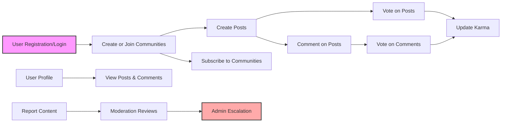
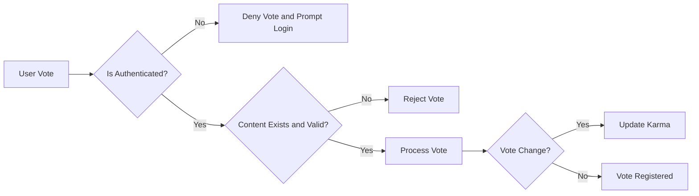

# Functional Requirements Analysis Report for Reddit-like Community Platform

## 1. Introduction

The Reddit-like community platform aims to provide a robust and scalable social content aggregation service where registered users can create communities, submit posts in various formats, interact via voting and commenting with nested replies, and manage their profiles and reputations through a karma system. The platform supports community subscription and content reporting with a comprehensive moderation workflow.

## 2. User Roles and Authentication

### 2.1 User Role Definitions

- **Guest**: Unauthenticated user with permission to browse public communities and posts, but cannot create content or interact.
- **Member**: Registered and authenticated user capable of creating communities, posting content, voting, commenting, subscribing, and managing their profile.
- **Community Moderator**: Member assigned to specific communities with permissions to moderate posts, comments, handle reports, and manage community settings.
- **Admin**: Platform-wide administrator with all permissions including user management, community control, system settings, and oversight of moderation.

### 2.2 Authentication Workflow

- WHEN a user registers with email and password, THE system SHALL validate email format, uniqueness, and password strength (minimum 8 characters).
- THE system SHALL send a verification email; WHEN the user verifies, THE system SHALL activate the account.
- Unverified accounts SHALL be restricted from posting, commenting, voting, or subscribing.
- WHEN a user logs in with valid credentials and active account, THE system SHALL issue JWT access and refresh tokens.
- Access tokens SHALL expire after 30 minutes; refresh tokens SHALL expire after 14 days.
- THE system SHALL allow password resets through secure email workflows.
- WHEN the user logs out, THE system SHALL invalidate refresh tokens.

### 2.3 Permission Matrix

| Action                          | Guest | Member | Community Moderator | Admin |
|--------------------------------|-------|--------|---------------------|-------|
| View public content             | ✅    | ✅     | ✅                  | ✅    |
| Register and Login             | N/A   | ✅     | ✅                  | ✅    |
| Create communities             | ❌    | ✅     | Assigned Only        | ✅    |
| Create posts                  | ❌    | ✅     | Assigned Communities  | ✅    |
| Comment on posts              | ❌    | ✅     | Assigned Communities  | ✅    |
| Vote on posts/comments        | ❌    | ✅     | Assigned Communities  | ✅    |
| Moderate content              | ❌    | ❌     | Assigned Communities  | ✅    |
| Manage users and system       | ❌    | ❌     | ❌                  | ✅    |
| Handle reports                | ❌    | ❌     | Assigned Communities  | ✅    |

## 3. Communities

- WHEN a member submits a create community request, THE system SHALL validate that the community name is unique, 3-50 characters long, and contains only alphanumeric characters and underscores.
- THE system SHALL assign the creator as initial community moderator.
- Community moderators SHALL be able to update descriptions, approve or remove posts and comments, and handle reports within their communities.
- Members SHALL be able to subscribe and unsubscribe to communities.
- Community subscription data SHALL be used to generate personalized feeds.

## 4. Posts

- Members SHALL be able to create posts of types: text only, link only (valid URL), or one image (JPEG, PNG, GIF up to 10MB).
- Text posts SHALL have a body length between 1 and 10,000 characters.
- Members SHALL be able to edit or delete their posts within 24 hours of creation.
- Community moderators and admins SHALL be able to delete any post in their communities.
- Posts SHALL store metadata: author, timestamps, vote counts, comment counts.

## 5. Voting

- Members SHALL be able to upvote or downvote posts and comments.
- Each user can have one active vote per post or comment, which can be changed or removed.
- Vote counts SHALL be publicly visible.
- Vote changes SHALL update the content score and author karma in real time.

## 6. Comments

- Members SHALL be able to comment on posts and reply to comments with unlimited nesting.
- Comments SHALL have a maximum of 2,000 characters.
- Like posts, comments can be edited or deleted by their authors within 24 hours.
- Moderators and admins SHALL have removal authority over any comment in their communities.

## 7. Karma System

- Karma SHALL be calculated as: +10 points for each upvote on posts, -2 for downvotes; +5 points for upvotes on comments, -1 for downvotes.
- When votes change or are removed, karma SHALL be updated accordingly.
- The sum of post and comment karma SHALL define user's total karma.

## 8. Sorting and Feeds

- Posts SHALL be sortable by:
  - Hot: a calculated score based on votes and recency
  - New: newest first
  - Top: highest votes first
  - Controversial: posts with highest vote variance
- Personalized feeds SHALL be generated from subscribed communities sorted by the chosen method.
- Default sorting SHALL be "hot".

## 9. User Profiles

- Profiles SHALL publicly display user's posts, comments, total karma, join date, and an optional bio.
- Members SHALL be able to edit their bios.

## 10. Reporting

- Members and guests SHALL be able to report posts, comments, or users for categories: spam, abuse, harassment, other.
- Reports SHALL be first reviewed by community moderators.
- Escalation to admins SHALL happen for unresolved or severe cases.
- Reporting data SHALL include reporter (if authenticated), content ID, reason, timestamp.

## 11. Error Handling

- Authentication failures SHALL return errors within 2 seconds.
- Invalid input data for registration, community creation, posts, comments SHALL return detailed error messages.
- Unauthorized actions SHALL return HTTP 403 errors.
- Voting on invalid or deleted content SHALL return errors.
- Content creation exceeding size limits SHALL be rejected with messages.
- Moderation actions on non-existent content SHALL return errors.

## 12. Performance Expectations

- Login and registration SHALL complete within 2 seconds.
- Content lists SHALL paginate 20 items per page, delivered within 3 seconds.
- Voting and commenting SHALL reflect changes within 1 second.
- Reports SHALL be acknowledged within 1 second and routed to moderators/admins within 5 seconds.
- System SHALL scale for 1 million users and 100,000 concurrent active users.

## 13. Security and Compliance

- Passwords SHALL be stored securely hashed.
- JWT tokens SHALL be signed, stored, and verified securely.
- Role-based access control SHALL be enforced for all restricted functions.
- User data SHALL comply with GDPR or applicable data privacy regulations.
- Audit logs of critical actions SHALL be maintained for minimum one year.
- Suspicious activity SHALL be monitored and flagged.

## 14. Glossary

- Community: A named group where members share posts and discussions.
- Post: A submission within a community; can be text, link, or image.
- Comment: A reply to a post or another comment; supports infinite nested replies.
- Karma: Numeric representation of user's reputation based on votes.
- Voting: Upvote (+1) or downvote (-1) action on posts and comments.
- Moderation: Process of managing content and enforcing community rules.
- Subscription: User's following of a community to receive content updates.

## 15. Diagrams

---

This report defines detailed business requirements for building the Reddit-like community platform. All requirements are specified in natural language using EARS format with measurable criteria. Backend developers shall implement these requirements adhering to best practices for security, performance, and scalability. This document contains no technical specifications such as API or database design, keeping full developer discretion for implementation.