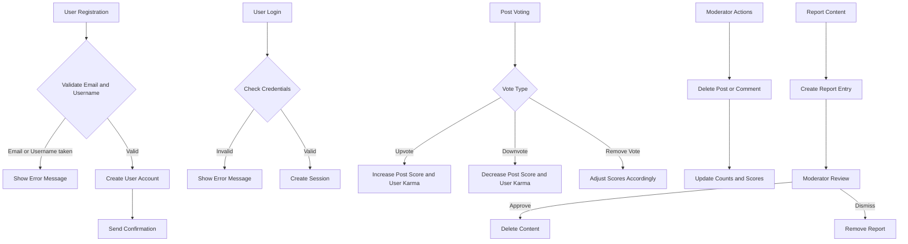

# Reddit-like Community Platform Requirements Specification

## 1. User Account

### 1.1 Account Registration
WHEN a guest submits a registration request with email, password, and desired username, THE system SHALL validate that the email and username are unique.
IF the email is already registered, THEN the system SHALL reject the registration with an "Email already in use" error.
IF the username is already taken, THEN the system SHALL reject the registration with a "Username already taken" error.
WHEN registration is successful, THE system SHALL create a new user account with default profile details.

### 1.2 Account Authentication
WHEN a user provides valid email and password, THE system SHALL authenticate and establish a user session.
IF credentials are invalid, THEN THE system SHALL reject the login attempt with an authentication failure message.
WHEN a user logs out, THE system SHALL terminate the user session.

### 1.3 Password Management
WHEN a logged-in user requests a password change, THE system SHALL validate the current password and update it if correct.
IF the current password validation fails, THEN THE system SHALL reject the request.

### 1.4 Account Deletion
WHEN a user requests account deletion, THE system SHALL delete the user account and cascade delete all related posts, comments, votes, and subscriptions.

## 2. User Profile
WHEN a user views any profile page, THE system SHALL display the user's display name, bio, avatar image, total karma score, all posts authored, and all comments written.
WHEN the user edits their profile, THE system SHALL allow changes to display name, bio, and avatar image.

## 3. Karma
EACH user SHALL have a karma score initialized at zero, which can be positive or negative.
WHEN a post or comment authored by the user receives an upvote, THE system SHALL increment the user's karma by 1.
WHEN a post or comment receives a downvote, THE system SHALL decrement the user's karma by 1.
WHEN a user removes a vote from a post or comment, THE system SHALL adjust the karma accordingly.

## 4. Communities
WHEN a user creates a community, THE system SHALL assign ownership to that user.
EACH community SHALL have a unique name, description, and icon image.
THE system SHALL provide paginated lists of all communities for browsing.
THE system SHALL support searching communities by name.
EACH community SHALL display its subscriber count.

## 5. Subscriptions
USERS SHALL be able to subscribe or unsubscribe from any community.
THE system SHALL list all communities a user is subscribed to in paginated form.
SUBSCRIPTION to a community is required for creating posts within it.

## 6. Posts
POSTS can be created only by users subscribed to the relevant community.
POSTS SHALL have a required title and content based on the post type: text, link, or image.
USERS can edit or delete their own posts.
POST content types:
- Text posts with text content.
- Link posts with URLs.
- Image posts with uploaded images.
WHEN viewing a post, THE system SHALL show title, full content, author, community, vote score, comment count, and timestamp.

## 7. Post Voting
EACH user SHALL be able to upvote, downvote, change vote, or remove vote on posts.
VOTE scores are calculated as total upvotes minus downvotes.
THE system SHALL update post authors' karma based on votes received.
USERS can vote only once per post.

## 8. Post Feeds
HOME feed shows posts from communities subscribed by the user.
POPULAR feed shows posts from all communities for all users.
COMMUNITY feed shows posts from a specific community.
ALL feeds support sorting by Hot, New, Top (with time filters), and Controversial.
FEEDS are paginated.

## 9. Post List Display
EACH post in feeds shows title, author username, community name, vote score, comment count, time since posting.
TEXT posts include the first 200 characters.
IMAGE posts show a thumbnail.
LINK posts display the domain name.

## 10. Comments
USERS can write comments or replies with unlimited nesting.
USERS can edit or delete their own comments.
COMMENTS display author, content, vote score, time ago, and nested replies.

## 11. Comment Voting
COMMENT voting rules mirror post voting rules.
USERS can upvote, downvote, change vote, or remove vote on comments.
COMMENT authors' karma is updated accordingly.

## 12. Comment Sorting
COMMENTS can be sorted by Best (vote score desc), New (most recent), and Controversial.

## 13. Community Moderation

### 13.1 Roles and Permissions
THE community creator is the owner with full permissions.
THE owner can add or remove moderators.
MODERATORS can add other moderators but cannot remove the owner or fellow moderators.

### 13.2 Moderator Actions
MODERATORS can delete any post or comment within their community.
MODERATORS can ban or unban users from their community.
BANNED users cannot post or comment but can view content.
MODERATORS can view banned users list.

## 14. Reporting
USERS can report posts or comments providing a reason.
MODERATORS can review, approve (delete content), or dismiss (keep content) reports.
DISMISSED reports are removed from lists.

## 15. Authentication and Authorization
ALL user interactions requiring authentication SHALL verify user identity.
SESSION management SHALL securely manage login and logout flows.
PERMISSION checks SHALL enforce role-based access throughout.

## 16. Error Handling and Performance
THE system SHALL provide clear error messages and validation feedback.
PERFORMANCE SHALL meet standard web responsiveness with paginated data loading.

## 17. Mermaid Diagrams

---

Comprehensive coverage of all functional requirements, workflows, and business rules ensures backend developers can implement a scalable Reddit-like community platform with proper authentication, authorization, moderation, voting, posting, commenting, and reporting features.