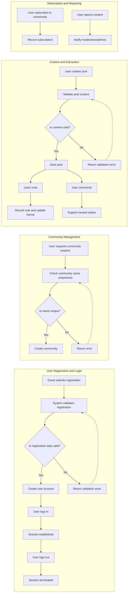

# Requirements Analysis Report for Reddit-like Community Platform

## 1. Introduction
This document specifies detailed business requirements for the backend of a Reddit-like community platform named redditCommunity. It translates the key feature requests into comprehensive, testable, and actionable requirements that backend developers will use to build the system.

## 2. Business Model
### Purpose
The redditCommunity platform exists to provide a decentralized social space where users can create, manage, and participate in communities (similar to Reddit's subreddits). It enables sharing of various content types, voting, commenting, karma-based reputation, community subscriptions, and content moderation through reporting.

### Revenue and Growth
The service aims to monetize through advertising, premium feature subscriptions, and sponsored communities. Growth is driven by user-generated content, viral community creation, and engaged moderation.

### Success Metrics
Key metrics include active user count, community creation and subscription rates, volume of posts and comments, voting activity, and moderation efficiency.

## 3. User Actors and Permissions
### Actors
- **Guest**: Can browse public communities and posts read-only.
- **Registered User**: Can create communities, post, comment, vote, subscribe, report content.
- **Moderator**: Manages content and reports within assigned communities.
- **Admin**: Full system permissions including user and content management.

### Permissions
| Action                            | Guest | Registered User | Moderator | Admin |
|----------------------------------|-------|-----------------|-----------|-------|
| Browse public communities         | ✅    | ✅              | ✅        | ✅    |
| Register / Login                  | ❌    | ✅              | ✅        | ✅    |
| Create communities                | ❌    | ✅              | ❌        | ✅    |
| Create posts                     | ❌    | ✅              | ✅        | ✅    |
| Comment on posts                 | ❌    | ✅              | ✅        | ✅    |
| Vote on posts/comments           | ❌    | ✅              | ✅        | ✅    |
| Moderate community content       | ❌    | ❌              | ✅        | ✅    |
| Subscribe to communities         | ❌    | ✅              | ✅        | ✅    |
| View user profiles               | ✅    | ✅              | ✅        | ✅    |
| Report inappropriate content     | ❌    | ✅              | ✅        | ✅    |

## 4. Functional Requirements
### 4.1 User Registration and Login
- WHEN a guest submits registration information with a unique email and strong password, THE system SHALL create a registered user account.
- WHEN a registered user submits valid login credentials, THE system SHALL authenticate and establish a session.
- IF login credentials are invalid, THEN THE system SHALL return an authentication error.
- WHEN a logged-in user logs out, THE system SHALL terminate their session securely.
- THE system SHALL validate email format and enforce password strength (minimum 8 characters, include uppercase, lowercase, number).

### 4.2 Community Creation and Management
- WHEN a registered user requests to create a community with a unique name and description, THE system SHALL create the community and assign the creator as the owner.
- THE system SHALL enforce community name uniqueness.
- WHEN moderators or admins manage content or community settings, THE system SHALL verify permissions before applying changes.

### 4.3 Posting Content
- WHEN a registered user posts content (text, link, or image) in a community, THE system SHALL validate content and save it linked to the user and community.
- Text posts SHALL have defined maximum length (e.g., 10,000 characters).
- Link posts SHALL be validated for URL format.
- Image posts SHALL validate file types and size limits.

### 4.4 Voting System
- WHEN a registered user votes (upvote or downvote) on a post or comment, THE system SHALL record the vote.
- THE system SHALL enforce one vote per user per content item.
- THE system SHALL allow users to change or remove their vote.
- Vote counts SHALL update post/comment scores and user karma accordingly.

### 4.5 Commenting and Replies
- WHEN a registered user comments on a post or replies to a comment, THE system SHALL save the comment with a reference to the parent post or comment.
- THE system SHALL support unlimited nesting depth.
- THE system SHALL enforce maximum comment length (e.g., 5,000 characters).
- THE system SHALL allow authors to edit or delete their comments within specified time frames.

### 4.6 User Karma System
- THE system SHALL calculate karma points based on received votes:
  - +10 karma for each upvote on a post.
  - -2 karma for each downvote on a post.
  - +5 karma for each upvote on a comment.
  - -1 karma for each downvote on a comment.
- Karma updates SHALL be reflected in near real-time on user profiles.

### 4.7 Post Sorting
- THE system SHALL provide sorting options for posts within communities:
  - "hot": based on popularity and recency.
  - "new": most recent posts.
  - "top": highest scored posts.
  - "controversial": posts with many upvotes and downvotes.
- THE system SHALL paginate results (default 20 posts per page).

### 4.8 Community Subscription
- WHEN a user subscribes or unsubscribes from a community, THE system SHALL update subscription records accordingly.
- THE system SHALL include subscription status in user profiles and affect content feeds.

### 4.9 User Profiles
- THE system SHALL provide user profiles containing:
  - List of user’s posts.
  - List of user’s comments.
  - Current karma point total.
  - List of subscribed communities.

### 4.10 Reporting Inappropriate Content
- WHEN a user reports a post or comment, THE system SHALL create a report containing reporter ID, content ID, reason, and timestamp.
- THE system SHALL notify moderators and admins of new reports.
- THE system SHALL provide interfaces for review and management of reports.

## 5. Business Rules and Validation
- Community names SHALL be unique and respect allowed character sets.
- Posts and comments SHALL adhere to length and type validations.
- Voting SHALL be limited to one vote per user per content item.
- Karma SHALL be calculated and updated immediately after votes.
- Reports SHALL initiate moderation workflows promptly.

## 6. Error Handling and Recovery
- IF a registration submission contains invalid data, THEN THE system SHALL return descriptive validation errors.
- IF login fails, THEN THE system SHALL return an appropriate authentication failure.
- IF unauthorized actions are detected, THEN THE system SHALL deny requests with clear error messages.
- IF content exceeds length or format constraints, THEN THE system SHALL reject with details.
- Errors SHALL be logged for diagnostic and monitoring purposes.

## 7. Performance Expectations
- User authentication SHALL respond within 2 seconds.
- Content lists SHALL paginate with 20 items per page.
- Voting and karma updates SHALL process within 2 seconds.
- Report submissions SHALL be acknowledged immediately.

## 8. Diagram of Key Workflows

## 9. Conclusion
The redditCommunity backend shall implement all the above business requirements to enable a robust, scalable, and user-friendly community platform. The requirements are clear, unambiguous, and testable to support high-quality development and deployment.

Backend developers shall design the system architecture, APIs, and database schemas based on these requirements. This document prescribes what the system must do, not how to implement it.