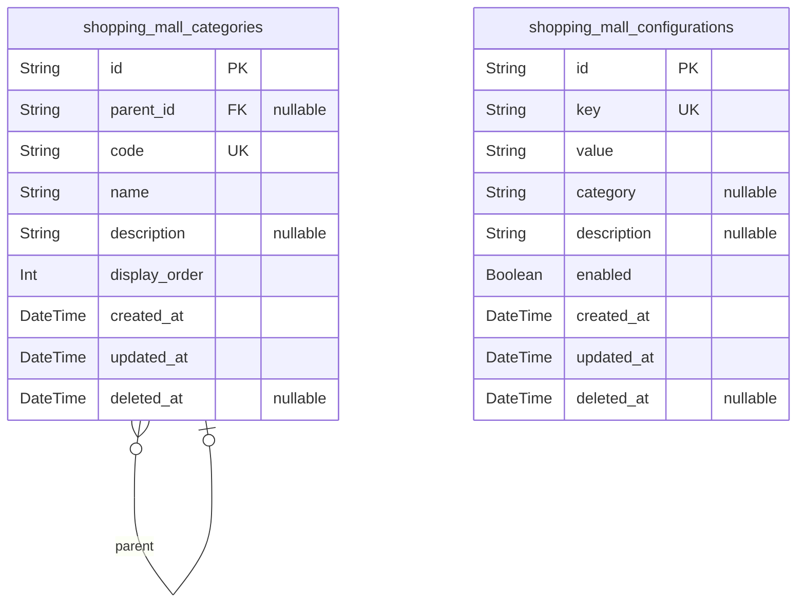
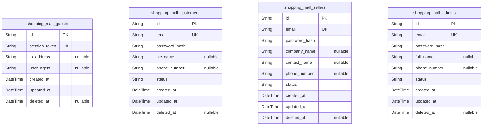
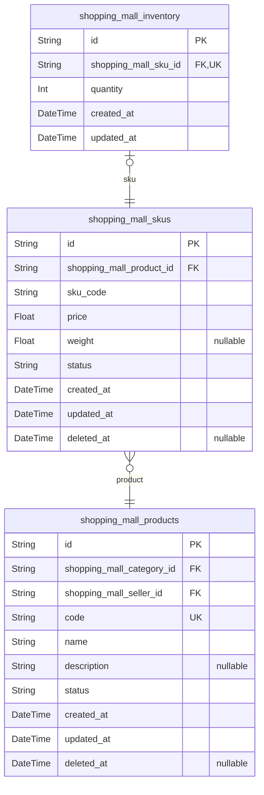
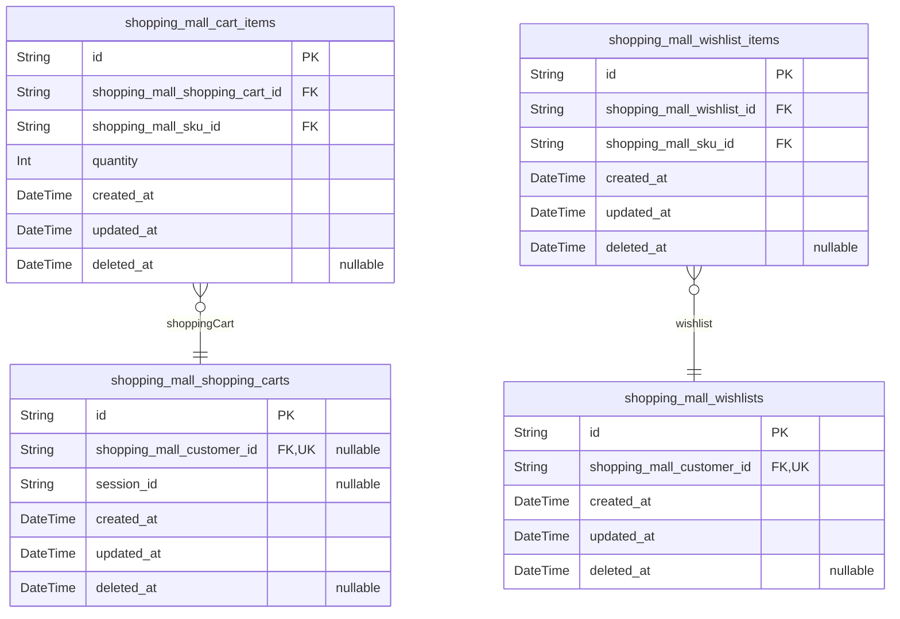
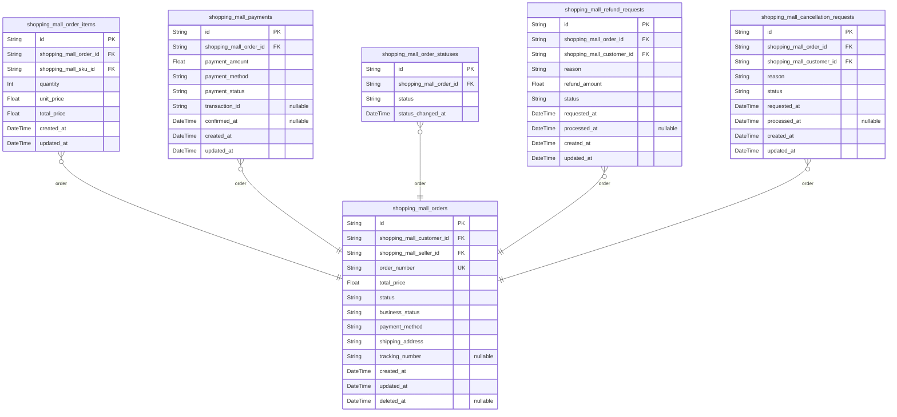
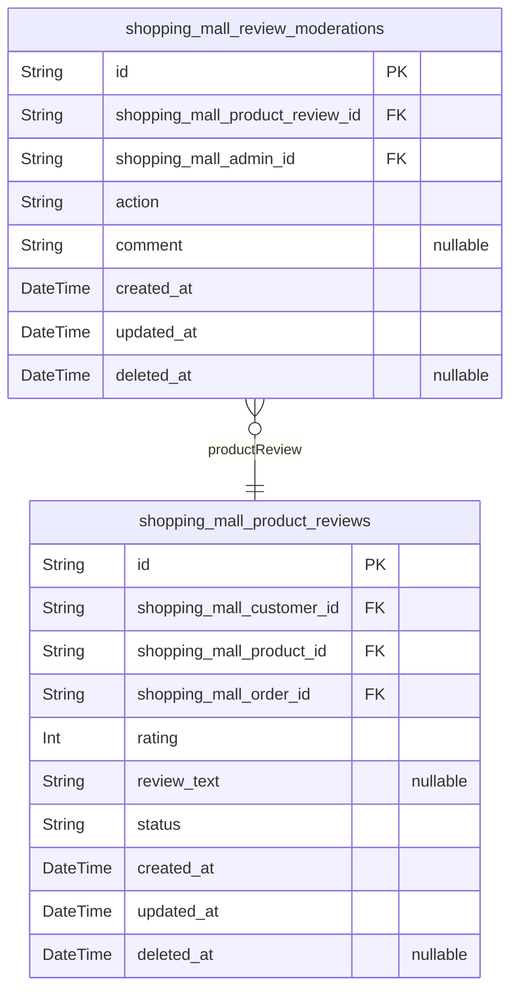
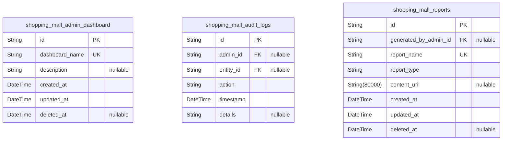

# Prisma Markdown

> Generated by [`prisma-markdown`](https://github.com/samchon/prisma-markdown)

- [Systematic](#systematic)
- [Actors](#actors)
- [Catalog](#catalog)
- [Carts](#carts)
- [Sales](#sales)
- [Reviews](#reviews)
- [Administration](#administration)

## Systematic

### `shopping_mall_categories`

Product categories in the shopping mall's hierarchical catalog. Enables
product classification and navigation via parent-child relationships
forming a tree structure. Supports category codes and display order for
UI sorting. Includes soft delete support and audit timestamps.
Self-referencing foreign key for parent-child linkage.

Properties as follows:

- `id`: Primary Key.
- `parent_id`
  > Parent category's [shopping_mall_categories.id](#shopping_mall_categories). Nullable for root
  > categories.
- `code`: Unique code identifying the category.
- `name`: Category display name.
- `description`: Optional detailed description of the category.
- `display_order`: Display order for sorting categories.
- `created_at`: Timestamp when the category was created.
- `updated_at`: Timestamp when the category was last updated.
- `deleted_at`: Soft delete timestamp. Null when active.

### `shopping_mall_configurations`

System-wide configuration parameters and settings for the shopping mall
platform. Stores key-value pairs defining various operational parameters.
Supports categorization, description, and status flags. Enables soft
deletion and tracks creation and update timestamps.

Properties as follows:

- `id`: Primary Key.
- `key`: Unique configuration key.
- `value`: Configuration value as a string.
- `category`: Optional category grouping for configurations.
- `description`: Description of the configuration parameter.
- `enabled`: Flag indicating if the configuration is active.
- `created_at`: Creation timestamp.
- `updated_at`: Last updated timestamp.
- `deleted_at`: Soft delete timestamp; null if active.

## Actors

### `shopping_mall_guests`

Guest users of the shopping mall platform representing unauthenticated
visitors possibly tracked for session and analytics purposes. This model
stores minimal information to identify guest sessions and access
patterns. No authentication fields are required. The guest entities serve
as primary actors in the system to track guest activity independently
from registered users.

Properties as follows:

- `id`: Primary Key.
- `session_token`: Unique session token identifying the guest session.
- `ip_address`: IP address from which the guest accessed the system.
- `user_agent`: Browser or client user agent string of the guest session.
- `created_at`: Timestamp when this guest record was created.
- `updated_at`: Timestamp when this guest record was last updated.
- `deleted_at`: Timestamp marking soft deletion of this guest record.

### `shopping_mall_customers`

Customer user accounts who can browse products, manage orders, addresses,
and submit product reviews. Customers require authentication with email
and password hash. This table stores user identity and authentication
data separately from transactional sales data. Customers are a primary
actor type in the platform.

Properties as follows:

- `id`: Primary Key.
- `email`: Customer's unique email address used for login and notifications.
- `password_hash`: Hashed password for secure customer authentication.
- `nickname`: Nickname or display name of the customer.
- `phone_number`: Customer's contact phone number in E.164 format.
- `status`
  > Status of the customer account, e.g., 'active', 'inactive', or
  > 'suspended'.
- `created_at`: Timestamp when the customer was created.
- `updated_at`: Timestamp when the customer record was last updated.
- `deleted_at`: Timestamp marking soft deletion of the customer account.

### `shopping_mall_sellers`

Seller accounts that manage product listings, SKUs, inventory, and orders
for their products. Sellers require authentication with email and
password hash. This table stores identity and authentication information
for sellers as primary actors distinct from customers.

Properties as follows:

- `id`: Primary Key.
- `email`: Seller's unique email address for login and notifications.
- `password_hash`: Hashed password for secure seller authentication.
- `company_name`: Legal or brand name of the seller company.
- `contact_name`: Main contact person name for the seller.
- `phone_number`: Contact phone number of the seller in E.164 format.
- `status`: Current status of the seller account such as 'active' or 'suspended'.
- `created_at`: Timestamp when the seller account was created.
- `updated_at`: Timestamp when the seller record was last updated.
- `deleted_at`: Timestamp marking soft deletion of the seller account.

### `shopping_mall_admins`

Administrator accounts that oversee platform operations including user
management, product controls, order processing, and review moderation.
Admins have elevated permissions and require secure authentication with
email and password hash. This primary actor entity stores identity and
authorization data to support system administration tasks.

Properties as follows:

- `id`: Primary Key.
- `email`: Administrator's unique email address for login and critical notifications.
- `password_hash`: Hashed password for secure admin authentication.
- `full_name`: Full legal name of the administrator.
- `phone_number`: Contact phone number of the admin in E.164 format.
- `status`
  > Administrative account status, indicating if active, suspended, or
  > disabled.
- `created_at`: Timestamp when the admin account was created.
- `updated_at`: Timestamp when the admin record was last updated.
- `deleted_at`: Timestamp marking soft deletion of the admin account.

## Catalog

### `shopping_mall_products`

Represents products listed by sellers on the shopping mall platform. Each
product belongs to a category and has various SKUs representing different
variants. Supports product lifecycle states and soft deletion. Includes
timestamps for creation and updates.

Properties as follows:

- `id`: Primary Key.
- `shopping_mall_category_id`
  > The category to which this product belongs. {@link
  > shopping_mall_categories.id}.
- `shopping_mall_seller_id`: The seller who owns this product. [shopping_mall_sellers.id](#shopping_mall_sellers).
- `code`: Unique business code identifying the product.
- `name`: The display name of the product.
- `description`: Detailed description of the product.
- `status`: The lifecycle state of the product, e.g., Draft, Active, Inactive.
- `created_at`: Timestamp when the product was created.
- `updated_at`: Timestamp when the product was last updated.
- `deleted_at`: Timestamp when the product was soft deleted.

### `shopping_mall_skus`

Represents product SKUs (stock keeping units) that specify variants such
as color, size, and options for each product. SKUs track inventory
quantities and pricing and have lifecycle states. SKUs belong to one
product and are managed by sellers.

Properties as follows:

- `id`: Primary Key.
- `shopping_mall_product_id`: The product to which this SKU belongs. [shopping_mall_products.id](#shopping_mall_products).
- `sku_code`: Unique SKU code within the product.
- `price`: Retail price of this SKU.
- `weight`: Weight of the SKU for shipping calculations.
- `status`: Lifecycle state of the SKU, e.g., Draft, Active, Inactive.
- `created_at`: Timestamp when the SKU was created.
- `updated_at`: Timestamp when the SKU was last updated.
- `deleted_at`: Timestamp when the SKU was soft deleted.

### `shopping_mall_inventory`

Tracks real-time inventory levels for SKUs managed by sellers in the
shopping mall platform. Each inventory record links to a SKU and records
available stock quantity with timestamps for auditing inventory changes.

Properties as follows:

- `id`: Primary Key.
- `shopping_mall_sku_id`
  > The SKU that this inventory record refers to. {@link
  > shopping_mall_skus.id}.
- `quantity`: Available stock quantity for this SKU.
- `created_at`: Timestamp when the inventory record was created.
- `updated_at`: Timestamp when the inventory record was last updated.

## Carts

### `shopping_mall_shopping_carts`

Shopping carts represent active or transient collections of SKUs that
customers intend to purchase. Each cart is tied to a customer (if logged
in) or can optionally belong to a guest session. Carts maintain creation
and update timestamps to support session persistence and caching. This
primary table enables independent CRUD operations for user shopping
carts.

Properties as follows:

- `id`: Primary Key.
- `shopping_mall_customer_id`: Belonged customer's [shopping_mall_customers.id](#shopping_mall_customers)
- `session_id`: Optional session identifier for guests to track carts without login.
- `created_at`: Timestamp when this cart was created.
- `updated_at`: Timestamp when this cart was last updated.
- `deleted_at`: Timestamp for soft delete, null if not deleted.

### `shopping_mall_cart_items`

Cart items represent individual SKU units added by customers into their
shopping carts. Each item belongs to a specific shopping cart and points
directly to a SKU variant. This subsidiary table supports detailed cart
composition and enables dynamic cart item management.

Properties as follows:

- `id`: Primary Key.
- `shopping_mall_shopping_cart_id`: Contained shopping cart's [shopping_mall_shopping_carts.id](#shopping_mall_shopping_carts)
- `shopping_mall_sku_id`: Referenced SKU variant's [shopping_mall_skus.id](#shopping_mall_skus)
- `quantity`: Quantity of SKU units added to the cart.
- `created_at`: Timestamp when this cart item was created.
- `updated_at`: Timestamp when this cart item was last updated.
- `deleted_at`: Timestamp for soft delete, null if not deleted.

### `shopping_mall_wishlists`

Wishlists store saved products for customers who wish to consider
purchasing them later. Each wishlist belongs to exactly one customer and
tracks creation and update timestamps. This primary table enables
independent CRUD operations for wishlists and supports user convenience
features.

Properties as follows:

- `id`: Primary Key.
- `shopping_mall_customer_id`: Belonged customer's [shopping_mall_customers.id](#shopping_mall_customers)
- `created_at`: Timestamp when this wishlist was created.
- `updated_at`: Timestamp when this wishlist was last updated.
- `deleted_at`: Timestamp for soft delete, null if not deleted.

### `shopping_mall_wishlist_items`

Wishlist items represent individual SKUs added by customers to their
wishlists. Each item belongs to a single wishlist and points to a SKU
variant. This subsidiary table supports detailed wishlist contents and
user convenience features.

Properties as follows:

- `id`: Primary Key.
- `shopping_mall_wishlist_id`: Contained wishlist's [shopping_mall_wishlists.id](#shopping_mall_wishlists)
- `shopping_mall_sku_id`: Referenced SKU variant's [shopping_mall_skus.id](#shopping_mall_skus)
- `created_at`: Timestamp when this wishlist item was created.
- `updated_at`: Timestamp when this wishlist item was last updated.
- `deleted_at`: Timestamp for soft delete, null if not deleted.

## Sales

### `shopping_mall_orders`

Primary business entity representing customer orders within the shopping
mall platform. Each order is linked to a customer, seller, and contains
information about total price, status, payment and shipping details. It
supports lifecycle tracking with created, updated, and optional deleted
timestamps. Orders are central to transactional workflows and aggregate
multiple order items. Foreign keys reference customers, sellers, and
payment methods.

Properties as follows:

- `id`: Primary Key.
- `shopping_mall_customer_id`: Belonged customer's [shopping_mall_customers.id](#shopping_mall_customers).
- `shopping_mall_seller_id`: Belonged seller's [shopping_mall_sellers.id](#shopping_mall_sellers).
- `order_number`: Unique order number for business identification and tracking.
- `total_price`: Total price of the order including taxes and shipping.
- `status`
  > Current status of the order (e.g., Pending Payment, Paid, Processing,
  > Shipped, Delivered, Cancelled).
- `business_status`: Business-specific status for workflow management.
- `payment_method`
  > Payment method used for the order (e.g., credit card, PayPal, bank
  > transfer).
- `shipping_address`: Shipping address for the order delivery.
- `tracking_number`: Carrier tracking number for shipment, nullable if not yet shipped.
- `created_at`: Record creation timestamp.
- `updated_at`: Record update timestamp.
- `deleted_at`: Record deletion timestamp for soft delete.

### `shopping_mall_order_items`

Subsidiary entity representing individual items within shopping mall
orders. Each record associates an order with a SKU, with details
including quantity, price per unit, and total price for that item. This
entity supports detailed order contents and SKU-level inventory tracking.

Properties as follows:

- `id`: Primary Key.
- `shopping_mall_order_id`: Belonged order's [shopping_mall_orders.id](#shopping_mall_orders).
- `shopping_mall_sku_id`: Belonged SKU's [shopping_mall_skus.id](#shopping_mall_skus).
- `quantity`: Quantity of the SKU ordered.
- `unit_price`: Price per unit of the SKU at the time of order.
- `total_price`: Total price for the SKU line item (quantity * unit_price).
- `created_at`: Record creation timestamp.
- `updated_at`: Record update timestamp.

### `shopping_mall_payments`

Primary entity capturing payment transactions associated with orders.
Records include payment amount, method, confirmation status, and related
timestamps. Supports tracking multiple payments per order in complex
payment scenarios.

Properties as follows:

- `id`: Primary Key.
- `shopping_mall_order_id`: Belonged order's [shopping_mall_orders.id](#shopping_mall_orders).
- `payment_amount`: Amount paid in this transaction.
- `payment_method`: Payment method used (e.g., credit card, PayPal, bank transfer).
- `payment_status`: Status of the payment (Pending, Completed, Failed).
- `transaction_id`
  > External payment gateway transaction identifier, nullable if not
  > applicable.
- `confirmed_at`: Timestamp when payment was confirmed.
- `created_at`: Record creation timestamp.
- `updated_at`: Record update timestamp.

### `shopping_mall_order_statuses`

Subsidiary entity capturing historical status changes of orders to
support audit trails and order lifecycle tracking. Records store status
and corresponding timestamps.

Properties as follows:

- `id`: Primary Key.
- `shopping_mall_order_id`: Belonged order's [shopping_mall_orders.id](#shopping_mall_orders).
- `status`
  > Order status at this point in time (Pending Payment, Paid, Processing,
  > Shipped, Delivered, Cancelled).
- `status_changed_at`: Timestamp when the status was recorded.

### `shopping_mall_refund_requests`

Primary entity representing refund requests initiated by customers for
orders. Includes reason, status, refund amount, and timestamps for
request and processing. Connected to orders and customers for validation
and audit purposes.

Properties as follows:

- `id`: Primary Key.
- `shopping_mall_order_id`: Belonged order's [shopping_mall_orders.id](#shopping_mall_orders).
- `shopping_mall_customer_id`: Belonged customer's [shopping_mall_customers.id](#shopping_mall_customers).
- `reason`: Reason for the refund request.
- `refund_amount`: Amount requested to be refunded.
- `status`: Status of the refund request (Pending, Approved, Rejected).
- `requested_at`: Timestamp when refund was requested.
- `processed_at`: Timestamp when refund request was processed.
- `created_at`: Record creation timestamp.
- `updated_at`: Record update timestamp.

### `shopping_mall_cancellation_requests`

Primary entity representing cancellation requests made by customers on
orders. Contains reason, status, timestamps, and relationships to orders
and customers. Facilitates order cancellation workflows and auditing.

Properties as follows:

- `id`: Primary Key.
- `shopping_mall_order_id`: Belonged order's [shopping_mall_orders.id](#shopping_mall_orders).
- `shopping_mall_customer_id`: Belonged customer's [shopping_mall_customers.id](#shopping_mall_customers).
- `reason`: Reason for the cancellation request.
- `status`: Status of the cancellation request (Pending, Approved, Rejected).
- `requested_at`: Timestamp when cancellation was requested.
- `processed_at`: Timestamp when cancellation request was processed.
- `created_at`: Record creation timestamp.
- `updated_at`: Record update timestamp.

## Reviews

### `shopping_mall_product_reviews`

Product reviews submitted by customers who purchased the products.
Includes rating, review text, moderation status, and links to related
entities such as customers, products, and orders. Supports soft delete
and audit timestamps. Independent user management and search capabilities
are essential for customer feedback and trust building.

Properties as follows:

- `id`: Primary Key.
- `shopping_mall_customer_id`: Belonged customer's [shopping_mall_customers.id](#shopping_mall_customers).
- `shopping_mall_product_id`: Reviewed product's [shopping_mall_products.id](#shopping_mall_products).
- `shopping_mall_order_id`
  > Order that confirmed purchase for eligibility. {@link
  > shopping_mall_orders.id}.
- `rating`: Review rating score between 1 and 5 indicating product satisfaction level.
- `review_text`: Review content text provided by the customer.
- `status`
  > Moderation status of the review such as 'pending', 'approved', or
  > 'rejected'.
- `created_at`: Timestamp when the review was created.
- `updated_at`: Timestamp when the review was last updated.
- `deleted_at`
  > Soft delete timestamp indicating when the review was deleted, if
  > applicable.

### `shopping_mall_review_moderations`

Administrative moderation records for product reviews, capturing the
review reference, admin who performed the moderation, the moderation
action taken, comments, and timestamps. Supports soft deletion and audit
trails. Managed as a subsidiary entity belonging to product reviews.

Properties as follows:

- `id`: Primary Key.
- `shopping_mall_product_review_id`
  > Reviewed product review [shopping_mall_product_reviews.id](#shopping_mall_product_reviews) which is
  > moderated.
- `shopping_mall_admin_id`
  > Admin user who performed this moderation action {@link
  > shopping_mall_admins.id}.
- `action`: Moderation action taken such as 'approve', 'reject', or 'flag'.
- `comment`: Administrative comments or reasons related to the moderation action.
- `created_at`: Timestamp when this moderation record was created.
- `updated_at`: Timestamp when this moderation record was last updated.
- `deleted_at`: Soft delete timestamp if this moderation record was deleted.

## Administration

### `shopping_mall_admin_dashboard`

Admin dashboard overview to monitor platform operations, presenting key
performance indicators (KPIs), summaries of orders, users, and system
status. Supports filters by time and operational category for
administrators' quick insights and management actions.

Properties as follows:

- `id`: Primary Key.
- `dashboard_name`: Unique name identifier for the specific admin dashboard instance or view.
- `description`
  > Optional textual description providing details about the dashboard
  > purpose or scope.
- `created_at`: Timestamp when the dashboard record was created.
- `updated_at`: Timestamp when the dashboard record was last updated.
- `deleted_at`: Timestamp when the dashboard record was soft deleted.

### `shopping_mall_audit_logs`

Audit logs capturing immutable historical records of administrative
actions, system events, and user activities for compliance and
troubleshooting. Logs reference relevant administrators and affected
entities to provide traceability.

Properties as follows:

- `id`: Primary Key.
- `admin_id`
  > Referencing administrator responsible for the action. {@link
  > shopping_mall_admins.id}
- `entity_id`
  > Referencing the entity affected by the action, could be order, product,
  > user etc. [shopping_mall_orders.id](#shopping_mall_orders) or other relevant entities
- `action`: Description of the action performed.
- `timestamp`: Timestamp when the action was performed.
- `details`: Optional additional information or metadata about the action.

### `shopping_mall_reports`

Reports generated for administrative insight and operational analytics
including sales data, user activity summaries, and inventory status.
Reports can reference temporal ranges and filtered entities for targeted
analysis.

Properties as follows:

- `id`: Primary Key.
- `generated_by_admin_id`: Administrator who generated the report. [shopping_mall_admins.id](#shopping_mall_admins)
- `report_name`: Unique name for the report configuration or instance.
- `report_type`: Type of report (e.g., sales_summary, user_activity).
- `content_uri`: URI for accessing the report content or file.
- `created_at`: Timestamp when the report record was created.
- `updated_at`: Timestamp when the report record was last modified.
- `deleted_at`: Timestamp when the report record was soft deleted.
