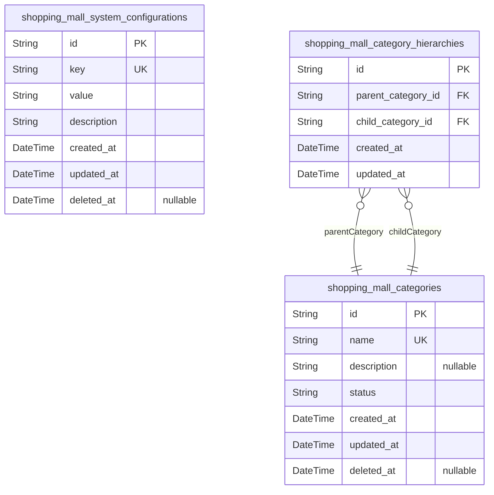
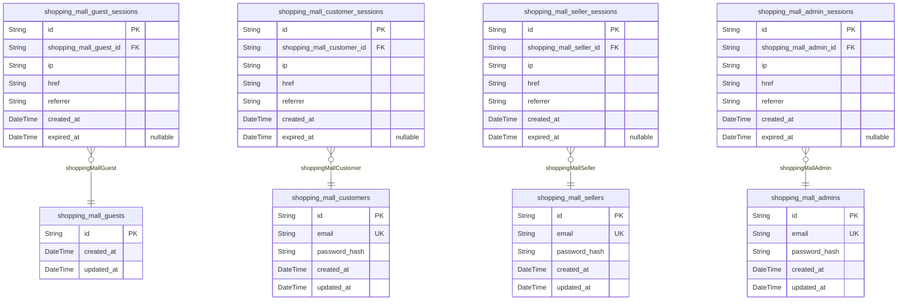
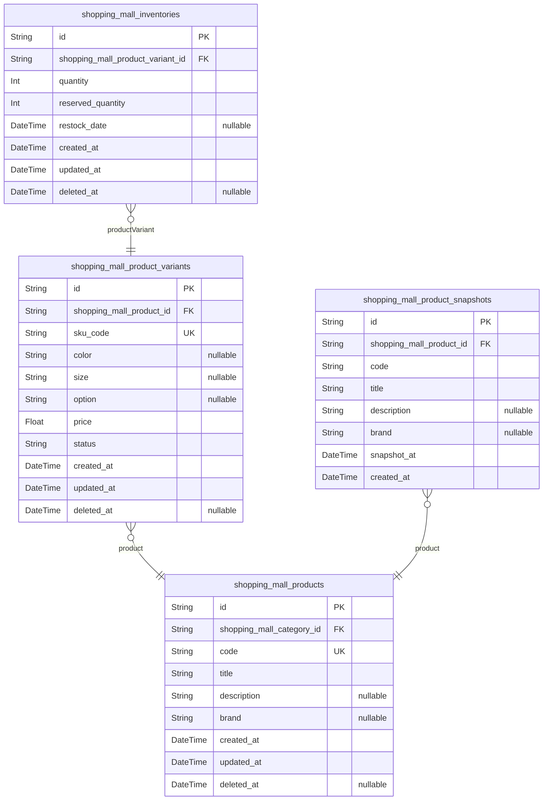
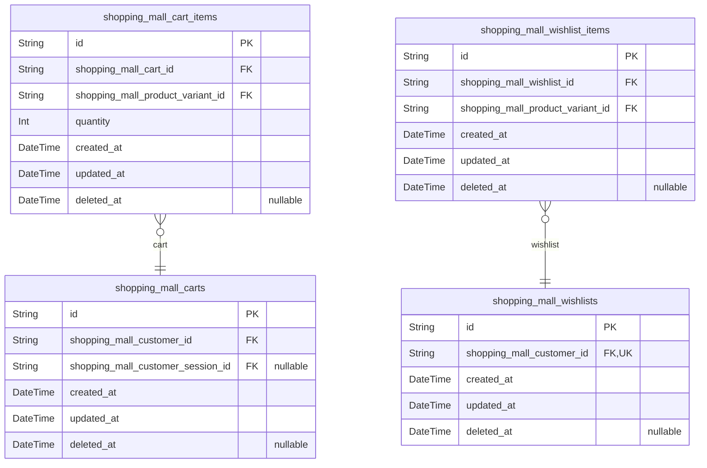
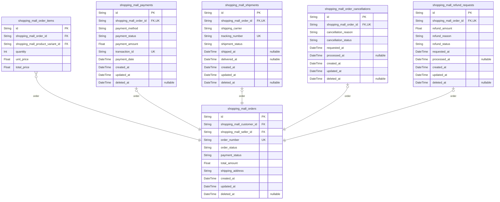
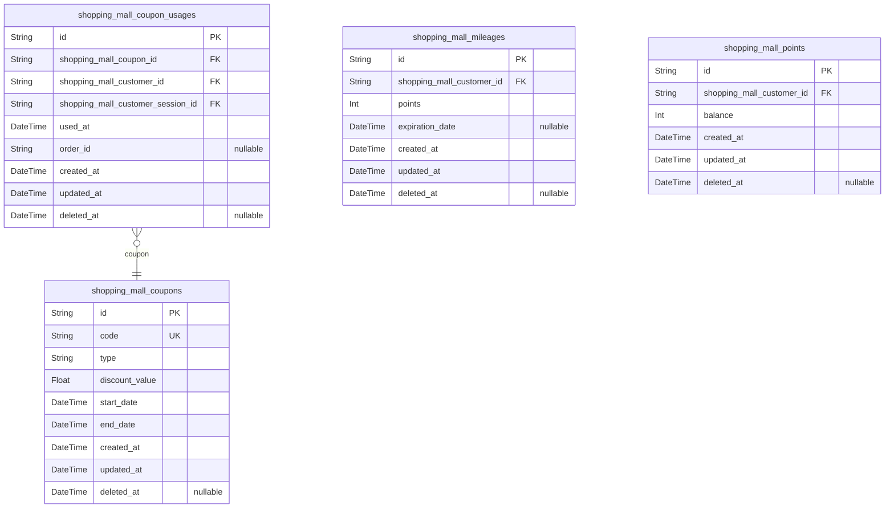
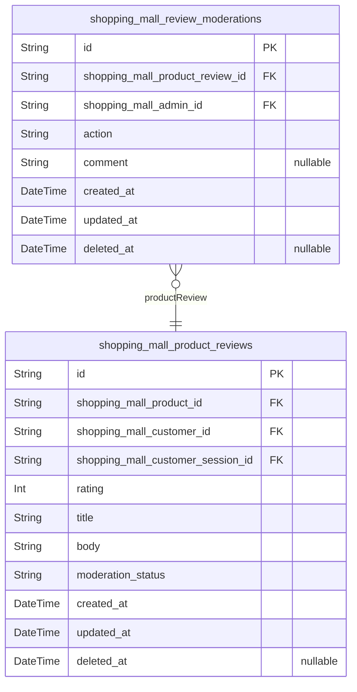
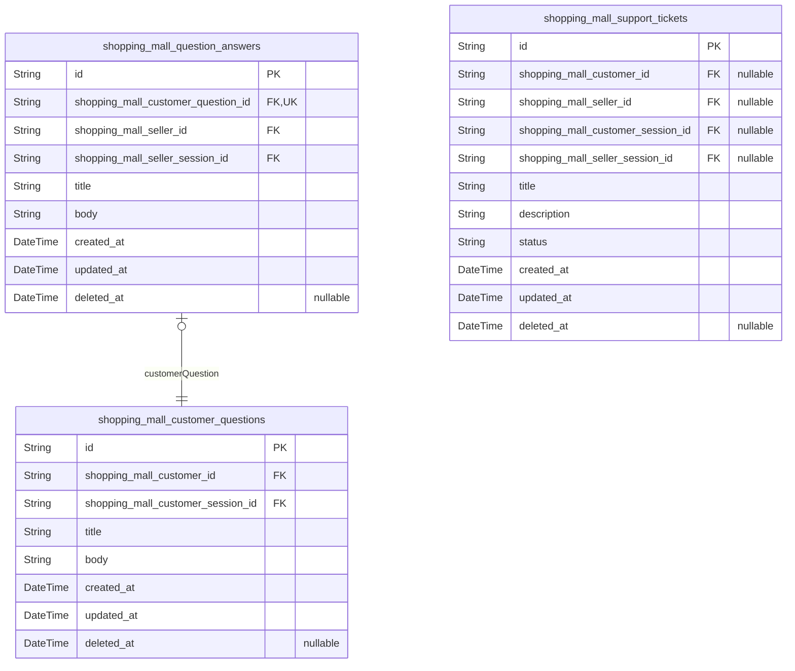
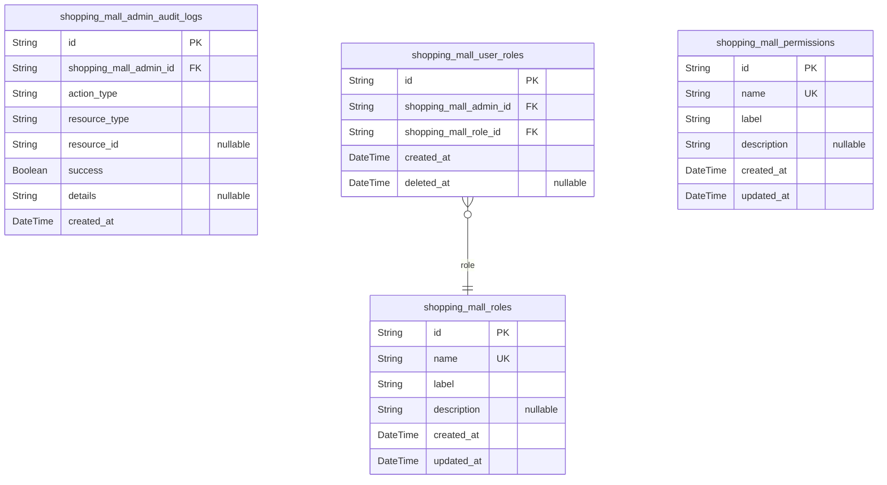
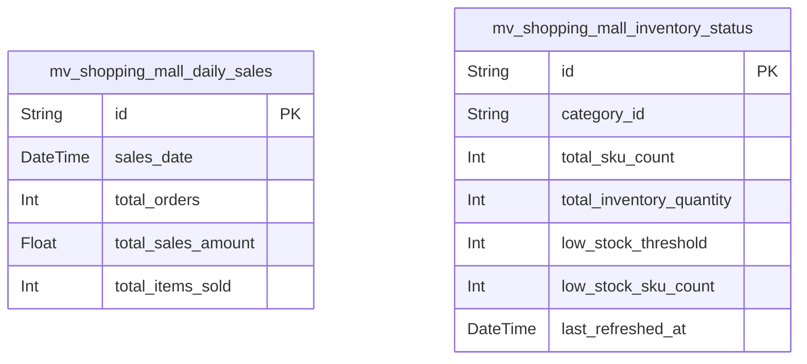

# Prisma Markdown

> Generated by [`prisma-markdown`](https://github.com/samchon/prisma-markdown)

- [Systematic](#systematic)
- [Actors](#actors)
- [Catalog](#catalog)
- [Carts](#carts)
- [Orders](#orders)
- [Promotions](#promotions)
- [Reviews](#reviews)
- [Inquiries](#inquiries)
- [Admin](#admin)
- [default](#default)

## Systematic

```mermaid
erDiagram
"shopping_mall_system_configurations" {
  String id PK
  String key UK
  String value
  String description
  DateTime created_at
  DateTime updated_at
  DateTime deleted_at "nullable"
}
"shopping_mall_categories" {
  String id PK
  String name UK
  String description "nullable"
  String status
  DateTime created_at
  DateTime updated_at
  DateTime deleted_at "nullable"
}
"shopping_mall_category_hierarchies" {
  String id PK
  String parent_category_id FK
  String child_category_id FK
  DateTime created_at
  DateTime updated_at
}
"shopping_mall_category_hierarchies" }o--|| "shopping_mall_categories" : parentCategory
"shopping_mall_category_hierarchies" }o--|| "shopping_mall_categories" : childCategory
```

### `shopping_mall_system_configurations`

System configuration parameters and settings.

Stores key-value pairs representing global system behaviors, feature
toggles, and operational parameters.
Configurations affect platform-wide features and can be edited by
authorized administrators.

Each configuration has a unique key, a value string, a description, and
temporal fields to track changes.
Soft delete supported to allow reversible disabling of settings.

Properties as follows:

- `id`: Primary Key.
- `key`: Unique configuration key identifying the setting.
- `value`: Configuration value stored as a string.
- `description`
  > Detailed description explaining the purpose and usage of this
  > configuration setting.
- `created_at`: Timestamp when the configuration was created.
- `updated_at`: Timestamp when the configuration was last updated.
- `deleted_at`: Timestamp when the configuration was soft deleted; null if active.

### `shopping_mall_categories`

Product categories used for organizing the catalog.

Represents business entities grouping products into meaningful hierarchies.
Categories have names, parent relationship references implicit via
hierarchy table, status for activation, and timestamps.
Soft deletion supported to maintain historical integrity.

Independent entity managed by users and sellers to classify products.

Properties as follows:

- `id`: Primary Key.
- `name`: Category name for business display and filtering.
- `description`: Optional detailed description of the category.
- `status`: Current category status indicating active or inactive state.
- `created_at`: Timestamp when the category was created.
- `updated_at`: Timestamp when the category was last updated.
- `deleted_at`: Timestamp marking soft deletion; null if active.

### `shopping_mall_category_hierarchies`

Links representing hierarchical relationships between categories.

Supports multi-level category trees by connecting parent categories to
child categories.
Maintains referential integrity to ensure the tree structure integrity.

This table is subsidiary and managed via category operations but has its
own record for relationship tracking.

Properties as follows:

- `id`: Primary Key.
- `parent_category_id`
  > Reference to the parent category in the hierarchy. {@link
  > shopping_mall_categories.id}.
- `child_category_id`
  > Reference to the child category in the hierarchy. {@link
  > shopping_mall_categories.id}.
- `created_at`: Timestamp when the hierarchy record was created.
- `updated_at`: Timestamp when the hierarchy record was last updated.

## Actors

```mermaid
erDiagram
"shopping_mall_guests" {
  String id PK
  DateTime created_at
  DateTime updated_at
}
"shopping_mall_customers" {
  String id PK
  String email UK
  String password_hash
  DateTime created_at
  DateTime updated_at
}
"shopping_mall_sellers" {
  String id PK
  String email UK
  String password_hash
  DateTime created_at
  DateTime updated_at
}
"shopping_mall_admins" {
  String id PK
  String email UK
  String password_hash
  DateTime created_at
  DateTime updated_at
}
"shopping_mall_guest_sessions" {
  String id PK
  String shopping_mall_guest_id FK
  String ip
  String href
  String referrer
  DateTime created_at
  DateTime expired_at "nullable"
}
"shopping_mall_customer_sessions" {
  String id PK
  String shopping_mall_customer_id FK
  String ip
  String href
  String referrer
  DateTime created_at
  DateTime expired_at "nullable"
}
"shopping_mall_seller_sessions" {
  String id PK
  String shopping_mall_seller_id FK
  String ip
  String href
  String referrer
  DateTime created_at
  DateTime expired_at "nullable"
}
"shopping_mall_admin_sessions" {
  String id PK
  String shopping_mall_admin_id FK
  String ip
  String href
  String referrer
  DateTime created_at
  DateTime expired_at "nullable"
}
"shopping_mall_guest_sessions" }o--|| "shopping_mall_guests" : shoppingMallGuest
"shopping_mall_customer_sessions" }o--|| "shopping_mall_customers" : shoppingMallCustomer
"shopping_mall_seller_sessions" }o--|| "shopping_mall_sellers" : shoppingMallSeller
"shopping_mall_admin_sessions" }o--|| "shopping_mall_admins" : shoppingMallAdmin
```

### `shopping_mall_guests`

Guest users browsing the e-commerce mall without authentication.

This table stores basic guest session information without login
credentials, enabling temporary tracking and session management.
Guests can browse the catalog but cannot place orders or access personal
data.
Sessions relate to this table for connection tracking.

Properties as follows:

- `id`: Primary Key.
- `created_at`: Record creation timestamp.
- `updated_at`: Last record update timestamp.

### `shopping_mall_customers`

Registered customer users with login credentials for authentication and
shopping.

Customers can manage profiles, multiple shipping addresses, orders,
reviews, and wishlists.
Contains login-related fields with secure password hashing.
Supports session relations to track active logins.

Properties as follows:

- `id`: Primary Key.
- `email`: Unique email address for customer authentication.
- `password_hash`: Hashed password used for customer login.
- `created_at`: Record creation timestamp.
- `updated_at`: Last record update timestamp.

### `shopping_mall_sellers`

Registered seller users managing product listings and order fulfillment.

Sellers authenticate via secure login credentials.
They manage inventories at SKU level and process orders related to their
products.
Sessions track seller login states.

Properties as follows:

- `id`: Primary Key.
- `email`: Unique email address for seller login authentication.
- `password_hash`: Hashed password for seller authentication.
- `created_at`: Record creation timestamp.
- `updated_at`: Last record update timestamp.

### `shopping_mall_admins`

Platform administrators with full permissions to manage users, products,
orders, and platform settings.

Admins have their own login credentials and sessions for audit and security.
Administrators oversee system health, order management, and user moderation.

Properties as follows:

- `id`: Primary Key.
- `email`: Unique email address for administrator login.
- `password_hash`: Hashed password for administrator authentication.
- `created_at`: Record creation timestamp.
- `updated_at`: Last record update timestamp.

### `shopping_mall_guest_sessions`

Session records for guest users connecting to the platform.

Stores connection context such as IP, referrer, and URL for auditing and
diagnostics.
Sessions link to guest users to track multiple concurrent sessions per
guest.

Properties as follows:

- `id`: Primary Key.
- `shopping_mall_guest_id`: Foreign key to guests table. [shopping_mall_guests.id](#shopping_mall_guests)
- `ip`: IP address of the session.
- `href`: Connection URL of the session.
- `referrer`: HTTP referrer header value.
- `created_at`: Session creation timestamp.
- `expired_at`: Session expiration timestamp, nullable if session is active.

### `shopping_mall_customer_sessions`

Session records for customer users managing authenticated connections.

Sessions include IP, referrer, and URL for auditing.
Allows tracking multiple active sessions per customer for security and
analytics.

Properties as follows:

- `id`: Primary Key.
- `shopping_mall_customer_id`: Foreign key to customers table. [shopping_mall_customers.id](#shopping_mall_customers)
- `ip`: IP address of the session.
- `href`: Connection URL of the session.
- `referrer`: HTTP referrer header value.
- `created_at`: Session creation timestamp.
- `expired_at`: Session expiration timestamp, nullable if session is active.

### `shopping_mall_seller_sessions`

Session records for seller users managing authenticated connections.

Contains connection context for auditing.
Supports multiple concurrent seller sessions for security management.

Properties as follows:

- `id`: Primary Key.
- `shopping_mall_seller_id`: Foreign key to sellers table. [shopping_mall_sellers.id](#shopping_mall_sellers)
- `ip`: IP address of the session.
- `href`: Connection URL of the session.
- `referrer`: HTTP referrer header value.
- `created_at`: Session creation timestamp.
- `expired_at`: Session expiration timestamp, nullable if session is active.

### `shopping_mall_admin_sessions`

Session records for administrator users managing platform access.

Sessions track connection context for auditing purposes.
Supports multiple concurrent admin sessions to enhance security and
administration monitoring.

Properties as follows:

- `id`: Primary Key.
- `shopping_mall_admin_id`: Foreign key to admins table. [shopping_mall_admins.id](#shopping_mall_admins)
- `ip`: IP address of the session.
- `href`: Connection URL of the session.
- `referrer`: HTTP referrer header value.
- `created_at`: Session creation timestamp.
- `expired_at`: Session expiration timestamp, nullable if session is active.

## Catalog

```mermaid
erDiagram
"shopping_mall_products" {
  String id PK
  String shopping_mall_category_id FK
  String code UK
  String title
  String description "nullable"
  String brand "nullable"
  DateTime created_at
  DateTime updated_at
  DateTime deleted_at "nullable"
}
"shopping_mall_product_variants" {
  String id PK
  String shopping_mall_product_id FK
  String sku_code UK
  String color "nullable"
  String size "nullable"
  String option "nullable"
  Float price
  String status
  DateTime created_at
  DateTime updated_at
  DateTime deleted_at "nullable"
}
"shopping_mall_inventories" {
  String id PK
  String shopping_mall_product_variant_id FK
  Int quantity
  Int reserved_quantity
  DateTime restock_date "nullable"
  DateTime created_at
  DateTime updated_at
  DateTime deleted_at "nullable"
}
"shopping_mall_product_snapshots" {
  String id PK
  String shopping_mall_product_id FK
  String code
  String title
  String description "nullable"
  String brand "nullable"
  DateTime snapshot_at
  DateTime created_at
}
"shopping_mall_product_variants" }o--|| "shopping_mall_products" : product
"shopping_mall_inventories" }o--|| "shopping_mall_product_variants" : productVariant
"shopping_mall_product_snapshots" }o--|| "shopping_mall_products" : product
```

### `shopping_mall_products`

Product entity representing items offered for sale in the shopping mall.

This table contains basic product information managed by sellers,
including title, description, category reference, and brand details. Each
product may have multiple variants (SKUs) represented in
shopping_mall_product_variants. Soft delete functionality is supported
via deleted_at. Products are linked to categories existing in the catalog
domain.

Consistent temporal tracking is maintained via created_at and updated_at
timestamps.

Properties as follows:

- `id`: Primary Key.
- `shopping_mall_category_id`: Reference to product category. [shopping_mall_categories.id](#shopping_mall_categories).
- `code`: Unique product code for business identification.
- `title`: Product title descriptive name.
- `description`: Detailed product description for customers.
- `brand`: Brand or manufacturer name.
- `created_at`: Record creation timestamp.
- `updated_at`: Record last update timestamp.
- `deleted_at`: Soft deletion timestamp; null if active.

### `shopping_mall_product_variants`

Represents distinct SKUs (product variants) with unique combinations of
attributes such as color, size, and options.

Each variant has its own inventory, pricing, and status independent of
the parent product. The variant references its parent product and
supports soft deletion. Detailed attributes allow for precise customer
selection and inventory management.

This model enables the platform to handle complex product variant
hierarchies consistently.

Properties as follows:

- `id`: Primary Key.
- `shopping_mall_product_id`: Reference to parent product. [shopping_mall_products.id](#shopping_mall_products).
- `sku_code`: Unique SKU code per product variant.
- `color`: Color attribute of the variant.
- `size`: Size attribute of the variant.
- `option`: Additional options (customizable features).
- `price`: Price for this variant.
- `status`: Current availability status (e.g., in stock, discontinued).
- `created_at`: Record creation timestamp.
- `updated_at`: Record last update timestamp.
- `deleted_at`: Soft deletion timestamp; null if active.

### `shopping_mall_inventories`

Inventory records tracking SKU stock levels and availability.

Each inventory entry is associated with a specific product variant (SKU)
and monitors stock quantities, reserved quantities, and restock dates.
Supports soft deletion and temporal tracking for audit purposes.

The inventory system is critical for enforcing stock constraints and
preventing overselling.

Properties as follows:

- `id`: Primary Key.
- `shopping_mall_product_variant_id`: Reference to product variant. [shopping_mall_product_variants.id](#shopping_mall_product_variants).
- `quantity`: Total stock available.
- `reserved_quantity`: Quantity reserved for pending orders.
- `restock_date`: Expected date of next restock.
- `created_at`: Record creation timestamp.
- `updated_at`: Record last update timestamp.
- `deleted_at`: Soft deletion timestamp; null if active.

### `shopping_mall_product_snapshots`

Historical snapshots capturing product data at specific points in time
for audit and versioning.

Stores complete denormalized state of shopping mall products enabling
retrieval of past product details. Snapshots are append-only and
immutable, supporting audit trails and rollback functionality.

This table follows snapshot stance and does not support updates or
deletions.

Properties as follows:

- `id`: Primary Key.
- `shopping_mall_product_id`: Reference to original product. [shopping_mall_products.id](#shopping_mall_products).
- `code`: Product code at snapshot moment.
- `title`: Product title at snapshot moment.
- `description`: Product description at snapshot moment.
- `brand`: Product brand at snapshot moment.
- `snapshot_at`: Timestamp when snapshot was created.
- `created_at`: Record creation timestamp.

## Carts

```mermaid
erDiagram
"shopping_mall_carts" {
  String id PK
  String shopping_mall_customer_id FK
  String shopping_mall_customer_session_id FK "nullable"
  DateTime created_at
  DateTime updated_at
  DateTime deleted_at "nullable"
}
"shopping_mall_cart_items" {
  String id PK
  String shopping_mall_cart_id FK
  String shopping_mall_product_variant_id FK
  Int quantity
  DateTime created_at
  DateTime updated_at
  DateTime deleted_at "nullable"
}
"shopping_mall_wishlists" {
  String id PK
  String shopping_mall_customer_id FK,UK
  DateTime created_at
  DateTime updated_at
  DateTime deleted_at "nullable"
}
"shopping_mall_wishlist_items" {
  String id PK
  String shopping_mall_wishlist_id FK
  String shopping_mall_product_variant_id FK
  DateTime created_at
  DateTime updated_at
  DateTime deleted_at "nullable"
}
"shopping_mall_cart_items" }o--|| "shopping_mall_carts" : cart
"shopping_mall_wishlist_items" }o--|| "shopping_mall_wishlists" : wishlist
```

### `shopping_mall_carts`

Shopping carts representing persistent customer or guest selections of
SKUs intended for purchase.

Each cart belongs to a customer, allowing multiple concurrent carts for
different sessions.
Carts persist across sessions and support soft deletion for audit purposes.

Properties as follows:

- `id`: Primary Key.
- `shopping_mall_customer_id`: Reference to the owning customer. [shopping_mall_customers.id](#shopping_mall_customers).
- `shopping_mall_customer_session_id`
  > Reference to the specific customer session. {@link
  > shopping_mall_customer_sessions.id}.
- `created_at`: Timestamp when the cart was created.
- `updated_at`: Timestamp when the cart was last updated.
- `deleted_at`: Soft deletion timestamp; null if active.

### `shopping_mall_cart_items`

Individual items within a shopping cart representing specific product
SKUs selected by the customer.

Each item references one cart and one product variant. Quantity tracks
the amount desired.
This subsidiary table enables efficient many-to-one relationship from
items to carts.

Properties as follows:

- `id`: Primary Key.
- `shopping_mall_cart_id`: Reference to the owning shopping cart. [shopping_mall_carts.id](#shopping_mall_carts).
- `shopping_mall_product_variant_id`
  > Reference to the selected product variant (SKU). {@link
  > shopping_mall_product_variants.id}.
- `quantity`: Quantity of the SKU selected by the customer.
- `created_at`: Timestamp when the cart item was created.
- `updated_at`: Timestamp when the cart item was last updated.
- `deleted_at`: Soft deletion timestamp; null if active.

### `shopping_mall_wishlists`

Wishlists representing private collections of desired product SKUs saved
by customers for future purchase consideration.

Each wishlist belongs to exactly one customer and can be soft deleted
while maintaining historical records.

Properties as follows:

- `id`: Primary Key.
- `shopping_mall_customer_id`: Reference to the owning customer. [shopping_mall_customers.id](#shopping_mall_customers).
- `created_at`: Timestamp when the wishlist was created.
- `updated_at`: Timestamp when the wishlist was last updated.
- `deleted_at`: Soft deletion timestamp; null if active.

### `shopping_mall_wishlist_items`

Individual items within a wishlist representing customer-selected product
SKUs saved for future purchase.

Each item references one wishlist and one product variant to support
many-to-one normalized relationships.

Properties as follows:

- `id`: Primary Key.
- `shopping_mall_wishlist_id`: Reference to the owning wishlist. [shopping_mall_wishlists.id](#shopping_mall_wishlists).
- `shopping_mall_product_variant_id`
  > Reference to the selected product variant (SKU). {@link
  > shopping_mall_product_variants.id}.
- `created_at`: Timestamp when the wishlist item was created.
- `updated_at`: Timestamp when the wishlist item was last updated.
- `deleted_at`: Soft deletion timestamp; null if active.

## Orders

```mermaid
erDiagram
"shopping_mall_orders" {
  String id PK
  String shopping_mall_customer_id FK
  String shopping_mall_seller_id FK
  String order_number UK
  String order_status
  String payment_status
  Float total_amount
  String shipping_address
  DateTime created_at
  DateTime updated_at
  DateTime deleted_at "nullable"
}
"shopping_mall_order_items" {
  String id PK
  String shopping_mall_order_id FK
  String shopping_mall_product_variant_id FK
  Int quantity
  Float unit_price
  Float total_price
}
"shopping_mall_payments" {
  String id PK
  String shopping_mall_order_id FK,UK
  String payment_method
  String payment_status
  Float payment_amount
  String transaction_id UK
  DateTime payment_date
  DateTime created_at
  DateTime updated_at
  DateTime deleted_at "nullable"
}
"shopping_mall_shipments" {
  String id PK
  String shopping_mall_order_id FK,UK
  String shipping_carrier
  String tracking_number UK
  String shipment_status
  DateTime shipped_at "nullable"
  DateTime delivered_at "nullable"
  DateTime created_at
  DateTime updated_at
  DateTime deleted_at "nullable"
}
"shopping_mall_order_cancellations" {
  String id PK
  String shopping_mall_order_id FK,UK
  String cancellation_reason
  String cancellation_status
  DateTime requested_at
  DateTime processed_at "nullable"
  DateTime created_at
  DateTime updated_at
  DateTime deleted_at "nullable"
}
"shopping_mall_refund_requests" {
  String id PK
  String shopping_mall_order_id FK,UK
  Float refund_amount
  String refund_reason
  String refund_status
  DateTime requested_at
  DateTime processed_at "nullable"
  DateTime created_at
  DateTime updated_at
  DateTime deleted_at "nullable"
}
"shopping_mall_order_items" }o--|| "shopping_mall_orders" : order
"shopping_mall_payments" |o--|| "shopping_mall_orders" : order
"shopping_mall_shipments" |o--|| "shopping_mall_orders" : order
"shopping_mall_order_cancellations" |o--|| "shopping_mall_orders" : order
"shopping_mall_refund_requests" |o--|| "shopping_mall_orders" : order
```

### `shopping_mall_orders`

Order entities representing customer purchase transactions.

Stores key business data such as customer, seller, payment, and order
status with lifecycle timestamps.
Each order references the customer placing it and the seller fulfilling it.
Includes soft delete support to maintain audit trail integrity.

Properties as follows:

- `id`: Primary Key.
- `shopping_mall_customer_id`: Customer who placed the order. [shopping_mall_customers.id](#shopping_mall_customers).
- `shopping_mall_seller_id`: Seller responsible for fulfillment. [shopping_mall_sellers.id](#shopping_mall_sellers).
- `order_number`: Unique order reference number for business tracking.
- `order_status`: Current status of the order indicating lifecycle phase.
- `payment_status`: Status of the payment associated with the order.
- `total_amount`: Total monetary amount of the order including taxes and shipping.
- `shipping_address`: Serialized shipping address at the time of order placement.
- `created_at`: Order creation timestamp.
- `updated_at`: Last update timestamp for the order.
- `deleted_at`: Optional soft delete timestamp to mark order as deleted.

### `shopping_mall_order_items`

Order items representing purchased product variants (SKUs) within an order.

Each item links to the product variant and the parent order.
Captures quantity and pricing information used for fulfillment and
invoicing.

Properties as follows:

- `id`: Primary Key.
- `shopping_mall_order_id`: Reference to the parent order. [shopping_mall_orders.id](#shopping_mall_orders).
- `shopping_mall_product_variant_id`
  > Purchased product variant (SKU). {@link
  > shopping_mall_product_variants.id}.
- `quantity`: Quantity of the product variant purchased.
- `unit_price`: Price per unit for this SKU at purchase time.
- `total_price`: Total price for this line item (quantity multiplied by unit price).

### `shopping_mall_payments`

Payment records associated with orders.

Tracks payment method, status, amounts, and timestamps.
Payments are linked uniquely to orders ensuring one-to-one relationship.

Properties as follows:

- `id`: Primary Key.
- `shopping_mall_order_id`: Order associated with this payment. [shopping_mall_orders.id](#shopping_mall_orders).
- `payment_method`: Method of payment used by the customer (e.g., credit card, PayPal).
- `payment_status`: Status of the payment transaction.
- `payment_amount`: Amount paid in this transaction.
- `transaction_id`: External payment gateway transaction identifier.
- `payment_date`: Timestamp of when the payment was processed.
- `created_at`: Record creation timestamp.
- `updated_at`: Record last update timestamp.
- `deleted_at`: Soft delete timestamp.

### `shopping_mall_shipments`

Shipment records tracking the shipping process of orders.

Stores shipping carrier, tracking codes, delivery status, and timestamps.
Each shipment relates to a single order for lifecycle tracking.

Properties as follows:

- `id`: Primary Key.
- `shopping_mall_order_id`: Order being shipped. [shopping_mall_orders.id](#shopping_mall_orders).
- `shipping_carrier`: Name of the shipping carrier handling delivery.
- `tracking_number`: Carrier tracking number for shipment.
- `shipment_status`: Current status of the shipment.
- `shipped_at`: Timestamp when the shipment was dispatched.
- `delivered_at`: Timestamp when the shipment was delivered.
- `created_at`: Record creation timestamp.
- `updated_at`: Record last update timestamp.
- `deleted_at`: Soft delete timestamp.

### `shopping_mall_order_cancellations`

Order cancellation requests submitted by customers.

Tracks request status and reasons with timestamps.
Referenced orders are those that customers want to cancel before
fulfillment.

Properties as follows:

- `id`: Primary Key.
- `shopping_mall_order_id`
  > Order for which cancellation is requested. {@link
  > shopping_mall_orders.id}.
- `cancellation_reason`: Customer-provided reason for cancellation.
- `cancellation_status`: Status of the cancellation request.
- `requested_at`: Timestamp when cancellation was requested.
- `processed_at`: Timestamp when cancellation was processed.
- `created_at`: Record creation timestamp.
- `updated_at`: Record last update timestamp.
- `deleted_at`: Soft delete timestamp.

### `shopping_mall_refund_requests`

Refund requests made by customers for orders post-payment.

Tracks refund amount, reason, status, and related timestamps.
Linked to orders that have completed payment but may require refund
processing.

Properties as follows:

- `id`: Primary Key.
- `shopping_mall_order_id`: Order associated with the refund request. [shopping_mall_orders.id](#shopping_mall_orders).
- `refund_amount`: Amount requested for refund.
- `refund_reason`: Reason provided for requesting refund.
- `refund_status`: Current status of the refund request.
- `requested_at`: Timestamp when refund was requested.
- `processed_at`: Timestamp when refund was processed.
- `created_at`: Record creation timestamp.
- `updated_at`: Record last update timestamp.
- `deleted_at`: Soft delete timestamp.

## Promotions

```mermaid
erDiagram
"shopping_mall_coupons" {
  String id PK
  String code UK
  String type
  Float discount_value
  DateTime start_date
  DateTime end_date
  DateTime created_at
  DateTime updated_at
  DateTime deleted_at "nullable"
}
"shopping_mall_coupon_usages" {
  String id PK
  String shopping_mall_coupon_id FK
  String shopping_mall_customer_id FK
  String shopping_mall_customer_session_id FK
  DateTime used_at
  String order_id "nullable"
  DateTime created_at
  DateTime updated_at
  DateTime deleted_at "nullable"
}
"shopping_mall_mileages" {
  String id PK
  String shopping_mall_customer_id FK
  Int points
  DateTime expiration_date "nullable"
  DateTime created_at
  DateTime updated_at
  DateTime deleted_at "nullable"
}
"shopping_mall_points" {
  String id PK
  String shopping_mall_customer_id FK
  Int balance
  DateTime created_at
  DateTime updated_at
  DateTime deleted_at "nullable"
}
"shopping_mall_coupon_usages" }o--|| "shopping_mall_coupons" : coupon
```

### `shopping_mall_coupons`

Coupon definitions for promotional campaigns.

Represents coupons issued by the shopping mall platform to provide
discounts or benefits to customers. Each coupon has unique code, type,
discount details and validity period. Coupons can be standalone or
associated with certain product categories or sellers.

Coupons support soft deletion to allow recovery and auditing.

Properties as follows:

- `id`: Primary key.
- `code`: Unique code identifying the coupon for redemption.
- `type`: Type of coupon, e.g., percentage discount, fixed amount, free shipping.
- `discount_value`: Value of the discount applied when the coupon is used.
- `start_date`: Start date and time from which the coupon is valid.
- `end_date`: End date and time until which the coupon is valid.
- `created_at`: Timestamp when this coupon was created.
- `updated_at`: Timestamp when this coupon was last updated.
- `deleted_at`: Timestamp marking soft deletion of the coupon; null if active.

### `shopping_mall_coupon_usages`

Records each usage of coupons by customers.

Tracks coupon redemptions by customers, including associated customer and
session information, usage timestamp, and any order linkage. Ensures
auditability of coupon consumption and prevents abuse.

Supports soft deletion for historical correction and auditing.

Properties as follows:

- `id`: Primary key.
- `shopping_mall_coupon_id`: Reference to the coupon that was used. [shopping_mall_coupons.id](#shopping_mall_coupons).
- `shopping_mall_customer_id`
  > Reference to the customer who used the coupon. {@link
  > shopping_mall_customers.id}.
- `shopping_mall_customer_session_id`
  > Reference to the customer's session during coupon usage. {@link
  > shopping_mall_customer_sessions.id}.
- `used_at`: Timestamp when the coupon usage occurred.
- `order_id`
  > Associated order ID if coupon usage is linked to a specific order; null
  > otherwise.
- `created_at`: Timestamp when the usage record was created.
- `updated_at`: Timestamp when the usage record was last updated.
- `deleted_at`: Timestamp marking soft deletion of the usage; null if active.

### `shopping_mall_mileages`

Tracks customer mileage points for reward programs.

Stores mileage points accumulated by customers through purchases and
activities. Mileages can be redeemed for discounts or benefits. Supports
expiration tracking and audit trail.

Supports soft deletion for records management and auditing.

Properties as follows:

- `id`: Primary key.
- `shopping_mall_customer_id`
  > Reference to the customer owning the mileage. {@link
  > shopping_mall_customers.id}.
- `points`: Number of mileage points accumulated.
- `expiration_date`: Optional expiration date for this mileage; null if no expiration.
- `created_at`: Timestamp when this mileage record was created.
- `updated_at`: Timestamp when this mileage record was last updated.
- `deleted_at`: Timestamp marking soft deletion; null if active.

### `shopping_mall_points`

Tracks customer point balances for loyalty rewards.

Represents points credited to customers as part of loyalty or promotional
programs. Points can be redeemed or adjusted. Maintains audit trail and
soft deletion for management.

Properties as follows:

- `id`: Primary key.
- `shopping_mall_customer_id`
  > Reference to the customer owning these points. {@link
  > shopping_mall_customers.id}.
- `balance`: Current point balance for the customer.
- `created_at`: Timestamp when this point record was created.
- `updated_at`: Timestamp when this point record was last updated.
- `deleted_at`: Timestamp marking soft deletion; null if active.

## Reviews

```mermaid
erDiagram
"shopping_mall_product_reviews" {
  String id PK
  String shopping_mall_product_id FK
  String shopping_mall_customer_id FK
  String shopping_mall_customer_session_id FK
  Int rating
  String title
  String body
  String moderation_status
  DateTime created_at
  DateTime updated_at
  DateTime deleted_at "nullable"
}
"shopping_mall_review_moderations" {
  String id PK
  String shopping_mall_product_review_id FK
  String shopping_mall_admin_id FK
  String action
  String comment "nullable"
  DateTime created_at
  DateTime updated_at
  DateTime deleted_at "nullable"
}
"shopping_mall_review_moderations" }o--|| "shopping_mall_product_reviews" : productReview
```

### `shopping_mall_product_reviews`

Customer-submitted product reviews capturing star ratings and textual
feedback.

Each review is linked to a specific product and authoring customer
through their active session to ensure authenticity and auditability.
Moderation status is tracked to control review publication.

Soft deletion is supported to enable content management and compliance
without data loss.

Properties as follows:

- `id`: Primary Key.
- `shopping_mall_product_id`: Reviewed product. [shopping_mall_products.id](#shopping_mall_products).
- `shopping_mall_customer_id`: Review author customer. [shopping_mall_customers.id](#shopping_mall_customers).
- `shopping_mall_customer_session_id`
  > Author customer session at review time. {@link
  > shopping_mall_customer_sessions.id}.
- `rating`: Star rating given by the customer, typically 1 to 5 stars.
- `title`: Short summary headline describing the review content.
- `body`: Detailed textual review provided by the customer.
- `moderation_status`: Current moderation status: pending, approved, rejected.
- `created_at`: Review creation timestamp.
- `updated_at`: Last modification timestamp of the review.
- `deleted_at`: Soft deletion timestamp, null if not deleted.

### `shopping_mall_review_moderations`

Moderation records for product reviews to enforce content guidelines and
compliance.

Each entry references a specific review and records the moderator admin
who performed the action, the action taken, and any relevant comments.

Soft deletion is supported to allow audit trails while maintaining
historical data integrity.

Properties as follows:

- `id`: Primary Key.
- `shopping_mall_product_review_id`
  > The product review being moderated. {@link
  > shopping_mall_product_reviews.id}.
- `shopping_mall_admin_id`
  > Admin who performed the moderation action. {@link
  > shopping_mall_admins.id}.
- `action`: Moderation action taken, e.g., approved, rejected, flagged.
- `comment`: Optional comment explaining the moderation decision.
- `created_at`: Timestamp when the moderation action was performed.
- `updated_at`: Timestamp of the last update on this moderation record.
- `deleted_at`: Soft deletion timestamp, null if not deleted.

## Inquiries

```mermaid
erDiagram
"shopping_mall_customer_questions" {
  String id PK
  String shopping_mall_customer_id FK
  String shopping_mall_customer_session_id FK
  String title
  String body
  DateTime created_at
  DateTime updated_at
  DateTime deleted_at "nullable"
}
"shopping_mall_question_answers" {
  String id PK
  String shopping_mall_customer_question_id FK,UK
  String shopping_mall_seller_id FK
  String shopping_mall_seller_session_id FK
  String title
  String body
  DateTime created_at
  DateTime updated_at
  DateTime deleted_at "nullable"
}
"shopping_mall_support_tickets" {
  String id PK
  String shopping_mall_customer_id FK "nullable"
  String shopping_mall_seller_id FK "nullable"
  String shopping_mall_customer_session_id FK "nullable"
  String shopping_mall_seller_session_id FK "nullable"
  String title
  String description
  String status
  DateTime created_at
  DateTime updated_at
  DateTime deleted_at "nullable"
}
"shopping_mall_question_answers" |o--|| "shopping_mall_customer_questions" : customerQuestion
```

### `shopping_mall_customer_questions`

Customer questions related to shopping mall products and orders.

Stores inquiries submitted by customers seeking information about
products or orders. Each question is linked to the customer who asked it
and their active session.

Questions can have one associated answer from sellers, maintained
separately for independent lifecycle tracking.
Soft deletion is supported to facilitate moderation and auditing.

This entity enables customer support workflows and Q&A content management.

Properties as follows:

- `id`: Primary key.
- `shopping_mall_customer_id`
  > Reference to the customer who asked the question. {@link
  > shopping_mall_customers.id}.
- `shopping_mall_customer_session_id`
  > Reference to the customer's active session when asking the question.
  > [shopping_mall_customer_sessions.id](#shopping_mall_customer_sessions)
- `title`: The title or summary of the question content.
- `body`: Detailed body text of the customer's question.
- `created_at`: Timestamp when the question was created.
- `updated_at`: Timestamp when the question was last updated.
- `deleted_at`: Timestamp when the question was soft deleted, if applicable.

### `shopping_mall_question_answers`

Answers provided by sellers in response to customer questions.

Each answer is linked to a specific customer question and created by an
authenticated seller. This separation allows independent lifecycle
management, including creation, updates, and soft deletion.

One-to-one relationship enforced by unique foreign key to the question.

Supports audit trails and enables efficient moderation of seller responses.

Properties as follows:

- `id`: Primary key.
- `shopping_mall_customer_question_id`
  > Reference to the customer question answered. {@link
  > shopping_mall_customer_questions.id}.
- `shopping_mall_seller_id`
  > Reference to the seller who answered the question. {@link
  > shopping_mall_sellers.id}.
- `shopping_mall_seller_session_id`
  > Reference to the seller's active session when providing the answer.
  > [shopping_mall_seller_sessions.id](#shopping_mall_seller_sessions)
- `title`: The title or headline of the answer.
- `body`: Detailed body text of the seller's answer.
- `created_at`: Timestamp when the answer was created.
- `updated_at`: Timestamp when the answer was last updated.
- `deleted_at`: Timestamp when the answer was soft deleted, if applicable.

### `shopping_mall_support_tickets`

Support tickets submitted by customers or sellers regarding various issues.

This entity tracks support requests including their status and handling
workflow. Tickets are associated with the submitter, either customer or
seller, and include session context.

Supports status management for ticket tracking, audit for responses, and
soft deletion for moderation.

Enables customer support management and resolution tracking within the
shopping mall platform.

Properties as follows:

- `id`: Primary key.
- `shopping_mall_customer_id`
  > Reference to the customer who submitted the ticket, if applicable. {@link
  > shopping_mall_customers.id}.
- `shopping_mall_seller_id`
  > Reference to the seller who submitted the ticket, if applicable. {@link
  > shopping_mall_sellers.id}.
- `shopping_mall_customer_session_id`
  > Customer session during ticket submission, if applicable. {@link
  > shopping_mall_customer_sessions.id}.
- `shopping_mall_seller_session_id`
  > Seller session during ticket submission, if applicable. {@link
  > shopping_mall_seller_sessions.id}
- `title`: Subject or summary of the support ticket.
- `description`: Detailed explanation of the issue or request.
- `status`: Current status of the ticket (e.g. open, in_progress, resolved, closed).
- `created_at`: Timestamp when the ticket was created.
- `updated_at`: Timestamp when the ticket was last updated.
- `deleted_at`: Timestamp when the ticket was soft deleted, if applicable.

## Admin

```mermaid
erDiagram
"shopping_mall_admin_audit_logs" {
  String id PK
  String shopping_mall_admin_id FK
  String action_type
  String resource_type
  String resource_id "nullable"
  Boolean success
  String details "nullable"
  DateTime created_at
}
"shopping_mall_roles" {
  String id PK
  String name UK
  String label
  String description "nullable"
  DateTime created_at
  DateTime updated_at
}
"shopping_mall_user_roles" {
  String id PK
  String shopping_mall_admin_id FK
  String shopping_mall_role_id FK
  DateTime created_at
  DateTime deleted_at "nullable"
}
"shopping_mall_permissions" {
  String id PK
  String name UK
  String label
  String description "nullable"
  DateTime created_at
  DateTime updated_at
}
"shopping_mall_user_roles" }o--|| "shopping_mall_roles" : role
```

### `shopping_mall_admin_audit_logs`

Administrator actions audit logs capturing detailed, immutable records of
administrative operations for security, compliance, and traceability.

Each log entry records the acting admin, the type of action performed,
affected resources, success or failure status, and timestamps. This
facilitates forensic analysis and audit trails across the platform.

The model ensures historical integrity by disallowing updates or
deletions of log entries.

Properties as follows:

- `id`: Primary Key.
- `shopping_mall_admin_id`
  > Reference to the administrator who performed the action. {@link
  > shopping_mall_admins.id}.
- `action_type`
  > The type of action performed by the admin (e.g., CREATE_USER,
  > DELETE_PRODUCT).
- `resource_type`: Type of resource affected by the action (e.g., user, product, order).
- `resource_id`: Identifier of the affected resource, if applicable.
- `success`: Indicates whether the action was successful.
- `details`
  > Additional JSON-formatted details about the action for context and
  > diagnostics.
- `created_at`: Timestamp when the audit log entry was created.

### `shopping_mall_roles`

System roles defining sets of permissions for access control within the
shopping mall platform.

Roles enable grouping of privileges and facilitate scalable management of
user rights and administrative capabilities.

Roles have unique names and descriptive labels to clearly denote their
purpose and scope.

Properties as follows:

- `id`: Primary Key.
- `name`: Unique role identifier name used internally.
- `label`: Human-readable label describing the role's purpose.
- `description`: Detailed description of the role's permissions and context.
- `created_at`: Timestamp when the role was created.
- `updated_at`: Timestamp when the role was last updated.

### `shopping_mall_user_roles`

Mapping of users to roles establishing user permissions within the
shopping mall platform.

Each record indicates a specific role assigned to a user (administrator).

Supports the management of multiple roles per user and enables effective
role-based access control.

Soft deletion allows temporary deactivation of role assignments without
losing history.

Properties as follows:

- `id`: Primary Key.
- `shopping_mall_admin_id`: Reference to the administrator user. [shopping_mall_admins.id](#shopping_mall_admins).
- `shopping_mall_role_id`: Reference to the role assigned. [shopping_mall_roles.id](#shopping_mall_roles).
- `created_at`: Timestamp when the role was assigned.
- `deleted_at`: Soft deletion timestamp to mark inactive role assignments.

### `shopping_mall_permissions`

Permissions defining granular access rights within the shopping mall
backend.

Each permission entry includes a unique name, label, and detailed
description.

Permissions are assigned to roles or users to enforce access control
policies consistently and flexibly.

This enables fine-grained authorization across the platform's
administrative functions.

Properties as follows:

- `id`: Primary Key.
- `name`: Unique permission identifier for internal use.
- `label`: Human-readable label describing the permission.
- `description`: Detailed description about the scope and usage of the permission.
- `created_at`: Timestamp when the permission was created.
- `updated_at`: Timestamp when the permission was last updated.

## default

```mermaid
erDiagram
"mv_shopping_mall_daily_sales" {
  String id PK
  DateTime sales_date
  Int total_orders
  Float total_sales_amount
  Int total_items_sold
}
"mv_shopping_mall_inventory_status" {
  String id PK
  String category_id
  Int total_sku_count
  Int total_inventory_quantity
  Int low_stock_threshold
  Int low_stock_sku_count
  DateTime last_refreshed_at
}
```

### `mv_shopping_mall_daily_sales`

Daily sales summary materialized view for the entire shopping mall platform.

Provides aggregated transactional sales data including total sales
amounts, number of orders, and total items sold per day. This view
enables fast analytics and reporting on daily performance trends,
supporting business decision making and operational monitoring.

This table is automatically refreshed regularly and optimized for
read-heavy queries. It is a read-only materialized view that denormalizes
multiple transactional tables into a single snapshot for speed.

Properties as follows:

- `id`: Primary key unique to each daily sales summary record.
- `sales_date`: The date representing the sales reporting day in ISO 8601 format.
- `total_orders`: Total number of orders placed on the sales date.
- `total_sales_amount`: Sum of all sales amounts (currency units) for the day.
- `total_items_sold`: Total count of product items sold across all orders on that day.

### `mv_shopping_mall_inventory_status`

Current inventory status materialized view providing aggregated SKU
inventory information across the entire mall.

This view consolidates inventory levels, low stock alerts, and SKU counts
per product category to facilitate monitoring and stock management
decisions. It enables efficient querying of inventory health and trends
without requiring joins to multiple base tables.

As a materialized view, it is optimized for fast read operations and is
periodically refreshed from transactional inventory data.

Properties as follows:

- `id`: Primary key unique to individual inventory status records.
- `category_id`
  > Identifier of the product category this inventory summary record belongs
  > to. [shopping_mall_categories.id](#shopping_mall_categories).
- `total_sku_count`: Total number of distinct SKUs under the product category.
- `total_inventory_quantity`
  > Aggregate quantity of all SKU items available in stock within the
  > category.
- `low_stock_threshold`: SKU inventory level considered low stock threshold for alerting.
- `low_stock_sku_count`
  > Number of SKUs currently below the low stock threshold within this
  > category.
- `last_refreshed_at`: Timestamp when this materialized view was last refreshed.
