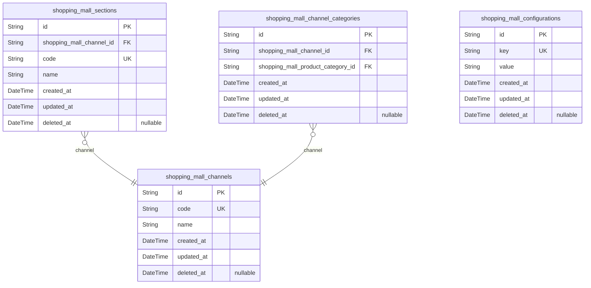
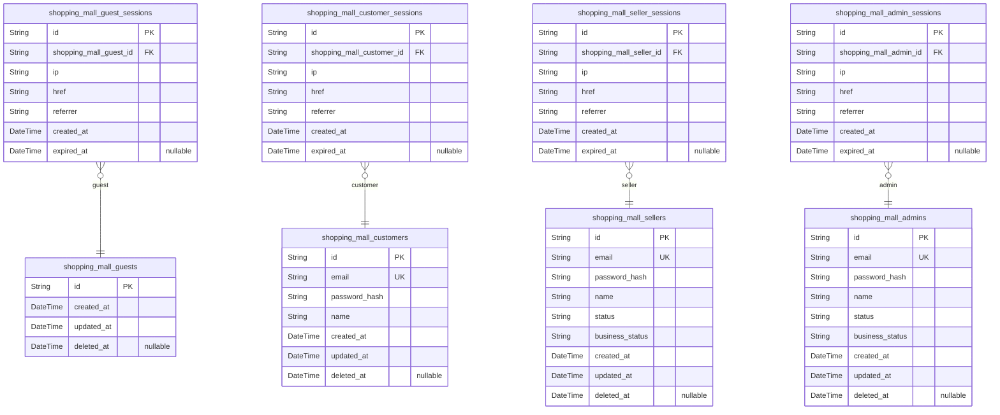
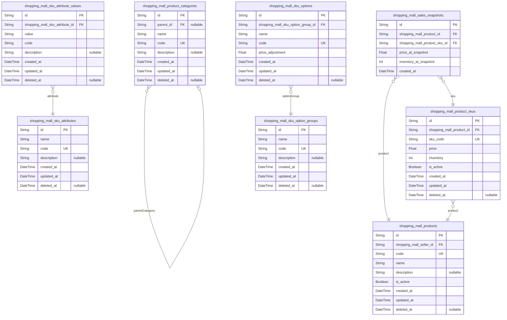
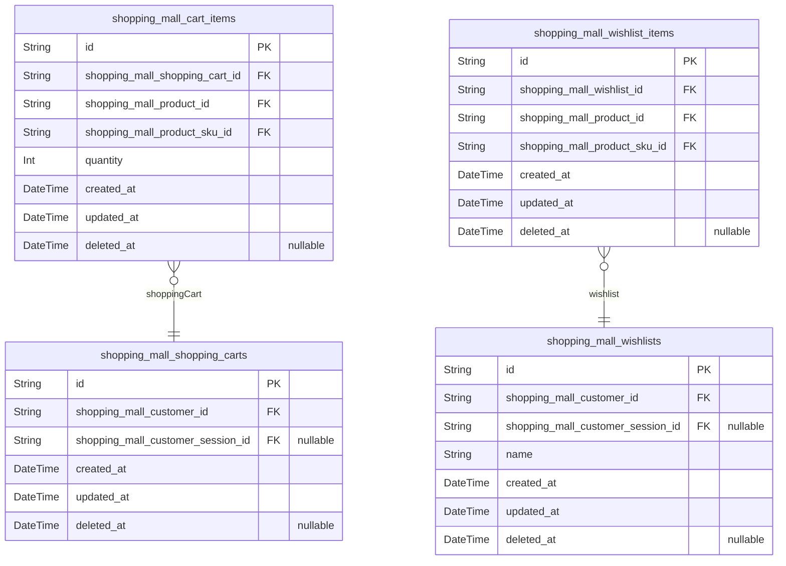
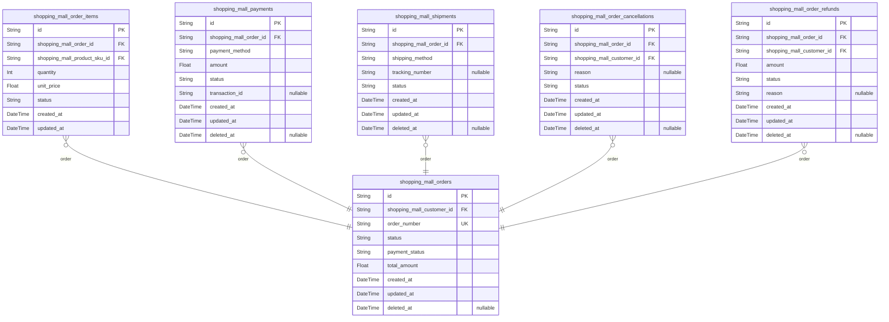
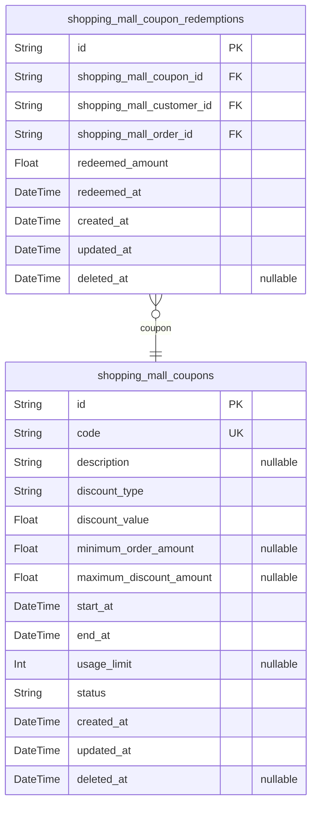
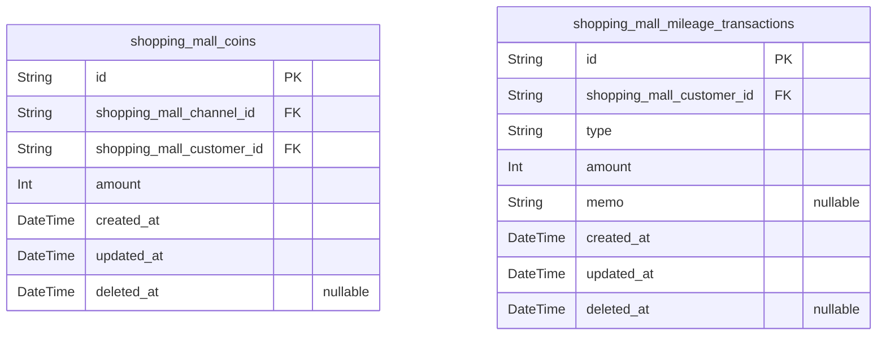
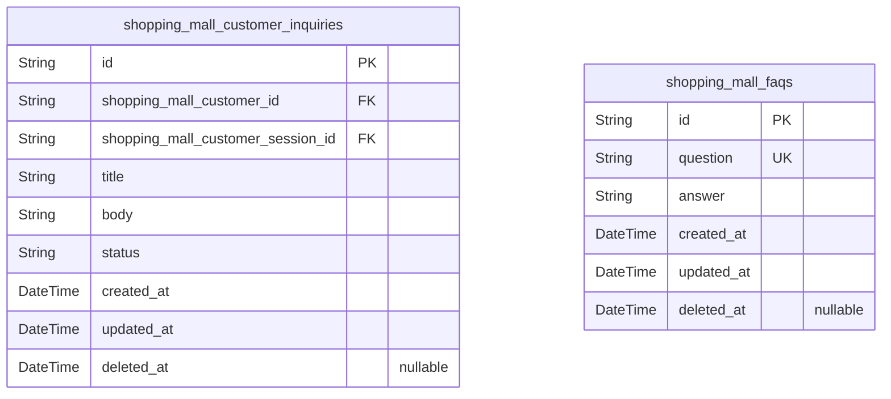
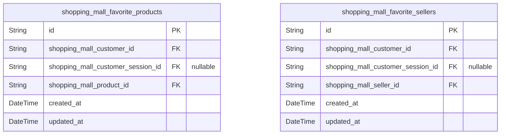
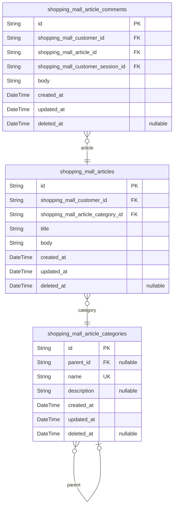

# Prisma Markdown

> Generated by [`prisma-markdown`](https://github.com/samchon/prisma-markdown)

- [Systematic](#systematic)
- [Actors](#actors)
- [Sales](#sales)
- [Carts](#carts)
- [Orders](#orders)
- [Coupons](#coupons)
- [Coins](#coins)
- [Inquiries](#inquiries)
- [Favorites](#favorites)
- [Articles](#articles)

## Systematic

```mermaid
erDiagram
"shopping_mall_channels" {
  String id PK
  String code UK
  String name
  DateTime created_at
  DateTime updated_at
  DateTime deleted_at "nullable"
}
"shopping_mall_sections" {
  String id PK
  String shopping_mall_channel_id FK
  String code UK
  String name
  DateTime created_at
  DateTime updated_at
  DateTime deleted_at "nullable"
}
"shopping_mall_channel_categories" {
  String id PK
  String shopping_mall_channel_id FK
  String shopping_mall_product_category_id FK
  DateTime created_at
  DateTime updated_at
  DateTime deleted_at "nullable"
}
"shopping_mall_configurations" {
  String id PK
  String key UK
  String value
  DateTime created_at
  DateTime updated_at
  DateTime deleted_at "nullable"
}
"shopping_mall_sections" }o--|| "shopping_mall_channels" : channel
"shopping_mall_channel_categories" }o--|| "shopping_mall_channels" : channel
```

### `shopping_mall_channels`

Channels represent the main entry points or marketplaces within the
e-commerce platform.

Each channel defines its unique code and display name, enabling clear
identification and management within the system.

Channels serve as organizational units that link to specific sections and
categories to structure the shopping experience.

Soft deletion is supported to retain historical records while allowing
content moderation and administrative control.

Properties as follows:

- `id`: Primary Key.
- `code`
  > Unique code identifying the channel, used for internal system references
  > and API routing.
- `name`: Display name of the channel as presented to customers and administrators.
- `created_at`: Timestamp when the channel record was created.
- `updated_at`: Timestamp when the channel record was last updated.
- `deleted_at`: Timestamp when the channel record was soft deleted; null if active.

### `shopping_mall_sections`

Sections represent subdivisions or areas within a channel that group
related categories and products.

Each section belongs to a single channel and serves to organize offerings
logically for improved navigation and management.

Sections have unique codes within the system and support soft deletion
for administrative purposes.

They track creation and update timestamps to support auditing and
operational history.

Properties as follows:

- `id`: Primary Key.
- `shopping_mall_channel_id`
  > Reference to the channel to which this section belongs. {@link
  > shopping_mall_channels.id}.
- `code`: Unique code identifying the section for internal use and API access.
- `name`
  > Display name of the section to show in the administrative interfaces and
  > to customers.
- `created_at`: Timestamp when the section was created.
- `updated_at`: Timestamp when the section was last updated.
- `deleted_at`: Soft delete timestamp; null when the section is active.

### `shopping_mall_channel_categories`

Channel categories link specific categories to channels, defining the
category organization within a particular channel context.

Each category linked to a channel may influence navigation, filtering,
and presentation of products within that channel.

This table supports soft deletion to allow removal without losing
historical relationships.

Timestamps track creation and update events for audit trails and system
operations.

Properties as follows:

- `id`: Primary Key.
- `shopping_mall_channel_id`: Reference to the shopping mall channel. [shopping_mall_channels.id](#shopping_mall_channels).
- `shopping_mall_product_category_id`
  > Reference to product category associated with this channel category.
  > [shopping_mall_product_categories.id](#shopping_mall_product_categories).
- `created_at`: Timestamp when the channel category record was created.
- `updated_at`: Timestamp of last update to this record.
- `deleted_at`: Soft deletion timestamp; null means active.

### `shopping_mall_configurations`

Configurations store key-value pairs representing system-wide settings
and preferences.

Each configuration entry has a unique key to prevent duplicates and
ensure unambiguous retrieval.

Configurations can be soft deleted to allow deactivation without data loss.

Timestamps for creation and updates are maintained for auditing and
change tracking.

Properties as follows:

- `id`: Primary Key.
- `key`: Unique identifier key for the configuration setting.
- `value`: Configuration value as a string. Interpretation is context-dependent.
- `created_at`: Record creation timestamp.
- `updated_at`: Last modification timestamp.
- `deleted_at`: Soft delete timestamp; null when configuration is active.

## Actors

```mermaid
erDiagram
"shopping_mall_guests" {
  String id PK
  DateTime created_at
  DateTime updated_at
  DateTime deleted_at "nullable"
}
"shopping_mall_guest_sessions" {
  String id PK
  String shopping_mall_guest_id FK
  String ip
  String href
  String referrer
  DateTime created_at
  DateTime expired_at "nullable"
}
"shopping_mall_customers" {
  String id PK
  String email UK
  String password_hash
  String name
  DateTime created_at
  DateTime updated_at
  DateTime deleted_at "nullable"
}
"shopping_mall_customer_sessions" {
  String id PK
  String shopping_mall_customer_id FK
  String ip
  String href
  String referrer
  DateTime created_at
  DateTime expired_at "nullable"
}
"shopping_mall_sellers" {
  String id PK
  String email UK
  String password_hash
  String name
  String status
  String business_status
  DateTime created_at
  DateTime updated_at
  DateTime deleted_at "nullable"
}
"shopping_mall_seller_sessions" {
  String id PK
  String shopping_mall_seller_id FK
  String ip
  String href
  String referrer
  DateTime created_at
  DateTime expired_at "nullable"
}
"shopping_mall_admins" {
  String id PK
  String email UK
  String password_hash
  String name
  String status
  String business_status
  DateTime created_at
  DateTime updated_at
  DateTime deleted_at "nullable"
}
"shopping_mall_admin_sessions" {
  String id PK
  String shopping_mall_admin_id FK
  String ip
  String href
  String referrer
  DateTime created_at
  DateTime expired_at "nullable"
}
"shopping_mall_guest_sessions" }o--|| "shopping_mall_guests" : guest
"shopping_mall_customer_sessions" }o--|| "shopping_mall_customers" : customer
"shopping_mall_seller_sessions" }o--|| "shopping_mall_sellers" : seller
"shopping_mall_admin_sessions" }o--|| "shopping_mall_admins" : admin
```

### `shopping_mall_guests`

Guest users who browse the platform without requiring authentication.

They have a minimal profile and are tracked primarily for session
management and audit purposes.

Guest entities do not have login credentials and are intended for
transient or anonymous usage.

Soft deletion is supported to allow recording of guest removal without
losing historic session data.

Properties as follows:

- `id`: Primary Key.
- `created_at`: Timestamp when the guest record was created.
- `updated_at`: Timestamp when the guest record was last updated.
- `deleted_at`: Soft deletion timestamp; null if not deleted.

### `shopping_mall_guest_sessions`

Session records for guest users.

These track individual guest sessions including connection context such
as IP address, referrer, and connection URL.

Sessions allow monitoring guest activity anonymously.

Sessions have a foreign key reference to the guest user.

Session expiry information is recorded for session lifecycle management.

Properties as follows:

- `id`: Primary Key.
- `shopping_mall_guest_id`: Reference to the guest user. [shopping_mall_guests.id](#shopping_mall_guests).
- `ip`: IP address of the guest session connection.
- `href`: URL of the connection origin.
- `referrer`: Referrer URL from which the guest arrived.
- `created_at`: Timestamp when the session was created.
- `expired_at`: Timestamp when the session expired; null if still active.

### `shopping_mall_customers`

Registered customer users who have accounts to purchase products and
manage their profiles.

Customers can manage multiple shipping addresses, perform purchases,
submit reviews, and track order history.

Customer accounts include authentication credentials for login purposes.

Accounts support soft deletion for audit trails and historical integrity.

Properties as follows:

- `id`: Primary Key.
- `email`: Unique email address for customer login and communication.
- `password_hash`: Hashed password for customer authentication.
- `name`: Customer's full name.
- `created_at`: Timestamp when the customer account was created.
- `updated_at`: Timestamp when the customer account was last updated.
- `deleted_at`: Soft deletion timestamp; null if account is active.

### `shopping_mall_customer_sessions`

Session records for authenticated customer users.

Each session tracks login information with IP, referrer, and connection URL.

Sessions help in managing multiple concurrent logins and auditing user
activity.

Sessions reference the customer user via a foreign key.

Session expiry supports session lifecycle management.

Properties as follows:

- `id`: Primary Key.
- `shopping_mall_customer_id`: Reference to the customer user. [shopping_mall_customers.id](#shopping_mall_customers).
- `ip`: IP address of the customer session connection.
- `href`: URL of the connection origin.
- `referrer`: Referrer URL from which the customer arrived.
- `created_at`: Timestamp when the session was created.
- `expired_at`: Timestamp when the session expired; null if still active.

### `shopping_mall_sellers`

Seller users who manage product listings and inventory.

Sellers have authentication credentials for platform login and operation.

Accounts track statuses such as active or suspended to control
operational rights.

Soft deletion is supported to maintain historical data legally and
operationally.

Properties as follows:

- `id`: Primary Key.
- `email`: Unique email address for seller login and communication.
- `password_hash`: Hashed password for seller authentication.
- `name`: Seller's registered business or personal name.
- `status`: Current status of the seller account (e.g., active, suspended).
- `business_status`: Business workflow status to track seller lifecycle.
- `created_at`: Timestamp when the seller account was created.
- `updated_at`: Timestamp when the seller account was last updated.
- `deleted_at`: Soft deletion timestamp; null if active.

### `shopping_mall_seller_sessions`

Session records for authenticated seller users.

Each session captures connection context for seller authentication and
activity tracking.

Sessions are linked to the corresponding seller user.

Expiration timestamps are used for session lifecycle management.

Properties as follows:

- `id`: Primary Key.
- `shopping_mall_seller_id`: Reference to the seller user. [shopping_mall_sellers.id](#shopping_mall_sellers).
- `ip`: IP address of the seller session connection.
- `href`: URL of the connection origin.
- `referrer`: Referrer URL from which the seller arrived.
- `created_at`: Timestamp when the session was created.
- `expired_at`: Timestamp when the session expired; null if still active.

### `shopping_mall_admins`

Administrative users who manage the platform and oversee operational
aspects.

Admins have authentication credentials and full access rights.

Their accounts track lifecycle statuses and support soft deletion for
auditing.

Admin data supports enforcement of high-level access control policies.

Properties as follows:

- `id`: Primary Key.
- `email`: Unique email address for admin login and communication.
- `password_hash`: Hashed password for admin authentication.
- `name`: Admin user's full name.
- `status`: Current status of the admin account (e.g., active, suspended).
- `business_status`: Business workflow status to track admin lifecycle.
- `created_at`: Timestamp when the admin account was created.
- `updated_at`: Timestamp when the admin account was last updated.
- `deleted_at`: Soft deletion timestamp; null if active.

### `shopping_mall_admin_sessions`

Session records for authenticated administrative users.

Sessions track login activity and connection details for administrators.

Foreign key references ensure session linkage to the admin account.

Expiration timestamps indicate session validity periods.

Properties as follows:

- `id`: Primary Key.
- `shopping_mall_admin_id`: Reference to the admin user. [shopping_mall_admins.id](#shopping_mall_admins).
- `ip`: IP address of the admin session connection.
- `href`: URL of the connection origin.
- `referrer`: Referrer URL from which the admin arrived.
- `created_at`: Timestamp when the session was created.
- `expired_at`: Timestamp when the session expired; null if still active.

## Sales

```mermaid
erDiagram
"shopping_mall_products" {
  String id PK
  String shopping_mall_seller_id FK
  String code UK
  String name
  String description "nullable"
  Boolean is_active
  DateTime created_at
  DateTime updated_at
  DateTime deleted_at "nullable"
}
"shopping_mall_product_categories" {
  String id PK
  String parent_id FK "nullable"
  String name
  String code UK
  String description "nullable"
  DateTime created_at
  DateTime updated_at
  DateTime deleted_at "nullable"
}
"shopping_mall_product_skus" {
  String id PK
  String shopping_mall_product_id FK
  String sku_code UK
  Float price
  Int inventory
  Boolean is_active
  DateTime created_at
  DateTime updated_at
  DateTime deleted_at "nullable"
}
"shopping_mall_sku_attributes" {
  String id PK
  String name
  String code UK
  String description "nullable"
  DateTime created_at
  DateTime updated_at
  DateTime deleted_at "nullable"
}
"shopping_mall_sku_attribute_values" {
  String id PK
  String shopping_mall_sku_attribute_id FK
  String value
  String code
  String description "nullable"
  DateTime created_at
  DateTime updated_at
  DateTime deleted_at "nullable"
}
"shopping_mall_sku_option_groups" {
  String id PK
  String name
  String code UK
  String description "nullable"
  DateTime created_at
  DateTime updated_at
  DateTime deleted_at "nullable"
}
"shopping_mall_sku_options" {
  String id PK
  String shopping_mall_sku_option_group_id FK
  String name
  String code UK
  Float price_adjustment
  DateTime created_at
  DateTime updated_at
  DateTime deleted_at "nullable"
}
"shopping_mall_sales_snapshots" {
  String id PK
  String shopping_mall_product_id FK
  String shopping_mall_product_sku_id FK
  Float price_at_snapshot
  Int inventory_at_snapshot
  DateTime created_at
}
"shopping_mall_product_categories" }o--o| "shopping_mall_product_categories" : parentCategory
"shopping_mall_product_skus" }o--|| "shopping_mall_products" : product
"shopping_mall_sku_attribute_values" }o--|| "shopping_mall_sku_attributes" : attribute
"shopping_mall_sku_options" }o--|| "shopping_mall_sku_option_groups" : optionGroup
"shopping_mall_sales_snapshots" }o--|| "shopping_mall_products" : product
"shopping_mall_sales_snapshots" }o--|| "shopping_mall_product_skus" : sku
```

### `shopping_mall_products`

Products available in the shopping mall marketplace.

Represents the main catalog entries created and managed by sellers. Each
product belongs to one or more categories, supports multiple SKUs as
variants, and can be tracked through sales snapshots.

Includes essential metadata for display, grouping, and status management.
Products may be soft-deleted.

References seller entities and category relationship via foreign keys
from other components.

Properties as follows:

- `id`: Primary Key.
- `shopping_mall_seller_id`
  > Reference to the seller entity who owns the product. {@link
  > shopping_mall_sellers.id}.
- `code`
  > Unique business code identifying the product, used in UI and backend
  > operations.
- `name`: Product name displayed to customers.
- `description`: Detailed product description.
- `is_active`: Indicates if the product is currently active and visible in the catalog.
- `created_at`: Timestamp when the product was created.
- `updated_at`: Timestamp when the product was last updated.
- `deleted_at`: Timestamp marking when the product was soft-deleted, if applicable.

### `shopping_mall_product_categories`

Product categories used to organize and classify products in the shopping
mall.

Supports hierarchical categorization for browsing and filtering.

Categories can have parent categories to form category trees.

Soft deletion is supported.

Primarily used to group products and facilitate search and navigation.

Properties as follows:

- `id`: Primary Key.
- `parent_id`
  > Optional reference to the parent category for hierarchical
  > categorization. [shopping_mall_product_categories.id](#shopping_mall_product_categories).
- `name`: Category name displayed to users.
- `code`: Unique category code used in business operations.
- `description`: Detailed description of the category's purpose.
- `created_at`: Timestamp when the category was created.
- `updated_at`: Timestamp when the category was last updated.
- `deleted_at`: Timestamp marking when the category was soft-deleted.

### `shopping_mall_product_skus`

Stock Keeping Units representing specific variants of products.

Each SKU uniquely identifies a variant defined by a combination of
attribute values, price, and inventory quantity.

SKUs are directly linked to products and manage seller-specific pricing
and stock levels.

Supports soft deletion and auditing timestamps.

Properties as follows:

- `id`: Primary Key.
- `shopping_mall_product_id`: Reference to the parent product. [shopping_mall_products.id](#shopping_mall_products).
- `sku_code`: Unique SKU code used for inventory and order processing.
- `price`: Sales price of this SKU variant.
- `inventory`: Current inventory count for the SKU.
- `is_active`: Indicates if the SKU is currently active and available for sale.
- `created_at`: Timestamp when the SKU was created.
- `updated_at`: Timestamp when the SKU was last updated.
- `deleted_at`: Timestamp marking when the SKU was soft-deleted.

### `shopping_mall_sku_attributes`

SKU attribute definitions representing types of variant attributes.

Defines attributes like color, size, material, etc., which can be used in
SKU options and values.

Attributes support soft deletion and auditing timestamps.

This supports extensible variant attribute management for products.

Properties as follows:

- `id`: Primary Key.
- `name`: Name of the attribute type, e.g., 'Color' or 'Size'.
- `code`: Unique code of the attribute for system reference.
- `description`: Detailed explanation of the attribute's use cases.
- `created_at`: Timestamp when the attribute was created.
- `updated_at`: Timestamp when the attribute was last updated.
- `deleted_at`: Timestamp when the attribute was soft-deleted.

### `shopping_mall_sku_attribute_values`

Individual values for SKU attributes.

Represents the selectable values for attribute types such as 'Red',
'Blue' for 'Color' or 'S', 'M', 'L' for 'Size'.

Links each value to an attribute and supports soft deletion and audit
timestamps.

Used to define variants in SKUs consistently.

Properties as follows:

- `id`: Primary Key.
- `shopping_mall_sku_attribute_id`
  > Reference to the SKU attribute this value belongs to. {@link
  > shopping_mall_sku_attributes.id}.
- `value`: The specific value of the attribute, e.g., "Red", "XL".
- `code`: Unique code representing this attribute value.
- `description`: Additional details about this attribute value.
- `created_at`: Timestamp when the value was created.
- `updated_at`: Timestamp of last update to this value.
- `deleted_at`: Timestamp marking the soft deletion of this attribute value.

### `shopping_mall_sku_option_groups`

Groups of SKU options that allow multiple selections under a variant.

Used to organize SKU options for complex variants with grouped choices.

Supports soft deletion and auditing timestamps.

Facilitates variant customization and pricing differentiation.

Properties as follows:

- `id`: Primary Key.
- `name`: Name of the option group, e.g., "Accessories", "Add-ons".
- `code`: Unique code identifying the group.
- `description`: Detailed explanation of the option group's purpose.
- `created_at`: Timestamp of the group's creation.
- `updated_at`: Timestamp of the last update.
- `deleted_at`: Soft deletion timestamp.

### `shopping_mall_sku_options`

Individual SKU options belonging to option groups.

Represents selectable options that can be chosen under an option group,
affecting SKU variation.

Supports soft deletion, indexing, and auditing timestamps.

Properties as follows:

- `id`: Primary Key.
- `shopping_mall_sku_option_group_id`
  > Reference to the SKU option group this option belongs to. {@link
  > shopping_mall_sku_option_groups.id}.
- `name`: Name of the option, e.g., "Gift Wrap", "Extended Warranty".
- `code`: Unique code for the SKU option.
- `price_adjustment`
  > Price adjustment amount applied when this option is selected; can be
  > positive or negative.
- `created_at`: Timestamp when the option was created.
- `updated_at`: Timestamp of last update to the option.
- `deleted_at`: Soft deletion timestamp.

### `shopping_mall_sales_snapshots`

Historical snapshots capturing the state of products and sales at points
in time.

Used for auditing, reporting, and trend analysis.

Denormalized to preserve exact historic state including product, SKU,
pricing and inventory data at snapshot time.

Snapshot entities are append-only with created_at denoting the snapshot
timestamp.

Do not modify snapshots after creation to ensure data integrity.

Properties as follows:

- `id`: Primary Key.
- `shopping_mall_product_id`
  > Reference to the product at snapshot time. {@link
  > shopping_mall_products.id}.
- `shopping_mall_product_sku_id`
  > Reference to the SKU at snapshot time. {@link
  > shopping_mall_product_skus.id}.
- `price_at_snapshot`: Sales price of the SKU at the snapshot time.
- `inventory_at_snapshot`: Inventory count of the SKU at the snapshot time.
- `created_at`: Timestamp when the snapshot was taken.

## Carts

```mermaid
erDiagram
"shopping_mall_shopping_carts" {
  String id PK
  String shopping_mall_customer_id FK
  String shopping_mall_customer_session_id FK "nullable"
  DateTime created_at
  DateTime updated_at
  DateTime deleted_at "nullable"
}
"shopping_mall_cart_items" {
  String id PK
  String shopping_mall_shopping_cart_id FK
  String shopping_mall_product_id FK
  String shopping_mall_product_sku_id FK
  Int quantity
  DateTime created_at
  DateTime updated_at
  DateTime deleted_at "nullable"
}
"shopping_mall_wishlists" {
  String id PK
  String shopping_mall_customer_id FK
  String shopping_mall_customer_session_id FK "nullable"
  String name
  DateTime created_at
  DateTime updated_at
  DateTime deleted_at "nullable"
}
"shopping_mall_wishlist_items" {
  String id PK
  String shopping_mall_wishlist_id FK
  String shopping_mall_product_id FK
  String shopping_mall_product_sku_id FK
  DateTime created_at
  DateTime updated_at
  DateTime deleted_at "nullable"
}
"shopping_mall_cart_items" }o--|| "shopping_mall_shopping_carts" : shoppingCart
"shopping_mall_wishlist_items" }o--|| "shopping_mall_wishlists" : wishlist
```

### `shopping_mall_shopping_carts`

Customer shopping carts storing active shopping sessions and associated
customer references.

Each shopping cart belongs to exactly one authenticated customer, linking
to their active customer session. The cart maintains creation and update
timestamps.
Soft deletion is supported to allow retention of historical cart data
without user visibility.

This entity serves as the primary container for items customers intend to
purchase and supports multiple items per cart.

Properties as follows:

- `id`: Primary Key.
- `shopping_mall_customer_id`: Reference to the owning customer. [shopping_mall_customers.id](#shopping_mall_customers).
- `shopping_mall_customer_session_id`
  > Reference to the customer's active session during cart activity. Nullable
  > if session expired or unknown. {@link
  > shopping_mall_customer_sessions.id}.
- `created_at`: Timestamp when cart was created.
- `updated_at`: Timestamp when cart was last updated.
- `deleted_at`: Timestamp marking soft deletion; NULL if active.

### `shopping_mall_cart_items`

Items contained within a customer's shopping cart.

Each cart item references the parent shopping cart, the product, and the
specific SKU variant selected for purchase.
Quantities are positive integers reflecting the desired purchase amount.

Timestamps track creation and updates for audit and synchronization.

Properties as follows:

- `id`: Primary Key.
- `shopping_mall_shopping_cart_id`
  > Reference to the parent shopping cart. {@link
  > shopping_mall_shopping_carts.id}.
- `shopping_mall_product_id`: Reference to the product selected. [shopping_mall_products.id](#shopping_mall_products).
- `shopping_mall_product_sku_id`
  > Reference to the specific SKU variant of the product. {@link
  > shopping_mall_product_skus.id}.
- `quantity`: Quantity of the product SKU in the cart item.
- `created_at`: Timestamp when the cart item was created.
- `updated_at`: Timestamp when the cart item was last updated.
- `deleted_at`: Soft deletion timestamp; NULL if active.

### `shopping_mall_wishlists`

Customer wishlists storing products customers are interested in
purchasing later.

Each wishlist belongs to one authenticated customer and manages multiple
wishlist items.
Soft deletion is supported to hide inactive wishlists but retain
historical data.

Wishlists facilitate personalized shopping experiences and user engagement.

Properties as follows:

- `id`: Primary Key.
- `shopping_mall_customer_id`: Reference to the owning customer. [shopping_mall_customers.id](#shopping_mall_customers).
- `shopping_mall_customer_session_id`
  > Reference to the customer's active session at the time of wishlist
  > activity. Nullable if unknown. {@link
  > shopping_mall_customer_sessions.id}.
- `name`: User-defined name for the wishlist to identify it.
- `created_at`: Timestamp when wishlist was created.
- `updated_at`: Timestamp of last update to the wishlist.
- `deleted_at`: Soft deletion timestamp; NULL if active.

### `shopping_mall_wishlist_items`

Items contained within customer wishlists.

Each wishlist item references the parent wishlist, the product, and the
specific SKU variant selected.

Timestamps track creation and updates, and soft deletion supports data
lifecycle management.

Properties as follows:

- `id`: Primary Key.
- `shopping_mall_wishlist_id`: Reference to the parent wishlist. [shopping_mall_wishlists.id](#shopping_mall_wishlists).
- `shopping_mall_product_id`
  > Reference to the product in the wishlist item. {@link
  > shopping_mall_products.id}.
- `shopping_mall_product_sku_id`
  > Reference to the specific SKU variant. {@link
  > shopping_mall_product_skus.id}.
- `created_at`: Timestamp when the wishlist item was created.
- `updated_at`: Timestamp when the wishlist item was last updated.
- `deleted_at`: Soft deletion timestamp; NULL if active.

## Orders

```mermaid
erDiagram
"shopping_mall_orders" {
  String id PK
  String shopping_mall_customer_id FK
  String order_number UK
  String status
  String payment_status
  Float total_amount
  DateTime created_at
  DateTime updated_at
  DateTime deleted_at "nullable"
}
"shopping_mall_order_items" {
  String id PK
  String shopping_mall_order_id FK
  String shopping_mall_product_sku_id FK
  Int quantity
  Float unit_price
  String status
  DateTime created_at
  DateTime updated_at
}
"shopping_mall_payments" {
  String id PK
  String shopping_mall_order_id FK
  String payment_method
  Float amount
  String status
  String transaction_id "nullable"
  DateTime created_at
  DateTime updated_at
  DateTime deleted_at "nullable"
}
"shopping_mall_shipments" {
  String id PK
  String shopping_mall_order_id FK
  String shipping_method
  String tracking_number "nullable"
  String status
  DateTime created_at
  DateTime updated_at
  DateTime deleted_at "nullable"
}
"shopping_mall_order_cancellations" {
  String id PK
  String shopping_mall_order_id FK
  String shopping_mall_customer_id FK
  String reason "nullable"
  String status
  DateTime created_at
  DateTime updated_at
  DateTime deleted_at "nullable"
}
"shopping_mall_order_refunds" {
  String id PK
  String shopping_mall_order_id FK
  String shopping_mall_customer_id FK
  Float amount
  String status
  String reason "nullable"
  DateTime created_at
  DateTime updated_at
  DateTime deleted_at "nullable"
}
"shopping_mall_order_items" }o--|| "shopping_mall_orders" : order
"shopping_mall_payments" }o--|| "shopping_mall_orders" : order
"shopping_mall_shipments" }o--|| "shopping_mall_orders" : order
"shopping_mall_order_cancellations" }o--|| "shopping_mall_orders" : order
"shopping_mall_order_refunds" }o--|| "shopping_mall_orders" : order
```

### `shopping_mall_orders`

Orders placed by customers in the e-commerce shopping mall.

This model represents the main order entity containing customer
references, order metadata, status, and amounts.
Orders are linked to customers and include totals, order numbers, and
lifecycle timestamps.
Soft delete is supported to enable audit and moderation.

Business-critical fields cover order status transitions, payment status,
and shipment tracking indicators.

Properties as follows:

- `id`: Primary key of the order.
- `shopping_mall_customer_id`
  > Reference to the customer who placed the order. {@link
  > shopping_mall_customers.id}.
- `order_number`: Unique business order number for external reference.
- `status`
  > Current order status such as pending, processing, shipped, delivered,
  > cancelled.
- `payment_status`
  > Payment status indicating whether payment is pending, completed, or
  > failed.
- `total_amount`: Total amount of the order including taxes, fees, and discounts.
- `created_at`: Timestamp when the order was created.
- `updated_at`: Timestamp when the order was last updated.
- `deleted_at`: Soft delete timestamp for logical deletion.

### `shopping_mall_order_items`

Individual items included in customer orders.

Each record represents a SKU included in an order with quantity, price,
and status.
Order items are dependent entities managed through the parent order.

Manages detailed product SKU references, quantities, and prices at the
time of ordering.

Properties as follows:

- `id`: Primary key of the order item.
- `shopping_mall_order_id`: Reference to the parent order. [shopping_mall_orders.id](#shopping_mall_orders).
- `shopping_mall_product_sku_id`: Reference to the product SKU. [shopping_mall_product_skus.id](#shopping_mall_product_skus).
- `quantity`: Number of units for the SKU in this order item.
- `unit_price`: Unit price of the SKU at order time.
- `status`: Status of the order item, e.g., pending, shipped, returned.
- `created_at`: Timestamp when the order item was created.
- `updated_at`: Timestamp when the order item was last updated.

### `shopping_mall_payments`

Payments made for orders in the shopping mall platform.

Tracks payment transactions including amounts, payment methods, statuses,
and timestamps.
Payments link to orders and manage success or failure details.
Soft delete supported for audit and rollback.

Properties as follows:

- `id`: Primary key of the payment.
- `shopping_mall_order_id`: Reference to the related order. [shopping_mall_orders.id](#shopping_mall_orders).
- `payment_method`: Payment method used, e.g., credit card, bank transfer, digital wallet.
- `amount`: Amount paid in this transaction.
- `status`: Payment status such as pending, completed, failed, refunded.
- `transaction_id`: External payment transaction identifier from gateway.
- `created_at`: Timestamp when the payment record was created.
- `updated_at`: Timestamp when the payment record was last updated.
- `deleted_at`: Soft delete timestamp for payment record.

### `shopping_mall_shipments`

Shipment records for orders in the shopping mall platform.

Tracks shipment status, shipping method, tracking numbers, and timestamps.
Shipments are linked to orders and enable shipment lifecycle tracking.
Soft deletion supported for shipment data management.

Properties as follows:

- `id`: Primary key of the shipment.
- `shopping_mall_order_id`: Reference to the order being shipped. [shopping_mall_orders.id](#shopping_mall_orders).
- `shipping_method`: Shipping method or carrier name.
- `tracking_number`: Shipment tracking number provided by the carrier.
- `status`: Shipment status such as pending, shipped, in_transit, delivered.
- `created_at`: Timestamp when the shipment record was created.
- `updated_at`: Timestamp of last update on shipment record.
- `deleted_at`: Soft delete timestamp for shipment.

### `shopping_mall_order_cancellations`

Order cancellation requests submitted by customers.

Tracks cancellation reasons, statuses, and timestamps.
Related to orders and managed independently for audit and processing.
Supports soft delete for audit trail.

Properties as follows:

- `id`: Primary key of the cancellation request.
- `shopping_mall_order_id`: Reference to the related order. [shopping_mall_orders.id](#shopping_mall_orders).
- `shopping_mall_customer_id`
  > Reference to the customer requesting cancellation. {@link
  > shopping_mall_customers.id}.
- `reason`: Reason provided for cancellation by the customer.
- `status`: Cancellation request status such as pending, approved, rejected.
- `created_at`: Timestamp when the cancellation request was created.
- `updated_at`: Timestamp when the cancellation request was last updated.
- `deleted_at`: Soft delete timestamp for cancellation request.

### `shopping_mall_order_refunds`

Refund requests and processing related to customer orders.

Tracks refund amounts, statuses, and administrative approval workflows.
Linked to orders and customers for complete audit and payment
reconciliation.
Supports soft deletion for audit purposes.

Properties as follows:

- `id`: Primary key of the refund request.
- `shopping_mall_order_id`: Reference to the related order. [shopping_mall_orders.id](#shopping_mall_orders).
- `shopping_mall_customer_id`
  > Reference to the customer requesting refund. {@link
  > shopping_mall_customers.id}.
- `amount`: Amount requested for refund.
- `status`: Refund status such as requested, approved, rejected, completed.
- `reason`: Reason for the refund request provided by the customer.
- `created_at`: Timestamp when the refund request was created.
- `updated_at`: Timestamp when the refund request was last updated.
- `deleted_at`: Soft delete timestamp for refund request.

## Coupons

```mermaid
erDiagram
"shopping_mall_coupons" {
  String id PK
  String code UK
  String description "nullable"
  String discount_type
  Float discount_value
  Float minimum_order_amount "nullable"
  Float maximum_discount_amount "nullable"
  DateTime start_at
  DateTime end_at
  Int usage_limit "nullable"
  String status
  DateTime created_at
  DateTime updated_at
  DateTime deleted_at "nullable"
}
"shopping_mall_coupon_redemptions" {
  String id PK
  String shopping_mall_coupon_id FK
  String shopping_mall_customer_id FK
  String shopping_mall_order_id FK
  Float redeemed_amount
  DateTime redeemed_at
  DateTime created_at
  DateTime updated_at
  DateTime deleted_at "nullable"
}
"shopping_mall_coupon_redemptions" }o--|| "shopping_mall_coupons" : coupon
```

### `shopping_mall_coupons`

Defines marketing coupons for the shopping mall platform.

Each coupon includes its unique code, discount information, validity
periods, and restrictions. Coupons are centrally managed to control
promotional offers and marketing campaigns.

This table stores raw coupon data without usage logs, supporting
creation, update, and deactivation. Soft deletion tracks removed coupons
while preserving history for auditing.

Uniqueness is enforced on coupon code for quick lookup during order
processing and validation.

Properties as follows:

- `id`: Primary key.
- `code`: Unique coupon code used by customers during checkout for discounts.
- `description`
  > Optional detailed description of the coupon's promotion and usage
  > conditions.
- `discount_type`: Type of discount applied by the coupon (e.g., percentage, fixed amount).
- `discount_value`
  > Value of the discount. Represents percentage or fixed amount depending on
  > discount type.
- `minimum_order_amount`: Optional minimum order amount required to apply this coupon.
- `maximum_discount_amount`: Optional cap on the maximum discount given by this coupon.
- `start_at`: Date and time when the coupon becomes valid and can be used.
- `end_at`: Date and time after which the coupon expires and cannot be used.
- `usage_limit`
  > Optional maximum number of total times this coupon can be redeemed across
  > all customers.
- `status`
  > Current status of the coupon, indicating if it is active, expired, or
  > disabled.
- `created_at`: Timestamp when the coupon was created.
- `updated_at`: Timestamp when the coupon was last updated.
- `deleted_at`
  > Soft delete timestamp to indicate logical deletion without physical
  > removal.

### `shopping_mall_coupon_redemptions`

Records each redemption of a coupon by a customer on an order.

Tracks which customer redeemed which coupon, tied to a specific order,
with timestamps and redeemed discount amount.

This table supports audit trails and prevents reuse where restrictions
apply. Logical deletion is supported for maintaining data integrity and
compliance.

Properties as follows:

- `id`: Primary key.
- `shopping_mall_coupon_id`: Reference to the coupon being redeemed. [shopping_mall_coupons.id](#shopping_mall_coupons).
- `shopping_mall_customer_id`
  > Reference to the customer redeeming the coupon. {@link
  > shopping_mall_customers.id}.
- `shopping_mall_order_id`
  > Reference to the order where the coupon was applied. {@link
  > shopping_mall_orders.id}.
- `redeemed_amount`: The actual discount amount applied during this redemption.
- `redeemed_at`: Timestamp when this coupon redemption occurred.
- `created_at`: Record creation timestamp.
- `updated_at`: Record last update timestamp.
- `deleted_at`: Soft delete timestamp for logical removal of the redemption record.

## Coins

```mermaid
erDiagram
"shopping_mall_coins" {
  String id PK
  String shopping_mall_channel_id FK
  String shopping_mall_customer_id FK
  Int amount
  DateTime created_at
  DateTime updated_at
  DateTime deleted_at "nullable"
}
"shopping_mall_mileage_transactions" {
  String id PK
  String shopping_mall_customer_id FK
  String type
  Int amount
  String memo "nullable"
  DateTime created_at
  DateTime updated_at
  DateTime deleted_at "nullable"
}
```

### `shopping_mall_coins`

Customer coin balances within the shopping mall platform.

This model tracks the current balance of digital coins associated with
each customer in a specific mall channel. It provides essential
information for loyalty and reward programs that utilize coins as a
currency.

Each coin record is linked to a specific customer and mall channel,
enabling accurate allocation and querying across multiple marketplaces or
sales channels. The balance field represents the current amount of coins
the customer holds.

Soft deletion is supported via the deleted_at field to allow reversible
removal and auditing. Temporal fields track creation and update
timestamps to support audit trails and synchronization.

Properties as follows:

- `id`: Primary Key.
- `shopping_mall_channel_id`: References the shopping mall channel. [shopping_mall_channels.id](#shopping_mall_channels).
- `shopping_mall_customer_id`
  > References the customer owning these coins. {@link
  > shopping_mall_customers.id}.
- `amount`: Current coin balance amount.
- `created_at`: Timestamp when the record was created.
- `updated_at`: Timestamp when the record was last updated.
- `deleted_at`: Timestamp when the record was soft-deleted, if applicable.

### `shopping_mall_mileage_transactions`

Mileage transactions recording all changes to customer mileage accounts.

This model captures every transaction related to mileage points within
the shopping mall platform. Each transaction links to the customer
involved and includes transaction type, amount, and references to related
entities like orders or payments when applicable.

Temporal fields ensure accurate logging of transaction creation and
updates, while soft deletion via deleted_at supports audit and recovery.

Transaction types include earning, spending, cancellations, and
administrative adjustments, allowing robust tracking and reporting of
mileage point flows.

Properties as follows:

- `id`: Primary Key.
- `shopping_mall_customer_id`
  > References the customer involved in the transaction. {@link
  > shopping_mall_customers.id}.
- `type`: Type of mileage transaction, e.g., earn, spend, cancel.
- `amount`: Quantity of mileage points changed in this transaction.
- `memo`: Optional descriptive memo for the transaction.
- `created_at`: Timestamp when the transaction was created.
- `updated_at`: Timestamp when the transaction was last updated.
- `deleted_at`: Timestamp when the transaction was soft-deleted, if applicable.

## Inquiries

```mermaid
erDiagram
"shopping_mall_customer_inquiries" {
  String id PK
  String shopping_mall_customer_id FK
  String shopping_mall_customer_session_id FK
  String title
  String body
  String status
  DateTime created_at
  DateTime updated_at
  DateTime deleted_at "nullable"
}
"shopping_mall_faqs" {
  String id PK
  String question UK
  String answer
  DateTime created_at
  DateTime updated_at
  DateTime deleted_at "nullable"
}
```

### `shopping_mall_customer_inquiries`

Customer inquiries submitted for support and resolution.

This table records all inquiries raised by registered customers. Each
inquiry is linked to the customer who created it and their active session
at the time of submission. The inquiries represent independent support
tickets requiring management, tracking, and resolution workflows.

The table supports soft deletion for audit trails and includes status
fields to track inquiry lifecycle stages such as open, pending, resolved,
and closed. Timestamps indicate creation and modification.

Status indexing allows efficient retrieval and filtering by inquiry state.

Properties as follows:

- `id`: Primary Key.
- `shopping_mall_customer_id`
  > Reference to the customer who created the inquiry. {@link
  > shopping_mall_customers.id}.
- `shopping_mall_customer_session_id`
  > Reference to customer's active session at inquiry submission. {@link
  > shopping_mall_customer_sessions.id}.
- `title`: Brief summary title of the inquiry for quick identification.
- `body`: Detailed inquiry content submitted by the customer.
- `status`
  > Current status of the inquiry, e.g., 'open', 'pending', 'resolved',
  > 'closed' to indicate lifecycle state.
- `created_at`: Timestamp when the inquiry was created.
- `updated_at`: Timestamp when the inquiry was last updated.
- `deleted_at`: Soft delete timestamp to indicate logical deletion without data loss.

### `shopping_mall_faqs`

Frequently Asked Questions for customer self-service support.

This table stores static FAQ entries to address common customer queries
and reduce direct support load. Each FAQ entry contains a question title
and an answer body with detailed explanations.

FAQs are independently searchable and manageable entities with no direct
user ownership but serve as valuable reference articles.

Entries support soft deletion and auditing through timestamps.

Properties as follows:

- `id`: Primary Key.
- `question`: FAQ question title succinctly summarizing the issue or topic.
- `answer`: Comprehensive answer providing solutions or instructions for the question.
- `created_at`: Timestamp when the FAQ entry was created.
- `updated_at`: Timestamp when the FAQ entry was last updated.
- `deleted_at`: Soft delete timestamp to indicate logical removal without data loss.

## Favorites

```mermaid
erDiagram
"shopping_mall_favorite_products" {
  String id PK
  String shopping_mall_customer_id FK
  String shopping_mall_customer_session_id FK "nullable"
  String shopping_mall_product_id FK
  DateTime created_at
  DateTime updated_at
}
"shopping_mall_favorite_sellers" {
  String id PK
  String shopping_mall_customer_id FK
  String shopping_mall_customer_session_id FK "nullable"
  String shopping_mall_seller_id FK
  DateTime created_at
  DateTime updated_at
}
```

### `shopping_mall_favorite_products`

User favorite products in the shopping mall platform.

This table captures the relationship between customers and their favorite
products. Each record links a customer to a specific product they have
marked as favorite. The table tracks the customer session when the
favorite was marked or updated.

Created_at and updated_at timestamps allow auditing and sorting by
recency. This supports personalized user experiences by enabling
efficient retrieval of favorite products.

The model has a primary stance as users independently manage their
favorite products with dedicated CRUD operations.

Properties as follows:

- `id`: Primary Key.
- `shopping_mall_customer_id`
  > Customer who marked the product as favorite. {@link
  > shopping_mall_customers.id}.
- `shopping_mall_customer_session_id`
  > Customer session during which the favorite action took place. {@link
  > shopping_mall_customer_sessions.id}.
- `shopping_mall_product_id`: Product marked as favorite. [shopping_mall_products.id](#shopping_mall_products).
- `created_at`: Timestamp when the favorite was created.
- `updated_at`: Timestamp when the favorite was last updated.

### `shopping_mall_favorite_sellers`

User favorite sellers in the shopping mall platform.

This table records the relationship between customers and their favorite
sellers. Each record associates a customer with a seller they prefer or
follow. The customer session capturing the favorite addition or update is
kept for auditing.

Timestamps for creation and last update support sorting favorites by
recency and audit tracking.

As a primary stance model, favorite seller relationships are managed
independently with dedicated endpoints.

Properties as follows:

- `id`: Primary Key.
- `shopping_mall_customer_id`
  > Customer who marked the seller as favorite. {@link
  > shopping_mall_customers.id}.
- `shopping_mall_customer_session_id`
  > Customer session during which the favorite was marked. {@link
  > shopping_mall_customer_sessions.id}.
- `shopping_mall_seller_id`: Seller marked as favorite. [shopping_mall_sellers.id](#shopping_mall_sellers).
- `created_at`: Timestamp when the favorite was created.
- `updated_at`: Timestamp when the favorite was last updated.

## Articles

```mermaid
erDiagram
"shopping_mall_articles" {
  String id PK
  String shopping_mall_customer_id FK
  String shopping_mall_article_category_id FK
  String title
  String body
  DateTime created_at
  DateTime updated_at
  DateTime deleted_at "nullable"
}
"shopping_mall_article_categories" {
  String id PK
  String parent_id FK "nullable"
  String name UK
  String description "nullable"
  DateTime created_at
  DateTime updated_at
  DateTime deleted_at "nullable"
}
"shopping_mall_article_comments" {
  String id PK
  String shopping_mall_customer_id FK
  String shopping_mall_article_id FK
  String shopping_mall_customer_session_id FK
  String body
  DateTime created_at
  DateTime updated_at
  DateTime deleted_at "nullable"
}
"shopping_mall_articles" }o--|| "shopping_mall_article_categories" : category
"shopping_mall_article_categories" }o--o| "shopping_mall_article_categories" : parent
"shopping_mall_article_comments" }o--|| "shopping_mall_articles" : article
```

### `shopping_mall_articles`

Articles posted in the shopping mall platform by registered users.

This model represents user-generated content allowing customers to
publish articles on various topics. Articles are organized by categories
and contain titles and text bodies.

Each article tracks creation, update, and soft deletion timestamps for
audit and moderation purposes.

Articles maintain relationships to customers and categories and support
moderation workflows through comment relationships.

Properties as follows:

- `id`: Primary key.
- `shopping_mall_customer_id`
  > Reference to the customer who authored the article. {@link
  > shopping_mall_customers.id}.
- `shopping_mall_article_category_id`
  > Reference to the category that the article belongs to. {@link
  > shopping_mall_article_categories.id}.
- `title`: The article's title summarizing the content.
- `body`: The main textual content of the article.
- `created_at`: Timestamp when the article was created.
- `updated_at`: Timestamp when the article was last updated.
- `deleted_at`: Timestamp when the article was soft-deleted; null if not deleted.

### `shopping_mall_article_categories`

Hierarchical categories to organize articles within the shopping mall
platform.

Categories can have parent-child relationships enabling nested structures.
Each category has a unique name within the platform.

The model supports creation, update, and soft deletion timestamps for
lifecycle management.

Properties as follows:

- `id`: Primary key.
- `parent_id`
  > Optional reference to the parent category. {@link
  > shopping_mall_article_categories.id}.
- `name`: The category name, unique within the platform.
- `description`: Optional detailed description of the category.
- `created_at`: Timestamp when the category was created.
- `updated_at`: Timestamp when the category was last updated.
- `deleted_at`: Timestamp when the category was soft-deleted; null if not deleted.

### `shopping_mall_article_comments`

User comments on articles within the shopping mall platform.

Comments enable customer interaction on articles and support moderation
workflows.

Each comment is linked to a customer, an article, and a specific customer
session to track the origin.

Comments include content, creation, update, and soft deletion timestamps.

Moderation and searchability are supported through indexing on content
fields.

Properties as follows:

- `id`: Primary key.
- `shopping_mall_customer_id`
  > Reference to the customer who made the comment. {@link
  > shopping_mall_customers.id}.
- `shopping_mall_article_id`
  > Reference to the article being commented on. {@link
  > shopping_mall_articles.id}.
- `shopping_mall_customer_session_id`
  > Reference to the customer session during which the comment was made.
  > [shopping_mall_customer_sessions.id](#shopping_mall_customer_sessions).
- `body`: Comment textual content, supporting detailed feedback or discussion.
- `created_at`: Timestamp when the comment was created.
- `updated_at`: Timestamp when the comment was last updated.
- `deleted_at`: Timestamp when the comment was soft-deleted, null if active.
