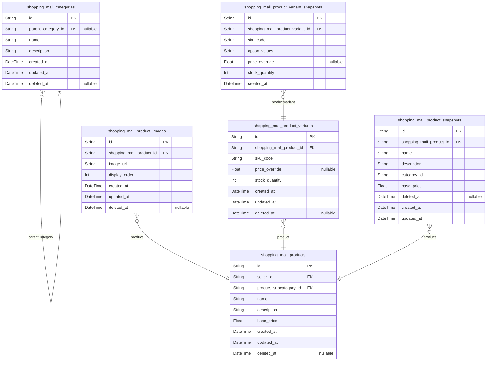
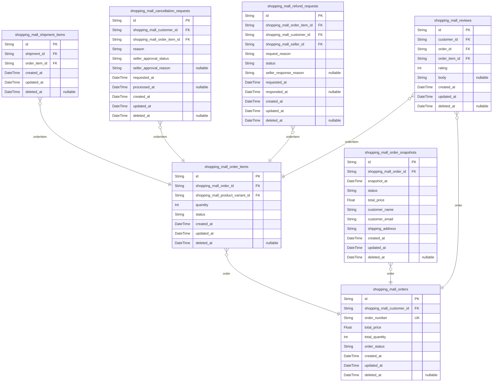
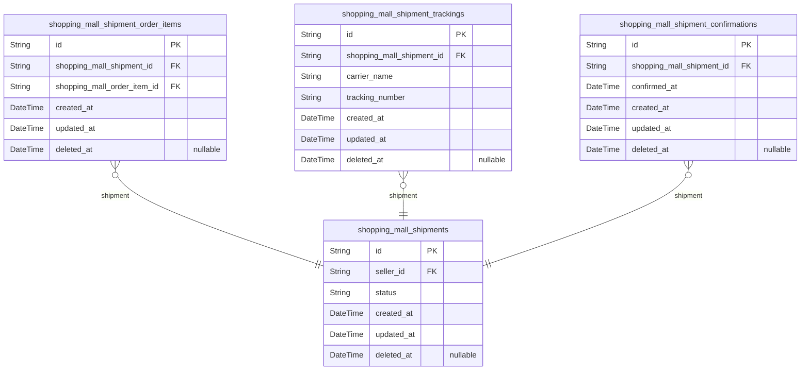
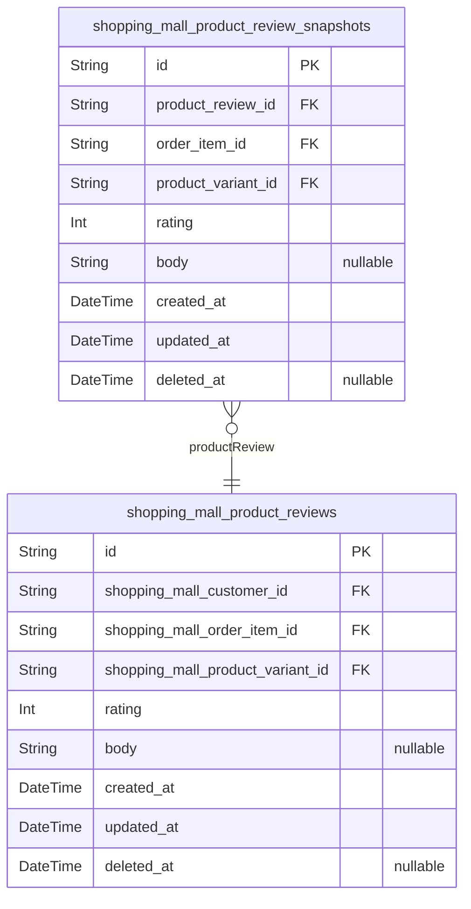
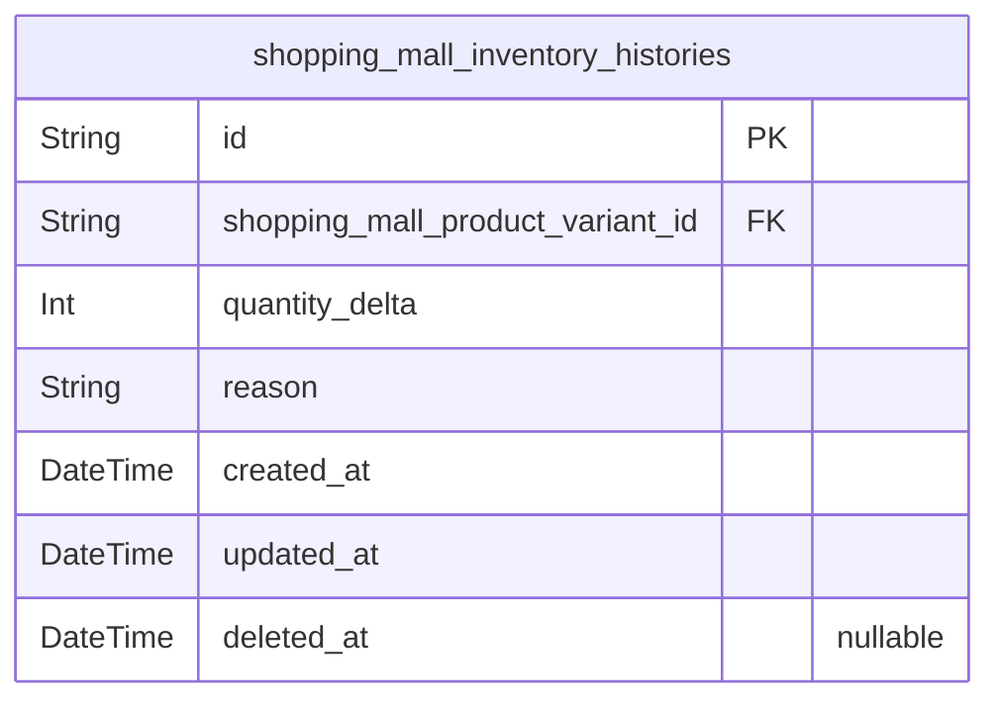
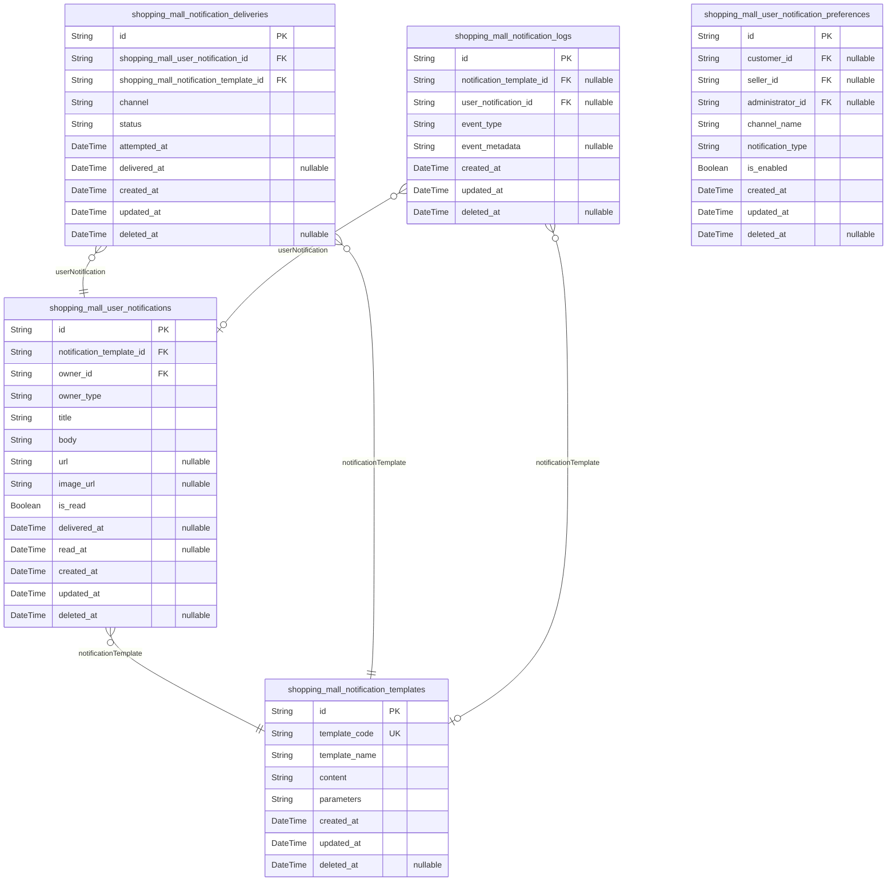
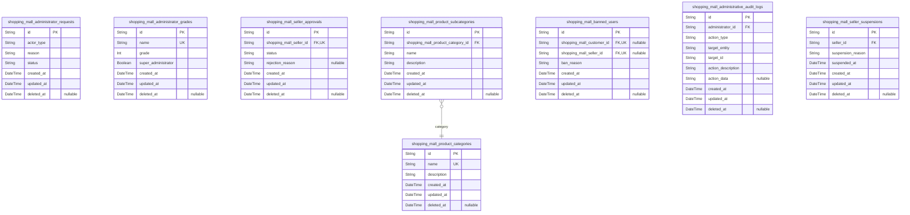

# Prisma Markdown

> Generated by [`prisma-markdown`](https://github.com/samchon/prisma-markdown)

- [Actors](#actors)
- [Systematic](#systematic)
- [Products](#products)
- [Sales](#sales)
- [Orders](#orders)
- [Shipping](#shipping)
- [Reviews](#reviews)
- [Inventory](#inventory)
- [Notifications](#notifications)
- [Administration](#administration)

## Actors

```mermaid
erDiagram
"shopping_mall_customers" {
  String id PK
  String email UK
  String password_hash
  String display_name "nullable"
  String phone_number "nullable"
  DateTime created_at
  DateTime updated_at
  DateTime deleted_at "nullable"
}
"shopping_mall_customer_sessions" {
  String id PK
  String shopping_mall_customer_id FK
  String ip
  String href
  String referrer
  DateTime created_at
  DateTime expired_at
}
"shopping_mall_customer_password_resets" {
  String id PK
  String shopping_customer_id FK
  String token UK
  DateTime expired_at
  DateTime created_at
  DateTime updated_at
  DateTime deleted_at "nullable"
}
"shopping_mall_customer_email_verifications" {
  String id PK
  String shopping_mall_customer_id FK
  String token UK
  DateTime expires_at
  DateTime verified_at "nullable"
  DateTime created_at
  DateTime updated_at
  DateTime deleted_at "nullable"
}
"shopping_mall_sellers" {
  String id PK
  String email UK
  String password_hash
  String shop_name
  String shop_description "nullable"
  String(80000) logo_uri "nullable"
  String approval_status
  String rejection_reason "nullable"
  DateTime created_at
  DateTime updated_at
  DateTime deleted_at "nullable"
}
"shopping_mall_seller_sessions" {
  String id PK
  String seller_id FK
  String ip
  String href
  String referrer
  DateTime created_at
  DateTime expired_at
}
"shopping_mall_seller_email_verifications" {
  String id PK
  String seller_id FK
  String token UK
  DateTime expired_at
  DateTime created_at
  DateTime updated_at
  DateTime deleted_at "nullable"
}
"shopping_mall_administrators" {
  String id PK
  String administrator_grade_id FK
  String email UK
  String password_hash
  String name
  Boolean is_super_admin
  DateTime created_at
  DateTime updated_at
  DateTime deleted_at "nullable"
}
"shopping_mall_administrator_sessions" {
  String id PK
  String administrator_id FK
  String ip
  String href
  String referrer
  DateTime created_at
  DateTime expired_at
}
"shopping_mall_administrator_password_resets" {
  String id PK
  String administrator_id FK
  String token UK
  DateTime expired_at
  DateTime created_at
  DateTime updated_at
  DateTime deleted_at "nullable"
}
"shopping_mall_administrator_audit_logs" {
  String id PK
  String administrator_id FK
  String action
  String description
  String ip
  String user_agent
  DateTime created_at
  DateTime updated_at
  DateTime deleted_at "nullable"
}
"shopping_mall_seller_password_resets" {
  String id PK
  String seller_id FK
  String token UK
  DateTime created_at
  DateTime expired_at
  DateTime used_at "nullable"
  DateTime deleted_at "nullable"
}
"shopping_mall_customer_sessions" }o--|| "shopping_mall_customers" : customer
"shopping_mall_customer_password_resets" }o--|| "shopping_mall_customers" : customer
"shopping_mall_customer_email_verifications" }o--|| "shopping_mall_customers" : customer
"shopping_mall_seller_sessions" }o--|| "shopping_mall_sellers" : seller
"shopping_mall_seller_email_verifications" }o--|| "shopping_mall_sellers" : seller
"shopping_mall_administrator_sessions" }o--|| "shopping_mall_administrators" : administrator
"shopping_mall_administrator_password_resets" }o--|| "shopping_mall_administrators" : administrator
"shopping_mall_administrator_audit_logs" }o--|| "shopping_mall_administrators" : administrator
"shopping_mall_seller_password_resets" }o--|| "shopping_mall_sellers" : seller
```

### `shopping_mall_customers`

Registered customer accounts with authentication credentials and profile
information. Each customer has a unique email for login, a securely
hashed password, and optional profile fields including display name and
phone number. Accounts support soft deletion via deleted_at field to
preserve historical data.

Properties as follows:

- `id`: Primary Key.
- `email`: Unique email address used for customer login and communication.
- `password_hash`: Securely hashed password for customer authentication.
- `display_name`: Customer's display name for personalization.
- `phone_number`: Customer's phone number for contact purposes.
- `created_at`: Timestamp when the customer account was created.
- `updated_at`: Timestamp when the customer account was last updated.
- `deleted_at`: Timestamp when the customer account was soft deleted, if applicable.

### `shopping_mall_customer_sessions`

JWT session tokens for customer authentication and session management.
Each session stores IP, referer, and URL data for auditing login
activities and security. Sessions belong to customers via foreign key
relation.

Properties as follows:

- `id`: Primary Key.
- `shopping_mall_customer_id`: Belonged customer's [shopping_mall_customers.id](#shopping_mall_customers).
- `ip`: IP address of the login client.
- `href`: URL of the current page or endpoint the client accessed.
- `referrer`: HTTP referrer from the client's request headers.
- `created_at`: Session creation timestamp.
- `expired_at`: Session expiration timestamp for security.

### `shopping_mall_customer_password_resets`

Stores password reset tokens for customer accounts. These tokens allow
customers to reset their passwords securely within an expiration window.
Each token is unique and references its associated customer account.
Expired tokens are invalidated and cleaned up via soft delete.

Properties as follows:

- `id`: Primary Key.
- `shopping_customer_id`: Associated customer's [shopping_mall_customers.id](#shopping_mall_customers).
- `token`: Unique secure token for password reset requests.
- `expired_at`: Datetime when this reset token expires.
- `created_at`: Timestamp when the reset token was created.
- `updated_at`: Timestamp when the reset token was last updated.
- `deleted_at`: Soft deletion timestamp; null if not deleted.

### `shopping_mall_customer_email_verifications`

Email verification tokens for customers confirming email ownership.
Stores unique verification tokens, expiration dates, and verification
status to manage and track customer email verification requests. Linked
to the customer's main account record with a foreign key relationship to
shopping_mall_customers.

Properties as follows:

- `id`: Primary Key.
- `shopping_mall_customer_id`: Belonged customer's [shopping_mall_customers.id](#shopping_mall_customers).
- `token`
  > Unique verification token value used in email confirmation links to
  > verify customer's email address.
- `expires_at`
  > Expiration datetime of the verification token to enforce time-limited
  > validity.
- `verified_at`
  > Timestamp when the email was successfully verified. Null if not yet
  > verified.
- `created_at`: Record creation timestamp for audit and historical tracking.
- `updated_at`: Record last update timestamp for sync and concurrency control.
- `deleted_at`: Soft delete timestamp marking record as logically deleted.

### `shopping_mall_sellers`

Registered seller accounts with authentication credentials and profile
including approval status.

This table stores the core information for sellers who register to sell
products on the platform. It holds authentication fields (email,
password), seller's shop profile (name, description, logo URI), and
approval status required for seller activation.

Related child tables include sessions, password resets, email
verifications, approval and suspension records handled separately.

This table uses soft delete to preserve historical data while allowing
logical removal of sellers.

Properties as follows:

- `id`: Primary Key.
- `email`: Unique email address used for seller authentication.
- `password_hash`: Password hash for secure authentication storage.
- `shop_name`: Name of the seller's shop, displayed to customers.
- `shop_description`: Optional descriptive text about the seller's shop.
- `logo_uri`: Optional URI pointing to the seller's shop logo image.
- `approval_status`
  > Current approval status of the seller registration. One of: pending,
  > approved, rejected.
- `rejection_reason`: Reason provided by administrators for rejecting the seller's registration.
- `created_at`: Timestamp when the seller account was created.
- `updated_at`: Timestamp when the seller account was last updated.
- `deleted_at`: Timestamp for soft deletion; null means active.

### `shopping_mall_seller_sessions`

Stores JWT session tokens for seller authentication and session
management, including connection metadata and expiration timestamps. This
table enables secure tracking of active seller sessions.

Properties as follows:

- `id`: Primary Key.
- `seller_id`: Belongs to seller's [shopping_mall_sellers.id](#shopping_mall_sellers).
- `ip`: IP address from which the seller session originated.
- `href`: URL of the page accessed when the session was created.
- `referrer`: Referrer URL indicating the previous page.
- `created_at`: Timestamp when the session was created.
- `expired_at`: Timestamp when the session expires for security.

### `shopping_mall_seller_email_verifications`

Email verification tokens for sellers confirming email ownership during
registration. Supports multiple tokens per seller but each token is
unique and has an expiration time to ensure security. Used to verify
seller email addresses before allowing full account activation.

Properties as follows:

- `id`: Primary Key.
- `seller_id`
  > The seller who owns this email verification token. {@link
  > shopping_mall_sellers.id}
- `token`
  > Unique email verification token string used to confirm seller email
  > ownership.
- `expired_at`: Expiration datetime of the email verification token.
- `created_at`: Timestamp for when the token was created.
- `updated_at`: Timestamp for when the token was last updated.
- `deleted_at`: Optional soft delete timestamp, null if not deleted.

### `shopping_mall_administrators`

Administrator accounts with elevated privileges and authentication
credentials. They have login credentials using email and password hash,
are assigned roles with different grades, including super administrator
status, and support soft deletion. This table references administrator
grades and is central to access control in the system.

Properties as follows:

- `id`: Primary Key.
- `administrator_grade_id`
  > Role and permission grade of the administrator, referencing
  > shopping_mall_administrator_grades.id.
- `email`: Unique email address for administrator login credentials.
- `password_hash`: Hashed password for secure authentication.
- `name`: Full name of the administrator user.
- `is_super_admin`: Flag indicating if the administrator has super administrator privileges.
- `created_at`: Timestamp when the administrator account was created.
- `updated_at`: Timestamp when the administrator account was last updated.
- `deleted_at`: Timestamp for soft deletion; null if not deleted.

### `shopping_mall_administrator_sessions`

JWT session tokens for administrator authentication and session
management. Tracks sessions including IP address, URL where session was
initiated (href), HTTP referrer, creation timestamp, and expiration
timestamp. Foreign key 'administrator_id' references
shopping_mall_administrators table.

Properties as follows:

- `id`: Primary Key.
- `administrator_id`: Belonged administrator account's [shopping_mall_administrators.id](#shopping_mall_administrators).
- `ip`: IP address from which the session was established.
- `href`: URL where the session was initiated or last accessed.
- `referrer`: HTTP referrer header string for the session request.
- `created_at`: Timestamp when the session was created.
- `expired_at`: Timestamp when the session expires and is no longer valid.

### `shopping_mall_administrator_password_resets`

Password reset tokens with expiration for administrator accounts. Enables
secure password reset functionality by storing unique tokens linked to
administrators, with expiration for security control.

Properties as follows:

- `id`: Primary Key.
- `administrator_id`: Belonged administrator's [shopping_mall_administrators.id](#shopping_mall_administrators).
- `token`: Unique token string for password reset authentication.
- `expired_at`: Expiration timestamp after which the token is invalid.
- `created_at`: Creation timestamp of the token record.
- `updated_at`: Last update timestamp of the token record.
- `deleted_at`: Soft delete timestamp; null if active.

### `shopping_mall_administrator_audit_logs`

Audit log records of administrator actions for security and compliance.
Each log entry records the administrator responsible, action performed,
details including IP address and user agent, and timestamps for creation,
update, and soft deletion. This enables thorough tracking and auditing of
administrator activities to ensure security and accountability within the
system.

Properties as follows:

- `id`: Primary Key.
- `administrator_id`
  > Administrator responsible for the action. {@link
  > shopping_mall_administrators.id}.
- `action`
  > Description of the administrator action performed, such as 'create_user',
  > 'delete_product', 'approve_seller'.
- `description`
  > Detailed description of the action including context or additional
  > information.
- `ip`: IP address from which the administrator performed the action.
- `user_agent`: User agent string of the administrator's browser or client application.
- `created_at`: Timestamp when the audit log entry was created.
- `updated_at`: Timestamp when the audit log entry was last updated.
- `deleted_at`: Timestamp for soft deletion; null if not deleted.

### `shopping_mall_seller_password_resets`

Password reset tokens for sellers to securely manage password recovery
processes. Each record holds a unique token, creation timestamp,
expiration timestamp, optional usage timestamp, soft delete timestamp,
and is linked to a seller account.

Properties as follows:

- `id`: Primary Key.
- `seller_id`: Referenced seller's [shopping_mall_sellers.id](#shopping_mall_sellers).
- `token`: Unique token string for password reset verification.
- `created_at`: Timestamp when the reset token was created.
- `expired_at`: Timestamp when the reset token expires.
- `used_at`: Timestamp when the reset token was used; null if unused.
- `deleted_at`: Soft delete timestamp; null if not deleted.

## Systematic

```mermaid
erDiagram
"shopping_mall_seller_profile_snapshots" {
  String id PK
  String shopping_mall_seller_id FK
  String shop_name
  String shop_description
  String logo_image_url "nullable"
  DateTime created_at
}
"shopping_mall_order_item_snapshots" {
  String id PK
  String shopping_mall_order_item_id FK
  String shopping_mall_order_id FK
  String product_name
  String variant_sku
  String variant_option_values
  Float unit_price
  Int quantity
  String item_status
  String seller_shop_name
  String(80000) seller_logo_uri "nullable"
  DateTime created_at
  DateTime updated_at
  DateTime deleted_at "nullable"
}
"shopping_mall_review_snapshots" {
  String id PK
  String shopping_mall_product_review_id FK
  Int rating
  String body "nullable"
  DateTime snapshot_created_at
  DateTime created_at
  DateTime updated_at
  DateTime deleted_at "nullable"
}
"shopping_mall_system_settings" {
  String id PK
  String key UK
  String value
  String description "nullable"
  String data_type
  DateTime created_at
  DateTime updated_at
  DateTime deleted_at "nullable"
}
"shopping_mall_system_versions" {
  String id PK
  String entity_name
  String entity_id
  Int version_number
  String changed_fields
  String change_description "nullable"
  String changed_by "nullable"
  DateTime created_at
  DateTime updated_at
  DateTime deleted_at "nullable"
}
"shopping_mall_audit_logs" {
  String id PK
  String event_type
  String description
  String actor_type "nullable"
  String actor_id "nullable"
  String ip "nullable"
  String user_agent "nullable"
  String metadata "nullable"
  DateTime created_at
  DateTime updated_at
  DateTime deleted_at "nullable"
}
"shopping_mall_cancellation_request_snapshots" {
  String id PK
  String cancellation_request_id FK
  String reason
  String status
  DateTime created_at
  DateTime updated_at
  DateTime deleted_at "nullable"
}
"shopping_mall_refund_request_snapshots" {
  String id PK
  String shopping_mall_refund_request_id FK
  String status
  String reason
  String comment "nullable"
  DateTime created_at
  DateTime updated_at
  DateTime deleted_at "nullable"
}
```

### `shopping_mall_seller_profile_snapshots`

Immutable snapshots recording seller profile changes over time for audit
and dispute resolution. Each record preserves the seller's shop name,
shop description, and logo image URL at the time of snapshot, associated
with the seller via foreign key shopping_mall_seller_id.

Properties as follows:

- `id`: Primary Key.
- `shopping_mall_seller_id`: Referenced seller's [shopping_mall_sellers.id](#shopping_mall_sellers).
- `shop_name`: Seller's shop name at the time of snapshot.
- `shop_description`: Seller's shop description at the time of snapshot.
- `logo_image_url`
  > URL of the seller's logo image at the time of snapshot. Nullable if no
  > logo.
- `created_at`: Timestamp when the snapshot was created.

### `shopping_mall_order_item_snapshots`

Immutable snapshots preserving order item state including product,
variant, and seller data at the time of purchase to ensure accurate
historical records for audits, disputes, and legal compliance. Each
snapshot records the full state of the order item including product name,
SKU, pricing, quantity, status, and associated seller profile details.

Properties as follows:

- `id`: Primary Key.
- `shopping_mall_order_item_id`: Referenced order item. [shopping_mall_order_items.id](#shopping_mall_order_items).
- `shopping_mall_order_id`: Referenced order. [shopping_mall_orders.id](#shopping_mall_orders).
- `product_name`: Product name at the time of purchase.
- `variant_sku`: SKU code of the product variant at purchase time.
- `variant_option_values`: Serialized option values of the variant at purchase time.
- `unit_price`: Price per unit of the product variant at purchase time.
- `quantity`: Quantity purchased in the order item.
- `item_status`
  > Status of the order item at the time of snapshot (e.g., paid, shipped,
  > delivered).
- `seller_shop_name`: Name of the seller's shop at the time of purchase.
- `seller_logo_uri`
  > URI of the seller's logo image at the time of purchase; nullable if no
  > logo.
- `created_at`: Snapshot creation timestamp.
- `updated_at`: Last update timestamp of the snapshot.
- `deleted_at`: Soft delete timestamp for snapshot record; nullable.

### `shopping_mall_review_snapshots`

Immutable snapshots capturing customer reviews including rating and
content changes for audit and dispute resolution. Each record stores the
state of a customer review at a specific point in time, preserving
historical changes immutably.

Properties as follows:

- `id`: Primary Key.
- `shopping_mall_product_review_id`
  > Referenced customer product review's {@link
  > shopping_mall_product_reviews.id}.
- `rating`: Customer rating value from 1 to 5 stars.
- `body`: Review textual content; nullable if customer only rated without text.
- `snapshot_created_at`: Timestamp when the snapshot was created.
- `created_at`: Record creation timestamp.
- `updated_at`: Record last update timestamp.
- `deleted_at`: Record soft delete timestamp for logical deletion.

### `shopping_mall_system_settings`

System-wide configuration settings for platform behavior and parameters.
Stores key-value configuration options for the e-commerce platform,
including metadata for description and data type. Supports soft deletion
for safe configuration changes.

Properties as follows:

- `id`: Primary Key.
- `key`: Unique key identifier for the system setting.
- `value`: Value of the setting stored as a string.
- `description`: Human-readable description of the setting's purpose and usage.
- `data_type`: Data type of the setting value (e.g., string, int, boolean, json).
- `created_at`: Record creation timestamp.
- `updated_at`: Record last update timestamp.
- `deleted_at`: Soft deletion timestamp, null if active.

### `shopping_mall_system_versions`

Versioning records tracking changes and update history of critical system
entities. This table maintains an immutable audit log of entity versions,
including fields changed, version sequence, and timestamp information. It
supports rollback and historical inspection of system data changes.

Properties as follows:

- `id`: Primary Key.
- `entity_name`: Name of the entity being versioned, e.g., 'shopping_mall_sellers'.
- `entity_id`: The UUID of the entity instance being versioned.
- `version_number`: Sequential version number for this entity's changes.
- `changed_fields`: JSON string listing fields changed in this version.
- `change_description`: Optional textual description of the change.
- `changed_by`: Identifier of the actor who made the change, e.g., user email or admin ID.
- `created_at`: Record creation timestamp.
- `updated_at`: Record last update timestamp.
- `deleted_at`: Soft delete timestamp, null if not deleted.

### `shopping_mall_audit_logs`

Audit log records capturing system events, user actions, and system
changes for security and compliance purposes. Each entry stores details
about the event type, actor information, IP address, user agent, metadata
as JSON string, and timestamps for creation and updates.

Properties as follows:

- `id`: Primary Key.
- `event_type`
  > Type of the event being logged (e.g., 'login', 'order_created',
  > 'product_updated').
- `description`: Detailed description of the event or action performed.
- `actor_type`
  > Type of actor who performed the event (e.g., 'customer', 'seller',
  > 'administrator').
- `actor_id`: UUID of the actor who performed the event, if applicable.
- `ip`: IP address from which the event originated.
- `user_agent`: User agent string of the client application initiating the event.
- `metadata`: JSON string storing additional event metadata for auditing.
- `created_at`: Timestamp when the log entry was created.
- `updated_at`: Timestamp when the log entry was last updated.
- `deleted_at`: Timestamp when the log entry was deleted (soft delete).

### `shopping_mall_cancellation_request_snapshots`

Immutable snapshots preserving cancellation request data including reason
and status changes for auditing and dispute resolution purposes. Records
before-and-after states of cancellation requests on order items. Ensures
data immutability and historical traceability. Linked to
shopping_mall_cancellation_requests and capturing related timestamps and
status values.

Properties as follows:

- `id`: Primary Key.
- `cancellation_request_id`
  > Belonged cancellation request's {@link
  > shopping_mall_cancellation_requests.id}.
- `reason`: Textual reason provided for the cancellation request at the snapshot time.
- `status`
  > Status of the cancellation request at the snapshot time, e.g., pending,
  > approved, rejected.
- `created_at`: Timestamp when this snapshot record was created.
- `updated_at`: Timestamp when this snapshot record was last updated.
- `deleted_at`: Soft delete timestamp if the snapshot is logically deleted.

### `shopping_mall_refund_request_snapshots`

Immutable snapshots preserving refund request data including reason,
status, and comments. These records enable audit tracking and dispute
resolution by capturing historical states of refund requests without
alteration.

Properties as follows:

- `id`: Primary Key.
- `shopping_mall_refund_request_id`: Belonged refund request's [shopping_mall_refund_requests.id](#shopping_mall_refund_requests).
- `status`
  > Current status of the refund request at snapshot time. E.g., 'pending',
  > 'approved', 'rejected'.
- `reason`: Detailed reason provided by customer or seller for the refund request.
- `comment`
  > Optional comments or additional notes related to the refund request
  > snapshot.
- `created_at`: Timestamp when the snapshot record was created.
- `updated_at`: Timestamp when the snapshot record was last updated.
- `deleted_at`: Soft deletion timestamp. Null if not deleted.

## Products

```mermaid
erDiagram
"shopping_mall_categories" {
  String id PK
  String parent_category_id FK "nullable"
  String name
  String description
  DateTime created_at
  DateTime updated_at
  DateTime deleted_at "nullable"
}
"shopping_mall_products" {
  String id PK
  String seller_id FK
  String product_subcategory_id FK
  String name
  String description
  Float base_price
  DateTime created_at
  DateTime updated_at
  DateTime deleted_at "nullable"
}
"shopping_mall_product_images" {
  String id PK
  String shopping_mall_product_id FK
  String image_url
  Int display_order
  DateTime created_at
  DateTime updated_at
  DateTime deleted_at "nullable"
}
"shopping_mall_product_variants" {
  String id PK
  String shopping_mall_product_id FK
  String sku_code
  Float price_override "nullable"
  Int stock_quantity
  DateTime created_at
  DateTime updated_at
  DateTime deleted_at "nullable"
}
"shopping_mall_product_snapshots" {
  String id PK
  String shopping_mall_product_id FK
  String name
  String description
  String category_id
  Float base_price
  DateTime deleted_at "nullable"
  DateTime created_at
  DateTime updated_at
}
"shopping_mall_product_variant_snapshots" {
  String id PK
  String shopping_mall_product_variant_id FK
  String sku_code
  String option_values
  Float price_override "nullable"
  Int stock_quantity
  DateTime created_at
}
"shopping_mall_categories" }o--o| "shopping_mall_categories" : parentCategory
"shopping_mall_product_images" }o--|| "shopping_mall_products" : product
"shopping_mall_product_variants" }o--|| "shopping_mall_products" : product
"shopping_mall_product_snapshots" }o--|| "shopping_mall_products" : product
"shopping_mall_product_variant_snapshots" }o--|| "shopping_mall_product_variants" : productVariant
```

### `shopping_mall_categories`

Categories organizing products with optional single-level subcategories
for hierarchical browsing and filtering. Supports hierarchical
parent-child relationships for categories and subcategories.

Properties as follows:

- `id`: Primary Key.
- `parent_category_id`
  > Parent category's [shopping_mall_categories.id](#shopping_mall_categories). Nullable for
  > top-level categories.
- `name`: Name of the category.
- `description`: Description of the category.
- `created_at`: Record creation timestamp.
- `updated_at`: Record last update timestamp.
- `deleted_at`: Soft delete timestamp. Null if not deleted.

### `shopping_mall_products`

Products created by sellers with details like name, description, base
price, belonging to specific product subcategories and sellers. Supports
soft deletion for safe removal without losing history.

Properties as follows:

- `id`: Primary Key.
- `seller_id`: The seller who owns this product. References shopping_mall_sellers.id.
- `product_subcategory_id`
  > The subcategory this product belongs to. References
  > shopping_mall_product_subcategories.id.
- `name`: The product's name identifying it in listings and searches.
- `description`: Detailed description of the product, explaining features and attributes.
- `base_price`: The base price before any variant overrides.
- `created_at`: Timestamp when the product was created.
- `updated_at`: Timestamp when the product was last updated.
- `deleted_at`: Timestamp when the product was soft-deleted. Null means active.

### `shopping_mall_product_images`

Images associated with products, supporting multiple images per product
and reordering (first as thumbnail). Each image record references a
product and contains the image URL, display order, and timestamps for
creation, update, and soft deletion.

Properties as follows:

- `id`: Primary Key.
- `shopping_mall_product_id`: Referenced product's [shopping_mall_products.id](#shopping_mall_products).
- `image_url`: URL of the product image.
- `display_order`
  > Ordering index to determine the display sequence of images for a product.
  > The lowest value is the thumbnail.
- `created_at`: Record creation timestamp.
- `updated_at`: Record last update timestamp.
- `deleted_at`: Soft deletion timestamp; null means active.

### `shopping_mall_product_variants`

Variants (SKUs) of products representing option combinations with SKU
code, price override, and stock quantity. Each variant belongs to a
single product, storing unique SKU codes per product and optional price
overrides. Includes timestamps for creation, update, and soft deletion.

Properties as follows:

- `id`: Primary Key.
- `shopping_mall_product_id`: Belonged product's [shopping_mall_products.id](#shopping_mall_products).
- `sku_code`
  > Unique SKU code per product variant used for inventory and order
  > identification.
- `price_override`
  > Optional price override for this variant, replacing the product base
  > price.
- `stock_quantity`
  > Current stock quantity for the variant, updated through inventory history
  > records.
- `created_at`: Record creation timestamp.
- `updated_at`: Record last update timestamp.
- `deleted_at`: Soft deletion timestamp, null if not deleted.

### `shopping_mall_product_snapshots`

Immutable snapshots capturing product states at edit time including
embedded variant snapshots, preserving historical states. Each record
stores a complete snapshot of a product's data at a point in time for
audit and dispute resolution.

Properties as follows:

- `id`: Primary Key.
- `shopping_mall_product_id`
  > The original product's [shopping_mall_products.id](#shopping_mall_products) that this
  > snapshot belongs to.
- `name`: Snapshot of the product name at the time of this snapshot.
- `description`: Snapshot of the product description at the time of this snapshot.
- `category_id`
  > FK to the product's snapshot category [shopping_mall_categories.id](#shopping_mall_categories)
  > at snapshot time.
- `base_price`: Snapshot of the product's base price at the time of this snapshot.
- `deleted_at`
  > Timestamp indicating when this snapshot record was logically deleted, if
  > applicable.
- `created_at`: Timestamp when this snapshot was created.
- `updated_at`: Timestamp when this snapshot was last updated.

### `shopping_mall_product_variant_snapshots`

Immutable snapshots capturing individual variant states at edit time to
preserve audit trail of SKU changes. Stores SKU code, option values,
price override, stock quantity, and created timestamp. Linked to the
shopping_mall_product_variants parent for audit and historical tracking.

Properties as follows:

- `id`: Primary Key.
- `shopping_mall_product_variant_id`: Belonged product variant's [shopping_mall_product_variants.id](#shopping_mall_product_variants).
- `sku_code`: SKU code of the product variant at snapshot time.
- `option_values`: Serialized JSON string of variant option values at snapshot time.
- `price_override`: Price override of the variant at snapshot time; null if none.
- `stock_quantity`: Stock quantity of the variant at snapshot time.
- `created_at`: Timestamp when the snapshot was created.

## Sales

```mermaid
erDiagram
"shopping_mall_sales" {
  String id PK
  String seller_id FK
  String category_id FK
  String name
  String description
  Float base_price
  String status
  DateTime created_at
  DateTime updated_at
  DateTime deleted_at "nullable"
}
"shopping_mall_sale_snapshots" {
  String id PK
  String shopping_mall_sale_id FK
  String title
  String description
  String category_id
  Float base_price
  DateTime created_at
  DateTime updated_at
  DateTime deleted_at "nullable"
}
"shopping_mall_sale_units" {
  String id PK
  String shopping_mall_sale_id FK
  String sku_code
  String option_values
  Float price_override "nullable"
  DateTime created_at
  DateTime updated_at
  DateTime deleted_at "nullable"
}
"shopping_mall_sale_unit_snapshots" {
  String id PK
  String shopping_mall_sale_unit_id FK
  String shopping_mall_sale_snapshot_id FK
  String sku_code
  String option_values
  Float price_override "nullable"
  Int stock_quantity
  Boolean is_active
  DateTime created_at
  DateTime updated_at
  DateTime deleted_at "nullable"
}
"shopping_mall_sale_images" {
  String id PK
  String shopping_mall_sale_id FK
  String image_url
  Int display_order
  String alt_text "nullable"
  DateTime created_at
  DateTime updated_at
  DateTime deleted_at "nullable"
}
"shopping_mall_sale_specifications" {
  String id PK
  String shopping_mall_sale_id FK
  String specification_key
  String specification_value
  DateTime created_at
  DateTime updated_at
  DateTime deleted_at "nullable"
}
"shopping_mall_sale_reviews" {
  String id PK
  String shopping_mall_sale_id FK
  String shopping_mall_customer_id FK
  Int rating
  String body "nullable"
  DateTime created_at
  DateTime updated_at
  DateTime deleted_at "nullable"
}
"shopping_mall_sale_review_votes" {
  String id PK
  String shopping_mall_product_review_id FK
  String voter_id FK
  String actor_type
  DateTime created_at
  DateTime updated_at
  DateTime deleted_at "nullable"
}
"shopping_mall_sale_questions" {
  String id PK
  String shopping_mall_sale_id FK
  String shopping_mall_customer_id FK
  String title
  String body
  String status
  DateTime created_at
  DateTime updated_at
  DateTime deleted_at "nullable"
}
"shopping_mall_sale_favorites" {
  String id PK
  String shopping_mall_customer_id FK
  String shopping_mall_sale_id FK
  DateTime created_at
  DateTime updated_at
  DateTime deleted_at "nullable"
}
"shopping_mall_sale_promotions" {
  String id PK
  String shopping_mall_sale_id FK
  String promotion_code UK "nullable"
  String promotion_type
  String description "nullable"
  Float discount_value
  String discount_type
  DateTime start_at
  DateTime end_at
  Boolean active
  DateTime created_at
  DateTime updated_at
  DateTime deleted_at "nullable"
}
"shopping_mall_sale_view_stats" {
  String id PK
  String shopping_mall_sale_id FK
  Int view_count
  Int unique_view_count
  DateTime first_viewed_at
  DateTime last_viewed_at
  DateTime created_at
  DateTime updated_at
  DateTime deleted_at "nullable"
}
"shopping_mall_sale_question_answers" {
  String id PK
  String shopping_mall_sale_question_id FK,UK
  String seller_id FK
  String title
  String body
  DateTime created_at
  DateTime updated_at
  DateTime deleted_at "nullable"
}
"shopping_mall_sale_snapshots" }o--|| "shopping_mall_sales" : sale
"shopping_mall_sale_units" }o--|| "shopping_mall_sales" : sale
"shopping_mall_sale_unit_snapshots" }o--|| "shopping_mall_sale_units" : saleUnit
"shopping_mall_sale_unit_snapshots" }o--|| "shopping_mall_sale_snapshots" : saleSnapshot
"shopping_mall_sale_images" }o--|| "shopping_mall_sales" : sale
"shopping_mall_sale_specifications" }o--|| "shopping_mall_sales" : shoppingMallSale
"shopping_mall_sale_reviews" }o--|| "shopping_mall_sales" : sale
"shopping_mall_sale_questions" }o--|| "shopping_mall_sales" : sale
"shopping_mall_sale_favorites" }o--|| "shopping_mall_sales" : sale
"shopping_mall_sale_promotions" }o--|| "shopping_mall_sales" : sale
"shopping_mall_sale_view_stats" }o--|| "shopping_mall_sales" : sale
"shopping_mall_sale_question_answers" |o--|| "shopping_mall_sale_questions" : saleQuestion
```

### `shopping_mall_sales`

Main product sale listings containing details, pricing, and their
relationship to sellers and product categories. Represents products
available for sale by sellers in the e-commerce platform. Supports status
for approval workflow and soft deletion for logical removal.

Properties as follows:

- `id`: Primary Key.
- `seller_id`: The seller who owns this sale listing. [shopping_mall_sellers.id](#shopping_mall_sellers).
- `category_id`
  > The category this sale belongs to. {@link
  > shopping_mall_product_categories.id}.
- `name`: The product name for display and search.
- `description`: Detailed product description.
- `base_price`: Base price of the product.
- `status`
  > Status of the sale listing, e.g., pending approval, approved, rejected,
  > or inactive.
- `created_at`: The creation timestamp of this sale listing.
- `updated_at`: The last update timestamp of this sale listing.
- `deleted_at`: Timestamp indicating logical deletion.

### `shopping_mall_sale_snapshots`

Immutable snapshots capturing historical states of sales listings for
audit and dispute resolution. This table preserves all sale attributes
exactly as they were at the moment of snapshot creation, including
references to the original sale entity.

Properties as follows:

- `id`: Primary Key.
- `shopping_mall_sale_id`: Reference to the original sale's [shopping_mall_sales.id](#shopping_mall_sales).
- `title`: Snapshot of the sale's title.
- `description`: Snapshot of the sale's detailed description.
- `category_id`: Snapshot of the category id [shopping_mall_categories.id](#shopping_mall_categories).
- `base_price`: Snapshot of the base price of the sale.
- `created_at`: Timestamp when this snapshot was created.
- `updated_at`: Timestamp when this snapshot was last updated.
- `deleted_at`
  > Nullable timestamp for soft deletion; usually null as snapshots are
  > immutable.

### `shopping_mall_sale_units`

Individual product variant units within each sale, capturing SKU codes,
option values, and optional price overrides. Linked to the parent sale
entity in shopping_mall_sales to represent variant listings of the
product for sale.

Properties as follows:

- `id`: Primary Key.
- `shopping_mall_sale_id`
  > Parent sale reference. Links this unit to its sale listing in
  > shopping_mall_sales. [shopping_mall_sales.id](#shopping_mall_sales).
- `sku_code`
  > SKU (Stock Keeping Unit) code uniquely identifying this variant within
  > the sale.
- `option_values`: Option values representing variant attributes serialized as a JSON string.
- `price_override`
  > Optional price override for this variant, if different from the base sale
  > price.
- `created_at`: Record creation timestamp.
- `updated_at`: Record last updated timestamp.
- `deleted_at`: Soft delete timestamp, if the record is deleted.

### `shopping_mall_sale_unit_snapshots`

Immutable snapshots preserving states of sale units at each change event
for audit and dispute resolution. Each record duplicates all relevant
fields from the sale unit exactly at that snapshot event, with foreign
keys to the sale unit and to the parent sale snapshot for full history
capture.

Properties as follows:

- `id`: Primary Key.
- `shopping_mall_sale_unit_id`
  > The linked sale unit which this snapshot represents. {@link
  > shopping_mall_sale_units.id}
- `shopping_mall_sale_snapshot_id`
  > The parent sale snapshot that groups this sale unit snapshot. {@link
  > shopping_mall_sale_snapshots.id}
- `sku_code`: SKU code at the moment of snapshot.
- `option_values`: Option values of the sale unit at snapshot time.
- `price_override`: Optional price override at snapshot time.
- `stock_quantity`: Stock quantity at snapshot time.
- `is_active`: Whether the sale unit was active at snapshot time.
- `created_at`: Timestamp when this snapshot record was created.
- `updated_at`: Timestamp when this snapshot record was last updated.
- `deleted_at`: Timestamp indicating soft deletion, if any.

### `shopping_mall_sale_images`

Images associated with each sale in the shopping mall platform,
supporting multiple images per sale and allowing ordering and alt text
for accessibility. Each image is linked to a single sale listing.

Properties as follows:

- `id`: Primary Key.
- `shopping_mall_sale_id`: Reference to the owning sale's [shopping_mall_sales.id](#shopping_mall_sales).
- `image_url`: URL of the sale image.
- `display_order`: Order of the image within the sale's image list, starting from 1.
- `alt_text`
  > Alternative text description for the image, used for accessibility and
  > SEO.
- `created_at`: Timestamp when the record was created.
- `updated_at`: Timestamp when the record was last updated.
- `deleted_at`: Timestamp when the record was soft-deleted; null if active.

### `shopping_mall_sale_specifications`

Technical specifications and detailed attributes for each sale. Provides
extended product specification information linked to sales, enabling
precise detail management for products listed on the shopping mall
platform. References the main sale entity [shopping_mall_sales.id](#shopping_mall_sales)
for contextual association.

Properties as follows:

- `id`: Primary Key.
- `shopping_mall_sale_id`: Related sale entity's [shopping_mall_sales.id](#shopping_mall_sales).
- `specification_key`
  > Key name for the technical specification attribute, e.g., 'Weight',
  > 'Material', 'Battery Life'.
- `specification_value`
  > Value corresponding to the specification_key, describing the technical
  > detail.
- `created_at`: Record creation timestamp.
- `updated_at`: Record last update timestamp.
- `deleted_at`: Soft deletion timestamp, null if not deleted.

### `shopping_mall_sale_reviews`

Customer reviews and ratings for sales (products), including star ratings
and optional textual feedback. Each review is linked to a specific sale
and customer for ownership and traceability. Supports soft deletion for
review moderation and historical record keeping.

Properties as follows:

- `id`: Primary Key.
- `shopping_mall_sale_id`: Referenced sale entity's [shopping_mall_sales.id](#shopping_mall_sales).
- `shopping_mall_customer_id`: Authoring customer [shopping_mall_customers.id](#shopping_mall_customers).
- `rating`: Star rating given by the customer, integer between 1 and 5.
- `body`: Optional textual content of the review.
- `created_at`: Record creation timestamp.
- `updated_at`: Record last update timestamp.
- `deleted_at`: Soft deletion timestamp; null if not deleted.

### `shopping_mall_sale_review_votes`

Helpful votes on customer reviews indicating their usefulness.

Stores who voted on which review and when. Supports polymorphic ownership
by actor type (customer or seller). Maintains soft delete status to
preserve vote history.

Properties as follows:

- `id`: Primary Key.
- `shopping_mall_product_review_id`: Target review's [shopping_mall_product_reviews.id](#shopping_mall_product_reviews).
- `voter_id`
  > Voter's [shopping_mall_customers.id](#shopping_mall_customers) or {@link
  > shopping_mall_sellers.id} depending on actor_type.
- `actor_type`: Actor type of the voter: either 'customer' or 'seller'.
- `created_at`: Timestamp of when the vote was created.
- `updated_at`: Timestamp of when the vote was last updated.
- `deleted_at`: Timestamp of soft deletion. Null if not deleted.

### `shopping_mall_sale_questions`

Customer questions regarding sales, facilitating pre-purchase inquiries
and interactions with sellers. Stores question content, references to
sale and customer, and timestamps for lifecycle tracking.

Properties as follows:

- `id`: Primary Key.
- `shopping_mall_sale_id`: Referenced sale item's [shopping_mall_sales.id](#shopping_mall_sales).
- `shopping_mall_customer_id`: Authoring customer's [shopping_mall_customers.id](#shopping_mall_customers).
- `title`: Question title summarizing customer inquiry.
- `body`: Detailed question content written by the customer.
- `status`
  > Current status of the question (e.g., 'open', 'closed', 'answered',
  > 'pending'). Usually managed by system or seller responses.
- `created_at`: Record creation timestamp.
- `updated_at`: Last update timestamp.
- `deleted_at`: Soft delete timestamp for deactivated questions.

### `shopping_mall_sale_favorites`

Customer wishlist favorites for sales, tracking user preferences. Links
customers to sales items they have favorited, enabling wishlist
functionality.

Properties as follows:

- `id`: Primary Key.
- `shopping_mall_customer_id`: Belonged customer's [shopping_mall_customers.id](#shopping_mall_customers).
- `shopping_mall_sale_id`: Favorited sale item [shopping_mall_sales.id](#shopping_mall_sales).
- `created_at`: Record creation timestamp.
- `updated_at`: Record last update timestamp.
- `deleted_at`: Record soft deletion timestamp.

### `shopping_mall_sale_promotions`

Promotions and discounts applied to sales for marketing and pricing
strategies. This table records all active and historical promotions
assigned to sales items, including discount details, validity periods,
and promotional codes. Each promotion is linked to a specific sale in the
[shopping_mall_sales](#shopping_mall_sales) table. Maintaining these records enables
flexible marketing strategies and accurate pricing calculations.

Properties as follows:

- `id`: Primary Key.
- `shopping_mall_sale_id`: Associated sale's [shopping_mall_sales.id](#shopping_mall_sales).
- `promotion_code`: Optional promotional code for discount application.
- `promotion_type`
  > Type of promotion (e.g., percentage discount, fixed amount discount, free
  > shipping).
- `description`: Detailed description of the promotion.
- `discount_value`: Value of the discount, interpreted according to discount_type.
- `discount_type`: Specifies if discount_value is a percentage or a fixed amount.
- `start_at`: Start datetime for the promotion's validity period.
- `end_at`: End datetime for the promotion's validity period.
- `active`: Indicates whether the promotion is currently active.
- `created_at`: Record creation timestamp.
- `updated_at`: Record last update timestamp.
- `deleted_at`: Soft deletion timestamp, null if not deleted.

### `shopping_mall_sale_view_stats`

Analytics capturing view statistics for sales to understand customer
interest and behavior. This table stores aggregated counts of views and
unique user views per sale entity, supporting business intelligence and
marketing analysis.

Properties as follows:

- `id`: Primary Key.
- `shopping_mall_sale_id`: Referenced sale entity's [shopping_mall_sales.id](#shopping_mall_sales).
- `view_count`: Total number of views recorded for the sale.
- `unique_view_count`: Number of unique users who viewed the sale.
- `first_viewed_at`: Timestamp when the sale was first viewed.
- `last_viewed_at`: Timestamp when the sale was last viewed.
- `created_at`: Record creation timestamp.
- `updated_at`: Record update timestamp.
- `deleted_at`: Soft delete timestamp if the record is soft deleted.

### `shopping_mall_sale_question_answers`

Seller answers to customer questions, supporting a mandatory one-to-one
relationship with shopping_mall_sale_questions. Each answer has a title
and body provided by the seller, linking uniquely to a question. Includes
reference to the seller who answered and standard audit timestamps with
soft delete support.

Properties as follows:

- `id`: Primary Key.
- `shopping_mall_sale_question_id`
  > Referenced question's [shopping_mall_sale_questions.id](#shopping_mall_sale_questions) enforcing
  > one-to-one relation.
- `seller_id`
  > Belonging seller's [shopping_mall_sellers.id](#shopping_mall_sellers) who answered the
  > question.
- `title`: Answer title provided by the seller.
- `body`: Detailed answer content from the seller.
- `created_at`: Record creation timestamp.
- `updated_at`: Record last update timestamp.
- `deleted_at`: Soft delete timestamp; null if not deleted.

## Orders

```mermaid
erDiagram
"shopping_mall_orders" {
  String id PK
  String shopping_mall_customer_id FK
  String order_number UK
  Float total_price
  Int total_quantity
  String order_status
  DateTime created_at
  DateTime updated_at
  DateTime deleted_at "nullable"
}
"shopping_mall_order_items" {
  String id PK
  String shopping_mall_order_id FK
  String shopping_mall_product_variant_id FK
  Int quantity
  String status
  DateTime created_at
  DateTime updated_at
  DateTime deleted_at "nullable"
}
"shopping_mall_shipment_items" {
  String id PK
  String shipment_id FK
  String order_item_id FK
  DateTime created_at
  DateTime updated_at
  DateTime deleted_at "nullable"
}
"shopping_mall_cancellation_requests" {
  String id PK
  String shopping_mall_customer_id FK
  String shopping_mall_order_item_id FK
  String reason
  String seller_approval_status
  String seller_approval_reason "nullable"
  DateTime requested_at
  DateTime processed_at "nullable"
  DateTime created_at
  DateTime updated_at
  DateTime deleted_at "nullable"
}
"shopping_mall_refund_requests" {
  String id PK
  String shopping_mall_order_item_id FK
  String shopping_mall_customer_id FK
  String shopping_mall_seller_id FK
  String request_reason
  String status
  String seller_response_reason "nullable"
  DateTime requested_at
  DateTime responded_at "nullable"
  DateTime created_at
  DateTime updated_at
  DateTime deleted_at "nullable"
}
"shopping_mall_order_snapshots" {
  String id PK
  String shopping_mall_order_id FK
  DateTime snapshot_at
  String status
  Float total_price
  String customer_name
  String customer_email
  String shipping_address
  DateTime created_at
  DateTime updated_at
  DateTime deleted_at "nullable"
}
"shopping_mall_reviews" {
  String id PK
  String customer_id FK
  String order_id FK
  String order_item_id FK
  Int rating
  String body "nullable"
  DateTime created_at
  DateTime updated_at
  DateTime deleted_at "nullable"
}
"shopping_mall_order_items" }o--|| "shopping_mall_orders" : order
"shopping_mall_shipment_items" }o--|| "shopping_mall_order_items" : orderItem
"shopping_mall_cancellation_requests" }o--|| "shopping_mall_order_items" : orderItem
"shopping_mall_refund_requests" }o--|| "shopping_mall_order_items" : orderItem
"shopping_mall_order_snapshots" }o--|| "shopping_mall_orders" : order
"shopping_mall_reviews" }o--|| "shopping_mall_orders" : order
"shopping_mall_reviews" }o--|| "shopping_mall_order_items" : orderItem
```

### `shopping_mall_orders`

Customer orders with aggregated details including total price, quantity,
payment status, and overall order state. Links to customers placing
orders and supports soft delete for historical record keeping.

Properties as follows:

- `id`: Primary Key.
- `shopping_mall_customer_id`: The customer who placed this order. [shopping_mall_customers.id](#shopping_mall_customers)
- `order_number`: Unique order number for public reference and tracking.
- `total_price`: Total amount payable for the order.
- `total_quantity`: Total quantity of all items in the order.
- `order_status`
  > Overall status of the order: paid, shipped, delivered, cancelled,
  > refunded, partially_completed.
- `created_at`: Timestamp when the order was created.
- `updated_at`: Timestamp when the order was last updated.
- `deleted_at`: Soft delete timestamp allowing for historical record keeping.

### `shopping_mall_order_items`

Individual order items representing product variants within a customer
order, including status tracking, quantity, and linkage to related
entities. Each item is uniquely identified and associated with one order
and one product variant, supporting lifecycle management and operational
workflows.

Properties as follows:

- `id`: Primary Key.
- `shopping_mall_order_id`: The parent order containing this item. [shopping_mall_orders.id](#shopping_mall_orders)
- `shopping_mall_product_variant_id`
  > The product variant purchased in this order item. {@link
  > shopping_mall_product_variants.id}
- `quantity`: Quantity of the product variant ordered for this item.
- `status`
  > Current status of the order item: paid, shipped, delivered, cancelled,
  > refunded.
- `created_at`: Timestamp when the order item record was created.
- `updated_at`: Timestamp when the order item record was last updated.
- `deleted_at`: Timestamp marking soft deletion of the order item, if applicable.

### `shopping_mall_shipment_items`

Mapping of which order items are included in shipments. Each record
associates a specific order item with a shipment to accurately track
shipment contents and enable delivery tracking.

Properties as follows:

- `id`: Primary Key.
- `shipment_id`
  > Referenced shipment's [shopping_mall_shipments.id](#shopping_mall_shipments) this item
  > belongs to.
- `order_item_id`
  > Referenced order item [shopping_mall_order_items.id](#shopping_mall_order_items) included in
  > this shipment.
- `created_at`: Record creation timestamp.
- `updated_at`: Last record update timestamp.
- `deleted_at`: Soft deletion timestamp, nullable.

### `shopping_mall_cancellation_requests`

Customer requests to cancel specific order items with seller approval
status and processing workflow. Records customer, order item, reason,
seller approval status, optional reason, timestamps for request creation
and processing, facilitating management of cancellation requests
independently by customers and sellers.

Properties as follows:

- `id`: Primary Key.
- `shopping_mall_customer_id`: Requesting customer's [shopping_mall_customers.id](#shopping_mall_customers).
- `shopping_mall_order_item_id`
  > Order item requested for cancellation {@link
  > shopping_mall_order_items.id}.
- `reason`: Textual reason the customer provides for requesting cancellation.
- `seller_approval_status`
  > Seller's approval status for the cancellation request (e.g., 'pending',
  > 'approved', 'rejected').
- `seller_approval_reason`: Optional text explaining the seller's rejection or approval reason.
- `requested_at`: Timestamp when the cancellation request was made.
- `processed_at`: Timestamp of when the seller processed the request (approved/rejected).
- `created_at`: Creation timestamp for the cancellation request record.
- `updated_at`: Last update timestamp for the cancellation request record.
- `deleted_at`: Soft deletion timestamp; null if not deleted.

### `shopping_mall_refund_requests`

Customer refund requests for delivered order items including seller
approval status, reasons, and timestamps for request and response. Tracks
refund workflow status and supports soft deletion.

Properties as follows:

- `id`: Primary Key.
- `shopping_mall_order_item_id`: Referenced order item [shopping_mall_order_items.id](#shopping_mall_order_items).
- `shopping_mall_customer_id`: Requesting customer [shopping_mall_customers.id](#shopping_mall_customers).
- `shopping_mall_seller_id`: Seller receiving the refund request [shopping_mall_sellers.id](#shopping_mall_sellers).
- `request_reason`: Reason provided by the customer for the refund request.
- `status`: Status of the refund request (e.g., pending, approved, rejected).
- `seller_response_reason`: Reason provided by the seller in response to the refund request.
- `requested_at`: Timestamp when the refund was requested by the customer.
- `responded_at`: Timestamp when the seller responded to the refund request.
- `created_at`: Record creation timestamp.
- `updated_at`: Record last update timestamp.
- `deleted_at`: Record soft deletion timestamp; null if not deleted.

### `shopping_mall_order_snapshots`

Immutable snapshots of customer orders capturing the complete state of
each order at a specific point in time for audit, dispute resolution, and
historical reference. This includes denormalized data of the original
order, customer details, order items, and status.

Properties as follows:

- `id`: Primary Key.
- `shopping_mall_order_id`: Referenced original order's shopping_mall_orders.id.
- `snapshot_at`: Timestamp when the snapshot was created.
- `status`
  > Current status of the order in this snapshot (e.g., paid, shipped,
  > delivered).
- `total_price`: Total price of the order at snapshot time.
- `customer_name`: Denormalized customer name at snapshot time.
- `customer_email`: Denormalized customer email at snapshot time.
- `shipping_address`: Denormalized shipping address in text form at snapshot time.
- `created_at`: Record creation timestamp.
- `updated_at`: Record last update timestamp.
- `deleted_at`: Soft delete timestamp; null if not deleted.

### `shopping_mall_reviews`

Customer product reviews linked to orders with star ratings and textual
content. Reviews are tied to customers, orders, and specific order items
to ensure verified purchases. Supports rating from 1 to 5 stars, optional
review text, and soft deletion. Maintains historical integrity through
snapshots in a separate component.

Properties as follows:

- `id`: Primary Key.
- `customer_id`: Reviewing customer's [shopping_mall_customers.id](#shopping_mall_customers).
- `order_id`: Associated order [shopping_mall_orders.id](#shopping_mall_orders).
- `order_item_id`: Specific order item reviewed [shopping_mall_order_items.id](#shopping_mall_order_items).
- `rating`: Star rating given by the customer, between 1 and 5.
- `body`: Optional textual content of the review.
- `created_at`: Review creation timestamp.
- `updated_at`: Last review update timestamp.
- `deleted_at`: Soft delete timestamp for review removals.

## Shipping

```mermaid
erDiagram
"shopping_mall_shipments" {
  String id PK
  String seller_id FK
  String status
  DateTime created_at
  DateTime updated_at
  DateTime deleted_at "nullable"
}
"shopping_mall_shipment_order_items" {
  String id PK
  String shopping_mall_shipment_id FK
  String shopping_mall_order_item_id FK
  DateTime created_at
  DateTime updated_at
  DateTime deleted_at "nullable"
}
"shopping_mall_shipment_trackings" {
  String id PK
  String shopping_mall_shipment_id FK
  String carrier_name
  String tracking_number
  DateTime created_at
  DateTime updated_at
  DateTime deleted_at "nullable"
}
"shopping_mall_shipment_confirmations" {
  String id PK
  String shopping_mall_shipment_id FK
  DateTime confirmed_at
  DateTime created_at
  DateTime updated_at
  DateTime deleted_at "nullable"
}
"shopping_mall_shipment_order_items" }o--|| "shopping_mall_shipments" : shipment
"shopping_mall_shipment_trackings" }o--|| "shopping_mall_shipments" : shipment
"shopping_mall_shipment_confirmations" }o--|| "shopping_mall_shipments" : shipment
```

### `shopping_mall_shipments`

Represents shipments created by sellers to group order items for shipping
and tracking purposes. Each shipment is linked to one seller and can
contain multiple order items via a child junction table. Shipments track
lifecycle status and timestamps, supporting robust shipping management
within the e-commerce platform.

Properties as follows:

- `id`: Primary Key.
- `seller_id`: The seller who created the shipment. [shopping_mall_sellers.id](#shopping_mall_sellers)
- `status`
  > Current status of the shipment (e.g., pending, shipped, delivered,
  > cancelled).
- `created_at`: Timestamp when the shipment was created.
- `updated_at`: Timestamp when the shipment was last updated.
- `deleted_at`: Timestamp when the shipment was soft deleted, if applicable.

### `shopping_mall_shipment_order_items`

Junction table linking shipments to specific order items included in each
shipment. Enables grouping multiple order items under one shipment for
tracking and delivery management.

Properties as follows:

- `id`: Primary Key.
- `shopping_mall_shipment_id`
  > References the shipment that includes the order items. {@link
  > shopping_mall_shipments.id}
- `shopping_mall_order_item_id`
  > References the specific order item included in the shipment. {@link
  > shopping_mall_order_items.id}
- `created_at`: Record creation timestamp.
- `updated_at`: Record update timestamp.
- `deleted_at`: Soft deletion timestamp, if applicable.

### `shopping_mall_shipment_trackings`

Tracking details for shipments including the carrier name and tracking
number. Each record links to a shipment in shopping_mall_shipments and
stores the carrier's tracking code for shipment tracking purposes.

Properties as follows:

- `id`: Primary Key.
- `shopping_mall_shipment_id`: Linked shipment's [shopping_mall_shipments.id](#shopping_mall_shipments).
- `carrier_name`: Name of the shipping carrier (e.g., USPS, FedEx, DHL).
- `tracking_number`: Tracking number provided by the shipping carrier for package tracking.
- `created_at`: Record creation timestamp.
- `updated_at`: Record last update timestamp.
- `deleted_at`: Soft deletion timestamp; null if not deleted.

### `shopping_mall_shipment_confirmations`

Customer confirmations of delivery per shipment, including confirmation
timestamp. This table records when a customer confirms receipt of a
shipment to track delivery completion and support order status updates.

Properties as follows:

- `id`: Primary Key.
- `shopping_mall_shipment_id`: Referenced shipment's [shopping_mall_shipments.id](#shopping_mall_shipments).
- `confirmed_at`: Timestamp when the customer confirmed the delivery of the shipment.
- `created_at`: Record creation timestamp.
- `updated_at`: Record last update timestamp.
- `deleted_at`: Soft deletion timestamp; null if not deleted.

## Reviews

```mermaid
erDiagram
"shopping_mall_product_reviews" {
  String id PK
  String shopping_mall_customer_id FK
  String shopping_mall_order_item_id FK
  String shopping_mall_product_variant_id FK
  Int rating
  String body "nullable"
  DateTime created_at
  DateTime updated_at
  DateTime deleted_at "nullable"
}
"shopping_mall_product_review_snapshots" {
  String id PK
  String product_review_id FK
  String order_item_id FK
  String product_variant_id FK
  Int rating
  String body "nullable"
  DateTime created_at
  DateTime updated_at
  DateTime deleted_at "nullable"
}
"shopping_mall_product_review_snapshots" }o--|| "shopping_mall_product_reviews" : productReview
```

### `shopping_mall_product_reviews`

Stores customer reviews for products including ratings and textual
feedback, linked to the corresponding order item and product variant to
ensure purchase verification. Each review belongs to a customer and
references the specific order item and product variant to verify purchase
validity. Supports soft delete with deleted_at field. Rating is an
integer from 1 to 5 stars; review text is optional.

Properties as follows:

- `id`: Primary Key.
- `shopping_mall_customer_id`
  > Reviewed customer who wrote this review. References customer's {@link
  > shopping_mall_customers.id}.
- `shopping_mall_order_item_id`
  > Order item associated with this review to ensure purchase verification.
  > References [shopping_mall_order_items.id](#shopping_mall_order_items).
- `shopping_mall_product_variant_id`
  > Product variant reviewed, linked to {@link
  > shopping_mall_product_variants.id}.
- `rating`: Star rating given by the customer, from 1 to 5.
- `body`: Optional textual content of the review.
- `created_at`: Timestamp when the review was created.
- `updated_at`: Timestamp when the review was last updated.
- `deleted_at`: Timestamp when the review was soft deleted, if applicable.

### `shopping_mall_product_review_snapshots`

Immutable snapshots of product reviews capturing prior review states for
audit and dispute resolution purposes. Each snapshot preserves the state
of a customer's review at a specific point in time, including rating,
textual content, and associations with order items and product variants.

Properties as follows:

- `id`: Primary Key.
- `product_review_id`: Referenced product review's [shopping_mall_product_reviews.id](#shopping_mall_product_reviews).
- `order_item_id`
  > Referenced order item associated with the review {@link
  > shopping_mall_order_items.id}.
- `product_variant_id`
  > Referenced product variant associated with the review {@link
  > shopping_mall_product_variants.id}.
- `rating`: Star rating given by the customer (1 to 5).
- `body`: Optional textual review content provided by the customer.
- `created_at`: Timestamp when this snapshot was created.
- `updated_at`: Timestamp when this snapshot was last updated.
- `deleted_at`: Timestamp marking soft deletion (nullable).

## Inventory

```mermaid
erDiagram
"shopping_mall_inventory_histories" {
  String id PK
  String shopping_mall_product_variant_id FK
  Int quantity_delta
  String reason
  DateTime created_at
  DateTime updated_at
  DateTime deleted_at "nullable"
}
```

### `shopping_mall_inventory_histories`

Inventory history records capturing stock quantity changes, timestamped
and associated with a specific product variant to enable accurate stock
tracking in the e-commerce platform.

Properties as follows:

- `id`: Primary Key.
- `shopping_mall_product_variant_id`: Associated product variant's [shopping_mall_product_variants.id](#shopping_mall_product_variants).
- `quantity_delta`
  > Change in stock quantity. Positive means stock added; negative means
  > stock removed.
- `reason`
  > Text reason explaining the cause of quantity change such as 'restock',
  > 'order', or 'refund'.
- `created_at`: Datetime when the inventory change was logged.
- `updated_at`: Datetime of last update to this record, usually same as created_at.
- `deleted_at`: Soft deletion timestamp; null if record is active.

## Notifications

```mermaid
erDiagram
"shopping_mall_notification_templates" {
  String id PK
  String template_code UK
  String template_name
  String content
  String parameters
  DateTime created_at
  DateTime updated_at
  DateTime deleted_at "nullable"
}
"shopping_mall_user_notifications" {
  String id PK
  String notification_template_id FK
  String owner_id FK
  String owner_type
  String title
  String body
  String url "nullable"
  String image_url "nullable"
  Boolean is_read
  DateTime delivered_at "nullable"
  DateTime read_at "nullable"
  DateTime created_at
  DateTime updated_at
  DateTime deleted_at "nullable"
}
"shopping_mall_notification_deliveries" {
  String id PK
  String shopping_mall_user_notification_id FK
  String shopping_mall_notification_template_id FK
  String channel
  String status
  DateTime attempted_at
  DateTime delivered_at "nullable"
  DateTime created_at
  DateTime updated_at
  DateTime deleted_at "nullable"
}
"shopping_mall_notification_logs" {
  String id PK
  String notification_template_id FK "nullable"
  String user_notification_id FK "nullable"
  String event_type
  String event_metadata "nullable"
  DateTime created_at
  DateTime updated_at
  DateTime deleted_at "nullable"
}
"shopping_mall_user_notification_preferences" {
  String id PK
  String customer_id FK "nullable"
  String seller_id FK "nullable"
  String administrator_id FK "nullable"
  String channel_name
  String notification_type
  Boolean is_enabled
  DateTime created_at
  DateTime updated_at
  DateTime deleted_at "nullable"
}
"shopping_mall_user_notifications" }o--|| "shopping_mall_notification_templates" : notificationTemplate
"shopping_mall_notification_deliveries" }o--|| "shopping_mall_user_notifications" : userNotification
"shopping_mall_notification_deliveries" }o--|| "shopping_mall_notification_templates" : notificationTemplate
"shopping_mall_notification_logs" }o--o| "shopping_mall_notification_templates" : notificationTemplate
"shopping_mall_notification_logs" }o--o| "shopping_mall_user_notifications" : userNotification
```

### `shopping_mall_notification_templates`

Notification templates defining reusable message content and parameters
for notifications within the shopping mall platform. These templates
allow consistent messaging formats for various notify operations across
the system.

Properties as follows:

- `id`: Primary Key.
- `template_code`: Unique code identifying the notification template.
- `template_name`: Human-readable name of the notification template.
- `content`
  > Text content of the notification template with placeholders for
  > parameters.
- `parameters`: JSON string defining parameters for the notification template.
- `created_at`: Record creation timestamp.
- `updated_at`: Record update timestamp.
- `deleted_at`: Soft deletion timestamp if the record is deleted.

### `shopping_mall_user_notifications`

User-specific notifications linked to notification templates and owners
(customers, sellers, administrators). Tracks delivery and read status,
timestamps, and supports soft deletion. Notifications contain title,
body, URLs, and images for rich content.

Properties as follows:

- `id`: Primary Key.
- `notification_template_id`
  > Associated notification template {@link
  > shopping_mall_notification_templates.id}.
- `owner_id`: Owner user ID, polymorphic (customer, seller, administrator).
- `owner_type`
  > Type of the notification owner, e.g., 'customer', 'seller',
  > 'administrator'.
- `title`: Notification title.
- `body`: Notification body text.
- `url`: Optional URL for notification action.
- `image_url`: Optional image URL attached to notification.
- `is_read`: Flag indicating if the notification has been read by the owner.
- `delivered_at`: Timestamp when the notification was delivered.
- `read_at`: Timestamp when the notification was read.
- `created_at`: Record creation timestamp.
- `updated_at`: Record last update timestamp.
- `deleted_at`: Soft deletion timestamp; null if not deleted.

### `shopping_mall_notification_deliveries`

Delivery records capturing each notification delivery attempt, its
status, channel used, and timestamps for auditing and retry mechanisms.
Each delivery relates to a specific user notification and notification
template to maintain context and traceability.

Properties as follows:

- `id`: Primary Key.
- `shopping_mall_user_notification_id`
  > Reference to the user notification this delivery belongs to. {@link
  > shopping_mall_user_notifications.id}
- `shopping_mall_notification_template_id`
  > Reference to the notification template used for this delivery. {@link
  > shopping_mall_notification_templates.id}
- `channel`: Delivery channel used such as 'email', 'sms', or 'push'.
- `status`: Delivery status: delivered, failed, or pending.
- `attempted_at`: Timestamp when the delivery attempt was made.
- `delivered_at`: Timestamp when the delivery was successfully completed, if applicable.
- `created_at`: Record creation timestamp.
- `updated_at`: Record last updated timestamp.
- `deleted_at`: Soft delete timestamp if the record is marked as deleted.

### `shopping_mall_notification_logs`

Logs of all notification-related activities including sending, reading,
and system events for auditing and troubleshooting. This table records
each notification event with associated metadata, linking to notification
templates and user notifications where applicable to provide full
traceability and audit support in the Notifications domain.

Properties as follows:

- `id`: Primary Key.
- `notification_template_id`
  > Referenced notification template's {@link
  > shopping_mall_notification_templates.id}.
- `user_notification_id`
  > Referenced user notification's {@link
  > shopping_mall_user_notifications.id}.
- `event_type`: Type of notification event (e.g., 'sent', 'read', 'clicked', 'system').
- `event_metadata`
  > JSON string metadata related to the event, allowing flexible storage of
  > additional details.
- `created_at`: Record creation timestamp.
- `updated_at`: Record last update timestamp.
- `deleted_at`: Soft deletion timestamp; null if not deleted.

### `shopping_mall_user_notification_preferences`

User preferences for notification settings, allowing customization of
notification channels and message types to tailor delivery. Supports
polymorphic ownership referencing customers, sellers, or administrators
as users. Preferences indicate whether specific notification types are
enabled or disabled per channel.

Properties as follows:

- `id`: Primary Key.
- `customer_id`
  > The customer who owns these notification preferences. References {@link
  > shopping_mall_customers.id}.
- `seller_id`
  > The seller who owns these notification preferences. References {@link
  > shopping_mall_sellers.id}.
- `administrator_id`
  > The administrator who owns these notification preferences. References
  > [shopping_mall_administrators.id](#shopping_mall_administrators).
- `channel_name`: Name of the notification channel (e.g., email, sms, push).
- `notification_type`: Type of notification (e.g., order_update, promotion, system_alert).
- `is_enabled`: Flag indicating if the notification type is enabled for this channel.
- `created_at`: Timestamp when this preference was created.
- `updated_at`: Timestamp when this preference was last updated.
- `deleted_at`: Timestamp for soft deletion of this preference; null if active.

## Administration

```mermaid
erDiagram
"shopping_mall_administrator_requests" {
  String id PK
  String actor_type
  String reason
  String status
  DateTime created_at
  DateTime updated_at
  DateTime deleted_at "nullable"
}
"shopping_mall_administrator_grades" {
  String id PK
  String name UK
  Int grade
  Boolean super_administrator
  DateTime created_at
  DateTime updated_at
  DateTime deleted_at "nullable"
}
"shopping_mall_seller_approvals" {
  String id PK
  String shopping_mall_seller_id FK,UK
  String status
  String rejection_reason "nullable"
  DateTime created_at
  DateTime updated_at
  DateTime deleted_at "nullable"
}
"shopping_mall_product_categories" {
  String id PK
  String name UK
  String description
  DateTime created_at
  DateTime updated_at
  DateTime deleted_at "nullable"
}
"shopping_mall_product_subcategories" {
  String id PK
  String shopping_mall_product_category_id FK
  String name
  String description
  DateTime created_at
  DateTime updated_at
  DateTime deleted_at "nullable"
}
"shopping_mall_banned_users" {
  String id PK
  String shopping_mall_customer_id FK,UK "nullable"
  String shopping_mall_seller_id FK,UK "nullable"
  String ban_reason
  DateTime created_at
  DateTime updated_at
  DateTime deleted_at "nullable"
}
"shopping_mall_administrative_audit_logs" {
  String id PK
  String administrator_id FK
  String action_type
  String target_entity
  String target_id
  String action_description
  String action_data "nullable"
  DateTime created_at
  DateTime updated_at
  DateTime deleted_at "nullable"
}
"shopping_mall_seller_suspensions" {
  String id PK
  String seller_id FK
  String suspension_reason
  DateTime suspended_at
  DateTime created_at
  DateTime updated_at
  DateTime deleted_at "nullable"
}
"shopping_mall_product_subcategories" }o--|| "shopping_mall_product_categories" : category
```

### `shopping_mall_administrator_requests`

Administrator requests to become administrators with explanation reasons
and approval status tracking.
Polymorphic actor ownership allows requests from customers or sellers to
be recorded uniformly.
Status tracks the approval workflow state.
Includes timestamps for auditing and soft delete support.

Properties as follows:

- `id`: Primary Key.
- `actor_type`
  > Type of actor who submitted the request, e.g., 'customer' or 'seller',
  > indicating polymorphic ownership.
- `reason`
  > Reason provided by the requester explaining why they want to become an
  > administrator.
- `status`
  > Current approval status of the request - one of 'pending', 'approved', or
  > 'rejected'.
- `created_at`: Timestamp when the request was created.
- `updated_at`: Timestamp when the request was last updated.
- `deleted_at`
  > Timestamp indicating when the request was softly deleted (null if not
  > deleted).

### `shopping_mall_administrator_grades`

Administrator roles and grades including super administrator designation.
This table defines the various administrator roles in the platform with
their corresponding hierarchical grade levels and a flag indicating
whether the role is a super administrator role with elevated privileges.

Properties as follows:

- `id`: Primary Key.
- `name`
  > Name of the administrator role, e.g., "regular administrator", "super
  > administrator".
- `grade`
  > Grade level representing hierarchical rank; higher number indicates
  > higher privilege.
- `super_administrator`
  > Indicates whether this role is a super administrator with elevated
  > permissions.
- `created_at`: Timestamp when this record was created.
- `updated_at`: Timestamp when this record was last updated.
- `deleted_at`: Timestamp when this record was soft deleted; NULL if active.

### `shopping_mall_seller_approvals`

Seller registration approvals capturing approval status and optional
rejection reasons for seller accounts. Links to the seller account and
tracks timestamps for creation, updates, and optional soft deletion.

Properties as follows:

- `id`: Primary Key.
- `shopping_mall_seller_id`
  > The seller account this approval is associated with. {@link
  > shopping_mall_sellers.id}
- `status`
  > Approval status of the seller registration. Valid values: 'pending',
  > 'approved', 'rejected'
- `rejection_reason`
  > Reason provided for rejection if status is 'rejected'. Null if no
  > rejection.
- `created_at`: Timestamp when this approval record was created.
- `updated_at`: Timestamp when this approval record was last updated.
- `deleted_at`
  > Timestamp indicating when this approval record was soft deleted; null if
  > active.

### `shopping_mall_product_categories`

Product categories for organizing products into hierarchical structure
with support for one level of subcategories. Categories have unique names
and descriptions, and support soft deletion for historical record
keeping.

Properties as follows:

- `id`: Primary Key.
- `name`: Unique name of the product category.
- `description`: Detailed description of the product category.
- `created_at`: Timestamp when the category was created.
- `updated_at`: Timestamp when the category was last updated.
- `deleted_at`: Timestamp when the category was deleted; null if active.

### `shopping_mall_product_subcategories`

Product subcategories linked to their parent product categories. Each
subcategory has a name and description to categorize products within a
specific hierarchical structure. This table is essential for organizing
products into a two-level category system for browsing and filtering. The
parent category is referenced via foreign key relation to
shopping_mall_product_categories.

Properties as follows:

- `id`: Primary Key.
- `shopping_mall_product_category_id`
  > Reference to the parent product category's
  > shopping_mall_product_categories.id.
- `name`: Name of the product subcategory for identification and display.
- `description`: Detailed description about the product subcategory's purpose and contents.
- `created_at`: The creation timestamp of this subcategory record.
- `updated_at`: The last updated timestamp of this subcategory record.
- `deleted_at`: Timestamp for soft deletion; null if not deleted.

### `shopping_mall_banned_users`

Records banned users who are either customers or sellers, including the
reason for the ban and timestamps for tracking ban history and audit
purposes. Ensures compliance with polymorphic ownership rule by having
separate nullable foreign keys to customers and sellers. Supports
administrative user-access restrictions.

Properties as follows:

- `id`: Primary Key.
- `shopping_mall_customer_id`: The banned customer's [shopping_mall_customers.id](#shopping_mall_customers).
- `shopping_mall_seller_id`: The banned seller's [shopping_mall_sellers.id](#shopping_mall_sellers).
- `ban_reason`: The reason for banning the user, provided by administrators.
- `created_at`: Timestamp of when the ban record was created.
- `updated_at`: Timestamp of the most recent update to the ban record.
- `deleted_at`: Timestamp of when the ban was lifted (soft delete).

### `shopping_mall_administrative_audit_logs`

Administrative audit logs for tracking actions and changes performed by
administrators in the shopping mall platform. Each record captures the
type of action, the target entity affected, detailed description of the
change, and references the administrator who performed the action. This
enables robust audit trails for security, compliance, and accountability
within the administrative domain.

Properties as follows:

- `id`: Primary Key.
- `administrator_id`
  > Administrator who performed the action. {@link
  > shopping_mall_administrators.id}
- `action_type`: Type of action performed (e.g., create, update, delete, suspend).
- `target_entity`: Name of the entity/table affected by the action.
- `target_id`: Primary key id of the target entity affected by the action.
- `action_description`: Detailed description of the action performed.
- `action_data`: Additional data or metadata related to the action, stored as JSON string.
- `created_at`: Timestamp when the audit log was created.
- `updated_at`: Timestamp when the audit log was last updated.
- `deleted_at`: Timestamp when the audit log was soft deleted (nullable for active logs).

### `shopping_mall_seller_suspensions`

Suspension records for sellers including suspension reasons and
timestamps. Each record references one seller in shopping_mall_sellers.
Supports soft deletion via nullable deleted_at. Used for administrative
account suspension management.

Properties as follows:

- `id`: Primary Key.
- `seller_id`: Belonged seller's [shopping_mall_sellers.id](#shopping_mall_sellers).
- `suspension_reason`: Reason for suspending the seller account.
- `suspended_at`: Datetime when the seller was suspended.
- `created_at`: Record creation timestamp.
- `updated_at`: Record last update timestamp.
- `deleted_at`: Record soft deletion timestamp; null if active.
