# Prisma Markdown

> Generated by [`prisma-markdown`](https://github.com/samchon/prisma-markdown)

- [Systematic](#systematic)
- [Actors](#actors)
- [ProductCatalog](#productcatalog)
- [Shopping](#shopping)
- [Orders](#orders)
- [Reviews](#reviews)
- [Inventory](#inventory)
- [OrderHistory](#orderhistory)
- [AdminDashboard](#admindashboard)
- [BusinessRules](#businessrules)
- [default](#default)

## Systematic

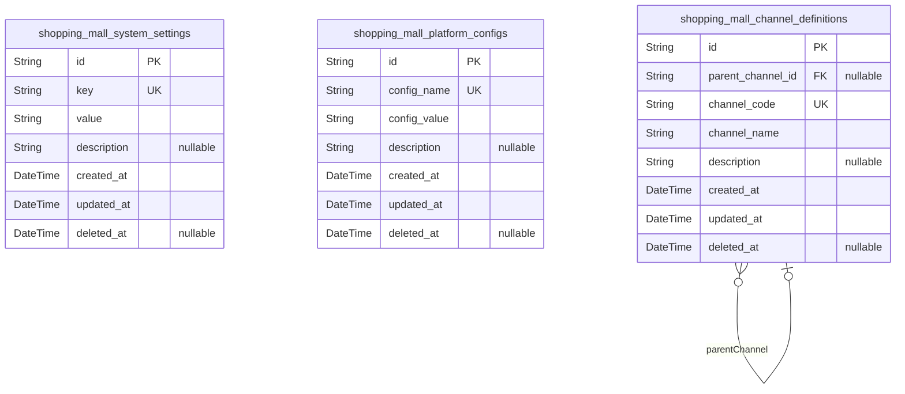
```mermaid
erDiagram
"shopping_mall_system_settings" {
  String id PK
  String key UK
  String value
  String description "nullable"
  DateTime created_at
  DateTime updated_at
  DateTime deleted_at "nullable"
}
"shopping_mall_platform_configs" {
  String id PK
  String config_name UK
  String config_value
  String description "nullable"
  DateTime created_at
  DateTime updated_at
  DateTime deleted_at "nullable"
}
"shopping_mall_channel_definitions" {
  String id PK
  String parent_channel_id FK "nullable"
  String channel_code UK
  String channel_name
  String description "nullable"
  DateTime created_at
  DateTime updated_at
  DateTime deleted_at "nullable"
}
"shopping_mall_channel_definitions" }o--o| "shopping_mall_channel_definitions" : parentChannel
```

### `shopping_mall_system_settings`

Stores global system settings and configuration values for the shopping
mall platform infrastructure. Holds configurable parameters impacting
system behavior and administration.

Properties as follows:

- `id`: Primary Key.
- `key`: Unique key identifier for the system setting.
- `value`: Value corresponding to the configuration key.
- `description`: Detailed explanation of the setting's purpose and usage.
- `created_at`: Record creation timestamp.
- `updated_at`: Record last update timestamp.
- `deleted_at`: Soft delete timestamp; null if active.

### `shopping_mall_platform_configs`

Configuration parameters specific to the shopping mall platform instance,
including feature flags, versioning, and environment settings.

Properties as follows:

- `id`: Primary Key.
- `config_name`: Unique name of the configuration parameter.
- `config_value`: Value of the configuration parameter.
- `description`: Detailed explanation of the configuration usage.
- `created_at`: Record creation timestamp.
- `updated_at`: Record last modification timestamp.
- `deleted_at`: Soft delete timestamp, null if active.

### `shopping_mall_channel_definitions`

Defines communication or operational channels within the shopping mall
platform. Supports hierarchical channel groups via parent-child
relationships.

Properties as follows:

- `id`: Primary Key.
- `parent_channel_id`
  > Reference to the parent channel for hierarchical grouping. {@link
  > shopping_mall_channel_definitions.id}.
- `channel_code`: Unique code identifying the channel.
- `channel_name`: Human-readable name of the channel.
- `description`: Descriptive text explaining the channel's purpose.
- `created_at`: When the channel was created.
- `updated_at`: Last time the channel was updated.
- `deleted_at`: Soft delete timestamp to mark channel as removed.

## Actors

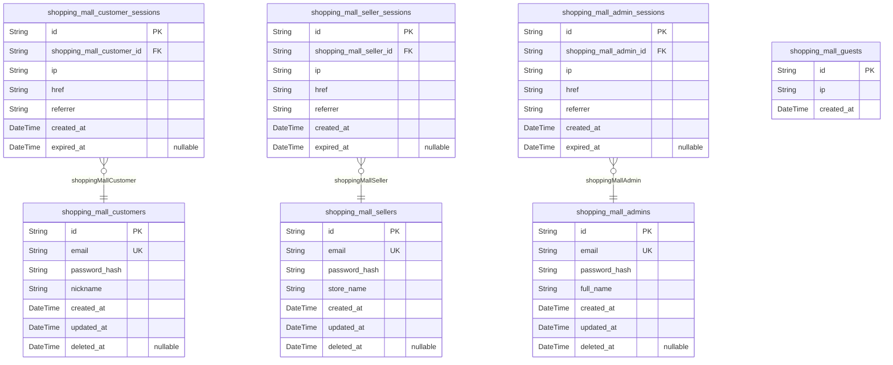
```mermaid
erDiagram
"shopping_mall_customers" {
  String id PK
  String email UK
  String password_hash
  String nickname
  DateTime created_at
  DateTime updated_at
  DateTime deleted_at "nullable"
}
"shopping_mall_customer_sessions" {
  String id PK
  String shopping_mall_customer_id FK
  String ip
  String href
  String referrer
  DateTime created_at
  DateTime expired_at "nullable"
}
"shopping_mall_sellers" {
  String id PK
  String email UK
  String password_hash
  String store_name
  DateTime created_at
  DateTime updated_at
  DateTime deleted_at "nullable"
}
"shopping_mall_seller_sessions" {
  String id PK
  String shopping_mall_seller_id FK
  String ip
  String href
  String referrer
  DateTime created_at
  DateTime expired_at "nullable"
}
"shopping_mall_admins" {
  String id PK
  String email UK
  String password_hash
  String full_name
  DateTime created_at
  DateTime updated_at
  DateTime deleted_at "nullable"
}
"shopping_mall_admin_sessions" {
  String id PK
  String shopping_mall_admin_id FK
  String ip
  String href
  String referrer
  DateTime created_at
  DateTime expired_at "nullable"
}
"shopping_mall_guests" {
  String id PK
  String ip
  DateTime created_at
}
"shopping_mall_customer_sessions" }o--|| "shopping_mall_customers" : shoppingMallCustomer
"shopping_mall_seller_sessions" }o--|| "shopping_mall_sellers" : shoppingMallSeller
"shopping_mall_admin_sessions" }o--|| "shopping_mall_admins" : shoppingMallAdmin
```

### `shopping_mall_customers`

Customer accounts registered on the shopping mall platform. Customers can
log in, manage personal profiles, shopping carts, orders, and reviews.
Each customer has unique authentication credentials and related sessions.

Properties as follows:

- `id`: Primary Key.
- `email`: Unique email address for customer login and communication.
- `password_hash`: Hashed password for secure authentication.
- `nickname`: Display name or nickname of the customer.
- `created_at`: Account creation timestamp.
- `updated_at`: Last profile update timestamp.
- `deleted_at`: Timestamp when the account is soft deleted, if applicable.

### `shopping_mall_customer_sessions`

Authentication sessions for shopping mall customers. Each session
corresponds to a login instance for a customer acting in their security
context.

Properties as follows:

- `id`: Primary Key.
- `shopping_mall_customer_id`: Belonged customer's [shopping_mall_customers.id](#shopping_mall_customers).
- `ip`: IP address from which the session originated.
- `href`: URL where session was initiated.
- `referrer`: Referrer URL for the session start.
- `created_at`: Session creation timestamp.
- `expired_at`: Session expiration timestamp, if applicable.

### `shopping_mall_sellers`

Seller accounts registered on the shopping mall platform. Sellers manage
their own product listings, inventory, orders, and storefront profiles.

Properties as follows:

- `id`: Primary Key.
- `email`: Unique email address for seller login and communication.
- `password_hash`: Hashed password for secure authentication.
- `store_name`: Name of the seller's store or business.
- `created_at`: Account creation timestamp.
- `updated_at`: Last profile update timestamp.
- `deleted_at`: Timestamp when the account is soft deleted, if applicable.

### `shopping_mall_seller_sessions`

Authentication sessions for shopping mall sellers. Each session
corresponds to a seller's login instance with authentication context.

Properties as follows:

- `id`: Primary Key.
- `shopping_mall_seller_id`: Belonged seller's [shopping_mall_sellers.id](#shopping_mall_sellers).
- `ip`: IP address of seller session origin.
- `href`: URL where session was created.
- `referrer`: Referrer URL of the session.
- `created_at`: Session creation timestamp.
- `expired_at`: Optional session expiration timestamp.

### `shopping_mall_admins`

Administrative user accounts who have full access to all platform
features and management functions.

Properties as follows:

- `id`: Primary Key.
- `email`: Unique email address for admin login.
- `password_hash`: Hashed password for admin authentication.
- `full_name`: Full name of the admin user.
- `created_at`: Admin account creation timestamp.
- `updated_at`: Last profile update timestamp.
- `deleted_at`: Soft deletion timestamp, if applicable.

### `shopping_mall_admin_sessions`

Authentication sessions for platform administrators. Records login
instances and security data per admin user.

Properties as follows:

- `id`: Primary Key.
- `shopping_mall_admin_id`: Belonged admin's [shopping_mall_admins.id](#shopping_mall_admins).
- `ip`: IP address of admin session origin.
- `href`: URL where session was initiated.
- `referrer`: Referrer URL of the session start.
- `created_at`: Session creation timestamp.
- `expired_at`: Optional expiration timestamp for the session.

### `shopping_mall_guests`

Guest user session representations for unauthenticated visitors browsing
the shopping mall catalog. Guests have limited access and no
authentication sessions.

Properties as follows:

- `id`: Primary Key.
- `ip`: IP address of the guest user.
- `created_at`: Timestamp of the guest session creation.

## ProductCatalog

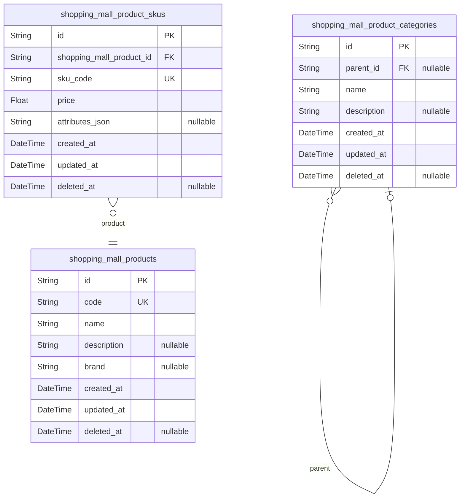
```mermaid
erDiagram
"shopping_mall_product_categories" {
  String id PK
  String parent_id FK "nullable"
  String name
  String description "nullable"
  DateTime created_at
  DateTime updated_at
  DateTime deleted_at "nullable"
}
"shopping_mall_products" {
  String id PK
  String code UK
  String name
  String description "nullable"
  String brand "nullable"
  DateTime created_at
  DateTime updated_at
  DateTime deleted_at "nullable"
}
"shopping_mall_product_skus" {
  String id PK
  String shopping_mall_product_id FK
  String sku_code UK
  Float price
  String attributes_json "nullable"
  DateTime created_at
  DateTime updated_at
  DateTime deleted_at "nullable"
}
"shopping_mall_product_categories" }o--o| "shopping_mall_product_categories" : parent
"shopping_mall_product_skus" }o--|| "shopping_mall_products" : product
```

### `shopping_mall_product_categories`

Product categories organized hierarchically with parent-child
relationship supporting flexible nested categorization for products.
Enforces unique category names within the same hierarchy level to ensure
unambiguous navigation and filtering. Serves as the primary
classification mechanism for products within the shopping mall platform.

Properties as follows:

- `id`: Primary Key.
- `parent_id`
  > Parent category's [shopping_mall_product_categories.id](#shopping_mall_product_categories). Nullable
  > for top-level categories.
- `name`: Category name, unique among sibling categories to avoid conflicts.
- `description`: Detailed description of the category's purpose and content.
- `created_at`: Category creation timestamp.
- `updated_at`: Category last update timestamp.
- `deleted_at`: Soft delete timestamp for the category.

### `shopping_mall_products`

Products listed within the shopping mall platform, each assigned to one
or more categories. Represents core commerce entities with detailed
attributes for descriptions, branding, and pricing. Maintains inventory
and variant relationships through SKUs. Enables sellers and admins to
manage product information independently.

Properties as follows:

- `id`: Primary Key.
- `code`: Unique business identifier code for the product.
- `name`: Product name with descriptive title.
- `description`: Detailed textual description of the product.
- `brand`: Brand or manufacturer name for the product.
- `created_at`: Product creation timestamp.
- `updated_at`: Product last updated timestamp.
- `deleted_at`: Soft delete timestamp for the product.

### `shopping_mall_product_skus`

Stock Keeping Units (SKU) representing distinct product variants defined
by combinations of attributes such as color, size, and other options.
Each SKU has a unique code and pricing information. Inventory tracking is
performed externally via other components. Related to a single product
and enables granular product management.

Properties as follows:

- `id`: Primary Key.
- `shopping_mall_product_id`: Referenced product's [shopping_mall_products.id](#shopping_mall_products).
- `sku_code`: Unique SKU code identifying the variant globally.
- `price`: Price of this SKU variant.
- `attributes_json`: JSON-encoded variant attributes such as color, size, and options.
- `created_at`: SKU creation timestamp.
- `updated_at`: SKU last updated timestamp.
- `deleted_at`: Soft delete timestamp for the SKU.

## Shopping

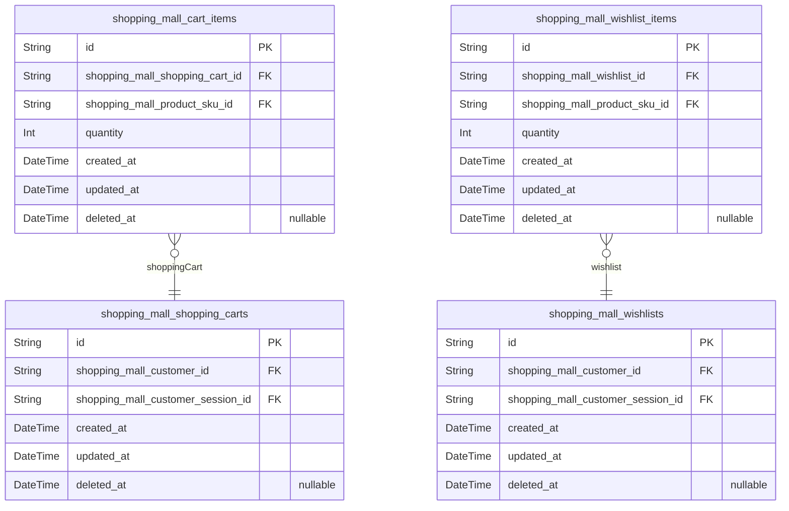
```mermaid
erDiagram
"shopping_mall_shopping_carts" {
  String id PK
  String shopping_mall_customer_id FK
  String shopping_mall_customer_session_id FK
  DateTime created_at
  DateTime updated_at
  DateTime deleted_at "nullable"
}
"shopping_mall_cart_items" {
  String id PK
  String shopping_mall_shopping_cart_id FK
  String shopping_mall_product_sku_id FK
  Int quantity
  DateTime created_at
  DateTime updated_at
  DateTime deleted_at "nullable"
}
"shopping_mall_wishlists" {
  String id PK
  String shopping_mall_customer_id FK
  String shopping_mall_customer_session_id FK
  DateTime created_at
  DateTime updated_at
  DateTime deleted_at "nullable"
}
"shopping_mall_wishlist_items" {
  String id PK
  String shopping_mall_wishlist_id FK
  String shopping_mall_product_sku_id FK
  Int quantity
  DateTime created_at
  DateTime updated_at
  DateTime deleted_at "nullable"
}
"shopping_mall_cart_items" }o--|| "shopping_mall_shopping_carts" : shoppingCart
"shopping_mall_wishlist_items" }o--|| "shopping_mall_wishlists" : wishlist
```

### `shopping_mall_shopping_carts`

Shopping cart information associated with a customer and their session.
This entity stores the overall cart state for the customer, allowing
persistent shopping across sessions and devices. It references the owning
customer and the current session and supports soft deletion and temporal
tracking.

Properties as follows:

- `id`: Primary Key.
- `shopping_mall_customer_id`: Belonged customer's [shopping_mall_customers.id](#shopping_mall_customers).
- `shopping_mall_customer_session_id`
  > Current customer session [shopping_mall_customer_sessions.id](#shopping_mall_customer_sessions) for
  > cart tracking.
- `created_at`: Cart creation timestamp.
- `updated_at`: Cart last update timestamp.
- `deleted_at`: Soft delete field to mark cart as deleted.

### `shopping_mall_cart_items`

Individual items contained in a customer's shopping cart. Each item
references the shopping cart it belongs to, as well as the individual
product SKU being purchased. This entity allows managing multiple SKUs
within a single cart, including quantities and timestamps.

Properties as follows:

- `id`: Primary Key.
- `shopping_mall_shopping_cart_id`: Referenced shopping cart [shopping_mall_shopping_carts.id](#shopping_mall_shopping_carts).
- `shopping_mall_product_sku_id`: SKU of the product [shopping_mall_product_skus.id](#shopping_mall_product_skus) added to cart.
- `quantity`: Quantity of this SKU added to the cart.
- `created_at`: Item addition timestamp.
- `updated_at`: Item last update timestamp.
- `deleted_at`: Soft delete field for cart items.

### `shopping_mall_wishlists`

Wishlist belonging to a customer, representing a collection of product
SKUs the customer is interested in purchasing later. It maintains session
linkage and temporal tracking to allow persistent, user-specific
wishlists.

Properties as follows:

- `id`: Primary Key.
- `shopping_mall_customer_id`: Owner customer's [shopping_mall_customers.id](#shopping_mall_customers).
- `shopping_mall_customer_session_id`
  > Current customer session [shopping_mall_customer_sessions.id](#shopping_mall_customer_sessions)
  > capturing wishlist activity.
- `created_at`: Wishlist creation timestamp.
- `updated_at`: Wishlist last update timestamp.
- `deleted_at`: Soft delete timestamp marking wishlist removal.

### `shopping_mall_wishlist_items`

Individual product SKUs added by a customer to their wishlist. Each item
references the wishlist it belongs to and the associated product SKU. It
tracks quantity and timestamp info for accurate wishlist management.

Properties as follows:

- `id`: Primary Key.
- `shopping_mall_wishlist_id`: Parent wishlist [shopping_mall_wishlists.id](#shopping_mall_wishlists).
- `shopping_mall_product_sku_id`: Product SKU included in wishlist [shopping_mall_product_skus.id](#shopping_mall_product_skus).
- `quantity`: Number of SKU units wished for.
- `created_at`: Timestamp when SKU was added to wishlist.
- `updated_at`: Last update timestamp of wishlist item.
- `deleted_at`: Soft delete field for wishlist items.

## Orders

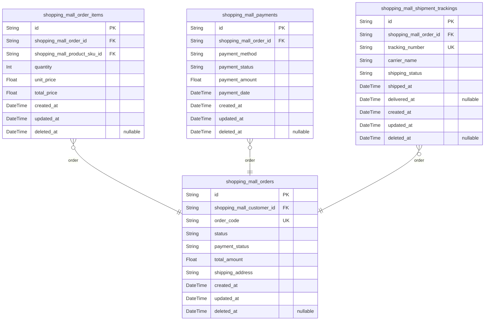
```mermaid
erDiagram
"shopping_mall_orders" {
  String id PK
  String shopping_mall_customer_id FK
  String order_code UK
  String status
  String payment_status
  Float total_amount
  String shipping_address
  DateTime created_at
  DateTime updated_at
  DateTime deleted_at "nullable"
}
"shopping_mall_order_items" {
  String id PK
  String shopping_mall_order_id FK
  String shopping_mall_product_sku_id FK
  Int quantity
  Float unit_price
  Float total_price
  DateTime created_at
  DateTime updated_at
  DateTime deleted_at "nullable"
}
"shopping_mall_payments" {
  String id PK
  String shopping_mall_order_id FK
  String payment_method
  String payment_status
  Float payment_amount
  DateTime payment_date
  DateTime created_at
  DateTime updated_at
  DateTime deleted_at "nullable"
}
"shopping_mall_shipment_trackings" {
  String id PK
  String shopping_mall_order_id FK
  String tracking_number UK
  String carrier_name
  String shipping_status
  DateTime shipped_at
  DateTime delivered_at "nullable"
  DateTime created_at
  DateTime updated_at
  DateTime deleted_at "nullable"
}
"shopping_mall_order_items" }o--|| "shopping_mall_orders" : order
"shopping_mall_payments" }o--|| "shopping_mall_orders" : order
"shopping_mall_shipment_trackings" }o--|| "shopping_mall_orders" : order
```

### `shopping_mall_orders`

Customer orders placed on the shopping mall platform. Includes order
lifecycle status, payment status, total amount, shipping address, and
references to the owning customer. Supports soft deletion and timestamps
for lifecycle management.

Properties as follows:

- `id`: Primary Key.
- `shopping_mall_customer_id`: Owning customer's [shopping_mall_customers.id](#shopping_mall_customers).
- `order_code`: Unique order code used for business reference and lookup.
- `status`
  > Current status of the order (e.g., pending, processing, shipped,
  > delivered, cancelled).
- `payment_status`: Status of payment for this order (e.g., unpaid, paid, refunded).
- `total_amount`: Total amount payable for the order, accounting for all items and fees.
- `shipping_address`: Full shipping address for order delivery.
- `created_at`: Timestamp when the order was created.
- `updated_at`: Timestamp of last order update.
- `deleted_at`: Timestamp marking when the order was logically deleted (soft delete).

### `shopping_mall_order_items`

Line items within a customer order, each linked to a specific product
SKU. Contains quantity, unit price, and extended pricing for inventory
tracking and order detail accuracy.

Properties as follows:

- `id`: Primary Key.
- `shopping_mall_order_id`: Parent order [shopping_mall_orders.id](#shopping_mall_orders).
- `shopping_mall_product_sku_id`: Associated SKU variant [shopping_mall_product_skus.id](#shopping_mall_product_skus).
- `quantity`: Quantity of the SKU ordered.
- `unit_price`: Price per unit at order time.
- `total_price`: Extended price for this line item (quantity multiplied by unit price).
- `created_at`: Timestamp when the order item was created.
- `updated_at`: Timestamp of last modification to the order item.
- `deleted_at`: Logical deletion timestamp for the order item, if applicable.

### `shopping_mall_payments`

Payment records for orders, capturing payment method, status, amount, and
timestamps for audit and reconciliation.

Properties as follows:

- `id`: Primary Key.
- `shopping_mall_order_id`: The order this payment is associated with [shopping_mall_orders.id](#shopping_mall_orders).
- `payment_method`: Payment method used (e.g., credit_card, bank_transfer).
- `payment_status`: Current status of the payment (e.g., pending, completed, failed).
- `payment_amount`: Amount paid for the order.
- `payment_date`: Date and time when the payment was made.
- `created_at`: Timestamp for record creation.
- `updated_at`: Timestamp for last update of the payment record.
- `deleted_at`: Timestamp for logical deletion of the payment record.

### `shopping_mall_shipment_trackings`

Shipment tracking information for orders, including tracking number,
carrier, status, and timestamps for shipment lifecycle monitoring.

Properties as follows:

- `id`: Primary Key.
- `shopping_mall_order_id`: Related order for this shipment tracking [shopping_mall_orders.id](#shopping_mall_orders).
- `tracking_number`: Carrier-provided shipment tracking number.
- `carrier_name`: Name of the shipping carrier, e.g., UPS, FedEx.
- `shipping_status`: Current status of the shipment (e.g., shipped, in_transit, delivered).
- `shipped_at`: Date and time the shipment was sent.
- `delivered_at`: Date and time the shipment was delivered, if applicable.
- `created_at`: Record creation timestamp.
- `updated_at`: Timestamp of last update to this record.
- `deleted_at`: Soft deletion timestamp.

## Reviews

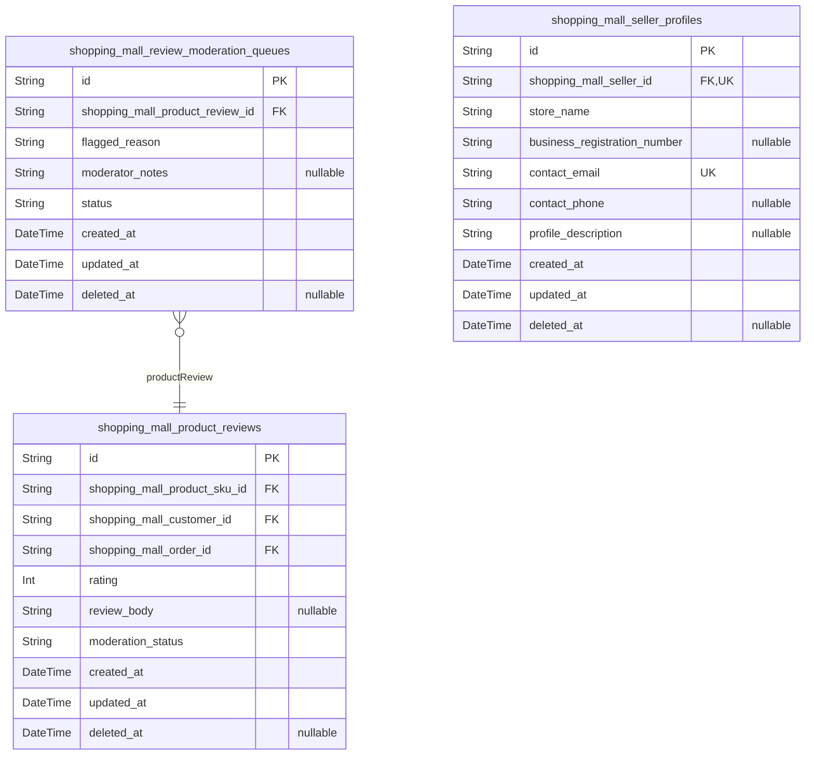
```mermaid
erDiagram
"shopping_mall_product_reviews" {
  String id PK
  String shopping_mall_product_sku_id FK
  String shopping_mall_customer_id FK
  String shopping_mall_order_id FK
  Int rating
  String review_body "nullable"
  String moderation_status
  DateTime created_at
  DateTime updated_at
  DateTime deleted_at "nullable"
}
"shopping_mall_review_moderation_queues" {
  String id PK
  String shopping_mall_product_review_id FK
  String flagged_reason
  String moderator_notes "nullable"
  String status
  DateTime created_at
  DateTime updated_at
  DateTime deleted_at "nullable"
}
"shopping_mall_seller_profiles" {
  String id PK
  String shopping_mall_seller_id FK,UK
  String store_name
  String business_registration_number "nullable"
  String contact_email UK
  String contact_phone "nullable"
  String profile_description "nullable"
  DateTime created_at
  DateTime updated_at
  DateTime deleted_at "nullable"
}
"shopping_mall_review_moderation_queues" }o--|| "shopping_mall_product_reviews" : productReview
```

### `shopping_mall_product_reviews`

Customer product reviews capturing ratings and textual feedback, linked
to products and customers, with moderation status and timestamps.
Supports audit trails and versioning of review data.

Properties as follows:

- `id`: Primary Key.
- `shopping_mall_product_sku_id`: Referenced product SKU. [shopping_mall_product_skus.id](#shopping_mall_product_skus).
- `shopping_mall_customer_id`: Customer who submitted the review. [shopping_mall_customers.id](#shopping_mall_customers).
- `shopping_mall_order_id`
  > Order associated with this review to verify purchase. {@link
  > shopping_mall_orders.id}.
- `rating`: Numeric rating from 1 to 5 representing customer satisfaction.
- `review_body`: Optional textual comments provided by customer (max 1000 chars).
- `moderation_status`: Review moderation status such as 'pending', 'approved', or 'rejected'.
- `created_at`: Review creation timestamp.
- `updated_at`: Review last updated timestamp.
- `deleted_at`: Soft delete timestamp for logical removal (null if active).

### `shopping_mall_review_moderation_queues`

Active moderation queue holding reviews and related content flagged for
administrative review or automatic filtering. Enables tracking of review
status, moderator actions, and notes.

Properties as follows:

- `id`: Primary Key.
- `shopping_mall_product_review_id`
  > Linked product review requiring moderation. {@link
  > shopping_mall_product_reviews.id}.
- `flagged_reason`: Reason for review being flagged and sent to moderation.
- `moderator_notes`: Optional notes added by moderators during review.
- `status`
  > Moderation queue status such as 'pending', 'approved', 'rejected', or
  > 'needs_changes'.
- `created_at`: Timestamp when the review was queued for moderation.
- `updated_at`: Timestamp of last moderation action update.
- `deleted_at`: Soft deletion timestamp to mark moderation queue rows as inactive.

### `shopping_mall_seller_profiles`

Profiles for sellers containing business and contact information,
supporting identity verification and profile management. Linked to
shopping_mall_sellers for authentication and authorization.

Properties as follows:

- `id`: Primary Key.
- `shopping_mall_seller_id`: Linked seller identity. [shopping_mall_sellers.id](#shopping_mall_sellers).
- `store_name`: Official store or business name of the seller.
- `business_registration_number`: Government-issued business registration number for verification.
- `contact_email`: Primary contact email for seller communications.
- `contact_phone`: Contact phone number for seller support.
- `profile_description`: Description or biography of the seller's store.
- `created_at`: Timestamp of profile creation.
- `updated_at`: Timestamp of last profile update.
- `deleted_at`: Soft delete flag indicating profile removal.

## Inventory

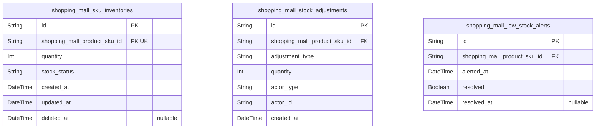
```mermaid
erDiagram
"shopping_mall_sku_inventories" {
  String id PK
  String shopping_mall_product_sku_id FK,UK
  Int quantity
  String stock_status
  DateTime created_at
  DateTime updated_at
  DateTime deleted_at "nullable"
}
"shopping_mall_stock_adjustments" {
  String id PK
  String shopping_mall_product_sku_id FK
  String adjustment_type
  Int quantity
  String actor_type
  String actor_id
  DateTime created_at
}
"shopping_mall_low_stock_alerts" {
  String id PK
  String shopping_mall_product_sku_id FK
  DateTime alerted_at
  Boolean resolved
  DateTime resolved_at "nullable"
}
```

### `shopping_mall_sku_inventories`

Represents current inventory levels for each product SKU. Tracks
available quantity, stock status, and last updated timestamps. References
shopping_mall_product_skus to tie inventory data to specific variants.
Maintains data integrity with non-nullable foreign keys and consistent
temporal fields. Supports real-time inventory queries and stock
availability checks.

Properties as follows:

- `id`: Primary Key.
- `shopping_mall_product_sku_id`: Belongs to product SKU [shopping_mall_product_skus.id](#shopping_mall_product_skus).
- `quantity`: Current inventory quantity for this SKU. Cannot be negative.
- `stock_status`: Inventory stock status, e.g., 'in stock', 'out of stock', 'backordered'.
- `created_at`: Record creation timestamp.
- `updated_at`: Record last update timestamp.
- `deleted_at`: Soft deletion timestamp. Null if not deleted.

### `shopping_mall_stock_adjustments`

Records all inventory stock adjustments for SKUs including additions,
subtractions, reservations, and releases. Each adjustment logs the SKU
affected, the quantity change, adjustment type, actor (customer, seller,
admin) responsible, and timestamps for audit and operational integrity.
Ensures that adjustments maintain accurate inventory states and provide
complete history for reconciliation.

Properties as follows:

- `id`: Primary Key.
- `shopping_mall_product_sku_id`
  > Inventory adjustment related to product SKU {@link
  > shopping_mall_product_skus.id}.
- `adjustment_type`
  > Type of adjustment: 'addition', 'subtraction', 'reservation', or
  > 'release'.
- `quantity`
  > Quantity adjusted; positive integer for additions/reservations, negative
  > for subtractions.
- `actor_type`: Type of actor who made the adjustment: 'customer', 'seller', or 'admin'.
- `actor_id`: ID of the actor who performed adjustment. Reference depends on actor_type.
- `created_at`: Timestamp when the adjustment was made.

### `shopping_mall_low_stock_alerts`

Captures alerts generated when SKU inventory falls below configured low
stock thresholds. Records the SKU involved, alert generation timestamp,
resolution status, and notification details. Supports operational
monitoring and proactive restocking workflows by sellers and
administrators.

Properties as follows:

- `id`: Primary Key.
- `shopping_mall_product_sku_id`
  > SKU for which the low stock alert was generated {@link
  > shopping_mall_product_skus.id}.
- `alerted_at`: Timestamp when the low stock alert was triggered.
- `resolved`: Flag indicating if the alert has been resolved.
- `resolved_at`: Timestamp when the alert was resolved, null if unresolved.

## OrderHistory

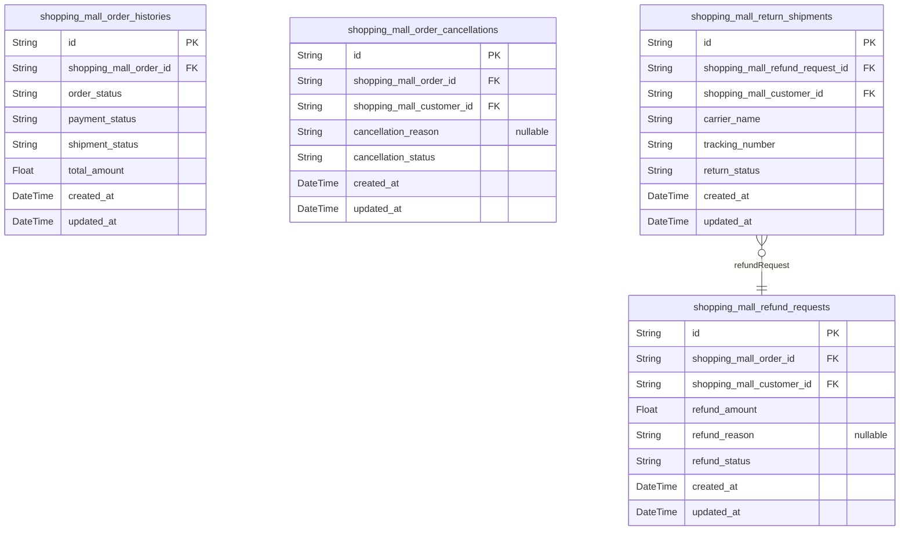
```mermaid
erDiagram
"shopping_mall_order_histories" {
  String id PK
  String shopping_mall_order_id FK
  String order_status
  String payment_status
  String shipment_status
  Float total_amount
  DateTime created_at
  DateTime updated_at
}
"shopping_mall_order_cancellations" {
  String id PK
  String shopping_mall_order_id FK
  String shopping_mall_customer_id FK
  String cancellation_reason "nullable"
  String cancellation_status
  DateTime created_at
  DateTime updated_at
}
"shopping_mall_refund_requests" {
  String id PK
  String shopping_mall_order_id FK
  String shopping_mall_customer_id FK
  Float refund_amount
  String refund_reason "nullable"
  String refund_status
  DateTime created_at
  DateTime updated_at
}
"shopping_mall_return_shipments" {
  String id PK
  String shopping_mall_refund_request_id FK
  String shopping_mall_customer_id FK
  String carrier_name
  String tracking_number
  String return_status
  DateTime created_at
  DateTime updated_at
}
"shopping_mall_return_shipments" }o--|| "shopping_mall_refund_requests" : refundRequest
```

### `shopping_mall_order_histories`

Historical records capturing the full lifecycle and state changes of
orders placed by customers on the shopping mall platform. Tracks all
modifications over time, including status updates, payments, and shipment
events for auditing and analysis purposes. References the primary {@link
shopping_mall_orders.id} entity. Used for immutable audit trails and
comprehensive order history queries.

Properties as follows:

- `id`: Primary Key.
- `shopping_mall_order_id`: Referenced order's [shopping_mall_orders.id](#shopping_mall_orders).
- `order_status`
  > Current status of the order at this historical snapshot (e.g., 'pending',
  > 'shipped', 'cancelled').
- `payment_status`: Status of payment at this snapshot (e.g., 'paid', 'pending', 'failed').
- `shipment_status`: Shipment state of the order at this point in time.
- `total_amount`: Total monetary amount for the order at this snapshot.
- `created_at`
  > Snapshot creation timestamp capturing when this history record was
  > recorded.
- `updated_at`: Timestamp for last update of this snapshot record.

### `shopping_mall_order_cancellations`

Records of customer-initiated order cancellations. Tracks cancellation
requests, reasons, statuses, and timestamps related to orders. Each
cancellation references the original order and the customer who requested
it. Enables audit trail and processing workflows for order cancellations.

Properties as follows:

- `id`: Primary Key.
- `shopping_mall_order_id`: Related order's [shopping_mall_orders.id](#shopping_mall_orders).
- `shopping_mall_customer_id`: Customer who requested cancellation [shopping_mall_customers.id](#shopping_mall_customers).
- `cancellation_reason`: Text describing the customer's reason for cancellation.
- `cancellation_status`
  > Current status of the cancellation process (e.g., 'pending', 'approved',
  > 'rejected').
- `created_at`: Timestamp when the cancellation request was created.
- `updated_at`: Last update timestamp of the cancellation record.

### `shopping_mall_refund_requests`

Tracks customer refund requests for orders. Contains refund amounts,
reasons, statuses, and linked order and customer information. Used for
managing refund workflows and auditing financial adjustments related to
sales.

Properties as follows:

- `id`: Primary Key.
- `shopping_mall_order_id`: Associated order for refund [shopping_mall_orders.id](#shopping_mall_orders).
- `shopping_mall_customer_id`: Customer who requested refund [shopping_mall_customers.id](#shopping_mall_customers).
- `refund_amount`: Monetary amount requested for refund.
- `refund_reason`: Text description of the refund reason provided by customer.
- `refund_status`
  > Current processing status of the refund (e.g., 'pending', 'approved',
  > 'declined').
- `created_at`: Timestamp when refund request was created.
- `updated_at`: Last update time for refund request record.

### `shopping_mall_return_shipments`

Records of physical return shipments linked to refund requests. Tracks
shipment tracking information, carrier details, return status, and
timestamps. Associated with the refund request and customer. Supports
return process monitoring and customer notifications.

Properties as follows:

- `id`: Primary Key.
- `shopping_mall_refund_request_id`: Associated refund request [shopping_mall_refund_requests.id](#shopping_mall_refund_requests).
- `shopping_mall_customer_id`: Customer returning the product [shopping_mall_customers.id](#shopping_mall_customers).
- `carrier_name`: Name of the shipping carrier handling the return.
- `tracking_number`: Carrier-provided tracking number for the return shipment.
- `return_status`
  > Current status of the return shipment (e.g., 'requested', 'in_transit',
  > 'received', 'inspected', 'completed').
- `created_at`: Timestamp when return shipment was created.
- `updated_at`: Last update timestamp for return shipment record.

## AdminDashboard

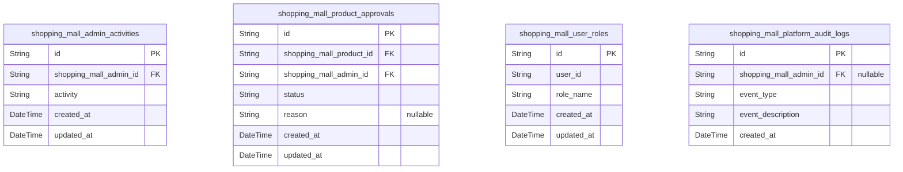
```mermaid
erDiagram
"shopping_mall_admin_activities" {
  String id PK
  String shopping_mall_admin_id FK
  String activity
  DateTime created_at
  DateTime updated_at
}
"shopping_mall_product_approvals" {
  String id PK
  String shopping_mall_product_id FK
  String shopping_mall_admin_id FK
  String status
  String reason "nullable"
  DateTime created_at
  DateTime updated_at
}
"shopping_mall_user_roles" {
  String id PK
  String user_id
  String role_name
  DateTime created_at
  DateTime updated_at
}
"shopping_mall_platform_audit_logs" {
  String id PK
  String shopping_mall_admin_id FK "nullable"
  String event_type
  String event_description
  DateTime created_at
}
```

### `shopping_mall_admin_activities`

Records all actions performed by admin users on the platform for audit
and tracking purposes. It logs what operation was performed, when, and by
which admin user, aiding compliance and forensic analysis.

Properties as follows:

- `id`: Primary Key.
- `shopping_mall_admin_id`: Admin user performing the activity. [shopping_mall_admins.id](#shopping_mall_admins)
- `activity`: Description of the admin activity performed.
- `created_at`: Activity timestamp when the action occurred.
- `updated_at`: Timestamp for the last update to the activity record.

### `shopping_mall_product_approvals`

Tracks the approval status of products submitted by sellers. Records
which admin performed the approval, status updates, and timestamps for
moderation tracking and compliance verification.

Properties as follows:

- `id`: Primary Key.
- `shopping_mall_product_id`: Product being approved. [shopping_mall_products.id](#shopping_mall_products)
- `shopping_mall_admin_id`
  > Admin user who approved or rejected the product. {@link
  > shopping_mall_admins.id}
- `status`: Approval status (e.g., pending, approved, rejected).
- `reason`: Reason for rejection or comments by the admin.
- `created_at`: Timestamp for when the approval record was created.
- `updated_at`: Timestamp for the last update to the approval record.

### `shopping_mall_user_roles`

Manages user roles in the platform, detailing which user has what role
(e.g., admin, customer, seller) with timestamps for audit and role change
tracking.

Properties as follows:

- `id`: Primary Key.
- `user_id`: Identifier of the user the role is assigned to.
- `role_name`: Name of the role granted to the user (e.g., admin, seller, customer).
- `created_at`: Timestamp when the role was assigned.
- `updated_at`: Timestamp for the last update to this role assignment.

### `shopping_mall_platform_audit_logs`

Comprehensive audit logs for platform-wide actions and system events.
Supports forensic analysis, security audits, and operational monitoring
with detailed metadata and timestamps.

Properties as follows:

- `id`: Primary Key.
- `shopping_mall_admin_id`
  > Admin user related to this audit event, if available. {@link
  > shopping_mall_admins.id}
- `event_type`: Type of the audit event, e.g., login, access, change.
- `event_description`: Detailed description of the event.
- `created_at`: Timestamp when the audit event was recorded.

## BusinessRules

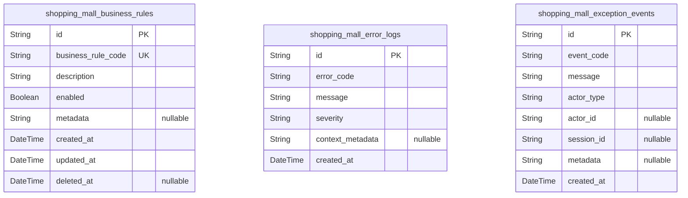
```mermaid
erDiagram
"shopping_mall_business_rules" {
  String id PK
  String business_rule_code UK
  String description
  Boolean enabled
  String metadata "nullable"
  DateTime created_at
  DateTime updated_at
  DateTime deleted_at "nullable"
}
"shopping_mall_error_logs" {
  String id PK
  String error_code
  String message
  String severity
  String context_metadata "nullable"
  DateTime created_at
}
"shopping_mall_exception_events" {
  String id PK
  String event_code
  String message
  String actor_type
  String actor_id "nullable"
  String session_id "nullable"
  String metadata "nullable"
  DateTime created_at
}
```

### `shopping_mall_business_rules`

Business rules enforcing platform-wide constraints, validation logic, and
compliance checkpoints. Each rule has a unique code and descriptive
metadata guiding system behavior and validation. Acts as a centralized
source for business rule definitions and aids in automated enforcement.

Properties as follows:

- `id`: Primary Key.
- `business_rule_code`: Unique business rule identifier code.
- `description`
  > Detailed textual explanation of the rule's intent, scope, and application
  > context.
- `enabled`: Flag indicating whether the rule is active and enforced by the system.
- `metadata`
  > JSON-encoded additional data for rule parameters, conditions, or complex
  > configurations.
- `created_at`: Timestamp when the business rule was created.
- `updated_at`: Timestamp of the last update to the business rule.
- `deleted_at`: Soft delete timestamp marking the rule as inactive without removal.

### `shopping_mall_error_logs`

Comprehensive error logs capturing operational errors, system faults, and
exception traces occurring within the shoppingMall platform. Each log
entry records error codes, messages, severity, context metadata, and
timestamps for troubleshooting and audit purposes.

Properties as follows:

- `id`: Primary Key.
- `error_code`: System-specific code identifying the type of error encountered.
- `message`: Detailed error message describing the issue encountered.
- `severity`: Severity level of the error (e.g., INFO, WARNING, ERROR, CRITICAL).
- `context_metadata`
  > JSON-encoded metadata capturing environmental/contextual details relevant
  > to the error.
- `created_at`: Timestamp when the error was logged.

### `shopping_mall_exception_events`

Records of exception events for auditing and operational analysis,
encompassing uncaught exceptions and handled edge cases within the
system. Stores event codes, detailed messages, associated actor and
session references, metadata, and temporal information to aid root cause
analysis and compliance.

Properties as follows:

- `id`: Primary Key.
- `event_code`: Unique code representing the exception event type.
- `message`: Detailed description of the exception event.
- `actor_type`: Type of actor involved in the event, e.g., customer, seller, admin.
- `actor_id`: Reference to the actor's unique identifier involved in the event.
- `session_id`: Reference to the session associated with the event, if applicable.
- `metadata`
  > JSON-encoded supplementary data providing additional context or
  > diagnostics.
- `created_at`: Timestamp of when the exception event occurred.

## default

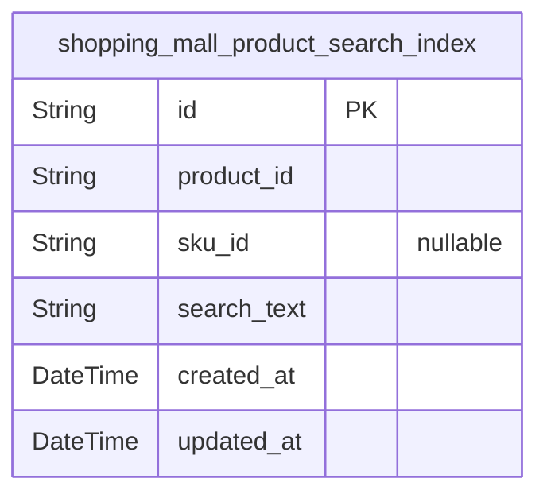
```mermaid
erDiagram
"shopping_mall_product_search_index" {
  String id PK
  String product_id
  String sku_id "nullable"
  String search_text
  DateTime created_at
  DateTime updated_at
}
```

### `shopping_mall_product_search_index`

Materialized view optimized for full-text product and SKU search
operations. Contains denormalized and precomputed search fields for
efficient keyword and attribute-based querying. This table is read-only
and updated by background processes to reflect current product catalog
state.

Properties as follows:

- `id`: Primary Key.
- `product_id`: Related product's [shopping_mall_products.id](#shopping_mall_products).
- `sku_id`
  > Related SKU's [shopping_mall_product_skus.id](#shopping_mall_product_skus). Nullable if index
  > entry relates only to product level.
- `search_text`: Concatenated searchable text for full-text search.
- `created_at`: Search index entry creation timestamp.
- `updated_at`: Search index entry last updated timestamp.
