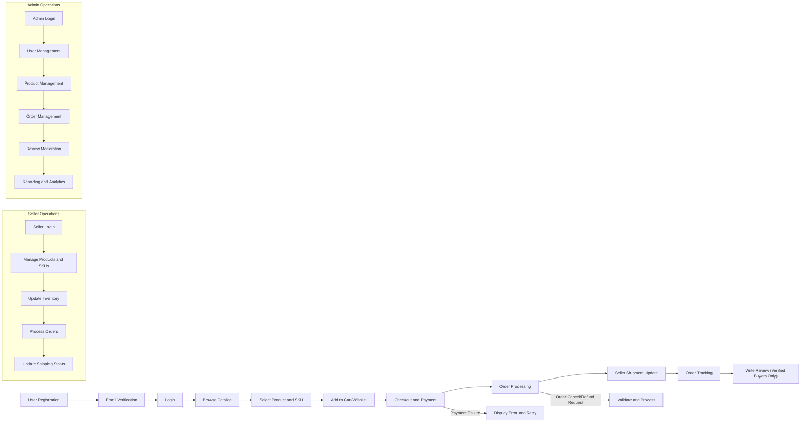

# E-commerce Shopping Mall Platform Requirements Analysis Report

## 1. Introduction and Business Model

### 1.1 Business Justification
The e-commerce shopping mall platform aims to establish a robust, user-friendly online marketplace connecting customers and sellers efficiently. It addresses market demands for a comprehensive platform that supports diverse product variants, seller-managed inventories, and seamless purchase experiences.

### 1.2 Revenue Model
The platform shall generate revenue primarily through transactional commissions on sales, subscription fees for seller services, and targeted promotional advertising.

### 1.3 Growth Strategy
Growth will focus on user acquisition through marketing campaigns, seller onboarding programs, and enhancing user retention via continuous feature innovation and performance improvements.

### 1.4 Success Metrics
The platform shall measure success by achievements in monthly active users, transaction volumes, customer satisfaction rates, average order values, and seller engagement levels.

## 2. User Roles and Authentication

### 2.1 User Roles
- Guest: Browses product catalog and registers an account.
- Customer: Manages profile, addresses, shopping cart, orders, reviews, and refund requests.
- Seller: Manages product listings with SKUs, inventory, orders, and shipment updates.
- Admin: Oversees platform operations including user management, product controls, orders, reviews, and analytics.

### 2.2 Authentication Requirements
- WHEN a user registers, THE system SHALL collect email, password, and basic profile information.
- THE system SHALL enforce unique email verification and password strength requirements.
- USERS SHALL log in using verified email and password only.
- THE system SHALL maintain secure sessions with automatic expiration after inactivity.
- Password reset requests SHALL send secure email links.
- Role-based access control SHALL enforce permission boundaries per user role.

## 3. Functional Requirements

### 3.1 User Registration and Profile Management
- WHEN a visitor registers, THE system SHALL validate unique email and password security.
- THE system SHALL allow users to add, edit, and delete multiple shipping addresses.

### 3.2 Product Catalog and Search
- THE system SHALL organize products into hierarchical categories.
- Users SHALL be able to search, filter, and sort products.

### 3.3 Product Variants and SKUs
- THE system SHALL support multiple SKUs per product differing in color, size, and options.
- Inventory and pricing SHALL be managed per SKU.

### 3.4 Shopping Cart and Wishlist
- THE system SHALL allow customers to add SKUs to the cart and save items in wishlists.
- Shopping carts SHALL persist across logged-in sessions.

### 3.5 Order Placement and Payment Processing
- WHEN a customer places an order, THE system SHALL validate SKU inventory and compute total costs including taxes and shipping.
- THE system SHALL support multiple payment methods including credit cards and PayPal.
- Payment authorization SHALL be confirmed before order acceptance.

### 3.6 Order Tracking and Shipping Status
- Customers SHALL track order statuses including shipment tracking.
- Sellers SHALL update shipping status and tracking information.
- THE system SHALL notify customers upon status changes.

### 3.7 Product Reviews and Ratings
- Only customers who purchased products SHALL be allowed to submit reviews.
- Reviews SHALL require admin approval before publication.

### 3.8 Seller Account Management
- Sellers SHALL create and manage their product listings and SKUs.
- Sellers SHALL update inventory and process orders.
- Shipping status updates SHALL be managed by sellers for their fulfilled orders.

### 3.9 Inventory Management
- THE system SHALL track inventory at the SKU level.
- THE system SHALL prevent overselling by validating stock before order confirmation.

### 3.10 Order History and Refunds
- Customers SHALL view order history and request cancellations or refunds within platform policies.
- Refund requests SHALL require admin approval.

### 3.11 Admin Dashboard
- Admins SHALL monitor and manage all users, orders, products, and reviews.
- Dashboard SHALL provide reporting on sales, user activity, and inventory.

## 4. Business Rules and Constraints

- Inventory SHALL never fall below zero.
- Order statuses SHALL transition through defined states: Pending Payment, Paid, Processing, Shipped, Delivered, Cancelled.
- Payment confirmation SHALL precede order fulfillment.
- Reviews SHALL be moderated before display.
- Email verification SHALL precede order placement.

## 5. User Scenarios and Workflows

- Registration and login flows with validation and password reset.
- Browsing catalog with filtering and search.
- Adding products with SKUs to the cart and placing orders.
- Payment processing and confirmation.
- Order tracking and shipping updates.
- Seller product management and shipping status updates.
- Admin moderation of reviews and order management.
- Error scenarios such as payment failure, inventory shortage, and unauthorized actions.

## 6. Order and Payment Processing

- Order creation after cart confirmation.
- Payment authorization and capture.
- Inventory update on order confirmation.
- Order status progression.
- Cancellation and refund request handling including approval workflows.

## 7. Inventory and Product Management

- SKU creation, status transitions (Draft, Active, Inactive).
- Inventory adjustments with audit logs.
- Automated low stock alerts.

## 8. Review and Rating Management

- Submission restrictions to verified buyers.
- Moderation and approval workflows.
- Aggregation and display of average ratings.

## 9. Admin Dashboard Functionalities

- User account controls including suspension and reactivation.
- Product and inventory management including bulk operations.
- Order oversight and exception handling.
- Analytics dashboards for business metrics.

## 10. Error Handling and Recovery

- Validation error messages.
- Retry mechanisms for payment and order processes.
- User notifications for failures and success.

## 11. Performance and Security Requirements

- Response times under 3 seconds for key actions.
- Secure authentication with MFA for sellers and admins.
- Data encryption and compliance with privacy laws.
- Rate limiting and threat detection.

## 12. External Integrations and System Context

- Payment gateway integrations.
- Shipping carrier API integration for tracking updates.

---

## Mermaid Diagram: User Interactions and Workflows

This comprehensive requirements analysis report defines a clear and complete set of business rules, user roles, workflows, and system expectations for the e-commerce shopping mall platform development.