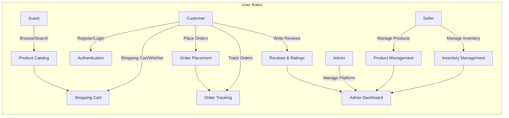
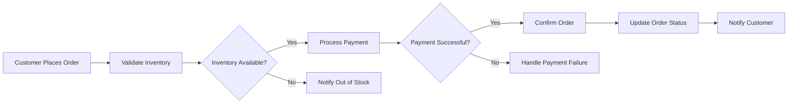

# E-commerce Shopping Mall Platform Requirements Analysis Report

## 1. Introduction

The purpose of this document is to define the comprehensive business requirements for the e-commerce shopping mall platform backend. This platform serves as a robust marketplace enabling buyers to browse, search, and purchase products offered by multiple sellers with variant options while managing orders, payments, and fulfillment efficiently.

This report targets backend developers, system architects, and stakeholders involved in implementation, ensuring all functional and business rules are clearly and unambiguously defined.

## 2. Business Overview

### 2.1 Business Model

The platform connects sellers with customers by aggregating diverse products into a single marketplace. Revenue is generated primarily through transaction fees, premium seller services, and advertising. The system must support customizable product variants (SKUs), inventory management per SKU, secure payment processing, order tracking, and administration controls.

### 2.2 User Actors and Roles

- **Guest**: Unauthenticated users who can browse products without purchasing.
- **Customer**: Registered users who manage accounts, shipping addresses, carts, orders, reviews, and payments.
- **Seller**: Authorized users managing their product listings, SKUs, inventory, and order fulfillment.
- **Admin**: Platform administrators overseeing products, orders, users, and system settings.

Role-based access control must govern platform features strictly.

## 3. Functional Requirements

### 3.1 User Registration and Login

WHEN a guest submits registration details including a unique email and secure password, THEN the system SHALL create a customer account and require email verification.
WHEN a customer logs in with valid credentials, THEN the system SHALL authenticate within 2 seconds and establish a secure session.
IF login fails, THEN the system SHALL notify the user with explicit error messaging.
WHEN a password reset is requested, THEN the system SHALL generate a secure token to allow password updating.

### 3.2 Address Management

THE customer SHALL be able to add, edit, and delete multiple shipping addresses (up to 5) with validation for postal codes and required fields.
ONE address SHALL be markable as the default shipping address.
Errors in address input SHALL prompt detailed validation messages.

### 3.3 Product Catalog and Search

THE system SHALL maintain a hierarchical product category structure.
WHEN a user searches with filters including category, price range, and attributes, THEN relevant products SHALL return within 3 seconds sorted by relevance.

### 3.4 Product Variants (SKU) Management

THE system SHALL support multiple SKUs per product differentiated by color, size, and customizable options.
SELLERS SHALL manage SKU pricing and inventory levels individually.
Duplicate SKUs SHALL be prevented.

### 3.5 Shopping Cart and Wishlist

THE customer SHALL maintain a persistent shopping cart allowing add, update, and remove operations on SKUs.
THE customer SHALL be able to add SKUs to a wishlist with the option to transfer items to the cart.

### 3.6 Order Placement and Payment

WHEN placing an order, THE system SHALL validate SKU inventory to ensure stock availability.
THE system SHALL calculate totals including taxes, discounts, and shipping fees accurately.
Payment processing SHALL integrate securely with external payment gateways.
IF payment fails, THEN the system SHALL cancel the order and notify the customer.

### 3.7 Order Tracking and Shipping Status

THE system SHALL track order status changes: Pending, Processing, Shipped, Delivered, Cancelled.
THE customer SHALL receive real-time notifications on shipping milestones.
SELLERS SHALL update shipment statuses promptly.

### 3.8 Product Reviews and Ratings

ONLY customers who purchased a product SHALL submit reviews and ratings.
THE system SHALL moderate reviews for inappropriate content before publishing.

### 3.9 Seller Account Management

SELLERS SHALL create, update, and disable their product listings and variants.
SELLERS SHALL receive notifications about new orders and inventory alerts.

### 3.10 Inventory Management

THE system SHALL decrement inventory per SKU upon confirmed orders.
LOW stock alerts SHALL notify sellers based on configurable thresholds.

### 3.11 Order History and Cancellation/Refund

CUSTOMERS SHALL view their complete order history with statuses.
CANCELLATION requests SHALL be allowed within 1 hour post-order placement if not shipped.
REFUND requests SHALL be processed with admin approval.

### 3.12 Admin Dashboard

ADMINS SHALL access a comprehensive dashboard for orders, products, users, sellers, refunds, and platform configurations.
Filtering and reporting capabilities SHALL enable operational oversight.

## 4. Business Rules and Validation

- Email addresses MUST be unique platform-wide.
- Passwords MUST meet specified complexity requirements.
- Inventory counts MAY NOT fall below zero.
- Product variants MUST have unique SKU identifiers.
- Order cancellations ARE ONLY allowed within defined time windows and status conditions.
- Reviews must comply with content policies and are subject to moderation.

## 5. Error Handling Requirements

WHEN authentication or authorization fails, THE system SHALL provide precise error messages with no sensitive details.
WHEN inventory is insufficient, THE system SHALL prevent order placement and notify the user promptly.
WHEN payments fail or time out, THE system SHALL rollback transactions and inform users.
Input validation errors SHALL prompt detailed, field-specific messages.

## 6. Performance Requirements

THE system SHALL respond to login requests within 2 seconds 95% of the time under normal load.
Product search SHALL return paginated results of 20 items per page within 3 seconds.
Order processing including payment SHALL complete within 5 seconds.
THE system SHALL support concurrency for at least 10,000 logged-in users.

## 7. Security and Compliance (Referenced)

Security requirements including authentication protocols, data encryption, role validations, and audit logging SHALL be detailed in the security requirements document.

## 8. Third-Party Integrations (Referenced)

Payment gateways, shipping APIs, and notification services SHALL be integrated as per their respective requirements specifications.

## 9. Data Flow and Lifecycle Diagrams

### 9.1 User Roles and Interactions

```mermaid
graph LR
  subgraph "User Roles"
    guest["Guest"] -->|"Browse/Search"| productCatalog["Product Catalog"]
    customer["Customer"] -->|"Register/Login"| auth["Authentication"]
    customer -->|"Shopping Cart/Wishlist"| cart["Shopping Cart"]
    customer -->|"Place Orders"| order["Order Placement"]
    customer -->|"Track Orders"| tracking["Order Tracking"]
    customer -->|"Write Reviews"| review["Reviews & Ratings"]
    seller["Seller"] -->|"Manage Products"| productMgmt["Product Management"]
    seller -->|"Manage Inventory"| inventory["Inventory Management"]
    admin["Admin"] -->|"Manage Platform"| adminDashboard["Admin Dashboard"]
  end
  productCatalog --> cart
  order --> tracking
  review --> adminDashboard
  productMgmt --> adminDashboard
  inventory --> adminDashboard
```

### 9.2 Order Lifecycle

```mermaid
graph LR
  A["Customer Places Order"] --> B["Validate Inventory"]
  B --> C{"Inventory Available?"}
  C -->|"Yes"| D["Process Payment"]
  C -->|"No"| E["Notify Out of Stock"]
  D --> F{"Payment Successful?"}
  F -->|"Yes"| G["Confirm Order"]
  F -->|"No"| H["Handle Payment Failure"]
  G --> I["Update Order Status"]
  I --> J["Notify Customer"]
```

## 10. Summary

The e-commerce shopping mall platform must deliver seamless multi-role interactions, robust SKU and inventory management, secure order and payment workflows, and comprehensive operational oversight through admin dashboards. All requirements are expressed in clear business language emphasizing precise conditions, validations, and timely user feedback to enable effective backend development.

Developers retain full discretion to implement appropriate technologies following these business requirements to deliver a scalable, secure, and user-centric marketplace system.