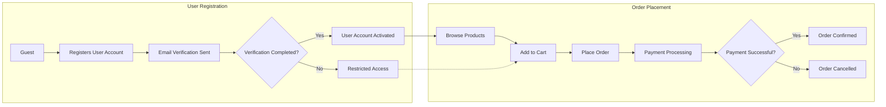

# Functional Requirements for E-Commerce Shopping Mall Platform

## 1. Introduction
The e-commerce shopping mall platform serves as a multi-vendor marketplace connecting customers and sellers. This document defines business requirements for backend developers to implement the platform’s functionality in a production-ready manner.

## 2. Business Model
The platform enables customers to browse a rich catalog of products, place orders, and submit reviews while empowering sellers to manage inventories and fulfillment.

## 3. User Actors and Authentication
### 3.1 Actors
- Guest: Unauthenticated user browsing catalog.
- Customer: Registered user with access to account, orders, reviews.
- Seller: Vendor managing own products and orders.
- Admin: Platform administrator with full access.

### 3.2 Authentication and Authorization
- Email/password registration with verification mandatory.
- Password reset capabilities.
- JWT session tokens with role-based access control.

## 4. Functional Requirements
### 4.1 User Registration and Login
- WHEN a guest registers, THE system SHALL create a user account after email verification.
- WHEN login credentials are valid, THE system SHALL authenticate user and establish a session.
- The system SHALL reject invalid logins with descriptive errors.

### 4.2 Address Management
- Customers SHALL manage multiple shipping addresses with validation.

### 4.3 Product Catalog and Search
- Products SHALL be categorized hierarchically.
- Search SHALL support filters by category, price, ratings.

### 4.4 Product Variants and SKUs
- Sellers SHALL create multiple variants for colors, sizes, and options.
- Each SKU SHALL have independent inventory and pricing.

### 4.5 Shopping Cart and Wishlist
- Customers SHALL add or remove SKUs from carts.
- Carts SHALL persist across sessions.
- Wishlists SHALL be private.

### 4.6 Order Placement and Payment
- Orders SHALL validate inventory and payment.
- Payment gateways SHALL process payments securely.

### 4.7 Order Tracking and Shipping
- Customers SHALL view order status updates.
- Order status SHALL update with shipping events.

### 4.8 Product Reviews and Ratings
- Purchasers SHALL submit reviews subject to moderation.

### 4.9 Seller Account Management
- Sellers SHALL manage own products, SKUs, inventory.
- Sellers SHALL fulfill orders related to their products.

### 4.10 Inventory Management
- Inventory SHALL be tracked at SKU level.
- System SHALL prevent overselling.

### 4.11 Order History and Cancellation/Refund
- Customers SHALL view order history.
- Cancellations and refunds SHALL be time-bound and require approvals.

### 4.12 Admin Dashboard
- Admins SHALL manage products, orders, users via dashboards.

## 5. Business Rules
- Orders SHALL not be placed with insufficient inventory.
- Email verification required before placing orders.
- Reviews allowed only for purchased products.
- Customers MAY request refunds within 14 days after delivery.
- Sellers MAY update inventory only for their products.

## 6. Error Handling
- Authentication failures SHALL return clear errors.
- Payment failures SHALL abort order creation and notify.
- Inventory shortages SHALL prevent checkout.
- Review violations SHALL reject content with explanations.

## 7. Performance Requirements
- Login SHALL respond within 2 seconds.
- Search SHALL return within 1 second.
- Support 1000 concurrent users.

## 8. User Flow Diagram

```mermaid
graph LR
  subgraph "User Registration"
    A["Guest"] --> B["Registers User Account"]
    B --> C["Email Verification Sent"]
    C --> D{"Verification Completed?"}
    D -->|"Yes"| E["User Account Activated"]
    D -->|"No"| F["Restricted Access"]
  end

  subgraph "Order Placement"
    E --> G["Browse Products"]
    G --> H["Add to Cart"]
    H --> I["Place Order"]
    I --> J["Payment Processing"]
    J --> K{"Payment Successful?"}
    K -->|"Yes"| L["Order Confirmed"]
    K -->|"No"| M["Order Cancelled"]
  end

  F -.-> H
```

This comprehensive requirements analysis provides clear, measurable, and complete business goals and workflows needed for backend implementation. It conforms with EARS standards and includes business rules, error handling, performance needs, and authentication mechanics essential to the success of an e-commerce shopping mall platform.