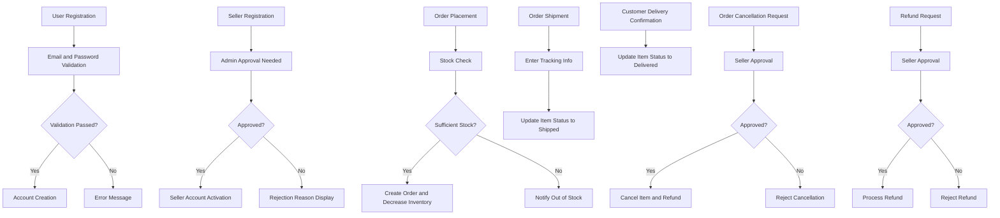

# E-Commerce Shopping Mall Platform Requirements

## 1. Introduction
The platform is a comprehensive e-commerce shopping mall designed to connect customers and sellers securely and efficiently. It facilitates product browsing, purchasing, and order fulfillment, ensuring regulatory compliance through immutable snapshots and administrative oversight.

## 2. Customer Account
- WHEN a user wants to use the platform, THE system SHALL require the user to register an account with a valid email and password; guest browsing is NOT allowed.
- WHEN a customer signs up, THE system SHALL securely store the email and password.
- WHEN a customer attempts to log in, THE system SHALL authenticate using their email and password.
- WHEN a customer requests to change their password, THE system SHALL validate the current password and allow updating to a new password.
- WHEN a customer requests account deletion, THE system SHALL delete their profile information immediately.
- WHEN a customer deletes their account, THE system SHALL preserve all their order records and purchase history for seller records and legal compliance.
- WHEN a customer deletes their account, THE system SHALL preserve their product reviews; these reviews SHALL be displayed under the author "deleted user".

## 3. Customer Profile
- EACH customer SHALL have a profile containing a display name and phone number.
- WHEN a customer edits their profile, THE system SHALL allow updates to the display name and phone number.

## 4. Address Management
- EACH customer SHALL be able to add multiple shipping addresses.
- EACH address SHALL include recipient name, phone number, street address, city, state/province, postal code, and country.
- WHEN a customer edits an address, THE system SHALL allow modification of any field.
- WHEN a customer deletes an address, THE system SHALL remove it permanently.
- EACH customer SHALL be able to set exactly one address as the default shipping address.

## 5. Seller Account
- Sellers SHALL register with email and password.
- WHEN a seller signs up, THE system SHALL create the account with a pending approval status.
- Seller accounts SHALL NOT be active for selling until approved by an administrator.
- Sellers SHALL be able to view their approval status: pending, approved, or rejected.
- IF a seller registration is rejected, THE system SHALL provide a reason for rejection.
- IF a seller is rejected, THEY SHALL be able to submit a new registration request.
- Sellers SHALL be able to change their password after account activation.
- Sellers SHALL be able to delete their account ONLY if they have no pending orders (paid or shipped) and no pending cancellation or refund requests.
- WHEN a seller deletes their account, THE system SHALL delete all their listed products immediately.
- WHEN a seller deletes their account, THE system SHALL preserve order history and snapshots.
- Seller shop names referenced in past orders SHALL remain preserved even after account deletion.

## 6. Seller Profile
- EACH seller SHALL have a profile containing shop name, shop description, and logo image.
- Sellers SHALL be able to edit their shop name, description, and logo.
- WHEN a seller edits their profile, THE system SHALL create an immutable snapshot recording the prior profile state and the changes.
- Customers SHALL be able to view seller profiles through product detail pages.

## 7. Categories
- Products SHALL be organized into categories.
- Categories SHALL support one level of subcategory nesting.
- EACH category SHALL have a name and description.
- Only administrators SHALL be permitted to create, edit, or delete categories.
- WHEN categories are deleted, THE associated products SHALL become uncategorized.
- Customers SHALL be able to browse all categories and view products within categories.

## 8. Snapshot Principle
- All editable data changes SHALL result in snapshot creation capturing the previous state.
- Snapshots SHALL record the change timestamp, changed fields, and before-and-after values.
- Snapshots SHALL be immutable and cannot be deleted or altered.
- Snapshots SHALL be accessible to relevant parties (owners, administrators) for dispute resolution.
- Snapshot entities include products, variants, seller profiles, order items, reviews, cancellation and refund requests.

### Product Snapshot Structure
- WHEN a product is edited, THE system SHALL create a product snapshot containing all product fields, including name, description, category, base price, and images.
- EACH product snapshot SHALL embed snapshots of all product variants at that moment preserving SKU, option values, and price.

## 9. Products
- Sellers SHALL be able to create products with required fields: name, description, category (or subcategory), and base price.
- Products SHALL belong uniquely to the seller who created them.
- Sellers SHALL be able to edit their products.
- EACH product edit SHALL trigger snapshot creation as per "Snapshot Principle."
- Sellers SHALL be allowed to delete a product ONLY if there are no pending order items (paid or shipped) or pending cancellation/refund requests for any variants under that product.
- WHEN a product is deleted, THE system SHALL delete all its variants and inventory records.
- Deleted products SHALL NOT be visible in search or category listings.
- Sellers SHALL be able to view snapshots of their products.
- Administrators SHALL be able to view snapshots of any product.
- Snapshots SHALL be preserved after product deletion.

## 10. Product Images
- Sellers SHALL be able to upload multiple images for each product.
- Sellers SHALL be able to reorder images; the first image SHALL be the thumbnail.
- Sellers SHALL be able to delete images.
- All changes to product images SHALL be captured in product snapshots.

## 11. Product Variants
- EACH product MAY have multiple variants representing option combinations (e.g., color, size).
- EACH variant SHALL have a unique SKU code, option values, optional price override, and stock quantity starting at zero.
- Sellers SHALL be able to add, edit, or delete variants.
- Variant deletions SHALL only be allowed if there are no pending order items or cancellation/refund requests associated.
- A product SHALL have at least one variant for it to be purchasable.
- Products without variants SHALL be visible with status "unavailable."

## 12. Inventory Management
- Stock quantity SHALL be managed per variant via inventory history records.
- EACH inventory record SHALL record quantity change, reason, and timestamp.
- Current stock SHALL be calculated by summing all inventory records for the variant.
- Sellers SHALL be able to add stock with reason and subtract stock with reason.
- Orders and cancellations/refunds SHALL automatically generate inventory adjustments.
- Variants with zero stock SHALL be marked "out of stock" and cannot be added to carts.
- Sellers SHALL be able to view variant inventory history.

## 13. Product Search
- Customers SHALL be able to search products by name.
- Search results SHALL encompass products from all sellers.
- Search results SHALL be paginated.
- Filters SHALL include category, price range, and stock availability.
- Sorting SHALL allow newest first, price ascending, and price descending.

## 14. Product Listing
- Product listings SHALL display thumbnail image, name, base price or price range, seller shop name, and average rating (if available).

## 15. Product Detail Page
- Customers SHALL view product details showing all images, name, description, category, seller profile link, variants with price and stock status, average rating, review count, and all reviews sorted newest first.

## 16. Wishlist
- Customers SHALL add or remove products to/from their wishlist.
- The wishlist SHALL be paginated and show products.
- WHEN a product is deleted, it SHALL be removed from all wishlists.

## 17. Shopping Cart
- Customers SHALL add specific product variants to the cart with specified quantities.
- Quantities for the same variant SHALL combine in the cart.
- The cart SHALL display product name, variant options, price, quantity, and subtotal per item.
- Customers SHALL be able to update item quantities and remove items.
- Cart SHALL calculate total price.
- Warnings SHALL be shown when cart quantity exceeds available stock.
- Deleted or out-of-stock variants SHALL be marked unavailable in the cart.

## 18. Checkout
- Customers SHALL select a shipping address (or default) before checkout.
- Unavailable items SHALL NOT be allowed in the checkout process.
- The order summary SHALL show itemized prices, shipping address, and total price.
- The shipping address SHALL be fixed once order is placed.

## 19. Payment
- Payments SHALL be processed via an external gateway.
- The system SHALL allow payment retry on failure; orders are not created on payment failure.
- Orders SHALL be created only on successful payment.

## 20. Order Creation
- On successful payment, stock quantities SHALL be decreased per purchased variant.
- Purchased items SHALL be removed from the customer's cart.
- An order record SHALL be created with order items corresponding to variants and quantities.
- Each order item SHALL have status "paid."
- Snapshots of products, variants, and seller profiles SHALL be saved with order items to preserve purchased information.

## 21. Order Structure and Status
- Orders SHALL contain one or more order items; each item corresponds to a variant purchase with quantity.
- Order items can be from multiple sellers.
- Each order item SHALL track individual status: paid, shipped, delivered, cancelled, refunded.
- Overall order status SHALL be derived from item statuses: paid, shipped, delivered, cancelled, refunded, or partially completed for mixed states.

## 22. Shipping and Tracking
- Shipments represent packages sent by sellers; items from different sellers shipped separately.
- Sellers SHALL choose items to include in each shipment and enter tracking information.
- When shipment is created, included items SHALL change status to "shipped."
- Customers SHALL view tracking details per shipment.
- Delivery confirmation by the customer changes all items in the shipment to "delivered."
- Items SHALL automatically change to "delivered" after 14 days if no confirmation.

## 23. Order Cancellation
- Customers SHALL request cancellation per order item with status "paid." 
- Cancellation requests SHALL include a reason.
- Sellers SHALL approve or reject cancellations.
- Upon seller response, a snapshot of the cancellation request SHALL be saved.
- If approved, the item status changes to "cancelled" and stock is restored.
- Partial cancellations affect only selected items; order status updates accordingly.

## 24. Refund Requests
- Refund requests SHALL be per order item with status "delivered." 
- Refund requests SHALL include a reason.
- Refunds must be requested within 7 days of delivery.
- Sellers SHALL approve or reject refunds.
- Seller responses SHALL be snapshotted.
- Approved refunds change item status to "refunded" and restore stock.
- Partial refunds adjust only selected items.

## 25. Reviews and Ratings
- Customers SHALL write one review per product per order after delivery.
- Review SHALL include a 1-5 star rating and optional text.
- Reviews SHALL be displayed sorted newest first on product pages.
- Customers SHALL edit or delete their own reviews.
- Each review edit SHALL create a snapshot.
- Deleted reviews remain snapshotted but excluded from rating calculations.
- Product average ratings SHALL be calculated from all non-deleted reviews.

## 26. Seller Dashboard
- Sellers SHALL view summaries: total products, total order items, pending cancellations and refunds.
- Sellers SHALL be able to view and filter order items by status.

## 27. Administrator System
### Becoming an Administrator
- Users MAY submit administrator requests with a reason.
- Super administrators SHALL manage requests: approve or reject.
- Approved users become regular administrators.
### Administrator Grades
- There are regular and super administrators.
- Super administrators can promote or demote other administrators, except themselves.
### Seller Management
- Administrators SHALL approve or reject seller registrations with reasons.
- Rejected sellers MAY resubmit registrations.
- Administrators MAY suspend seller accounts, hiding products and restricting creation/editing, but allowing order processing.
- Administrators MAY unsuspend sellers.
### Category Management
- Administrators CAN create, edit, and delete product categories.
- Deleted categories cause products to become uncategorized.
### Product Oversight
- Administrators CAN view all platform products and their snapshots.
- Administrators CAN delete any product.
### Order Oversight
- Administrators CAN view all orders.
- Administrators CAN force-cancel or force-refund items or entire orders.
### User Management
- Administrators CAN view and ban/unban customers and sellers.
- Banned users cannot log in, but existing orders remain.

---

```mermaid
flowchart TD
  A["User Registration"] --> B["Email and Password Validation"]
  B --> C{"Validation Passed?"}
  C -->|"Yes"| D["Account Creation"]
  C -->|"No"| E["Error Message"]

  F["Seller Registration"] --> G["Admin Approval Needed"]
  G --> H{"Approved?"}
  H -->|"Yes"| I["Seller Account Activation"]
  H -->|"No"| J["Rejection Reason Display"]

  K["Order Placement"] --> L["Stock Check"]
  L --> M{"Sufficient Stock?"}
  M -->|"Yes"| N["Create Order and Decrease Inventory"]
  M -->|"No"| O["Notify Out of Stock"]

  P["Order Shipment"] --> Q["Enter Tracking Info"]
  Q --> R["Update Item Status to Shipped"]

  S["Customer Delivery Confirmation"] --> T["Update Item Status to Delivered"]

  U["Order Cancellation Request"] --> V["Seller Approval"]
  V --> W{"Approved?"}
  W -->|"Yes"| X["Cancel Item and Refund"]
  W -->|"No"| Y["Reject Cancellation"]

  Z["Refund Request"] --> AA["Seller Approval"]
  AA --> AB{"Approved?"}
  AB -->|"Yes"| AC["Process Refund"]
  AB -->|"No"| AD["Reject Refund"]
```

---

This specification serves as the authoritative requirements document for backend development, covering all processes, workflows, roles, and business rules in detail.