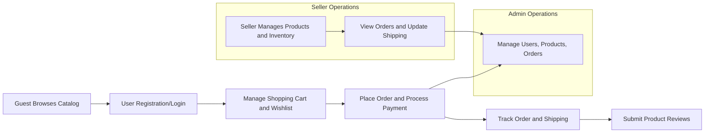

# Requirements Analysis Report for E-Commerce Shopping Mall Platform

## 1. Introduction
This report details the comprehensive business requirements for the e-commerce shopping mall platform backend. It establishes detailed functional and non-functional requirements for all key features, user roles, and workflows necessary to deliver a robust, scalable, and secure marketplace.

## 2. User Management
### 2.1 User Registration and Login
WHEN a guest user registers an account with valid credentials, THEN THE system SHALL create a new customer account with a unique identifier.
WHEN a registered user logs in with valid credentials, THEN THE system SHALL create a secure session to authenticate the user.
IF login credentials are invalid, THEN THE system SHALL deny access and provide a generic authentication error message.

### 2.2 Address Management
THE system SHALL allow authenticated users to add, update, and delete multiple shipping addresses associated with their accounts.
WHEN adding or updating an address, THE system SHALL validate required fields including recipient name, street address, city, postal code, and country.

## 3. Product Catalog
### 3.1 Category Management
THE system SHALL support creation, updating, and deletion of product categories by authorized users.
Categories SHALL be organized hierarchically, supporting parent and child relationships.
Category names SHALL be unique among sibling categories.

### 3.2 Product Listing and Details
THE system SHALL allow sellers to create products assigned to one or more categories.
Products SHALL have detailed descriptions, images, and pricing information.

### 3.3 Product Variants (SKUs)
Products SHALL support multiple variants defined by attributes such as color, size, and other options.
Each SKU SHALL have a unique code, individual price, and inventory quantity.
Inventory SHALL be tracked at the SKU level.

### 3.4 Search Functionality
Users SHALL be able to search products by keywords, filter by category, price range, availability, and attributes.
Search results SHALL be paginated and sortable by relevance, price, and newest arrivals.

## 4. Shopping Cart and Wishlist
### 4.1 Shopping Cart
WHEN a customer adds an SKU to the cart, THEN THE system SHALL persist the cart state across sessions.
Customers SHALL be able to update quantities and remove items from the cart.
SKU availability SHALL be validated before addition or quantity update.

### 4.2 Wishlist
Customers SHALL be able to add SKUs to a wishlist separate from the cart.
The wishlist SHALL be persistent and private to the customer unless sharing is supported.

## 5. Order Management
### 5.1 Order Placement
WHEN a customer places an order, THEN THE system SHALL validate SKU inventory and lock stock to prevent overselling.
The customer SHALL select a shipping address and payment method.

### 5.2 Payment Processing
Payment SHALL be processed securely via supported gateways.
Successful payment confirmation SHALL result in order creation.
Failed payments SHALL notify the customer and abort order creation.

### 5.3 Order Tracking and Shipping Updates
Customers SHALL be able to view real-time order status including shipment progress.
Shipping status changes SHALL trigger notifications.

### 5.4 Order Cancellation and Refunds
Customers SHALL be able to request cancellation before shipment.
Refund requests SHALL be submitted for review post-shipment.

## 6. Product Reviews and Ratings
Customers SHALL be permitted to submit reviews and ratings only for products they have purchased.
Reviews SHALL include a numeric rating and optional textual comments.
Submitted reviews SHALL undergo moderation before public display.

## 7. Seller Account Management
Sellers SHALL register and maintain profiles including business information.
Sellers SHALL manage their own products, SKUs, pricing, and inventory.
Sellers SHALL have access to orders containing their products and be able to update shipping statuses.

## 8. Inventory Management
Inventory SHALL be tracked at the SKU level.
THE system SHALL update inventory on order placement, cancellation, and returns.
Low stock alerts SHALL notify sellers and admins when inventory thresholds are crossed.

## 9. Admin Dashboard
Admins SHALL have comprehensive access to manage products, users, orders, and categories.
Administrative actions SHALL be logged for audit.
Admins SHALL manage user roles, product approvals, order statuses, and platform settings.

## 10. Business Rules and Error Handling
THE system SHALL enforce uniqueness of SKUs per product.
WHEN errors occur (e.g., out of stock, payment failure), THEN THE system SHALL provide clear messages and recover gracefully.
Unauthorized access attempts SHALL be logged and denied.

## 11. Performance and Security
Login and registration responses SHALL occur within 2 seconds.
Product searches SHALL return results within 2 seconds.
Order processing SHALL complete within 5 seconds in normal conditions.
Secure authentication using JWTs SHALL be implemented.
Sensitive data SHALL be encrypted at rest and in transit.

## Diagrams

This requirements analysis report provides detailed, actionable business requirements in natural language using EARS format for the proposed e-commerce shopping mall backend platform. It forms a foundation for developers to build production-ready, scalable systems fulfilling all core needs specified by the stakeholders.