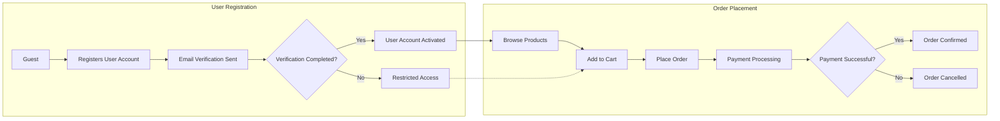

# Service Overview of the E-commerce Shopping Mall Platform

## Introduction
This document provides a comprehensive overview and requirement analysis for the e-commerce shopping mall platform named **shoppingMall**. The platform will facilitate online buying and selling by connecting customers with sellers through a comprehensive product catalog, streamlined order processing, and robust account management features.

This document outlines the business rationale, market positioning, service objectives, and key features to guide backend developers in creating a production-ready, scalable, and secure platform.

## Business Model

### Why This Service Exists
Online shopping continues to grow globally, with a strong demand for versatile platforms that cater to diverse products and sellers. The shopping mall platform aims to fill market gaps by providing a multi-seller marketplace where customers can browse a wide variety of products, personalized through rich product variants (color, size, options). It addresses challenges in inventory management, order processing, and seller empowerment with a unified system.

### Revenue Strategy
The primary revenue model is based on transaction fees charged to sellers for each successful sale processed through the platform. Additional revenue may come from premium seller accounts offering enhanced visibility and promotional tools, as well as targeted advertising services.

### Growth Plan
User acquisition will focus on digital marketing targeting both customer shoppers and sellers seeking new sales channels. Retention strategies include loyalty programs, wishlist features, and personalized recommendations. Expansion will target regional market integration and adding support for diverse payment and shipping methods.

### Success Metrics
- Monthly active users (MAU) for customers and sellers
- Order volume and transaction value
- Average cart size and conversion rates
- Seller satisfaction and retention
- Platform uptime and response times

## User Actors and Authentication

### Actors Overview
- **Guest**: Unauthenticated user who can browse products and view details.
- **Customer**: Registered user who can manage profiles, addresses, carts, orders, reviews, and wishlists.
- **Seller**: Vendor user with permissions to manage product catalogs, inventory by SKU, and order fulfillment.
- **Admin**: Platform administrators having full control over products, orders, users, and dashboard management.

### Authentication Flow
- Users register with email and password, verified via email confirmation.
- Password reset functionality is available.
- JWT tokens with role and permissions payloads manage session authentication.
- User sessions expire after 30 days of inactivity; access tokens expire after 30 minutes; refresh tokens expire after 14 days.

### Permission Matrix
| Action | Guest | Customer | Seller | Admin |
|---|---|---|---|---|
| Browse catalog | ✅ | ✅ | ✅ | ✅ |
| Register account | ✅ | ❌ | ❌ | ❌ |
| Login / Logout | ✅ | ✅ | ✅ | ✅ |
| Manage addresses | ❌ | ✅ | ❌ | ❌ |
| Manage cart and wishlist | ❌ | ✅ | ❌ | ❌ |
| Place orders | ❌ | ✅ | ❌ | ❌ |
| Write reviews | ❌ | ✅ | ❌ | ❌ |
| Manage products | ❌ | ❌ | ✅ | ✅ |
| Manage inventory | ❌ | ❌ | ✅ | ✅ |
| View orders (own products or self) | ❌ | ✅ (self) | ✅ (own products) | ✅ (all) |
| Process orders | ❌ | ❌ | ✅ | ✅ |
| Manage users | ❌ | ❌ | ❌ | ✅ |
| Admin dashboard access | ❌ | ❌ | ❌ | ✅ |

## Functional Requirements

### User Registration and Login
- WHEN a guest submits registration details (email, password), THE system SHALL create a customer account.
- WHEN a customer logs in, THE system SHALL authenticate credentials, issue tokens, and track session.
- THE system SHALL enable customers to add, edit, and delete multiple shipping addresses, each with validation of postal code and country.
- THE system SHALL allow password reset via email link.

### Product Catalog and Search
- THE system SHALL support hierarchical product categories with unlimited subcategories.
- THE system SHALL allow keyword search on product titles, descriptions, and variants.
- THE system SHALL permit filters by category, price range, rating, and availability.
- THE system SHALL display product details including images, descriptions, prices, and variant options.

### Product Variants
- THE system SHALL model product variants (SKUs) with attributes such as color, size, and other options.
- WHEN sellers add products, THE system SHALL enable defining variant combinations with inventory counts.

### Shopping Cart and Wishlist
- THE system SHALL allow customers to add multiple SKUs to their shopping cart.
- THE shopping cart SHALL persist across user sessions.
- THE system SHALL allow customers to create and manage wishlists.
- WHERE sharing is not enabled, wishlists shall remain private.

### Order Placement and Payment Processing
- WHEN a customer confirms checkout, THE system SHALL calculate total cost inclusive of taxes and shipping.
- THE system SHALL integrate with payment gateways to process payments securely.
- WHEN payment succeeds, THE system SHALL create an order record and decrement inventory.
- IF payment fails, THEN THE system SHALL notify the user and abort order creation.

### Order Tracking and Shipping Updates
- THE system SHALL provide real-time order statuses to customers.
- WHEN order status changes (processing, shipped, delivered), THE system SHALL notify customers.
- THE system SHALL support shipping provider integration or manual status updates by sellers.

### Product Reviews and Ratings
- THE system SHALL permit customers to submit ratings and reviews for purchased products.
- THE system SHALL moderate reviews to block inappropriate content.

### Seller Accounts and Features
- THE system SHALL allow users to register as sellers and create a seller profile.
- THE system SHALL enable sellers to list, update, and delete products.
- THE system SHALL provide sellers views of their orders and ability to update fulfillment status.

### Inventory Management
- THE system SHALL track inventory at SKU level.
- WHEN inventory reaches zero, THE system SHALL prevent orders for that SKU.
- THE system SHALL allow sellers to update stock and receive low inventory alerts.

### Order History, Cancellation, and Refund Requests
- THE system SHALL let customers view complete order histories.
- WHEN customers request cancellations or refunds within policy timeframe, THE system SHALL facilitate requests and update statuses accordingly.
- IF cancellations/refunds are approved, THEN THE system SHALL adjust inventory and notify relevant parties.

### Admin Dashboard and Platform Management
- THE system SHALL provide admin dashboard for overseeing users, products, and orders.
- THE system SHALL permit admins full CRUD operations on users, products, and orders.
- THE system SHALL maintain audit logs for admin actions.

## Business Rules
- Orders SHALL not be placed if inventory is insufficient.
- Payment confirmation is mandatory before order confirmation.
- Reviews SHALL be accepted only for products actually purchased and delivered.
- Customers MAY request refunds within 14 days after delivery.
- Sellers MAY update inventory only for their own products.
- Admins SHALL have override capabilities for order and refund processing.

## Error Handling
- IF authentication fails, THE system SHALL provide a clear, actionable error message.
- IF product inventory is insufficient during checkout, THE system SHALL notify the customer immediately.
- IF payment processing fails, THE system SHALL rollback order creation and notify the customer.
- IF review content violates guidelines, THEN THE system SHALL reject submission with explanation.

## Performance Requirements
- THE system SHALL respond to login requests within 2 seconds under normal load.
- THE product catalog search results SHALL return within 1 second.
- THE system SHALL handle up to 1000 concurrent users without degradation.

## Mermaid Diagram: User Registration and Order Process

This document provides business requirements only. All technical implementation decisions belong to developers. Developers have full autonomy over architecture, APIs, and database design. The document describes WHAT the system should do, not HOW to build it.