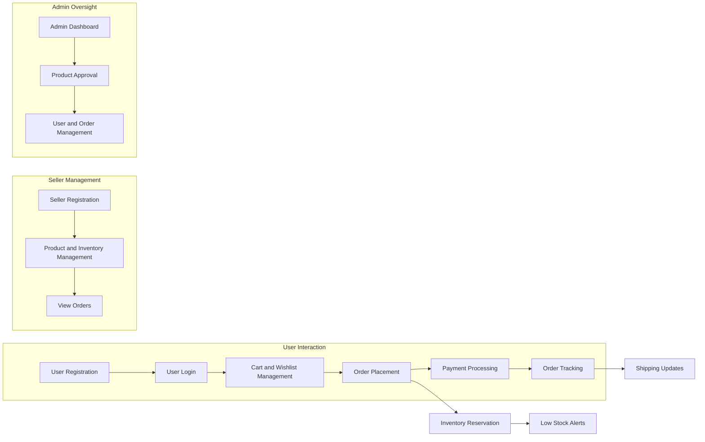

# E-Commerce Shopping Mall Platform - Requirements Analysis Report

## 1. Introduction
This document provides detailed, production-ready business requirements for the E-Commerce Shopping Mall backend platform. It fully covers all requested functionalities, workflows, actors, business rules, error handling, and performance expectations. All requirements follow the EARS format to ensure unambiguous implementation.

## 2. User Registration and Login
### 2.1 User Registration
- WHEN a new user submits valid registration details including email and password, THE system SHALL create a new customer account.
- IF the email address is already registered, THEN THE system SHALL reject registration with an appropriate, clear error message.
- THE system SHALL require email verification before granting full access.
- THE system SHALL enforce strong password policies, including minimum length of 8 characters, uppercase and lowercase letters, numbers, and special characters.
### 2.2 User Login
- WHEN a registered user submits valid credentials, THE system SHALL authenticate and create a secure session.
- IF credentials are invalid, THEN THE system SHALL deny access with a generic authentication failure message.
- THE system SHALL lock the account for 15 minutes after 5 successive failed login attempts.
- THE system SHALL implement JWT-based session management with access and refresh tokens.
### 2.3 Session Management
- THE system SHALL automatically expire access tokens after 15 minutes.
- THE system SHALL provide refresh tokens valid for 30 days.
- THE system SHALL allow users to log out, terminating their sessions immediately.

## 3. Address Management
- WHEN a customer adds a shipping address, THE system SHALL validate the address fields for completeness and format.
- THE system SHALL allow customers to manage multiple addresses (create, update, delete).
- THE system SHALL require at least one valid default address before order placement.

## 4. Product Catalog and Categories
- THE system SHALL structure product categories hierarchically without limit in depth.
- THE system SHALL enforce unique category names among siblings.
- THE system SHALL allow browsing and filtering by category hierarchy.
- THE system SHALL require each product to be assigned to at least one category.

## 5. Product Variants (SKU) Management
- THE system SHALL support products having multiple SKUs representing variant combinations.
- THE system SHALL enforce unique SKU codes globally.
- EACH SKU SHALL have distinct attributes such as color, size, and customizable options.
- THE system SHALL maintain inventory counts at the SKU level.

## 6. Search Functionality
- WHEN a user performs a search, THE system SHALL support filtering by keyword (name/description), category (including subcategories), price range, availability, and brand.
- THE system SHALL support sorting by relevance, price ascending/descending, and newest.
- THE system SHALL paginate results with 20 items per page.
- THE system SHALL return search results within 2 seconds for datasets up to 10,000 products.

## 7. Shopping Cart Management
- EACH authenticated customer SHALL have a persistent shopping cart accessible across sessions and devices.
- THE system SHALL allow adding, updating quantities, and removing SKUs in the cart.
- THE system SHALL prevent adding SKUs with insufficient stock and notify customers.

## 8. Wishlist Functionality
- EACH authenticated customer SHALL have a wishlist separate from the cart.
- THE system SHALL allow adding and removing SKUs to the wishlist.
- IF sharing is supported, THE system SHALL secure wishlist sharing links.

## 9. Order Placement and Payment
- WHEN a customer places an order, THE system SHALL validate SKU availability, reserve inventory, and validate shipping address completeness.
- THE system SHALL support multiple payment methods with secure payment gateway integration.
- THE system SHALL generate unique order IDs upon successful payment.
- IF payment fails, THE system SHALL notify the customer and allow retry.
- THE system SHALL allow order cancellation before shipment initiation.

## 10. Order Tracking and Shipping
- THE system SHALL update customers on order status changes including processing, shipped, in transit, and delivered.
- THE system SHALL send notifications on shipping progress.
- THE system SHALL handle tracking numbers and shipping company details.

## 11. Product Reviews and Ratings
- ONLY customers who have purchased a product SHALL be allowed to submit reviews.
- Reviews SHALL include a 1-5 rating and optional text up to 1000 characters.
- Reviews SHALL be subject to moderation with flagged content blocking public display.
- THE system SHALL notify customers on review approval or rejection.
- THE system SHALL aggregate average ratings and update dynamically.

## 12. Seller Accounts
- Sellers SHALL register and verify identity before managing products.
- Sellers SHALL have permissions limited to managing only their own product listings, inventory, and orders.
- Seller dashboards SHALL provide real-time views of sales and inventory.

## 13. Inventory Management
- THE system SHALL track each SKU’s inventory quantity
- Stock adjustments SHALL be authorized by role
- Low stock alerts SHALL be generated and sent to concerned parties
- Inventory reports SHALL be available on demand

## 14. Order History
- Customers SHALL access their own order histories with full details and filtering.
- Sellers SHALL access orders for their products only.
- Admins SHALL access all orders.

## 15. Order Cancellation and Refunds
- Cancellation requests SHALL be allowed only before shipment and within 24 hours of order placement.
- Refund requests SHALL be accepted for delivered or completed orders within 14 days of delivery.
- Return windows SHALL be enforced and returns tracked by status.

## 16. Admin Dashboard
- Admins SHALL manage all products, categories, users, orders, cancellations, and refunds.
- Product approvals SHALL be required for new or updated products.
- Admin actions SHALL be audited.

## 17. Business Rules
- Duplicate emails SHALL be rejected at registration.
- Inventory SHALL never be negative.
- Only sellers manage their own products and inventory.
- Reviews only from verified purchasers.

## 18. Error Handling
- Clear error messages SHALL be provided for invalid inputs or unauthorized actions.
- Concurrent modification conflicts SHALL trigger error notifications.

## 19. Performance Requirements
- Login SHALL respond within 2 seconds.
- Catalog search SHALL complete within 2 seconds.
- Order placements SHALL complete within 10 seconds.

## 20. Security Requirements
- Strong password policies and account lockouts SHALL be enforced.
- JWT authentication with secure token management SHALL be implemented.
- Sensitive data SHALL be encrypted in transit and rest.
- Role-based access control SHALL restrict features as per actor.

## 21. Mermaid Diagrams

This report provides detailed, unambiguous, implementable functional requirements for backend developers to build the e-commerce platform comprehensively according to business needs and best practices.