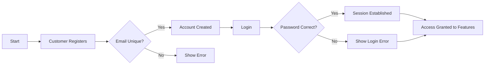
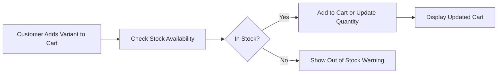

# E-Commerce Shopping Mall Platform

## Customer Account

- WHEN a user registers with a valid email and password, THE system SHALL create a new customer account.
- Customers SHALL be required to authenticate (log in) using their email and password before accessing any other platform features.
- WHEN a customer requests a password change, THE system SHALL verify the current password before allowing the update.
- WHEN a customer requests account deletion, THE system SHALL delete the customer's profile information.
- AFTER account deletion, the system SHALL preserve the customer's order history and records for legal and seller reference.
- Customer reviews SHALL be preserved but shown as "deleted user" after account deletion.

## Customer Profile

- EACH customer SHALL have a profile containing a display name and phone number.
- Customers SHALL be able to edit their display name and phone number.
- ALL profile edits SHALL create snapshots recording previous states, timestamps, and changed values for dispute resolution.

## Address Management

- Customers MAY add multiple shipping addresses containing recipient name, phone number, street address, city, state/province, postal code, and country.
- Customers SHALL be able to edit, delete, and manage their shipping addresses.
- ONE address MAY be set as the default shipping address.

## Seller Account

- Sellers SHALL register using a valid email and password.
- Seller accounts SHALL require administrator approval before activation for selling products.
- Sellers SHALL be able to check their approval status and view rejection reasons if applicable.
- Sellers MAY submit new registration requests if previously rejected.
- Sellers MAY change their passwords post-registration.
- Sellers SHALL delete their accounts only if no pending orders with statuses "paid" or "shipped" exist and no pending cancellation or refund requests.
- Upon seller account deletion, their products SHALL be removed from listings, but order history and seller information in past orders SHALL be retained.

## Seller Profile

- EACH seller profile SHALL include a shop name, description, and logo image.
- Sellers MAY edit their shop name, description, and logo.
- EVERY edit SHALL create immutable snapshots capturing previous states and change details.
- Customers SHALL be able to view seller profiles.

## Categories

- Products SHALL be organized into categories, allowing a single level of subcategory nesting.
- EACH category SHALL have a name and description.
- Category management SHALL be restricted to administrators.
- Customers SHALL browse all categories and view products under each.

## Snapshot Principle

- ALL mutable data modifications SHALL create snapshots capturing the timestamp, what was changed, and previous/new values.
- Snapshots SHALL be immutable and preserved indefinitely.
- SNAPSHOT coverage includes products, product variants, seller profiles, order items, reviews, cancellation, and refund requests.

## Products

- Sellers SHALL create products with required fields: name, description, category, and base price.
- Products MUST belong to the creating seller.
- Editing a product SHALL create a snapshot of its previous state.
- Products MAY be deleted by sellers only if there are no pending order items or requests related to any of its variants.
- Deleted products SHALL be removed from listings but their snapshots shall remain accessible.

## Product Images

- Sellers MAY upload multiple images per product.
- Images MAY be reordered; the first image SHALL serve as the thumbnail.
- Image additions and changes SHALL be captured in product snapshots.
- Sellers MAY delete images.

## Product Variants (SKU)

- Products MAY have multiple variants, each representing a unique combination of option values.
- Each variant SHALL have a unique SKU code, option values, an optional price override, and a stock quantity starting at zero.
- Variant modifications SHALL create snapshots.
- Variants MAY be deleted only when no pending order items or requests apply.
- A product MUST have at least one variant to be available for purchase.
- Products with no variants SHALL remain visible but be marked "unavailable".

## Inventory Management

- Stock quantity per variant SHALL be maintained through inventory history records detailing quantity changes, reasons, and timestamps.
- Sellers SHALL manage inventory by adding positive or negative quantity records with reasons.
- Stock recalculations SHALL be done by summing inventory history.
- Order placements and cancellations SHALL automatically adjust inventory.
- Variants with zero stock SHALL be marked "out of stock" and cannot be added to carts.

## Product Search

- Customers SHALL search products by name across all sellers.
- Results SHALL be paginated and support filtering by category, price range, and stock availability.
- Sorting options include newest first, low to high price, and high to low price.

## Product Listing

- Product listings SHALL display main image, name, price range, seller shop name, and average rating.

## Product Detail Page

- THE product detail page SHALL show all images, full product description, category, seller's shop profile link, variants with prices and stock status, and aggregated review data.

## Wishlist

- Customers SHALL be able to add and remove products to/from their wishlist.
- The wishlist SHALL be paginated and updated automatically when products are deleted.

## Shopping Cart

- Customers SHALL add specific product variants with quantities to their shopping cart.
- If a variant exists in cart, quantities SHALL be combined.
- The cart SHALL display itemized details and total price.
- Any out of stock or deleted variant SHALL be marked unavailable in cart and cannot be checked out.

## Checkout

- Customers SHALL select a shipping address for checkout, defaulting to the preferred address if set.
- The system SHALL provide an order summary before confirmation.
- Upon ordering, the selected shipping address SHALL be locked.

## Payment

- Orders SHALL be confirmed post payment through an external payment gateway.
- Failed payments SHALL allow customers to retry.
- Successful payments SHALL trigger order creation workflows.

## Order Creation

- Upon order placement, stock SHALL decrement according to ordered quantities.
- Cart items SHALL be removed correspondingly.
- Orders SHALL be created with multiple order items, each tracking product, variant, seller snapshots at purchase time.

## Order Structure

- Orders SHALL group one or more ordered variants each with their quantity.
- Each order item SHALL maintain an individual status.
- Items MAY belong to multiple sellers.
- Order item statuses include paid, shipped, delivered, cancelled, and refunded.
- Overall order status SHALL be computed based on item statuses.

## Order History

- Customers SHALL view paginated, reverse-chronological order lists showing overview details.
- Detail views SHALL include item info, shipping addresses, and shipment tracking.

## Order Status

- Item statuses control shipment and cancellation flows.
- Overall order status adapts dynamically per item status aggregation.

## Shipping and Tracking

- Shipments SHALL bundle one or more order items from a single seller.
- Sellers SHALL manage shipment creation with tracking info.
- Customers SHALL view and confirm delivery, triggering status updates.
- Automatic delivery confirmation SHALL occur after 14 days without customer confirmation.

## Order Cancellation

- Customers SHALL request cancellations per item with reason.
- Sellers SHALL respond with approval/rejection creating a snapshot of request status.
- Approved cancellations SHALL revert stock and mark items as cancelled.
- Partial cancellations handled appropriately.

## Refund Requests

- Customers SHALL request refunds per delivered item within seven days with a reason.
- Sellers SHALL approve or reject the request with snapshots of these responses.
- Approved refunds SHALL return stock and mark items refunded.
- Partial and full order refunds handled accordingly.

## Reviews and Ratings

- Customers SHALL review delivered products once per order.
- Reviews require a 1-5 star rating and optional comment.
- Review edits create immutable snapshots.
- Deleted reviews remain preserved but marked.
- Average product rating computed excluding deleted reviews.

## Seller Dashboard

- Sellers SHALL see stats on products, orders, and pending cancellation/refund requests.
- Sellers SHALL list order items with status filters.

## Administrator System

- Any user SHALL request admin access with reason; super admins approve/reject.
- Admins have defined roles: regular and super, with promotion and demotion handled by super admins.
- Admins manage seller approvals, suspensions, and category/product oversight.
- Admins can ban/unban customers and sellers affecting login and product visibility.
- Admins can forcibly cancel or refund orders.

---

All requirements are specified with measurable conditions and clear workflows to enable straightforward implementation.