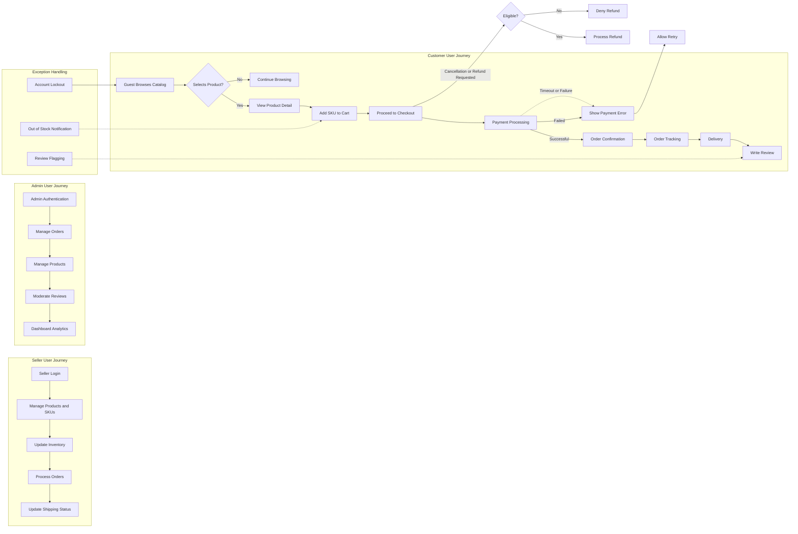

# E-commerce Shopping Mall Platform - Functional Requirements Analysis

## 1. Introduction
This document defines the core functional business requirements for the e-commerce shopping mall platform, aimed at backend development teams. It consolidates features from user registration to order tracking and review management, providing clear, unambiguous instructions for system behavior.

This document focuses solely on business logic and requirements, not technical implementation details such as APIs, data schemas, or UI designs. Developers have full autonomy to decide on technical approaches.

## 2. Business Model Overview

### Why This Service Exists
The e-commerce platform fills a market need by connecting buyers and sellers in a seamless, feature-rich environment where buyers can discover, purchase, and review products, and sellers can effectively manage their inventories and sales.

### Core Business Operations
The platform generates revenue via commissions on transactions and possibly premium seller services. Key value lies in enabling smooth transactions, trusted reviews, and efficient order and inventory management.

## 3. User Roles and Authentication

The system supports four primary roles:

- **Guest**: Unauthenticated user who can browse products and register an account.
- **Customer**: Authenticated buyer with permissions to manage profiles, addresses, carts, orders, and reviews.
- **Seller**: Authenticated seller who manages products, SKUs, inventory, and order shipping statuses.
- **Admin**: System administrator with full control over users, products, orders, reviews, and platform settings.

### Authentication Requirements
- WHEN a user registers, THE system SHALL validate the uniqueness of the email address and confirm password security (minimum 8 characters with complexity).
- THE system SHALL send an email verification link upon registration, which must be confirmed before login.
- Users SHALL log in via their verified email and password.
- THE system SHALL maintain secure session management with expiration after 30 minutes of inactivity.
- THE system SHALL enforce role-based access control, granting permissions consistent with user roles.

## 4. Functional Requirements

### 4.1 User Registration and Profile Management
- WHEN a user submits registration details, THE system SHALL validate all inputs including email format, password strength, and required profile fields.
- THE system SHALL allow users to add, edit, and delete multiple shipping addresses, each including recipient name, street, city, postal code, and country.
- WHEN profile updates occur, THE system SHALL verify ownership and data validity.

### 4.2 Product Catalog and Search
- THE system SHALL maintain a hierarchical product catalog with categories and subcategories.
- WHEN a user performs a search or browses categories, THE system SHALL return paginated results within 2 seconds.
- THE system SHALL allow filtering of products by category, price range, and SKU attributes such as color or size.

### 4.3 Product Variants and SKUs
- THE system SHALL support products with multiple SKUs representing variant options such as color, size, and customizations.
- EACH SKU SHALL have independent inventory tracking and pricing.
- WHEN sellers add or update products, THE system SHALL validate SKU uniqueness and data completeness.

### 4.4 Shopping Cart and Wishlist
- WHEN a customer adds a SKU to the cart, THE system SHALL verify SKU inventory availability.
- THE system SHALL persist the shopping cart for logged-in customers and restore contents across sessions and devices.
- THE system SHALL allow customers to add products to a wishlist for future consideration.

### 4.5 Order Placement and Tracking
- WHEN a customer places an order, THE system SHALL validate SKU inventory availability and payment eligibility.
- THE system SHALL calculate totals including taxes, shipping, and discounts.
- THE system SHALL support multiple payment methods including credit cards, PayPal, and bank transfers.
- THE system SHALL notify customers of order progress including confirmation, shipping updates, and delivery status.

### 4.6 Review and Rating Features
- ONLY verified customers who purchased a product SHALL be allowed to submit reviews and ratings.
- Reviews SHALL be stored in a pending state and require admin approval before public visibility.
- THE system SHALL calculate and display average ratings with one decimal precision.

## 5. Business Rules and Validation Constraints

- Inventory levels SHALL never drop below zero.
- Orders SHALL follow the lifecycle states: Pending Payment, Paid, Processing, Shipped, Delivered, Cancelled, and Refunded.
- Payment failures SHALL trigger cancellation of pending orders after 24 hours.
- Reviews SHALL be moderated according to content policies and admin decisions.
- Multi-factor authentication SHALL be required for admin and seller roles.

## 6. User Scenarios and Workflows

### Registration and Login
- WHEN a guest registers, THE system SHALL create a pending account and send verification email.
- WHEN the email is verified, THE user SHALL be activated and allowed to log in.
- IF login attempts exceed threshold on failures, THE system SHALL temporarily lock the account.

### Browsing and Shopping
- Customers SHALL browse and filter products efficiently.
- WHEN a product is viewed, all active SKUs with available inventory SHALL be shown.
- Customers SHALL add SKUs to carts and move items between cart and wishlist.

### Order Processing
- THE checkout flow SHALL validate stock and payment before order confirmation.
- Sellers SHALL receive orders and update shipping status.
- Customers SHALL track orders and receive notifications.

### Reviews and Moderation
- AFTER delivery, customers SHALL submit reviews.
- Admin SHALL moderate reviews before publication.

## 7. Error Handling and Performance

- THE system SHALL provide clear error messages for invalid inputs, payment failures, and inventory shortages.
- THE system SHALL limit and log failed login attempts.
- Search and browsing SHALL respond within 2 seconds under typical load.
- Payment processing SHALL complete within 3 seconds.

## 8. Summary

These requirements provide a comprehensive and precise foundation to develop the shopping mall platform’s backend. All processes have defined inputs, outputs, validations, and user roles.

Developers must implement secure, scalable, and robust backend services adhering strictly to these business rules.

---

### Mermaid Diagram: User and Seller Journeys

