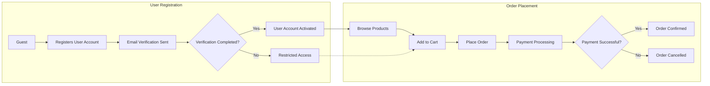

# Functional Requirements for E-Commerce Shopping Mall Platform

## Introduction
This document captures the detailed functional requirements for the e-commerce shopping mall platform. It serves as a comprehensive guide for backend developers to implement the complete platform features based on the client's stated needs and inferred business context.

## Business Model
### Why This Service Exists
The platform serves as a multi-vendor marketplace that enables customers to browse, select, and purchase products from multiple sellers in one place. It solves the problem of fragmented marketplaces by centralizing product offerings with rich variant support and streamlined order management.

### Revenue Strategy
The primary revenue stream will be transaction fees on sales made through the platform. Secondary revenue may come from seller subscription fees for enhanced listings and services.

### Growth Plan
The platform aims to acquire a broad customer base through digital marketing and partnerships while expanding the seller base via onboarding programs.

### Success Metrics
Key measures include active user count, order volume, seller retention, and average order value.

## User Actors and Permissions
| Actor   | Description               | Permissions Summary                                                  |
|---------|---------------------------|--------------------------------------------------------------------|
| Guest   | Unauthenticated user       | Browse catalog, view product details, register account             |
| Customer| Registered user            | Manage account and addresses, place orders, write reviews, manage cart and wishlist |
| Seller  | Vendor                    | Manage products, inventory, view and process orders for products    |
| Admin   | Platform administrator     | Full oversight and management of products, orders, users via dashboard |

## Functional Requirements

### User Registration and Login
- WHEN a guest submits a valid registration form, THE system SHALL create a new customer account with a unique email.
- THE system SHALL require email and password for registration.
- THE system SHALL allow customers to login using email and password.
- THE system SHALL maintain sessions with token-based authentication.
- THE system SHALL enable customers to manage multiple shipping addresses.
- IF a user enters incorrect login credentials, THEN THE system SHALL return appropriate authentication errors.

### Product Catalog and Search
- THE system SHALL support hierarchical categories with unlimited nesting.
- THE system SHALL allow keyword search on product titles, descriptions, and variants.
- THE system SHALL permit filters by category, price range, rating, availability.
- THE system SHALL display product details including images, descriptions, prices, and variant options.

### Product Variants
- THE system SHALL model product variants (SKUs) with attributes like color, size, and custom options.
- WHEN sellers add products, THE system SHALL enable defining variant combinations with inventory counts.

### Shopping Cart and Wishlist
- THE system SHALL allow customers to add multiple SKUs to their shopping cart.
- THE system SHALL persist cart state between sessions.
- THE system SHALL allow customers to create and manage wishlists.
- WHERE sharing is not enabled, wishlists shall remain private.

### Order Placement and Payment Processing
- WHEN a customer confirms checkout, THE system SHALL calculate total cost inclusive of taxes and shipping.
- THE system SHALL integrate with payment gateways to process payments securely.
- WHEN payment succeeds, THE system SHALL create an order record and decrement inventory.
- IF payment fails, THEN THE system SHALL notify the user and abort order creation.

### Order Tracking and Shipping Updates
- THE system SHALL provide real-time order statuses to customers.
- WHEN order status changes (processing, shipped, delivered), THE system SHALL notify customers.
- THE system SHALL support shipping provider integration or manual status updates by sellers.

### Product Reviews and Ratings
- THE system SHALL permit customers to submit ratings and reviews for purchased products.
- THE system SHALL moderate reviews to block inappropriate content.

### Seller Accounts and Features
- THE system SHALL allow users to register as sellers and create a seller profile.
- THE system SHALL enable sellers to list, update, and delete products.
- THE system SHALL provide sellers views of their orders and ability to update fulfillment status.

### Inventory Management
- THE system SHALL track inventory at SKU level.
- WHEN inventory reaches zero, THE system SHALL prevent orders for that SKU.
- THE system SHALL allow sellers to update stock and receive low inventory alerts.

### Order History, Cancellation, and Refund Requests
- THE system SHALL let customers view complete order histories.
- WHEN customers request cancellations or refunds within policy timeframe, THE system SHALL facilitate requests and update statuses accordingly.
- IF cancellations/refunds are approved, THEN THE system SHALL adjust inventory and notify relevant parties.

### Admin Dashboard and Platform Management
- THE system SHALL provide admin dashboard for overseeing users, products, and orders.
- THE system SHALL permit admins full CRUD operations on users, products, and orders.
- THE system SHALL maintain audit logs for admin actions.

## Business Rules
- Orders SHALL not be placed if inventory is insufficient.
- Payment confirmation is mandatory before order confirmation.
- Reviews SHALL be accepted only for products actually purchased and delivered.
- Customers MAY request refunds within 14 days after delivery.
- Sellers MAY update inventory only for their own products.
- Admins SHALL have override capabilities for order and refund processing.

## Error Handling
- IF authentication fails, THE system SHALL provide a clear, actionable error message.
- IF product inventory is insufficient during checkout, THE system SHALL notify the customer immediately.
- IF payment processing fails, THE system SHALL rollback order creation and notify the customer.
- IF review content violates guidelines, THEN THE system SHALL reject submission with explanation.

## Performance Requirements
- THE system SHALL respond to login requests within 2 seconds under normal load.
- THE product catalog search results SHALL return within 1 second.
- THE system SHALL handle up to 1000 concurrent users without degradation.

## Mermaid Diagram: User Registration and Order Process

```mermaid
graph LR
  subgraph "User Registration"
    A["Guest"] --> B["Registers User Account"]
    B --> C["Email Verification Sent"]
    C --> D{"Verification Completed?"}
    D -->|"Yes"| E["User Account Activated"]
    D -->|"No"| F["Restricted Access"]
  end
  
  subgraph "Order Placement"
    E --> G["Browse Products"]
    G --> H["Add to Cart"]
    H --> I["Place Order"]
    I --> J["Payment Processing"]
    J --> K{"Payment Successful?"}
    K -->|"Yes"| L["Order Confirmed"]
    K -->|"No"| M["Order Cancelled"]
  end
  
  F -.-> H
```

This document provides business requirements only. All technical implementation decisions belong to developers. Developers have full autonomy over architecture, APIs, and database design. The document describes WHAT the system should do, not HOW to build it.